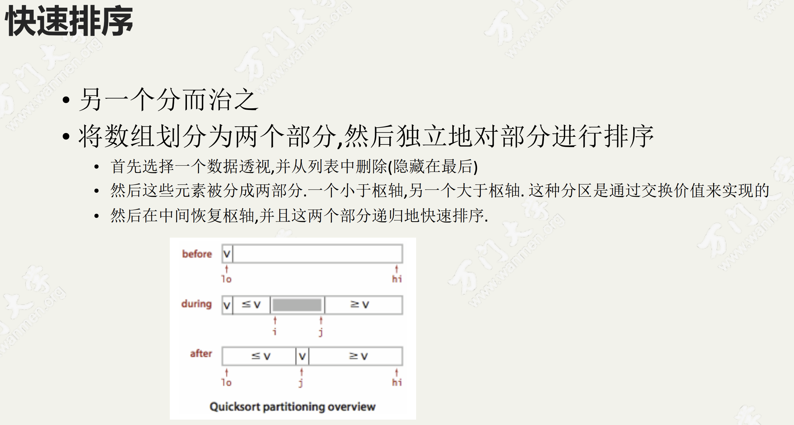

## 冒泡排序

<div align="center"></img></div>

稳定性：数组arr中有若干元素，其中A元素和B元素相等，并且A元素在B元素前面，如果使用某种排序算法排序后，能够保证A元素依然在B元素的前面，可以说这个该算法是稳定的。

<div align="center"></img></div>

冒泡排序的基本思想：通过对排序序列从后向前，依次比较相邻元素的排序码，若发现逆序则交换，使排序码较大的元素逐渐从后往前移动，就像水底的气泡一样向上冒

## 选择排序

<div align="center"></img></div>

图中是选出最大值放到最后。

<div align="center"></img></div>

```go
// chooseSort 每次遍历选出剩余未排序数组中的最小值放到当前未排序数组最前面
func chooseSort(list []int) []int {
	for i := 0; i < len(list); i++ {
		minPosition := i
		for j := i + 1; j < len(list); j++ {
			if list[minPosition] > list[j] {
				minPosition = j
			}
		}
		list[i], list[minPosition] = list[minPosition], list[i]
	}
	return list
}

func main() {
	testList := []int{2, 4, 4, 8, 1, 1, 5, -1, 3}
	fmt.Println(chooseSort(testList))
}
```

## 插入排序

<div align="center"></img></div>

<div align="center"></img></div>

```go
func insertSort(list []int) {

	for i := 1; i < len(list); i++ {
		position := i
		for position > 0 && list[position] < list[position-1] {
			list[position], list[position-1] = list[position-1], list[position]
			position--
		}
	}
}

func main() {
	testList := []int{2, 4, 4, 8, 1, 1, 5, -1, 3}
	insertSort(testList)
	fmt.Println(testList)
}
```


## 希尔排序

<div align="center"></img></div>

<div align="center"></img></div>

```go
func ShellSort(a []int) {
	n := len(a)
	h := 1
	for h < n/3 { //寻找合适的间隔h
		h = 3*h + 1
	}
	for h >= 1 {
		//将数组变为间隔h个元素有序
		for i := h; i < n; i++ {
			//间隔h插入排序
			for j := i; j >= h && a[j] < a[j-h]; j -= h {
				swap(a, j, j-h)
			}
		}
		h /= 3
	}
}

func swap(slice []int, i int, j int) {
	slice[i], slice[j] = slice[j], slice[i]
}

func main() {
	testList := []int{2, 4, 4, 8, 1, 1, 5, -1, 3}
	ShellSort(testList)
	fmt.Println(testList)
}
```

## 计数排序

<div align="center"></img></div>

**算法过程**

1. 根据待排序集合中最大元素和最小元素的差值范围，申请额外空间；
2. 遍历待排序集合，将每一个元素出现的次数记录到元素值对应的额外空间内；
3. 对额外空间内数据进行计算，得出每一个元素的正确位置；
4. 将待排序集合每一个元素移动到计算得出的正确位置上。

时间复杂度： O(n+k)

空间复杂度： O(k)

稳定性： 稳定。

两大局限性：

1.当数列最大最小值差距过大时，并不适用于计数排序

比如给定 20 个随机整数，范围在 0 到 1 亿之间，此时如果使用计数排序的话，就需要创建长度为 1 亿的数组，不但严重浪费了空间，而且时间复杂度也随之升高。

2.当数列元素不是整数时，并不适用于计数排序

如果数列中的元素都是小数，比如 3.1415，或是 0.00000001 这样子，则无法创建对应的统计数组，这样显然无法进行计数排序。

正是由于这两大局限性，才使得计数排序不像快速排序、归并排序那样被人们广泛适用。

## 分治排序

<div align="center"></img></div>

<div align="center"></img></div>

```go
func MergeSort(intList []int) []int {
	length := len(intList)
	// 长度为0直接退出
	if length <= 1 {
		return intList
	}

	// 先分
	middle := length / 2
	left := MergeSort(intList[:middle])
	right := MergeSort(intList[middle:])
	// 后治
	return merge(left, right)
}

func merge(left, right []int) []int {
	leftLen := len(left)
	rightLen := len(right)
	// 定义i,j指针指向left,right的,开始
	i, j := 0, 0
	// 定义临时切片
	temp := make([]int, 0)
	for i < leftLen && j < rightLen {
		if left[i] < right[j] {
			// 将左边的值放入temp
			temp = append(temp, left[i])
			i++
		} else {
			// 将右边的值放入temp
			temp = append(temp, right[j])
			j++
		}
	}
	// 结束循环后会多有一个切片有余
	if i < leftLen {
		// 如果左边有余
		temp = append(temp, left[i:]...)
	} else if j < rightLen {
		// 如果右边有余
		temp = append(temp, right[j:]...)
	}
	return temp
}

func main() {
	testList := []int{2, 4, 4, 8, 1, 1, 5, -1, 3}

	fmt.Println(MergeSort(testList))
}
-------------------------------------
[-1 1 1 2 3 4 4 5 8]
```

## 快排

<div align="center"></img></div>

<div align="center"></img></div>

<div align="center"></img></div>

```go
func QuickSort(source []int) []int {
	if len(source) <= 1 {
		return source
	}

	pivot := source[0]
	var left, right []int
	for _, value := range source[1:] {
		if value < pivot {
			left = append(left, value)
		} else {
			right = append(right, value)
		}
	}
	mid := append([]int{pivot}, QuickSort(right)...)
	return append(QuickSort(left), mid...)
}
```

https://www.jianshu.com/p/7a7ad3af5e25


<div align="center"></img></div>
