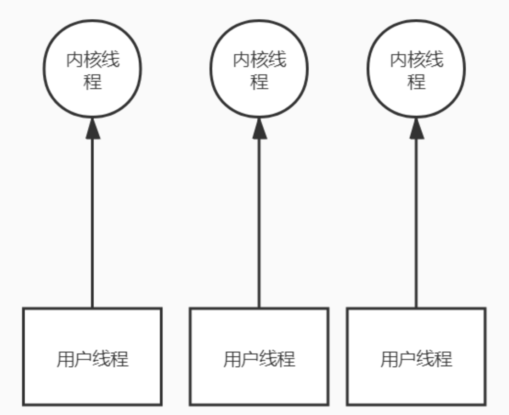
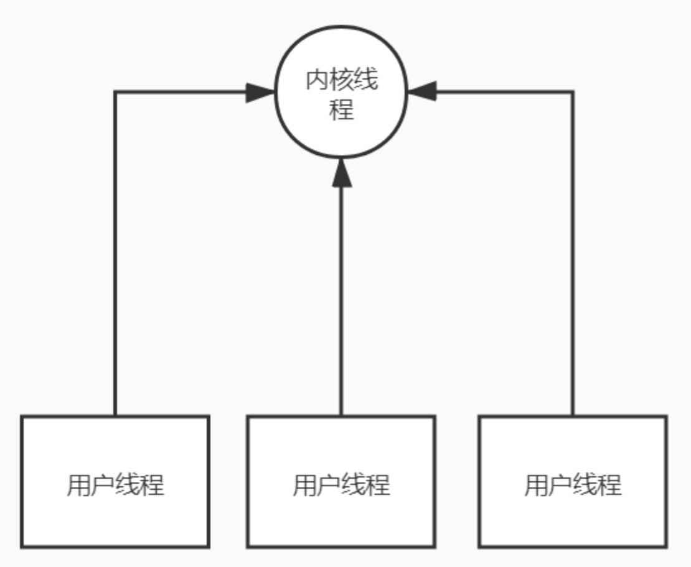
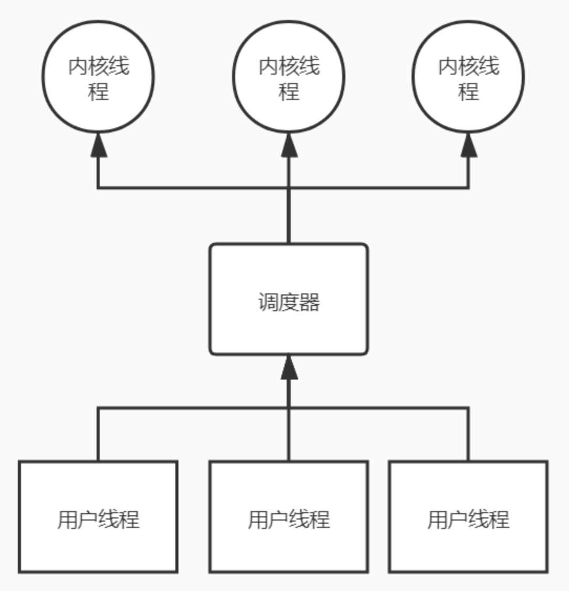
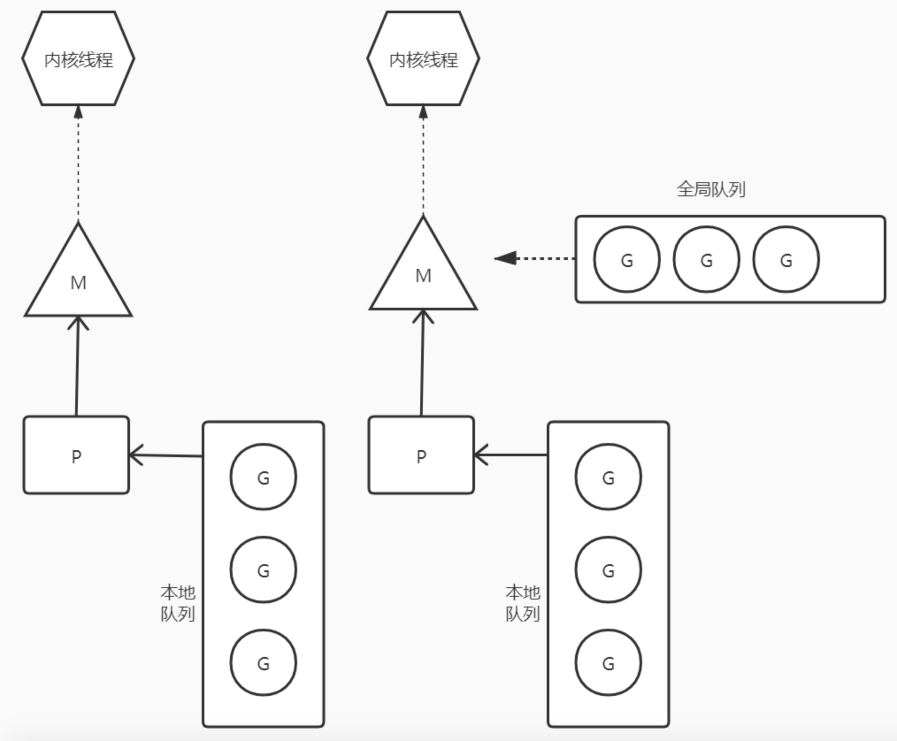

<!-- GFM-TOC -->

* [一 、概述](#一-概述)

* [二、传递or引用](#二-传递or引用)
  - [1.值类型](#1-值类型)
  - [2.引用类型](#2-引用类型)
* 三、[用法](#三-用法)

  - [1.Golang 中函数作为值与类型](1-Golang 中函数作为值与类型)
  - [2.for的用法](1-for的用法)

* [记录点](记录点)

​    

<!-- GFM-TOC -->

# 一、概述

**1.1 背景**

随着信息技术的迅速发展，单台服务器处理能力越来越强，迫使编程模式由从前的串行模式升级到并发模型。

并发模型包含 IO 多路复用、多进程以及多线程，这几种模型都各有优劣，现代复杂的高并发架构大多是几种模型协同使用，不同场景应用不同模型，扬长避短，发挥服务器的最大性能。

而**多线程，因为其轻量和易用**，成为并发编程中使用频率最高的并发模型，包括后衍生的协程等其他子产品，也都基于它。

**1.2 并发 ≠ 并行**

并发 (concurrency) ：在单个 CPU 核上，线程通过时间片或者让出控制权来实现任务切换，达到 "同时" 运行多个任务的目的但实际上任何时刻都只有一个任务被执行，其他任务通过某种算法来排队。

并行 ( parallelism) ：多核 CPU 可以让同一进程内的 "多个线程" 做到真正意义上的同时运行，这才是并行。

**1.3 进程、线程、协程**

进程：进程是系统进行资源分配的基本单位，有独立的内存空间。

线程：线程是 CPU 调度和分派的基本单位，线程依附于进程存在，每个线程会共享父进程的资源。

协程：**协程是一种用户态的轻量级线程，**协程的调度完全由用户控制，协程间切换只需要保存任务的上下文，没有内核的开销。

**1.4 线程上下文切换（Thread Context Switch ）**

线程上下文是指某一时间点 CPU 寄存器和程序计数器的内容。

CPU执行线程的时候是通过时间分片的方式来轮流执行的，当某一个线程的时间片用完（到期），那么这个线程就会被中断，CPU不再执行当前线程，CPU会把使用权给其它线程来执行。如T1线程未执行结束，T2/T3线程插进来执行了，若干时间后T1又继续执行未执行完的部分，这种就造成了线程之间的来回切换。

一次上下文切换：CPU通过时间片分配算法来循环执行任务，当前任务执行一个时间片后会切换到下一个任务，在切换前会保存上一个任务的状态，以便下次切换回这个任务时，可以再次加载这个任务的状态，从任务保存到再加载的过程就是一次上下文切换。当Context Switch发生时，需要由操作系统保持当前线程的状态，并恢复另一个线程的状态，状态包括程序计数器、虚拟机栈中每个栈帧的信息。

造成原因：线程的CPU时间片用完；垃圾回收；有更高优先级的线程需要运行；线程自已调用了sleep、yield、wait、park、	synchronized、lock等方法

**1.5 上下文切换的开销**

上下文切换的开销包括直接开销和间接开销。

**上下文切换的代价是高昂的**，因为在核心上交换线程会花费很多时间。上下文切换的延迟取决于不同的因素，大概在在 50 到 100 纳秒之间。考虑到硬件平均在每个核心上每纳秒执行 12 条指令，那么一次上下文切换可能会花费 600 到 1200 条指令的延迟时间。实际上，上下文切换占用了大量程序执行指令的时间。直接开销有如下几点：

- 操作系统保存回复上下文所需的开销
- 线程调度器调度线程的开销

如果存在**跨核上下文切换**（Cross-Core Context Switch），可能会导致 CPU 缓存失效（CPU 从缓存访问数据的成本大约 3 到 40 个时钟周期，从主存访问数据的成本大约 100 到 300 个时钟周期），这种场景的切换成本会更加昂贵。

间接开销有如下几点：

- 处理器高速缓存重新加载的开销
- 上下文切换可能导致整个一级高速缓存中的内容被冲刷，即被写入到下一级高速缓存或主存

多核CPU一定程度上可以减少上下文切换。

**1.6 线程调度模型**

1. 一个用户线程和一个内核线程绑定，用户线程的调度依赖于内核线程的调度，这种方式可以充分利用多核资源，由cpu直接控制线程的调度。缺点是频繁的上下文切换和资源调度，如果用户线程较多，会带来很大的额外开销。

  
 

2. 多个用户线程绑定到一个内核线程，用户线程的调度切换可以用户自己实现，多个线程共享一个内核线程的时间片。这种方式极大减少了上下文切换，内核线程无需频繁切换调度，且不再受限于线程数，可以开辟大量用户线程。缺点是无法充分利用多核资源，对于多个用户线程而言，其本质仍然是单核运行，需要分时间片利用内核线程的cpu时间。

   
  
 

3. 用户线程和内核线程是多对多的关系，每个用户线程可以被多个内核线程调度，每个内核线程可以调度多个不同的用户线程。这种调度模型综合了前面两种的优缺点。既可以充分利用多核资源，每个空闲的内核线程都可以参与调度，也可以减少上下文开销，每个内核线程可以在一定时间内运行多个用户线程。但是这种调度模型实现复杂度高。go的调度是基于这种模式。

   
  
 

# 二、**Goroutine调度模型** 

go的调度过程中主要依赖三种结构：

M-工作线程，对应一个内核线程 

P-逻辑处理器（上下文、调度信息等） 

G-goroutine，用户线程，即一个待执行的任务

  
 

如上图所示，每个M都与一个内核线程绑定，在go的运行过程中，M的绑定关系不变。每个M在同一时刻都至多只能与一个P绑定，每个P都有一个自己的本地队列，M通过从P的本地队列中取一个G执行，如果本地队列消耗完毕，则会从全局队列取一个G，如果全局队列也消耗完毕，则从其他P那里窃取G。

**情况1.G阻塞**

如果一个被调度的G（G1）进入阻塞态，此时M将无法继续执行P中的其他G。如果G1因系统调用被阻塞，M会和P解绑，P会被另一个M绑定，当前M等待系统调用返回，然后尝试获取一个P，如果获取成功，则将G1加入该P队列，如果获取失败，则将G1放入全局队列，M自己放入空闲M等待队列，等待一个可绑定的P。如果G1是因为IO、管道等用户态操作阻塞，则G1会被放入等待队列，当前M继续执行P中其他G，当G1被另一个G唤醒的时候，再加入对应P。

**情况2.P中G消耗完毕**

不同P中G不一样，执行效率也不一样，导致可能一个P很快就消耗完了本地队列，全局队列也无新的G，此时为了任务均衡，P会尝试从其他P中窃取一半的G加入自己队列。

**情况3.全局队列中有G，但是所有P都能生产消费平衡。**

如果每个M都只执行对应P中本地队列的G，只有当P中无G才去消费全局队列，那么在P的本地队列一直不为空的情况下，全局队列中的G将一直无法被调度到。所以每次M都有一定概率从全局队列中找G，以保证调度公平。