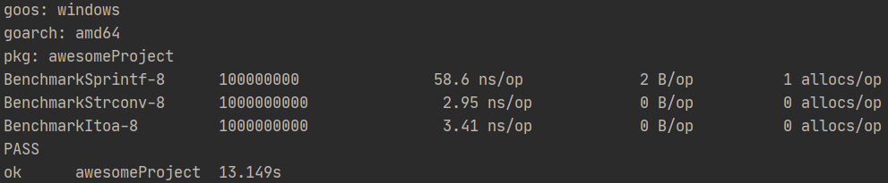
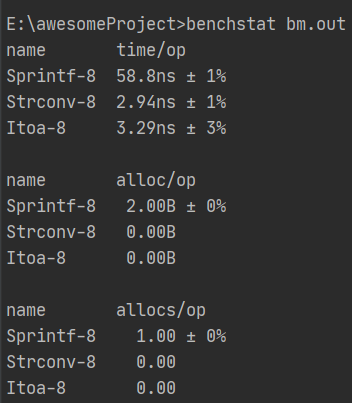
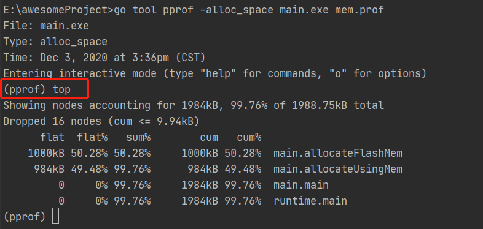
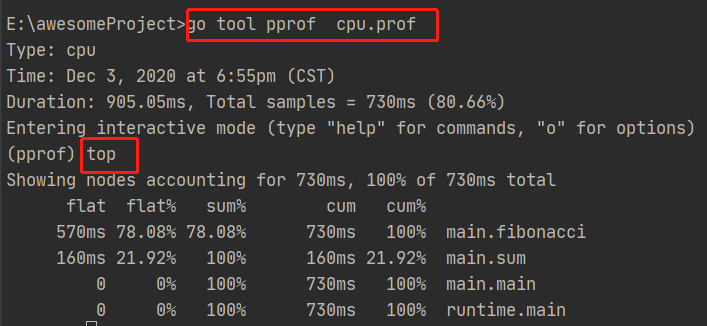
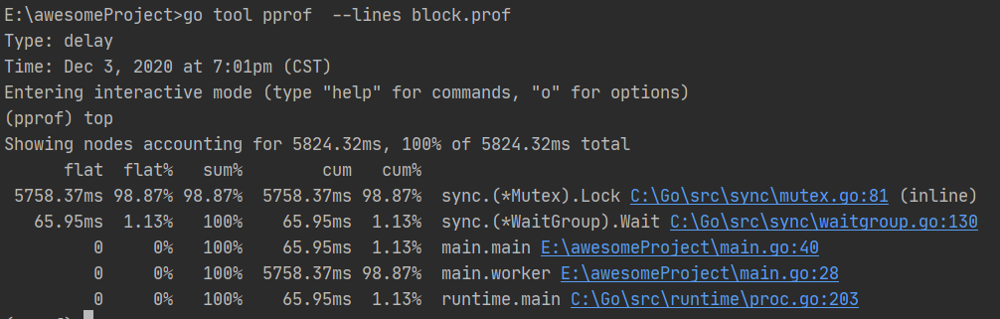
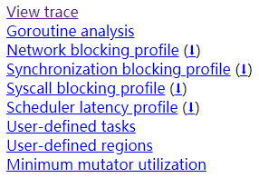

<!-- GFM-TOC -->

* [一 、基准调试](#一-基准调试)
  - [1.介绍](#1-介绍)
* [二、传递or引用](#二-传递or引用)
  - [1.值类型](#1-值类型)
  - [2.引用类型](#2-引用类型)

<!-- GFM-TOC -->


# 一、基准调试

## 1.介绍

Golang代码优化第一步：通过基准测试知道性能（CPU和内存效率）。下面以整数转字符串为例进行说明：

```go
package main_test

import (
	"fmt"
	"strconv"
	"testing"
)
func BenchmarkSprintf(b *testing.B) {
	for i := 0; i < b.N; i++ {
		fmt.Sprintf("%d", 10)
	}
}
func BenchmarkStrconv(b *testing.B) {
	for i := 0; i < b.N; i++ {
		strconv.FormatInt(10, 10)
	}
}
func BenchmarkItoa(b *testing.B) {
	for i := 0; i < b.N; i++ {
		strconv.Itoa(10)
	}
}
```

执行：

```shell
go test -bench=. -benchtime=5s -benchmem
```

bench：适配那些测试函数，如-bench=S.则会跑BenchmarkSprintf和BenchmarkStrconv两个测试，-bench=BenchmarkStrconv则会只跑BenchmarkStrconv测试。

benchtime：默认1s，跑每个基准的大概限时，基准会先跑100、1000等数量的测试预估时间，然后调整b.N使其差不多在-benchtime时间左右完成。

benchmem：同时测试内容的使用情况。

结果说明：

<div align="center">  </div><br>

第一列是函数名字+运行时对应的GOMAXPROCS的值，可以用-cpu=2来设置成其他的值

第二列是一种执行多少次

第三列是每次执行的耗时

第四列是每次执行需要分配的内存数量（堆上）

第五列是每次执行需要分配的对象个数（堆上）

FormatInt速度更快一些，而Sprintf耗时是FormatInt的20倍，原因是Sprintf每次执行需要分配一个对象，具体可以去看fmt.Sprintf的实现源码，Itoa 其实是FormatInt的简单封装，因为多了一次函数调用耗时，性能也有部分损耗。

## **2. benchstat**

计算机系统是个动态的类生命体，每次的基准测试结果都有变数，此时就需要多测试几次得到平均值，[benchstat](https://github.com/golang/perf)。设置运行基准的次数并输出，经benchstat处理后可以看到偏差。

<div align="center">  </div><br>

使用benchstat可对实际生成选型进行检验，例如对自带的json库和[easyjson](https://github.com/mailru/easyjson)进行测试，效果会是easyjsonen的encode和decode及内存使用比json库好很多。原因是，easyjson是预先处理结构体，通过字符串连接实现，而原生的是通过耗资源的反射实现的。

# 二、变量逃逸分析

##  1. 介绍

通过基准测试发现在堆上分配内存的操作都比较耗时，接下来需确定变量如何在堆上分配：

```go
package main

// 形如 //go: 就是 Go 语言编译指示的实现方式。
// go:noinline 为了防止编辑器将test函数内联
//go:noinline
func test() *int {
	inner := 10
	return &inner
}
func main() {
	ret := test()
	*ret = 1
}
```

上面这段代码，在C/C++：inner是在栈上分配的内存，在test函数返回后会回收，会给警告执行出错。golang中能够执行：go的编译器会做逃逸分析，如果发现变量的作用域跑远了，会在堆上分配变量空间。

-------------------------------------------------------------------------------------------------------

**内联函数与一般函数的区别**：

1）内联含函数比一般函数在前面多一个inline修饰符

2）内联函数是直接复制“镶嵌”到主函数中去的，就是将内联函数的代码直接放在内联函数的位置上，这与一般函数不同，主函数在调用一般函数的时候，是指令跳转到被调用函数的入口地址，执行完被调用函数后，指令再跳转回主函数上继续执行后面的代码；而由于内联函数是将函数的代码直接放在了函数的位置上，所以没有指令跳转，指令按顺序执行

3）一般函数的代码段只有一份，放在内存中的某个位置上，当程序调用它是，指令就跳转过来；当下一次程序调用它是，指令又跳转过来；而内联函数是程序中调用几次内联函数，内联函数的代码就会复制几份放在对应的位置上

利：避免了指令的来回跳转，加快程序执行速度

弊：代码被多次复制，增加了代码量，占用更多的内存空间

**什么时候使用内联函数**

1）函数本身内容比较少，代码比较短，函数功能相对简单

2）函数被调用得频繁，不如循环中的函数

**什么时候不能使用内联函数**

1）函数代码量多，功能复杂，体积庞大。对于这种函数，就算加上inline修饰符，系统也不一定会相应，可能还是会当成一般函数处理

2）递归函数不能使用内联函数

--------------------------------------------------------------------------------------------------------

展示编译器分析log，运行
`go tool compile -m main.go`

```shell
main.go:9:6: can inline main
main.go:6:2: moved to heap: inner
```

逃逸分析对内存管理进行优化和简化，好处就是减少程序员的脑力，但在实际生产中会导致一些问题，把原本可以在栈上分配的空间提到堆上，增大GC的压力。

## 2. 示例

以下是实际过程中常见的两种逃逸：

（1）传递回调函数导致变量逃逸，会带来非必要的逃逸

```go
//go:noinline
func swap(*int, *int) {}
func test() {
    x, y := 1, 2
    swap(&x, &y)
}
func callbackTest(f func(*int, *int)) {
    s, b := 1, 2
    f(&s, &b)
}

func main() {
    test()
    callbackTest(swap)
}
```

（2）针对接口的方法调用产生的变量逃逸：想要程序扩展性好，接口是必不可少的，但是这回带来少量的GC压力。

```go
type Bird interface {
    sing()
}
type Duck struct {}

//go:noinline
func (me Duck) sing() {}
func test() {
    duck := Duck{}
    var bird Bird = duck
    duck.sing()
}
func main() {
    test()
```

# 三、内存pprof

[下载及用法](https://github.com/google/pprof)

参数说明：

| 参数           | 解释                                                         |
| -------------- | ------------------------------------------------------------ |
| —inuse_space   | Display the number of in-use megabytes (i.e. space that has been allocated but not freed). This is the default. |
| —inuse_objects | Display the number of in-use objects<br/>(i.e. number of objects that have been allocated but not freed). |
| —alloc_space   | Display the number of allocated megabytes.<br/>This includes the space that has since been de-allocated.<br/>Use this if you want to find the main allocation sites in the program. |
| —alloc_objects | Display the number of allocated objects.<br/>This includes the objects that have since been de-allocated.<br/>Use this if you want to find the main allocation sites in the program. |

space和objects的区别：space是展示内存大小，单位是Byte；而objects展示的对象，单位是个，例如：

**inuse_space**展示的是现在正在使用的内存，被分配但是还没有被释放，这个是默认参数。

**alloc_space**展示的是程序启动到现在的分配内存，包括那些已经被释放的内存，如果系统GC负担大，我们一般用这个来定位代码中创建临时变量的大户。

例子：

```go
package main

import (
   "log"
   "os"
   "runtime"
   "runtime/pprof"
)

var usingBuffer []byte

func main() {
   f, err := os.Create("mem.prof")
   if err != nil {
      log.Fatal("could not create memory profile: ", err)
   }
   defer f.Close()
   runtime.MemProfileRate = 1
   allocateUsingMem()
   allocateFlashMem()
   runtime.GC()
   if err := pprof.Lookup("heap").WriteTo(f, 0); err != nil {
      log.Fatal("could not write memory profile: ", err)
   }
}

//go:noinline
func allocateUsingMem() {
   usingBuffer = make([]byte, 100*10000)
}
func allocateFlashMem() []byte {
   var buf []byte
   for i := 0; i < 100; i++ {
      buf = make([]byte, 10000)
   }
   return buf
}
```

运行

```
go tool pprof -alloc_space test.exe mem.prof
```

<div align="center">  </div><br>

第一列flat是它自己直接使用多少内存

第二列是flat在所有使用内存中的占比，值为flat/total

第三列是前面的第二列之和，如第n行的三列值为表达topn-1函数直接使用的内存在total中的占比

第四列cum是它自己直接使用和它调用的函数使用一起内存使用之和

第五列是cum在所有使用内存中的占比,值为cum/total

在pprof中执行web命名会绘画出下面的树形图，方框越大使用过的内存越多。

```shell
$ go tool pprof -http=:8080 mem.prof
// 或
$ go tool pprof mem.prof 
$ (pprof) web
```

使用inuse_space展示正在使用的内存
`go tool pprof -inuse_space main.exe mem.pprof`

# 四、CPU pprof

CPU pprof是runtime定时记录现在执行的goroutine执行栈，累加各个函数出现的次数得到的结果。越是占用时间长越热的函数命中的概率越大， CPU pprof用来定位程序中的瓶颈函数，定位出来后可以按照前面讲的进行部分优化。

例子是递归的斐波纳契数列来测试，在中间加入了sum函数，在实际生成中一般不如此编码。

```go
package main
import (
	"os"
	"runtime/pprof"
)
func main() {
	f, err := os.Create("cpu.pprof")
	if err != nil {
		panic(err)
	}
	pprof.StartCPUProfile(f)
	fibonacci(40)
	pprof.StopCPUProfile()
}

//go:noinline
func sum(a, b int) int {
	return a + b
}

func fibonacci(num int) int {
	switch num {
	case 0:
		return 0
	case 1:
		return 1
	default:
		return sum(fibonacci(num-1), fibonacci(num-2))
	}
}
```

结果如下：

<div align="center">  </div><br>

第一列flat是函数在执行栈中被命中的次数时间的累加

第二列是flat/total,标识函数在整个耗时里边的占比

第三列是前面的第二列之和，如第n行的三列值为表达topn-1函数耗时的占比

第四列cum是它自己和它调用的函数使用时间之和

第五列是cum/total,标识它自己和调用的函数在total中的占比

在pprof中执行web命名会绘画出下面的树形图，方框越大使耗时越大。

观看cpu pprof的方式还是通过火焰图来，虽然比较直观，但安装环境比较麻烦，参考如下：
https://github.com/uber/go-torch
https://github.com/brendangregg/FlameGraph
https://www.activestate.com/activeperl

# 五、阻塞pprof

pprof block保存用户程序中的Goroutine阻塞事件的记录，需要通过调用`runtime.SetBlockProfileRate`来激活golang的goroutine发生阻塞回切到另一个goroutine执行，所以golang的阻塞对比其他的开发语言影响较小，但是过大的阻塞时间消耗会影响接口的反馈速度，可以借助pprof block定位出热门阻塞资源进行代码结构优化。

```go
package main

import (
	"os"
	"runtime"
	"runtime/pprof"
	"sync"
)

type LockerMap struct {
	sync.Mutex
	datas map[int]int
}

var mutex sync.Mutex
var wg sync.WaitGroup
var lmap = LockerMap{datas: make(map[int]int, 10000)}

func checkErr(err error) {
	if err != nil {
		panic(err)
	}
}

func worker() {
	defer wg.Done()
	for i := 0; i < 10000; i++ {
		mutex.Lock()
		lmap.datas[i] = i
		mutex.Unlock()
	}

}
func main() {
	runtime.SetBlockProfileRate(1)
	for i := 0; i < 100; i++ {
		wg.Add(1)
		go worker()
	}
	wg.Wait()

	p := pprof.Lookup("block")
	f, err := os.Create("block.prof")
	checkErr(err)
	defer f.Close()
	err = p.WriteTo(f, 0)
	checkErr(err)

}
```

这段代码的主要描述是定义了一个简单带锁的map，每次操作都加锁进行，需要用`go tool pprof block.pprof` 可以看到阻塞统计，--lines参数可以看到是那个参数引起得阻塞。从统计中可以看到main.worker中的mutex.Lock()是主要阻塞元凶，也可以用web命令生成图片观看。

<div align="center">  </div><br>

其他语言一般采用内部使用数组锁，每个区间共享一把锁，这样减少数据共享一把锁带来的性能影响,但是golang的作者说过会考虑，除了1.9后出现的sync.Map没有进一步消息。sync.Map采用了另一种常用的解决方式双副本的形式来解决并发读写，我们上面这种只写的测试在sync.Map表现会更差，双副本的方式主要解决多读少写的场景，期待数组锁的的map的出现。先阶段如果是多写的Map，可以创建多个map，对key取模后存储在不同的map来提高效率。

# 六、net/trace

net trace区别与runtime trace，net trace用户服务端请求追踪，可以用来展示单次请求后服务端统计和长期执行的程序中的event统计，这些统计都是开发者埋点自己打印进去的。
而runtime trace记录的所有的运行时事件，用户诊断性能问题时（如延迟，并行化和竞争异常等）

```go
package main
import (
	"golang.org/x/net/trace"
	"net/http"
	"time"
)

var elog trace.EventLog

func helloHandler(w http.ResponseWriter, r *http.Request) {
	elog.Printf("helloHandler visit by %s", r.RemoteAddr)
	ret := "word"
	r.ParseForm()
	tr := trace.New("request", r.URL.Path)
	defer tr.Finish()
	tr.LazyPrintf("user request:%s", r.Form.Encode())
	tr.LazyPrintf("return result:%s", ret)
	w.Write([]byte(ret))
}

func weiHandler(w http.ResponseWriter, r *http.Request) {
	elog.Printf("weiHandler visit by %s", r.RemoteAddr)
	ret := "你好!"
	r.ParseForm()
	tr := trace.New("request", r.URL.Path)
	defer tr.Finish()
	tr.LazyPrintf("user request:%s", r.Form.Encode())
	tr.LazyPrintf("return result:%s", ret)
	w.Write([]byte(ret))

}

func main() {
	elog = trace.NewEventLog("server.event", "elog")
	defer elog.Finish()
	elog.Printf("server start:%s", time.Now().Format("20060102 15:03:04"))
	http.HandleFunc("/hello", helloHandler)
	http.HandleFunc("/wei", weiHandler)
	elog.Printf("registe handler ok  ")
	http.ListenAndServe(":80", nil)
}
```

然后请求下面两个网址各一次:
`http://127.0.0.1/wei?a=applen&b=banana`
`http://127.0.0.1/hello?a=b&b=c`

访问`http://127.0.0.1/debug/requests`可以得到trace日志，并不是报错所有的日志，trace会滚动保证每个title只有最近的10条。

访问`http://127.0.0.1/debug/events`可以得到eventlog日志，同样也会滚动保存最近的1000条。

net trace的能提供给我们一些简单的统计和event记录，在重要的逻辑段预埋eventlog，有利于我们了解我们的服务即时发现问题。

# 七、runtime/trace

执行追踪器。跟踪器捕获各种各样的执行事件，如 goroutine 创建/阻塞/解锁，系统调用进入/退出/块，GC 相关事件，堆大小变化，处理器启动/停止等，并将它们写入 io.Writer 中紧凑的形式。大多数事件都会捕获精确的纳秒精度时间戳和堆栈跟踪。跟踪可以稍后使用 'go tool trace' 命令进行分析。

```go
package main

import (
   "fmt"
   "os"
   "runtime/trace"
   "sync"
)

const testNumber = 10

var queue = make(chan int, 2)
var wg sync.WaitGroup

func consume() {
   for data := range queue {
      fmt.Println("consume", data)
   }
   wg.Done()
}

func product() {
   for i := 0; i < testNumber; i++ {
      queue <- i
   }
   close(queue)
   wg.Done()
}

func main() {
   f, err := os.Create("trace.out")
   if err != nil {
      panic(err)
   }
   defer f.Close()
   err = trace.Start(f)
   if err != nil {
      panic(err)
   }
   defer trace.Stop()

   wg.Add(4)
   for i := 0; i < 3; i++ {
      go consume()
   }
   go product()
   wg.Wait()
}
```

执行：

```
go tool trace trace.out
```

<div align="center">  </div><br>

View trace：查看跟踪，可视化交互展示runtime，可分析每个虚拟处理器执行、goroutine被那种资源阻止等待调度等

Goroutine analysis：Goroutine 分析，展示创建出的goroutine，里边统计所有的goroutine的执行、等待网络、同步、系统调用、调度等的耗时情况

Network blocking profile：网络阻塞概况

Synchronization blocking profile：同步阻塞概况

Syscall blocking profile：系统调用阻塞概况

Scheduler latency profile：调度延迟概况，展示对调度耗时统计数据

User defined tasks：用户自定义任务

User defined regions：用户自定义区域

Minimum mutator utilization：最低 Mutator 利用率


# Tips

- Go 项目一般都需要把 net/http/pprof 包引入，方便在线 pprof 排查问题。引入后，不调用也不影响性能。
- 一般 Go 即便自己的业务代码没有大量采用 Go 并发，import 引入的相关库的等其他依赖也会有 Go 的并发，包括 Runtime 本身也有 Go 并发，因此一个项目的 Goroutine 数目，抛开自己业务中启用的不谈，其他的加起来有十几个、几十个 Goroutine 数目都是正常预期之内的.
- 分析 Goroutine 泄漏的时候，优先观察自己写的业务代码的协程数量和调用栈情况，而不是框架、引入的外部包的协程数量和调用栈情况。
  - 如果确认自己的业务代码中真的没有泄漏情况，再观察和分析其他的
- 既然是泄漏，那么数量肯定较多，因此优先观察前面一批使用协程数量多的一些 case。
- 找到可疑协程泄漏点之后，可以再做一些对比，比如几分钟之后，再次观察，看是否按照预期这里的协程数量继续增加了。如果增加了，那么大概率就是这货引起的。如果没有增加，那么考虑下是否当前没有请求量过来、是否没有触发到这个逻辑、还是自己的判断有误

# 参考

[一看就懂系列之Golang的pprof](https://juejin.cn/post/6844904079525675016)