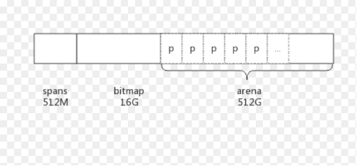
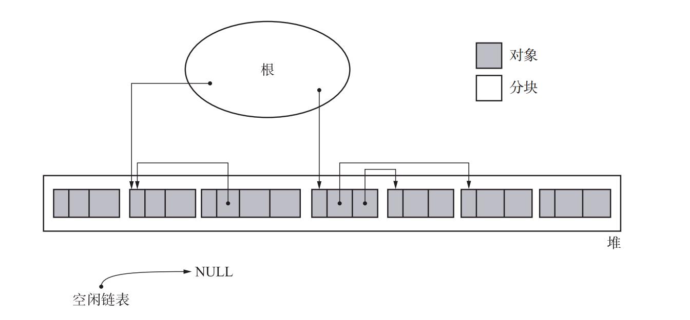
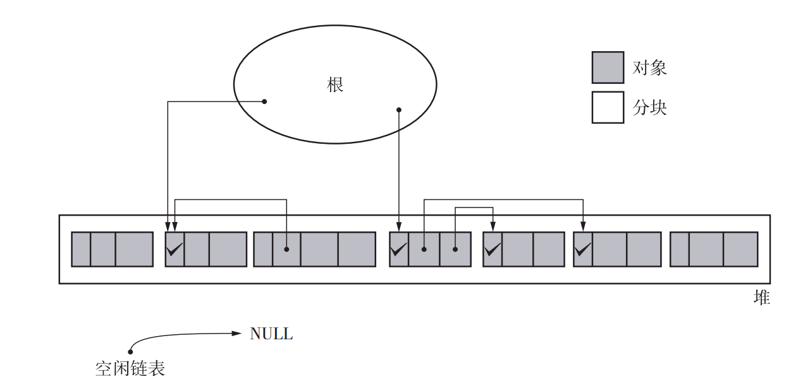
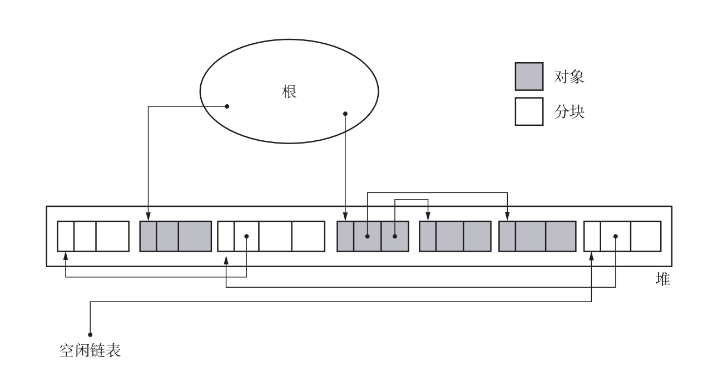
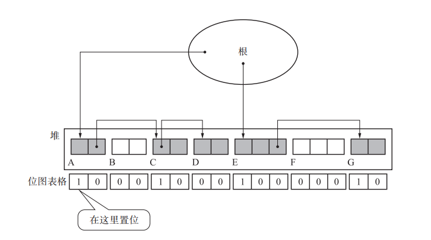
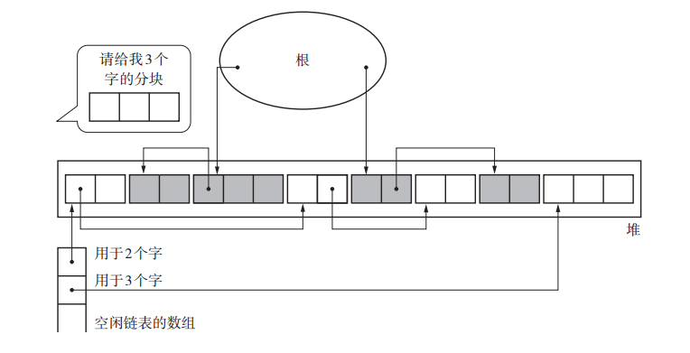
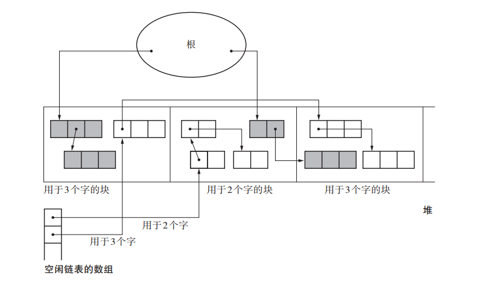
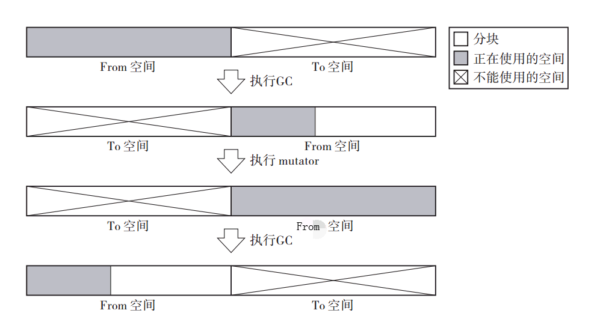

如果从手动管理内存, 跨越到GC, 是我的话, 我可能会有以下疑问:
- 有GC的语言是咋样的? (简化内存管理)
- GC可以帮我释放文件吗? (可以, 但不建议. finalization)
- GC会不会出现泄漏?(正确性问题)
- GC多久一次?(GC频率)
- GC会不会暂停很久?(Stop The World问题)
- 每次GC的暂停稳不稳定?(STW时间分布)
- GC会不会拖累我程序的运行速度?(吞吐量问题)
- GC是如何与程序并发运行的?(并发标记)
- 会不会导致碎片很多?(压缩和碎片)
- GC会不会一直不回收, 撑爆内存? (GC触发)
- GC影响程序, 如何调优?
- Go是GC是怎么实现的?
- Go的GC与其他语言对比如何?

我们先简单介绍一下GC一些基础概念:概念, 术语, GC发展历史, GC基础算法和分代理论.
然后介绍Golang的GC当前情况, 发展历程, 版本改进, 大致流程, 与Java的对比, 然后介绍目前生产中的GC, 以及简单的处理GC问题, 消除大家对GC的一些疑惑. 看到这我觉得面试时Golang GC部分就可以通过了.


# GC相关概念
## GC简介
垃圾回收（英语：Garbage Collection，缩写为GC）是一种自动内存管理机制. 垃圾回收器(Garbage Collector)尝试回收不再被程序所需要的对象所占用的内存. GC最早起源于LISP语言, 1959年左右由John McCarthy创造用以简化LISP中的内存管理. 所以GC可以说是一项"古老"的技术, 但是直到20世纪90年代Java的出现并流行, 广大的普通程序员们才得以接触GC. 当前许多语言如Go, Java, C#, JS和Python等都支持GC.

## 手动管理内存 VS 自动管理内存
> 存活是一个全局的(global)特征, 但是调用free函数将对象释放却是局部行为

手动内存管理需要开发者时刻注意对象的生命周期.

1. 显式的指定哪些对象要释放并归还给操作系统
1. 同时还需要注意需要清空指向已经释放对象的指针
1. 注意不能过早的回收还在引用的对象
1. 在处理有循环引用的对象或者指针操作非线程安全的情况下, 非常的复杂.
1. 调用其他方法或者第三方库时, 需要明确对象所有权, 需要明确其对象管理方式,加大了耦合性.

GC可以解决大部分悬挂指针和内存泄漏的问题.
1. GC可以将未被任何对象引用的对象的进行回收, 从而避免悬挂指针.
1. 只有回收器可以释放对象, 所以不会出现二次释放(double-freeing)
1. 回收器掌握堆中对象的全局信息以及所有可能访问堆中对象的线程信息, 因此其可以决定任意对象是否需要回收.
1. 回收器管理对象, 模块之间减少了耦合.

以下为不带GC的C++与有GC的Golang的简单对比.
**C++**
```c++
for(int i = 0; i < 100; i++)
{

      Person * p = new Person();
      doSomethingWithP(p);
      ....
      //时刻需要注意, 分配了就要释放
      delete p;
}

//错误
int* returnValue()
{
    int arr[]={1,2,3,4,5};
    return arr;
}
```

**Golang**
```go
for i:=0;i<100 ;i++  {
       o:=new(Person)
        ......
        //随便怎么用, 不需要显示释放
}

//完全OK
func ReturnValue() *Person {
    arr:=[]int{1,2,3,4,5}
    return arr
}
```
 GC大大减少了开发者编码时的心智负担, 把精力集中在更本质的编程工作上, 同时也大大减少了程序的错误.
## GC与资源回收
**GC是一种内存管理机制. 在有GC的语言中也要注意释放文件, 连接, 数据库等资源!**
前面提到GC是一种自动内存管理机制, 回收不再使用的对象的内存. 除了内存外, 进程还占用了socket, 文件描述符等资源等, 一般来说这些都不是GC处理的.
有一些GC系统可以将一些系统资源与一块内存关联, 在回收内存时, 其相关的资源也被释放, 这种机制称为finalization. 但是finalization存在很大的不足, 因为GC是不确定的, 无法明确GC什么时候会发生, finalization无法像析构函数那样精确的控制系统资源的释放, 资源的不再使用与被释放之间可能存在很大的时延, 也无法控制由谁释放资源.
Java和Go均有类似的机制, 目前Java 1.9中已经明确把finalizer标记为废弃.

## 术语说明
### 堆和栈
在不同场景下讨论heap和stack, 大致意义上一致. Heap是往上增长, Stack往下增长, Heap用于动态分配对象, 分配的对象需要进行管理和释放, 而Stack区用于线程/协程运行函数时分配局部变量和传递参数等, 随着函数的退出, Stack上的变量会自动释放.
但是不过不同场景下, heap位置可能不太一样, stack也不一样. 这里做一下简单的说明.

我们在讨论linux下C/C++程序时,  主线程的stack是图中的Stack, 而一般其他线程的stack是从Memory Mapping区域分配的. malloc小于128K从Heap区分配, >=128K从Memory Mapping区分配.


对于有GC的语言来说, 以Go为例, 在上一篇文章中我们讨论过, Golang中常接触的内存如下:

其实这些区域都是从前面提到的linux下程序的Heap区通过mmap fixed的方式分配.(Golang Runtime中管理这几个部分区域的数据结构本身其实是通过mmap的方式从Memory Mapping区域分配).
我们一般在讨论Go程序时, 所说的堆其实是指new或make一个对象时分配的区域, 同时该区域需要GC作用, 称为GC Heap, 在图中的Area区.
Golang中协程的stack其实也是从Area区分配, 不过分配和GC处理流程和GC Heap完全不一样.

GC Heap通常可以使用图的方式来描述, 一般是一个有向图, 图的节点是堆中的对象, 有向边是对象之间的引用.

### Roots对象
堆中可直接由mutator引用到的对象称为根对象(root object). 根对象通常包含静态/全局存储以及线程(或协程)本地存储(比如线程栈或协程栈).

### 可达性

即通过对Root对象能够直接或者间接访问到.


### 对象的存活

如果某一个对象在程序的后续执行中可能会被mutator访问, 则称该对象是存活的, 不存活的对象就是我们所说的garbage. 一般通过可达性来表示存活性.


### muator和allocator, collector
使用GC的程序的执行过程可以划分为部分:
- muator(可以理解为执行我们写的代码的线程协程)执行应用代码. 这一个过程会分配新的对象, 修改对象之间的引用关系, 改变堆中对象图中的拓扑结构. 在此过程中, 会有对象变得不可达.
- allocator(分配器)负责为应用代码分配对象
- collector(回收器)执行GC代码, 即找到不可达对象将其回收.
### 存活性, 正确性和可达性
如果某一个对象在程序的后续执行中可能会被muator访问, 则称该对象时**存活**的. 回收器的**正确性**是指
其他对象的需要通过根对象才可达.一旦某个对象在堆中不可达, muator将不能再访问到该对象(除非使用finalization机制, collector将其复活).


### STW
stop the world完全停止muator(可以理解应用程序)的运行来进行GC.增量式GC和并发GC都是为了减少stw时间而设计的.

GC的一些阶段需要停止所有的mutator(应用代码)以确定当前的引用关系. 这便是很多人对GC担心的来源, 这也是GC算法优化的重点. 对于大多数API/RPC服务, 10-20ms左右的STW完全接受的. Golang GC的STW时间从最初的秒级到百ms, 10ms级别, ms级别, 到现在的ms以下, 已经达到了准实时的程度.

## 自动内存管理系统的3个基本任务
理想的GC的目的是回收程序不再使用的对象所占的空间, 任何自动内存管理系统都面临以3个任务:
1. 为新对象分配空间
1. 确定存活的对象
1. 回收不再存活的对象所占的空间, 让程序能够再次利用这部分空间

这些任务并非相互独立的, 特别是回收空间的方法影响着分配新空间的方法.

## 判断对象存活
## 回收
## 三大基础算法
GC有三大基础算法, 分别是标记-清除算法(Mark-Sweep, 1960年John McCarthy发布), 引用计数法(Reference Count, 1960年George E. Collins发布), 复制算法(1963年 Marvin L. Minsky).
至今为止, 所有的GC算法都只是以上算法的组合或者升级, 本质上并没有改变. 对这几种回收策略进行描述时, 我们假设mutator运行在一个或多个线程上, collector运行在一个线程上. 且GC过程中, muator完全停止(stw), 整个GC过程可以看成是原子性的.
### 标记-清除算法(mark-sweep)
#### 简述

三大GC基础算法中的一种. 分为mark(标记)和sweep(清扫)两个阶段. 朴素的Mark Sweep流程如下:


1. Stop the World
2. Mark: 通过Root和Root直接间接访问到的对象, 来寻找所有可达的对象, 并进行标记
3. Sweep: 对堆对象迭代, 已标记的对象置位标记. 所有未标记的对象加入freelist, 可用于再分配.
4. Start the Wrold

朴素的Mark Sweep是整体STW, 并且分配速度慢, 内存碎片率高.
有很多对Mark Sweep的优化,
比如相同大小阶梯的对象分配在同一小块内存中, 减少碎片率.
freelist改成多条, 同一个大小范围的对象, 放在一个freelist上, 加快分配速率, 减少碎片率.
并发Sweep和并发Mark, 大大降低stw时间.


GC标记-清除算法就是由标记阶段和清除阶段组成.
1. 标记阶段从根对象(寄存器, 线程栈, 全局变量)开始trace遍历对象图, 并mark所遇上的对象, 即所有活动对象;
2. 而清除sweep阶段是把那些没有标记的对象, 即对非活动的对象进行回收的阶段.

标记-清除算一种间接回收算法, 并非检测垃圾本身, 而是先确定所有存活对象, 反过来判定其他对象都是垃圾.

伪代码如下:
```go
mark_sweep(){
    mark_phase()
    sweep_phase()
}
```

#### 标记 trace and mark
```go
mark(obj){
    //如果对象没有被标记, 就标记对象
    if(obj.mark == FALSE)
        obj.mark = TRUE
    for(child : children(obj))
        //循环标记
        mark(*child)
}
```
从Root对象进行迭代, 找到所有可达的对象, 进行标记. 标记完成之后的堆情况如下:


#### 清扫 sweep
```go
sweep_phase(){
    sweeping = $heap_start
    while(sweeping < $heap_end)
        //如果对象被标记过了, 表示该对象存活, 把标记设置为false, 下次GC时再启用
        if(sweeping.mark == TRUE)
            sweeping.mark = FALSE
        else
            //如果对象没被标记, 则说明对象不可达, 放到freelist中, 后续分配时使用
            sweeping.next = $free_list
            $free_list = sweeping
            //跳到下一个对象.
            //size为当前对象的大小, 实现时可以放在对象头中, 也可以在其他地方获取.比如golang的特定的span分配固定大小的对象
    sweeping += sweeping.size
}
```
对堆进行遍历, 重置可达对象的mark信息, 把不可达对象加入freelist中. 当然在加入freelist时, 可以做对象的


#### 分配 allocate
当mutator申请分块时，怎样才能把大小合适的分块分配给mutator呢？
```go
new_obj(size){
    chunk = pickup_chunk(size, $free_list)
    if(chunk != NULL)
        return chunk
    else
        allocation_fail()
}
```
pickup_chunk从free_list中找到一块至少为size大小的内存进行返回, 如果分配失败, 可能抛异常, 可能扩展堆. pickup有很多种策略, 比如first-fit或best-fit.

#### 优点
1. 算法实现简单
1. 可以容易与其他GC算法相结合
3. 不移动对象.

#### 缺点
**碎片化**: 在mark-sweep算法的使用过程中会逐渐产生碎片(fragmentation).
1. 即使堆中分块的总大小够用, 也会因为碎片太多而无法分配
2. 增加muator的执行负担, 有关联的对象在堆中分配较远, 局部性降低

**分配慢**:mark-sweep算法中分块是不连续的, 需要遍历空闲链表才能找到适合的分块.
**STW问题**: 因为整个GC操作是单线程, 且暂停mutator(用户程序)的, 所以用户程序需要等待GC完成之后才能运行.

#### 一些改进
1. mark标记与对象分离
    前面提到的mark和sweep阶段都需要对对象标记是否mark. 会出现即使没有重写存活对象, 还是需要不断对对象内存进行修改的情况. 可以采用位图标记(bitmap marking)的方式, 将mark位与对象分离(golang中使用了类似的bitmap).
    
1. 多条freelist
freelist只有一个, 无法区分大块的内存和小块的内存, 导致分配慢, 导致碎片化. 将freelist改成多条, 存放不同大小范围的空闲内存块. 比如16-31byte的对象在list上, 31-64byte的对象在一个list上等.

1. 采用span机制, 一块连续的内存(比如8KB)用于分配相同大小的对象
mark-sweep碎片化的原因之一就是堆上杂乱散布着大小各异的对象. 分配很多较大的块, 每个块用于分配相同大小的对象. 比如连续的8KB用于分配16字节的对象, 另外一个连续的8KB用于分配32字节的对象等.

1. 延迟清除(lazy-sweep), 分配时才进行sweep
前面有提到mark-sweep的一个缺点就是STW时间长, 清除所花费的时间与堆大小成正比, 会妨碍到mutator的处理.
在GC标记之后, 原先不可达的对象的引用关系其实已经不再变化, 不管进不进行sweep都不会导致已经不可达的对象的引用关系改变. 所以sweep是可以延迟的. 通过简单的区分未被sweep的内存块与已经sweep的内存块, sweep可以与alloc并行(go里面就是这样做的, mutator需要分配一个较大的块时, 需要sweep一部分内存, 同时还有一个协程在后台sweep没有被sweep的内存span块, 已经被sweep完的span块在一个list中, 等待被sweep的span在另外一个list中, mark完之后交换).
lazy-sweep在分配时才进行sweep, 这样可以减少GC时因为mark-sweep一起运行导致muator stw的时间. 把stw时间分散了.
```go
new_obj(size){
    //如果需要分配的话, 先执行sweep一部分内存(可以同等大小, 也可以是与size成比例)
    chunk = lazy_sweep(size)
    //扫描出可用的, 直接返回
    if(chunk != NULL)
        return chunk
    //空闲内存不够, 执行一个mark操作
    mark_phase()``
    //再次sweep
    chunk = lazy_sweep(size)
    //找到了就返回
    if(chunk != NULL)
        return chunk
    //否则分配失败, 可能抛异常, 或者上层进行heap扩容之类的
    allocation_fail()
}
```

### 引用计数法

### 复制算法
GC复制算法(Copying GC)是 Marvin L.Minsky 在1963年研究出来的算法. 简单的概括, 就是把某个空间里的活动对象复制到其他空间，把原空间里的所有对象都回收掉, 我们将复制活动对象的原空间称为From空间, 将粘贴活动对象的新空间称为To空间, 复制和回收之后, To空间是当前存活的对象, From空间为空, GC完之后, 交换From和To. 下次继续从From空间分配内存, From满了之后, GC, 重复以上流程. 示意图如下:


这里可以看出来, 复制算法是一个
## 三大高级算法
### 并发收集:

朴素的Mark Sweep算法会造成巨大的STW时间, 导致应用长时间不可用, 且与堆大小成正比, 可扩展性不好. Go的GC算法就是基于Mark Sweep, 不过是并发Mark和并发Sweep.
一般说并发GC有两层含义, 一层是每个mark或sweep本身是多个线程(协程)执行的(concurrent),一层是mutator(应用程序)和collector同时运行(background).

首先concurrent这一层是比较好实现的, GC时整体进行STW, 那么对象引用关系不会再改变, 对mark或者sweep任务进行分块, 就能多个线程(协程)conncurrent执行任务mark或sweep.

而对于backgroud这一层, 也就是说mutator和mark, sweep同时运行, 则相对复杂.
首先backgroup sweep是比较容易实现的, 因为mark后, 哪些对象是存活, 哪些是要被sweep是已知的, sweep的是不再引用的对象, sweep结束前, 这些对象不会再被分配到. 所以sweep容和mutator内存共存, 后面我们可以看到golang是先在1.3实现的sweep并发. 1.5才实现的mark并发.

### 写屏障

接上面, mark和mutator同时运行就比较麻烦, 因为mutator会改变已被scan的对象的引用关系.

假设下面这种情况:
mutator和collector同时运行.

b有c的引用. gc开始, 先扫描了a, 然后mutator运行, a引用了c, b不再引用c, gc再扫描b, 然后sweep, 清除了c. 这里其实a还引用了c, 导致了正确性问题.

```
b.obj1=c
                        gc mark start
                        gc scan a
mutaotr   a.obj1=c
mutator   b.obj1=nil
                        gc scan b
                        gc mark termination
                        sweep and free c(error)
```

为了解决这个问题, go引入了写屏障(写屏障有多种类型, Dijkstra-style insertion write barrier, Yuasa-style deletion write barrier等). 写屏障是在写入指针前执行的一小段代码用于防止指针丢失. 这一小段代码Golang是在编译时写入的. Golang目前写屏障在mark阶段开启.
Dijkstra write barrier在
mutaotr   a.obj1=c
这一步, 将c的指针写入到a.obj1之前, 会先执行一段判断代码, 如果c已经被扫描过, 就不再扫描, 如果c没有被扫描过, 就把c加入到待扫描的队列中. 这样就不会出现丢失存活对象的问题存在.

### 三色标记法

三色标记法是传统Mark-Sweep的一个改进, 由Dijkstra(就是提出最短路径算法的)在1978年发表的论文On-the-Fly Garbage Collection: An Exercise in Cooperation中提出.
它是一个并发的GC算法.
原理如下，

1. 首先创建三个集合：白, 灰, 黑. 白色节点表示未被mark和scan的对象, 灰色节点表示已经被mark, 但是还没有scan的对象, 而黑色表示已经mark和scan完的对象.
2. 初始时所有对象都在白色集合.
3. 从根节点开始广度遍历, 将其引用的对象加入灰色集合.
4. 遍历灰色集合, 将灰色对象引用的白色对象放入灰色集合, 之后将此灰色对象放入黑色集合.
   标记过程中通过write-barrier检测对象引用的变化.重复4直到灰色中无任何对象. GC结束, 黑色对象为存活对象, 而剩下的白色对象就是Garbage. Sweep所有白色对象.
   

下面我们会提到Golang也是使用的三色标记法. 在Go Runtime的实现中, 并没有白色集合, 灰色集合, 黑色集合这样的容器. 实现如下:
白色对象: 某个对象对应的gcMarkBit为0(未被标记)
灰色对象: gcMarkBit为1(已被标记)且在(待scan)gcWork的待scan buffer中
黑色对象: gcMarkBit为1(已被标记)且不在(已经scan)gcWork的待scan buffer中

# Golang GC发展历史

## Golang GC简介

Golang对于GC的目标是低延迟, 软实时GC, 很多围绕着这两点来设计.
Golang刚发布时(13,14年)GC饱受诟病, 相对于当时Java成熟的CMS(2002年JDK1.4中发布)和G1(2012年JDK7中发布)来说, 不管在吞吐量还是暂停时间控制上来说, 都有比较大的差距.
1.3-1.9之间的Golang版本更新, 都把GC放在了重要的改进点上, 从最初的STW算法到1.5的三色并发标记, 再到1.8的hybird write barrier, 完全消除了并发标记-清除算法需要的重新扫描栈阶段, Golang GC做到了sub ms的gc pause.
目前Golang GC(我这里指Go 1.11, 2018年8月发布)具有以下特征.

- 三色标记
- Mark Sweep算法,并发标记, 并发清除
- Muator会执行辅助标记, 辅助清扫
- 非分代
- 准确式GC, 能够知道内存中某个数据是数字还是指向对象的指针. 相对的是保守式GC.
- 非紧缩, 非移动,GC之后不会进行紧缩堆(也就不会移动堆对象地址)
- 写屏障实现增量式

在生产上, Golang GC对GC Pause的控制在Go 1.6以后超过了Java CMS和G1.当然Java 11(2018年9月发布)中加入了实验性质的ZGC, 在128G的堆上, GC Pause能够100%控制在2ms内, 是非常厉害的. 目前可能Java用的比较多的还是JDK7或者JDK8, 那么GC一般是CMS和少量的G1, 而Go的版本一般都在1.9以后, 这一点上, 生产上Go的GC体验还是比Java好一些.

> Go1.6中的gc pause已经完全超越JVM了吗?
> https://www.zhihu.com/question/42353634 R大的回答

## Golang各版本GC改进简介

以下是简单介绍Golang GC的版本更新以及STW时间(以下STW时间仅供参考, 因为STW时间与机器性能, 堆大小, 对象数量, 应用分配偏好, 都有很大的关系)

| 版本 | 发布时间 | GC算法                                                       | STW时间       | 重大更新                              |
| ---- | -------- | ------------------------------------------------------------ | ------------- | ------------------------------------- |
| V1.1 | 2013/5   | STW                                                          | 可能秒级别    |                                       |
| V1.3 | 2014/6   | Mark和Sweep分离. Mark STW, Sweep并发                         | 百ms级别      |                                       |
| V1.4 | 2014/12  | runtime代码基本都由C和少量汇编改为Go和少量汇编, 包括GC部分, 以此实现了准确式GC,减少了堆大小, 同时对指针的写入引入了write barrier, 为1.5铺垫 | 百ms级别      |                                       |
| V1.5 | 2015/8   | 三色标记法, 并发Mark, 并发Sweep. 非分代, 非移动, 并发的收集器 | 10ms-40ms级别 | 重要更新版本,生产上GC基本不会成为问题 |
| V1.6 | 2016/2   | 1.5中一些与并发GC不协调的地方更改. 集中式的GC协调协程, 改为状态机实现 | 5-20ms        |                                       |
| V1.7 | 2016/8   | GC时栈收缩改为并发, span中对象分配状态由freelist改为bitmap   | 1-3ms左右     |                                       |
| V1.8 | 2017/2   | hybird write barrier, 消除了stw中的重新扫描栈                | sub ms        | Golang GC进入Sub ms时代               |

Golang 1.12(2019.2月发布)中通过对Mark Termination的一些工作阶段清理, 基本消除了这个阶段的工作, 据测试, stw相对于1.11又降低了接近一半.
GC's STW pauses in Go1.12 beta are much shorter than Go1.11
https://www.reddit.com/r/golang/comments/aetba6/gcs_stw_pauses_in_go112_beta_are_much_shorter/

## Golang GC官方数据

因为本人并没有经历过golang 1.1-1.8的时代, 也没去测试过以前版本的具体数据. 以下GC的STW时间从网络上文章及官方分享中获取, 数据供参考, 但不会出现数量级的问题.

2015年Go官方对golang 1.5 GC阐述的一个ppt

1. Go1.3-Go1.5
   https://talks.golang.org/2015/go-gc.pdf
   

以下数据来自前google和前twitter工程师Brain Hatfield, 每隔半年在twitter上发表的一个服务升级Golang版本带来的GC提升. 这些数据在Golang GC掌门人Richard L. Hudson的分享上也列举过. 大概10GB级别堆从1.4-1.8的STW数据对比: https://twitter.com/brianhatfield/status/804355831080751104

### Go 1.4-Go 1.5

2015/8月重新编译发布
不清楚堆大小, STW时间由1.4的300-400ms下降到20-50ms.


### Go1.5-Go 1.6

2016年1月编译发布
应该与前面是同一个服务, STW由1.5的20ms左右降为3-5ms.


### Go 1.6-Go 1.7

2016年8月编译发布, Go1.6升级1.7后, 服务stw时间由3ms降为1-2ms


### Go 1.7-Go 1.8

2016年12月编译发布, 升级后, 服务STW时间由2-3ms->1ms以下


### Go 1.9

2017年8月
此图为go 1.9在18GB堆下, stw时间, 都在1.0ms以下. go1.8版本之后, stw时间的提升均不大, 已经到sub ms了.


### 总结图

Golang 1.4-1.9 STW时间与版本关系.


# Golang GC的一些演进规划

标题有点标题党, 我们就不谈未来了, 我们谈谈Golang GC的一些规划和尝试. 这个部分主要参考Go的GC掌门人Richard L. Hudson在去年做的一个演讲.
Getting to Go: The Journey of Go's Garbage Collector [Getting to Go: The Journey of Go's Garbage Collector](https://blog.golang.org/ismmkeynote)

## Request Oriented Collector(面向请求的回收器)

在2016年有一个propose是, Request Oriented Collector(面向请求的GC), 简单的说就是私有对象随着请求的结束而消亡.
Go目前很大一个应用场景(Cloud Native?)是接受一个请求, 开一个协程, 进行处理, 处理完后协程回收, 在这个过程中大部分对象都是和本次请求相关的, 不会和其他协程共享, 也不会在处理过程结束后还存活. 可以将这个过程的对象分为两种, 一种为private, 一种是shared.通过写屏障来保证, 如果将private对象交给shared对象, 会递归的将该private对象引用的对象标记为shared对象, 请求结束private对象就被回收了.
在实现的过程中Go团队发现, 开启ROC大大减少了对象的publish, 在大型应用中具有很好的扩展性. 但是因为ROC需要写屏障一直开启(而Go原来的实现只需要在并发Mark阶段开启写屏障), 大大降低了性能, 开启ROC的Go编译器使得编译速度降低了30%-50%, 一些性能测试中, 也降低了30%多, 我们大部分应用都是在4-16核的小机器上, 这些性能损失是不可接受的. 也许在128核以上, ROC的扩展性带来的好处大于写屏障带来的性能损失.
当前ROC这个尝试被标记为failure.
https://blog.golang.org/ismmkeynote

##  Generational GC(分代GC)

对ROC尝试上的失败, Go团队转向分代GC.(从描述来看, 个人感觉ROC像是对分代GC的一种激进的做法. 主要思路也是为了减少对象的publish, 能回收掉的对象尽快回收掉.)
分代GC理论是80年代提出来的, 基于大部分对象都会在短时间内成为垃圾这个软件工程上的事实, 将内存分为多个区, 不同的区采取不同的GC算法. 分代GC并不是一种GC算法, 而是一种策略.

### Java的分代GC

Java GC是分代GC的忠实拥簇者, 从98年发布的Java 1.2开始, 就已经是分代GC了. 图中是Java多种分代算法的默认分配情况.

图中Eden区, from, to区统称为新生代. 一般空间比较小, JVM中默认为堆的1/3.

对象优先分配在新生代(容量小, 放新对象)的Eden区, Minor GC时把Eden区的存活对象和From区对象一起复制到to区, GC完之后, 交换from和to区. 新对象到达一定年龄(经历GC不被回收的次数)后才提升到老年代(容量大, 放长期存活的对象)中. 新生代和老生代采用不同的算法. 新生代采用复制(Copy)算法, 老生代则一般采用并发的Mark Sweep.

大部分时候只需要对新生代进行Minor GC,因为新生代空间小,Minor GC的暂停很短(生产服务中, 4核机器中500M-1G的新生代, GC大概为3ms-10ms的级别). 且绝大部分对象分配后就很快被Minor GC回收, 不会提升到老年代中, 对老年代Major GC的次数就会很少, 大大减少了频繁进行Major GC而Scan和Mark消耗的CPU时间, 减少回收大堆而导致的大的STW时间频次. 像API/RPC后台服务, 比较稳定的话, 可能几小时或一天才进行一次Major GC.

### Golang的分代GC

### 为何Golang对分代GC需求相对不大?

Golang因为是面向值对象的, 而非Java那样面向引用, 且逃逸分析能够减少在堆中分配对象, 所以Golang天生产生的垃圾相对于Java比较少. 同时Golang的内存结构是类似TCMalloc多阶缓存机制, 大大减少多线程竞争, 所以Golang的对象分配速度比较快(Java的新生代使用指针移动的方式进行分配, 吐吞量更高), 同时经过多个版本的演进, Golang GC的STW已经降到了sub ms, 所以一直以来Golang对于分代GC的需求并不是那么大.

Golang目前在尝试引入分代GC的原因是目前Golang进行GC的频次还是有点快, 而每次GC时Golang都需要Mark Scan所有存活的对象, 导致GC的CPU消耗比较高.
在实际生产中, 千QPS的服务, Java CMS可能几个小时或一天才需要进行一次Major GC, Scan和Mark一遍堆中存活的对象, 而Go则为十多秒或分钟就需要进行一次GC, 把所有存活的对象扫描一遍(虽然Golang的STW非常短)

分代GC策略中, 新生代一般是Copy算法, 这样会移动对象, 而Golang之前GC是非移动的(Go中的对象可以直接传入到C中, 所以不能GC前后不能移动对象位置), Go实现分代GC也需要是非移动的. 如何实现呢?

### Golang分代GC实现

简单的说, 就是GC后的gcMarkBits不清空, 对象存活为1. 那下一次GC时, 在还没有进行标记时, 发现gcMarkBits为1, 那就是老对象, 为0, 就是新分配的对象.


在Minor GC中只需要对新生代对象进行清扫，老年代对象无论是否标记可达，都认为是存活的，不会进行清扫。同时还需要找出老年代对象对新生代对象的指向，对新生代对象进行提升的操作。

Java对新生代进行进行GC时, 需要把老年代作为新生代的Root Set(通过写屏障和Card Table记录). Golang也需要记录有哪些老对象引用了新对象, 目前的方案是使用Card Hash without write barrier, 对于每一小块内存, 使用硬件算法计算Hash, 如果两次GC中, Hash改变了, 表明引用了新对象, 只对改变的块进行扫描引用了哪些新对象.

至于何时开始GC, 何时做Minor GC, 何时为Full GC, 我也了解不是很清楚. 后面了解清楚再来补.

目前还只是有几个CI, 并没有真正release.
https://go-review.googlesource.com/c/go/+/137476/12
这里有一篇文章19年4月份对19年4月Golang分代GC状况的描述. 上面的一张图片来自此文.
https://www.jianshu.com/p/2383743edb7b

## 未来的一些方向原则

1. 增强runtime的鲁棒性, 更加关注用户提出的一些极端问题. 增强调度器的公平性.
2. Go会继续保持暴露给用户的GC参数的简单. 除了GOGC(SetGCPercent)外, 后续会发布一个SetMaxHeap(已在内部使用).
3. Go将会继续提升目前已经还不错的逃逸分析和面向值对象的编程.
4. 相对于增加CPU消耗(比如写屏障)的方案, Go团队会更倾向于占用内存多一些方案.因为Go团队认为, CPU的摩尔定律发展已经减缓, 18个月翻倍减缓为2年,4年...而内存容量和价格的摩尔定律仍在继续. 一个稍微更占用内存的解决方案比更占用CPU的解决方案拥有更好的扩展性.

# Golang GC方面一些重要的proposal和设计文档

Go 1.4+ Garbage Collection (GC) Plan and Roadmap
介绍Golang 1.4版本以后对并发GC的规划
https://docs.google.com/document/d/16Y4IsnNRCN43Mx0NZc5YXZLovrHvvLhK_h0KN8woTO4/edit

Go 1.5 concurrent garbage collector pacing
介绍Golang 1.5并发GC设计原理
https://golang.org/s/go15gcpacing

Go 1.6 GC roadmap
在1.6版本解决1.5并发GC发布后一些设计不协调以及考虑不充分的地方
https://docs.google.com/document/d/1kBx98ulj5V5M9Zdeamy7v6ofZXX3yPziAf0V27A64Mo

Golang 1.7中实现, Proposal: Dense mark bits and sweep-free allocation
span中组织对象的方式由freelist的方式改成bitmap, GC时写好了bitmap, sweep阶段, 就不需要做多余的转换.
https://github.com/golang/proposal/blob/master/design/12800-sweep-free-alloc.md

Request Oriented Collector (ROC) Algorithm: 一个面向请求的GC, 对象随着请求诞生, 随着请求消亡和回收
https://docs.google.com/document/d/1gCsFxXamW8RRvOe5hECz98Ftk-tcRRJcDFANj2VwCB0/edit

Golang 1.8中实现, Proposal: Eliminate STW stack re-scanning
Go 1.8消除stack re-scanning, 进入sub ms阶段
https://github.com/golang/proposal/blob/master/design/17503-eliminate-rescan.md

Proposal: Simplify mark termination and eliminate mark 2: 遗留代码清理, 简化流程
https://github.com/golang/proposal/blob/master/design/26903-simplify-mark-termination.md

# 总结

本文先介绍GC的一些基本内容, 然后介绍Golang GC的发展历史, 以及当前Golang GC的STW和Mark情况, 目前在生产上, Golang GC的sub ms的STW都不会成为问题. 需要注意的是如果频繁GC导致Mark对象带来的性能消耗.
Golang团队仍在不断的改进Golang的Runtime. 未来会继续注重runtime的稳定性, 关注用户提出的极端情况. 随着CPU摩尔定律的减缓, Golang团队会选择减少CPU消耗的方案.