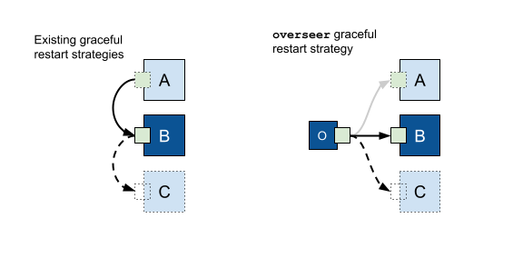

## 热更新

热更新目标：

- 正在处理中的连接/服务/请求不能立即中断，需要继续提供服务
- socket对用户来说要保持可用，可以接受新的请求

直接沿用nginx的热更思路，热更新（单进程）流程，其基本流程如下：

1. 用新的bin文件去替换老的bin文件
2. 发送信号告知server进程（通常是USR2信号），进行平滑升级
3. server进程收到信号后，通过调用 fork/exec 启动新的版本的进程
4. 子进程调用接口获取从父进程继承的 socket 文件描述符重新监听 socket
5. 老的进程不再接受请求，待正在处理中的请求处理完后，进程自动退出
6. 子进程托管给init进程
   我们可以按照这个思路完成一个简单的可以热更新的http server

需要一个最简单的http server

```go
func main() {
	fmt.Println("Hello World!")
    var err error

    // 注册http请求的处理方法
    http.HandleFunc("/", func(w http.ResponseWriter, r *http.Request) {
		w.Write([]byte("Hello world!"))
	})

    // 在8086端口启动http服务，其内部有一个循环accept 8086端口
    // 每当新的HTTP请求过来则开一个协程处理
    err = http.ListenAndServe("localhost:8086", nil)
    if err != nil {
        log.Println(err)
    }

}
```

## fork一个新的进程

在go语言里面可以有很多种方法fork一个新的进程，但是在这里我更倾向于推荐exec.Command接口来启动一个新的进程。因为Cmd struct中有一个ExtraFiles变量，子进程可以通过它直接继承文件描述符fd。同时可以执行新的二进制文件。

```go
func forkProcess() error {
	var err error
	files := []*os.File{gListen.File()} //demo only one //.File()
	path := "/Users/yousa/work/src/graceful-restart-demo/graceful-restart-demo"
	args := []string{
		"-graceful",
	}

	env := append(
		os.Environ(),
		"ENDLESS_CONTINUE=1",
	)
	env = append(env, fmt.Sprintf(`ENDLESS_SOCKET_ORDER=%s`, "0,127.0.0.1"))

	cmd := exec.Command(path, args...)
	//cmd := exec.Command(path, "-graceful", "true")
	cmd.Stdout = os.Stdout
	cmd.Stderr = os.Stderr
	cmd.ExtraFiles = files
	cmd.Env = env

	err = cmd.Start()
	if err != nil {
		log.Fatalf("Restart: Failed to launch, error: %v", err)
		return err
	}

	return nil
}
```
代码浅析：

在上面的files是存储父进程的文件描述符，path的内容是新的要替换的可执行文件的路径。

重要的一点是，.File()返回一个[dup(2)](http://pubs.opengroup.org/onlinepubs/009695399/functions/dup.html)的文件描述符。这个重复的文件描述符不会设置FD_CLOEXEC 标志，这个文件描述符操作容易出错，容易被在子进程中被错误关闭。

在其他语言（或者go里面）里面你可能通过使用命令行将文件描述符传递给子进程，在这里比较推荐使用ExtraFile传递fd。不过ExtraFiles在windows中不支持。

args中传递的-graceful参数是告诉子进程这是优雅热升级的一部分，这样子进程可以通过它知道，自己需要重用套接字而不是重新打开一个新的套接字

## 子进程初始化

```go
func main() {
	fmt.Println("Hello World!")

	...
		
    var gracefulChild bool
	var netListen net.Listener
	var err error
	args := os.Args
	...

    if len(args) > 1 && args[1] == "-graceful" {
		gracefulChild = true
	} else {
		gracefulChild = false
	}

	fmt.Println("gracefulChild:", gracefulChild)

    if gracefulChild {
		//重用套接字
        log.Print("main: Listening to existing file descriptor 3.")
        f := os.NewFile(3, "")
		netListen, err = net.FileListener(f)
    } else {
        log.Print("main: Listening on a new file descriptor.")
        netListen, err = net.Listen("tcp", gServer.Addr)
	}
	if err != nil {
		log.Fatal(err)
		return
	}
    
    ...
}
```

args用于解析入参，gracefulChild表示进程自己是否是子进程（对应到fork中的-graceful）（这里更推荐flag.BoolVar，但是写demo的时候使用起来有些问题，故临时使用args）

net.FileListener重用套接字，ExtraFiles中传递的套接字，从idx 3的位置开始获取。

## 给父进程发送信号停止父进程

```go
func main() {
	//init
	...
	
	if gracefulChild {
		syscall.Kill(syscall.Getppid(), syscall.SIGTERM)
		log.Println("Graceful shutdown parent process.")
	}
	
	//start http server.
	...
}
```

给父进程发送graceful shutdown信号

## 优雅停止父进程

等待请求超时或者处理完成退出进程

第一眼给人感觉，不知道该如何下手做热升级。

我们需要去跟踪连接，故想到的是有没有钩子函数来解决连接的accept和close，让人觉得Golang标准http包没有提供任何钩子来处理Accept()和Close()，这里恰恰是golang的interface的魅力所在。

> interface基础知识请自行补充。其实interface这种通过组合完成类似于继承的功能，虽然第一眼看起来侵入性不高，还算优雅。但是一是理解起来不容易，struct通过匿名变量等才能明白，普通找到的教程并不会提这种东西；二是interface很容易被滥用，通过interface+组合完成的继承功能，缺乏有效的类型校验，导致是一个坑很深的地方；三是interface若被滥用后，在查询源码的时候，非常难以跟踪定位代码，很难理解究竟是跑到了哪个实例或者方法。
> 总得来说，个人觉得interface是一个比较失败的设计。不过interface强调运行时绑定，那么会在阅读代码的时候很难静态的理解

我们需要一个sync.WaitGroup来跟踪已经打开的连接，每新accept一个连接则让其加一，每当连接断开则减一。定义一个listener struct并实现相应的Accept()、Close()、Addr()等方法。

```go
type demoListener struct {
	net.Listener
	stopped bool
	stop    chan error
}

func newDemoListener(listen net.Listener) (demoListen *demoListener) {
	demoListen = &demoListener{
		Listener: listen,
		stop: make(chan error),
	}

	return
}

func (listen *demoListener) Accept() (conn net.Conn, err error) {
	conn, err = listen.Listener.Accept()
	if err != nil {
		return
	}

	conn = demoConn{Conn: conn}
	gWg.Add(1)
	return
}

func (listen *demoListener) Close() error {
	if listen.stopped {
		return syscall.EINVAL
	}

	listen.stopped = true 
	return listen.Listener.Close() //停止接受新的连接
}

//get fd
func (listen *demoListener) File() *os.File {
	// returns a dup(2) - FD_CLOEXEC flag *not* set
	tcpListen := listen.Listener.(*net.TCPListener)
	fd, _ := tcpListen.File()
	return fd
}
```

demoListener定义的时候，通过匿名结构体（可以理解为是一种组合），继承了net.Listener的结构和方法，下面的Accept和Close则重载了net.Listener的Accept和Close方法。

Listener在每个Accept()上都增加了一个等待组。

newDemoListener()是Listener的构造函数。

File()方法是从Listener中获取文件描述符fd

当然，我们需要重载连接net.Conn的Close()方法，在连接断开时，将wg减一。

```go
type demoConn struct {
	net.Conn
}

func (conn demoConn) Close() error {
	err := conn.Conn.Close()
	if err == nil {
		gWg.Done()
	}

    return nil
}
```

最后，有可能客户端已经很长时间不发消息了，但是他不主动断开连接；为了避免这种情况，server端通常认为这种是连接超时，在一定时间后会将连接关闭，故初始化http.Server时比较建议这样:

```go
	gServer = &http.Server{
        Addr:           "0.0.0.0:8086",
        ReadTimeout:    60 * time.Second,
        WriteTimeout:   60 * time.Second,
		MaxHeaderBytes: 1 << 16,
		Handler:		demoHandler{},
	}
```

> **注意：若使用的go版本在1.8版本以上（包括），http包已经支持优雅退出，直接调用Shutdown()接口即可，更为简单。**

**关闭listener连接和监控信号的部分这里便不再赘述，文末附有源码，有兴趣可以看看。**

## 测试结果：

启动server，发送http请求

```go
$ curl -i http://localhost:8086
HTTP/1.1 200 OK
Date: Mon, 05 Nov 2018 08:11:17 GMT
Content-Length: 17
Content-Type: text/plain; charset=utf-8

Hello Tencent!
```

发送usr2信号给server

```go
$ ps -ef | grep grace
  501 50199 41134   0  4:10下午 ttys002    0:00.01 ./graceful-restart-demo
  501 50252 44808   0  4:11下午 ttys003    0:00.00 grep grace
$ kill -USR2 50199
$ ps -ef | grep grace
  501 50253     1   0  4:11下午 ttys002    0:00.01 /Users/yousa/work/src/graceful-restart-demo/graceful-restart-demo -graceful
  501 51460 44808   0  4:37下午 ttys003    0:00.00 grep grace
  
## 终端打印
Hello World!
gracefulChild: false
2018/11/05 16:10:16 main: Listening on a new file descriptor.
2018/11/05 16:11:10 50199 Received SIGUSR2.
Hello World!
gracefulChild: true
2018/11/05 16:11:10 main: Listening to existing file descriptor 3.
2018/11/05 16:11:10 Graceful shutdown parent process.
2018/11/05 16:11:10 50199 Received SIGTERM.
```

待升级后发送消息

```shell
$ curl -i http://localhost:8086
HTTP/1.1 200 OK
Date: Mon, 05 Nov 2018 08:11:44 GMT
Content-Length: 14
Content-Type: text/plain; charset=utf-8

Happy 20th birthday!
```

## 遇到的问题

### 1、翻了下代码，并没有看到父进程如何退出？是怎样的流程？

先看一下http ListenAndServe接口，它会调用net.Listen和serve.Serve两个函数，net.Listen是listen端口。

Serve代码如下，它是一个for循环，Accept一个新的连接后会用一个新的协程来处理请求；当listen的端口被关闭或者异常后，该Serve循环便会跳出

另外，也可以在这里看到，如果让http server接入协程池则可以重载http.Server的Serve，在收到新的连接后，从协程池中分配一个协程供新的连接使用。

```go
func (srv *Server) Serve(l net.Listener) error {
	defer l.Close()
	var tempDelay time.Duration // how long to sleep on accept failure
	for {
		rw, e := l.Accept()
		if e != nil {
			if ne, ok := e.(net.Error); ok && ne.Temporary() {
				if tempDelay == 0 {
					tempDelay = 5 * time.Millisecond
				} else {
					tempDelay *= 2
				}
				if max := 1 * time.Second; tempDelay > max {
					tempDelay = max
				}
				srv.logf("http: Accept error: %v; retrying in %v", e, tempDelay)
				time.Sleep(tempDelay)
				continue
			}
			return e
		}
		tempDelay = 0
		c, err := srv.newConn(rw)
		if err != nil {
			continue
		}
		c.setState(c.rwc, StateNew) // before Serve can return
		go c.serve()
	}
}
```

再看一下shutdownProcess函数，故在这里关闭listen socket后，http Serve处理请求的主循环便会退出

```go
func shutdownProcess() error {
	gServer.SetKeepAlivesEnabled(false)
	gListen.Close()
	log.Println("shutdownProcess success.")
	return nil
}
```

将listen socket 关闭后，main函数中的gServer.Serve(gListen)便会退出，但实际上已有的连接/服务并没有处理完成，需要使用waitgroup等待连接处理完成后，进程再退出。

**2、endless库是使用HUP信号进行热升级，但是通常go server是会采用nohup来拉起进程让进程在后台运行，nohup会屏蔽HUP信号等，如何解决？**

## github上的已有开源方案

解决golang http server热更新问题，有了基本的思路之后，想到的是去github看下有没有稳定的解决方案。找到了如下三个库：

- [fvbock/endless](https://github.com/fvbock/endless) - Zero downtime restarts for golang HTTP and HTTPS servers. (for golang 1.3+)
- [facebookgo/grace](https://github.com/facebookgo/grace) - Grace provides a library that makes it easy to build socket based servers that can be gracefully terminated & restarted (that is, without dropping any connections).
- [jpillora/overseer](https://github.com/jpillora/overseer) - Overseer is a package for creating monitorable, gracefully restarting, self-upgrading binaries in Go (golang)

其实除了这些外，还有一些支持热更新的库，但是更新时间过老，在这里就不作讨论了。
当然，非常火爆的框架比如beego等，也支持热升级/gracefun shutdown，但是由于嵌入到了beego中，故本章中不作讨论，有兴趣的可以自行去看看。

## 实现浅析

我们使用官方的例子来简单分析其流程并简单比较其异同

### 1、各个开源库demo代码

demo代码较为冗长，很影响阅读观感，故贴在了最后的附录中

### 2、对比

**操作步骤**：

- 编译demo示例，启动示例进程，记录其pid
- 修改内容(Hello Tencent初始内容，修改为Happy 20th Birthday！且请求处理均需要sleep 10-20秒)，重新构建。
- 发送请求，发送热升级信号，再发送请求，对比两次请求内容
- 对比进程热升级前后的pid，是否与之前一致

**结果对比**

|     第三方库      | 第一次请求返回 |    第二次请求返回     | 操作前进程pid | 操作后进程pid |
| :---------------: | :------------: | :-------------------: | :-----------: | :-----------: |
| facebookgo/grace  | Hello Tencent  | Happy 20th Birthday！ |     41992     |     41998     |
|  fvbock/endless   | Hello Tencent  | Happy 20th Birthday！ |     41200     |     41520     |
| jpillora/overseer | Hello Tencent  | Happy 20th Birthday！ |     43424     |     43424     |

**原理浅析**：

grace和endless的热升级方法与本文重点讲述的方法一致，基本是fork一个子进程，子进程listen端口，父进程优雅退出，这里便不再赘述

overseer的热升级与grace/endless有些不同，由于作者很久不更新了（差不多1-2年），也找不到比较好的介绍文章，故这里只能简要贴一下其github上对overseer的原理介绍。由于不是本文核心介绍内容，放在附录中。
overseer用一个主进程管理平滑重启，子进程处理连接，保持主进程pid不变；

**优缺点对比**：

- grace库支持net tcp热升级以及http热升级，endless仅支持http热升级
- grace库接入第三方http server较麻烦（比如fasthttp、gin等）；endless接入则只需要替换ListenAndServe即可（endless继承/重写了Serve方法），通用性更好
- grace库功能强大，但是稍微复杂；endless库更为简洁

由于我的项目使用了gin作为http框架，故考虑到快速集成，我选择了endless该框架

第三方库的对比经验：
主观因素：个人品味，是否要自己造轮子，朋友的推荐也对个人的判断也有很大影响；
客观因素：集成复杂度，内存管理，是否有大量I/O访问/耗性能访问，错误处理，工具参考文档等。

集成起来也非常方便，类似于如下：

```go
func main() {
	router := gin.Default()
	router.GET("/", handler)
	// [...]
	endless.ListenAndServe(":8086", router)
}
```

### 问题拓展

1、简单的http server很容易升级，若监听了多个端口该如何进行热升级？

2、若go server使用tls服务（其他也类似），如何进行升级？

3、go http server在容器场景下是否需要平滑热升级？平滑停机是否足够？如果平滑停机足够的话，那么如何结合docker+k8s进行热升级？

个人猜测了一下，这种场景下，后端服务应该会有冗余部署，前端通过负载均衡/elb/tgw等中间层访问，或者使用consul之类的服务注册发现机制，串行重启或者分批次重启，来做到不停服升级服务

## 总结

热更新目标：

- 1、正在处理中的连接/服务/请求不能立即中断，需要继续提供服务
- 2、socket对用户来说要保持可用，可以接受新的请求

直接沿用上篇的思路，热更新（单进程）流程，其基本流程如下：

- 1、用新的bin文件去替换老的bin文件
- 2、发送信号告知server进程（通常是USR2信号），进行平滑升级
- 3、server进程收到信号后，通过调用 fork/exec 启动新的版本的进程
- 4、子进程调用接口获取从父进程继承的 socket 文件描述符重新监听 socket
- 5、老的进程不再接受请求，待正在处理中的请求处理完后，进程自动退出
- 6、子进程托管给init进程

## 参考

https://grisha.org/blog/2014/06/03/graceful-restart-in-golang/
https://blog.csdn.net/u012058778/article/details/78705536
http://gulu-dev.com/post/2014-07-28-tech-evaluation
https://golang.org/doc/go1.8#http_shutdown golang1.8升级日志，支持gracefulshutdown

## 代码附录

### 1、facebookgo/grace

```go
// Command gracedemo implements a demo server showing how to gracefully
// terminate an HTTP server using grace.
package main

import (
	"flag"
	"fmt"
	"net/http"
	"os"
	"time"

	"github.com/facebookgo/grace/gracehttp"
)

var (
	address0 = flag.String("a0", ":48567", "Zero address to bind to.")
	address1 = flag.String("a1", ":48568", "First address to bind to.")
	address2 = flag.String("a2", ":48569", "Second address to bind to.")
	now      = time.Now()
)

func main() {
	flag.Parse()
	gracehttp.Serve(
		&http.Server{Addr: *address0, Handler: newHandler("Zero  ")},
		&http.Server{Addr: *address1, Handler: newHandler("First ")},
		&http.Server{Addr: *address2, Handler: newHandler("Second")},
	)
}

func newHandler(name string) http.Handler {
	mux := http.NewServeMux()
	mux.HandleFunc("/sleep/", func(w http.ResponseWriter, r *http.Request) {
		duration, err := time.ParseDuration(r.FormValue("duration"))
		if err != nil {
			http.Error(w, err.Error(), 400)
			return
		}
		time.Sleep(duration)
		fmt.Fprintf(
			w,
			"%s started at %s slept for %d nanoseconds from pid %d.\n",
			name,
			now,
			duration.Nanoseconds(),
			os.Getpid(),
		)
	})
	return mux
}
```

### 2、fvbock/endless

```go
package main

import (
	"log"
	"net/http"
	"os"

	"github.com/fvbock/endless"
	"github.com/gorilla/mux"
)

func handler(w http.ResponseWriter, r *http.Request) {
	w.Write([]byte("WORLD!"))
}

func main() {
	mux1 := mux.NewRouter()
	mux1.HandleFunc("/hello", handler).
		Methods("GET")

	err := endless.ListenAndServe("localhost:4242", mux1)
	if err != nil {
		log.Println(err)
	}
	log.Println("Server on 4242 stopped")

	os.Exit(0)
}
```

### 3、jpillora/overseer

```go
package main

import (
	"fmt"
	"net/http"
	"time"

	"github.com/jpillora/overseer"
	"github.com/jpillora/overseer/fetcher"
)

//see example.sh for the use-case

// BuildID is compile-time variable
var BuildID = "0"

//convert your 'main()' into a 'prog(state)'
//'prog()' is run in a child process
func prog(state overseer.State) {
	fmt.Printf("app#%s (%s) listening...\n", BuildID, state.ID)
	http.Handle("/", http.HandlerFunc(func(w http.ResponseWriter, r *http.Request) {
		d, _ := time.ParseDuration(r.URL.Query().Get("d"))
		time.Sleep(d)
		fmt.Fprintf(w, "app#%s (%s) says hello\n", BuildID, state.ID)
	}))
	http.Serve(state.Listener, nil)
	fmt.Printf("app#%s (%s) exiting...\n", BuildID, state.ID)
}

//then create another 'main' which runs the upgrades
//'main()' is run in the initial process
func main() {
	overseer.Run(overseer.Config{
		Program: prog,
		Address: ":5001",
		Fetcher: &fetcher.File{Path: "my_app_next"},
		Debug:   false, //display log of overseer actions
	})
}
```

### 4、overseer

- overseer uses the main process to check for and install upgrades and a child process to run Program.
- The main process retrieves the files of the listeners described by Address/es.
- The child process is provided with these files which is converted into a Listener/s for the Program to consume.
- All child process pipes are connected back to the main process.
- All signals received on the main process are forwarded through to the child process.
- Fetcher runs in a goroutine and checks for updates at preconfigured interval. When Fetcher returns a valid binary stream (io.Reader), the master process saves it to a temporary location, verifies it, replaces the current binary and initiates a graceful restart.
- The fetcher.HTTP accepts a URL, it polls this URL with HEAD requests and until it detects a change. On change, we GET the URL and stream it back out to overseer. See also fetcher.S3.
- Once a binary is received, it is run with a simple echo token to confirm it is a overseer binary.
- Except for scheduled restarts, the active child process exiting will cause the main process to exit with the same code. So, overseer is not a process manager.

<div align="center">  </div><br>