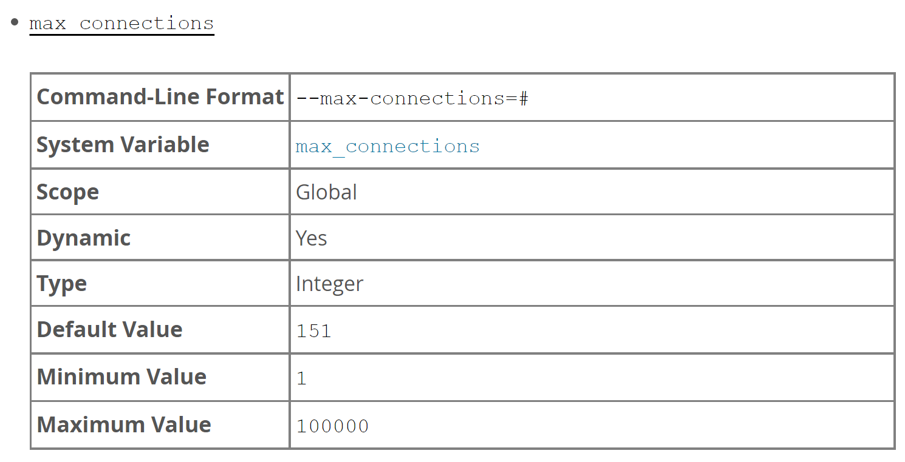
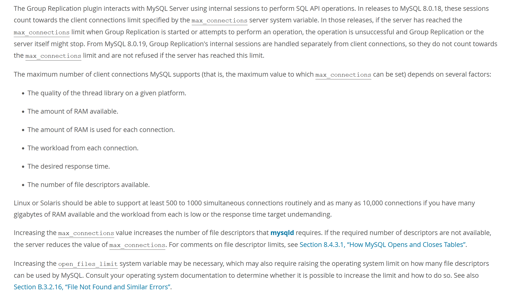

## 一、背景介绍

近期线上的一个go服务QPS达到峰值后突然间收到ERROR告警，报了mysql的 "Too many connections" 错误，这个问题引起了团队的注意。因为服务上云的数据库鉴权问题，我们的mysql没有走proxy而是直连，出于直觉考虑第一怀疑的是线上的链接数配置太少，使用命令 " SHOW VARIABLES LIKE '%max_connections%' " 查看了配置是2400，虽然这个量配置的也不大，但相对于我们的业务来说也暂时是OK，继续使用命令 " show global status like 'Max_used_connections' " 看到确实峰值的连接数也达到了配额。

在确定了mysql配置没有问题后，我们转向了应用层的排查。随机登陆到一个服务容器中，使用命令查询了一下mysql的TCP连接

```shell
lsof -p 1 |grep mysql |grep ESTABLISHED
```

建立连接数量还算正常范围，但是当我们重复执行这条查询命令，就观察到一个很奇怪的现象：基本每次命令查询的结果中TCP端口都在变！难不成gorm一直在创建新连接？为了印证自己的想法，又在容器中执行了命令 "netstat | grep mysql" , 这时就看到除了ESTABLISHED的TCP连接，还大量存在TIMEWAIT阶段的TCP连接！也就是gorm确实一直在新建和关闭连接，我们线上当时部署了30个pod，如果这种情况发生了，确实就很容易将db的连接数打满了。

gorm的底层是使用了连接池的，而且我们线上也配置了每个连接的最大存活时间为1h，按常规理解来看，一个mysql连接建立后，使用完就会放回空闲连接池等待复用，直到这个连接存活了1h才会关闭，但是现实发生的情况确实让人捉摸不透，这个问题不由得激发了我的求知欲，带着强烈的好奇心开始了我的gorm源码之旅。

## 二、从底层源码分析问题

其实gorm关于mysql连接的使用，主要也是使用了google的官方包 "database/sql"，核心文件代码行数也达到了3200+，整个逻辑还是比较多的，为了更好地方便大家理解，个人也是剪枝除叶般写了一个精简版，接下来将通过代码带领大家一步步解开谜团。首先来看下几个核心结构体定义：

```go
var ErrBadConn = errors.New("driver: bad connection")

// driverConn 虚构的连接结构体
type driverConn struct{}

// Close 连接关闭空实现
func (d *driverConn) Close() {}

// connRequest
type connRequest struct {
	// ...
	conn *driverConn
}
// DB
type DB struct {
	mu sync.Mutex // 并发锁

	maxLifeTime time.Duration // 连接最大存活时间，可配置项
	maxIdleTime time.Duration // 连接最大空闲时间，可配置项
	cleanerCh   chan struct{} // 控制清理任务chan

	maxOpenCount int // 最大打开连接数，可配置项
	numOpen      int // 当前打开连接数

	maxIdleCount int           // 最大空闲连接数，可配置项
	freeConn     []*driverConn // 空闲连接数组

	connRequests       map[uint64]chan connRequest // 连接请求等待chan map
	nextConnRequestKey uint64                      // connRequests的下一个key
}

// isConnExpired
func (d *DB) isConnExpired(dc *driverConn) bool {
	// 根据DB的maxLifetime判断当前的连接是否过期，return false只是空实现
	return false
}

```

第一个结构体是driveCon，是mysql建立连接后生成的对象，主要用来执行sql操作，由于这里我们只关心生成的连接不关心具体连接的使用，所以这里用一个空结构体代替。第二个结构体connRequest单纯从代码上看很简单，主要也是包容了driveConn属性，具体的使用我们在后面说这里先跳过。第三个结构体DB则是gorm的核心引用对象，其中maxOpenCount、maxIdleCount、maxLifeTime、maxIdleTime是四个可配置项，freeConn则是空闲连接存放的数组，mu则是一个用在很多场景下的并发锁，其他的属性我们将会在具体的方法用到的时候再做讲解。接下来我们来看下底层是如何清理到期连接：

```shell
// startCleanerLocked 开启异步清理连接
func (d *DB) startCleanerLocked() {
	if (d.maxLifeTime > 0 || d.maxIdleTime > 0) && d.numOpen > 0 && d.cleanerCh == nil {
		// 控制并发启动下面的异步清理连接，只允许启动一个goroutine
		d.cleanerCh = make(chan struct{}, 1)
		// 根据maxLifeTime和maxIdleTime关闭freeConn中的连接，因为逻辑相对比较简单就用空实现代替
		go func() {}()
	}
}
```

整个核心思路是启动一个goroutine，取maxLifeTime和maxIdleTime的最小值作为timer的最小间隔时间，一直轮询关闭并移除freeConn中的已过期连接，这个startCleanerLocked方法会在配置maxLifeTime或者maxIdleTime的时候启动。接下来再来看下如何获取一个可用连接：

```go
// getConn 获取一个可用连接
func (d *DB) getConn(ctx context.Context) (*driverConn, error) {
	d.mu.Lock()

	// 优先从空闲连接中取
	numFree := len(d.freeConn)
	if numFree > 0 {
		conn := d.freeConn[0]
		copy(d.freeConn, d.freeConn[1:])
		d.freeConn = d.freeConn[:numFree-1]
		d.mu.Unlock()
		if d.isConnExpired(conn) {
			conn.Close()
			return nil, ErrBadConn
		}
		return conn, nil
	}
	// 当最大可打开连接数已满则排队
	if d.maxOpenCount > 0 && d.numOpen >= d.maxOpenCount {
		req := make(chan connRequest, 1)
		reqKey := d.nextConnRequestKey
		d.nextConnRequestKey++
		d.connRequests[reqKey] = req
		d.mu.Unlock()

		select {
		case <-ctx.Done():
			d.mu.Lock()
			delete(d.connRequests, reqKey)
			d.mu.Unlock()
			// 并发情况下chan可能有值
			select {
			default:
			case retReq, ok := <-req:
				if ok {
					if d.isConnExpired(retReq.conn) {
						retReq.conn.Close()
						return nil, ErrBadConn
					}
					return retReq.conn, nil
				}
			}
			return nil, ctx.Err()
		case retReq, ok := <-req:
			if !ok {
				return nil, ErrBadConn
			}
			if d.isConnExpired(retReq.conn) {
				retReq.conn.Close()
				return nil, ErrBadConn
			}
			return retReq.conn, nil
		}
	}

	// 初始化新连接
	d.numOpen++
	conn := &driverConn{}
	d.mu.Unlock()

	return conn, nil
}
```

为了保证并发安全getConn方法进来就会使用mu加锁，首先会先从freeConn中找可用连接，如果没有空闲连接而且当前最大可连接数已满， 则会使用connRequest排队等待，不得不说这里的底层实现确实也很巧妙，使用了map结构代替队列，简单又高效，非常具有借鉴意义，最后当最大可连接数没有满的情况则不会等待，直接新建一个连接返回。既然有获取连接的逻辑，当然也需要有放回连接的逻辑：

```go
// putConn 将连接给等待req或者放回空闲池则返回true，其他则返回false
func (d *DB) putConn(conn *driverConn) bool {
	d.mu.Lock()
	defer d.mu.Unlock()

	if len(d.connRequests) > 0 {
		// 将连接给等待req
		var reqKey uint64
		var req chan connRequest
		for reqKey, req = range d.connRequests {
			break
		}
		delete(d.connRequests, reqKey)
		req <- connRequest{
			conn: conn,
		}
		return true
	}

	if d.maxIdleCount > len(d.freeConn) {
		// 将连接放回空闲池
		d.freeConn = append(d.freeConn, conn)
		return true
	}

	return false
```

同样的putConn方法的开头也使用了mu锁解决并发安全问题，首先会先判断connRequest是否有等待使用的请求，如果有的话则直接塞到chan中复用，如果没有等待请求则会判断空闲池配额是否已满，没满则放回freeConn中，整个方法会返回一个bool值通知这个连接是否已被复用，当调用方接收到false返回则会直接关闭这个连接，至此整个简化版的代码逻辑也完整讲完了。

现在回到文章开头遇到的问题，我们的gorm确实配置了maxLifeTime，但却没有配置maxIdleCount和maxOpenCount，也就是说在这种情况下getConn方法只有两种情况，一种是从freeConn获取空闲连接，一种是创建全新的连接，等待获取连接的选项则被跳过，而putConn方法只有放回freeConn一个途径，同时 "database/sql" 包在没有配置maxIdleCount的情况下默认会设置2个，这样子就意味着如果一旦请求量突然上来，就会大量创建新连接而且用完放不回freeConn而被关闭，所以就出现了大规模TIMEWAIT状态的TCP连接。通过对底层源码的分析，现在我们知道了在配置gorm的时候，一定要评估服务的请求情况，指定合适maxIdleCount、maxOpenCount、maxLiftTime和maxIdleTime，让应用能维持一定数量的长链支持复用，减少频繁新建和关闭连接带来的开销和风险。

## 三、如何决定mysql实例的最大允许连接数配置

在文章的开头处有提到，就是我们的Mysql实例最大允许连接数配置的是2400，想必大家都会有这样一个疑问：这个数量应该如配置才是最合理的？为了解答这个问题，我们来先来看下Mysql官方对于这个max_connections说明：

<div align="center">  </div><br>

这里提到允许配置的最大值为10w，再来看一下Mysql官方另一则对于连接数配置的推荐说明：

<div align="center">  </div><br>

总结来说主要关心几个指标：1、 服务器进程的最大可打开fd限制（每个mysql连接会占用进程的一个fd）；2、服务器当前的CPU和内存使用（越多的CPU和内存意味着可支持的连接数越多）；3、mysql服务请求延迟时间（当开启过量的连接数超过负荷，会引起整个请求的时延）。当然除了这些基础指标，我们的业务应用的使用情况也很重要，比如预计峰值QPS和TPS是多少，预计会启动多少个应用服务，每个服务预计需要的连接上限是多少等等，这些就需要结合经验来看，事先压测得出具体指标，同时平常多留意监控，但历史最大连接数达到配置项的80%则要引起我们的注意，是否连接数配置还有上升的空间，或者就要考虑拆解DB到不同的实例上，更或者寻求Mysql服务器升级方案。

## 四、案例

mysql实例配置了最多8000个连接，gorm配置maxLifeTime=3600秒，maxOpenCount=200，maxIdleCount=40，线上pod数量为35

> mysql 的wait_timeout 默认是3600s，grom设置的maxLeftTime 要比这个小一些。