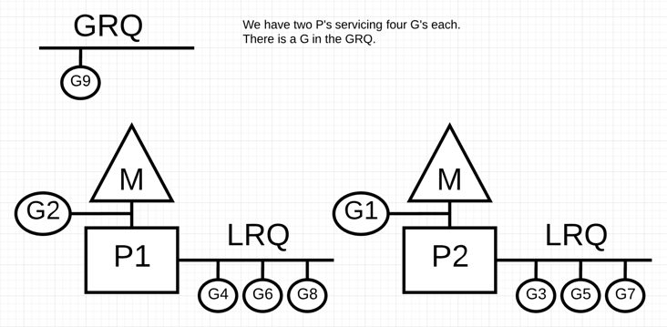

# [Golang - 调度剖析【第一部分】](https://www.ardanlabs.com/blog/2018/08/scheduling-in-go-part1.html)

## 简介

首先，Golang 调度器的设计和实现让我们的 Go 程序在多线程执行时效率更高，性能更好。这要归功于 Go 调度器与操作系统（OS）调度器的协同合作。不过在本篇文章中，多线程 Go 程序在设计和实现上是否与调度器的工作原理完全契合不是重点。重要的是对系统调度器和 Go 调度器，它们是如何正确地设计多线程程序，有一个全面且深入的理解。

本章多数内容将侧重于讨论调度器的高级机制和语义。我将展示一些细节，让你可以通过图像来理解它们是如何工作的，可以让你在写代码时做出更好的决策。因为原理和语义是必备的基础知识中的关键。

## 系统调度

操作系统调度器是一个复杂的程序。它们要考虑到运行时的硬件设计和设置，其中包括但不限于多处理器核心、CPU 缓存和 NUMA，只有考虑全面，调度器才能做到尽可能地高效。值得高兴的是，你不需要深入研究这些问题，就可以大致上了解操作系统调度器是如何工作的。

你的代码会被翻译成一系列机器指令，然后依次执行。为了实现这一点，操作系统使用线程（*Thread*）的概念。线程负责顺序执行分配给它的指令。一直执行到没有指令为止。这就是我将线程称为“执行流”的原因。

你运行的每个程序都会创建一个进程，每个进程都有一个初始线程。而后线程可以创建更多的线程。每个线程互相独立地运行着，调度是在线程级别而不是在进程级别做出的。**线程可以并发运行(每个线程在单个内核上轮流运行)，也可以并行运行(每个线程在不同的内核上同时运行)。**线程还维护自己的状态，以便安全、本地和独立地执行它们的指令。

如果有线程可以执行，操作系统调度器就会调度它到空闲的 CPU 核心上去执行，保证 CPU 不闲着。它还必须模拟一个假象，即所有可以执行的线程都在同时地执行着。在这个过程中，调度器还会根据优先级不同选择线程执行的先后顺序，高优先级的先执行，低优先级的后执行。当然，低优先级的线程也不会被饿着。调度器还需要通过快速而明智的决策尽可能减少调度延迟。

为了实现这一目标，算法在其中做了很多工作，且幸运的是，这个领域已经积累了几十年经验。为了我们能更好地理解这一切，接下来我们来看几个重要的概念。

## 执行指令

程序计数器(PC)，有时称为指令指针(IP)，线程利用它来跟踪下一个要执行的指令。在大多数处理器中，PC指向的是下一条指令，而不是当前指令。

<div align="center">  </div><br>

如果你之前看过 Go 程序的堆栈跟踪，那么你可能已经注意到了每行末尾的这些十六进制数字。如下：

```go
goroutine 1 [running]:
   main.example(0xc000042748, 0x2, 0x4, 0x106abae, 0x5, 0xa)
       stack_trace/example1/example1.go:13 +0x39                 <- LOOK HERE
   main.main()
       stack_trace/example1/example1.go:8 +0x72                  <- LOOK HERE
```

这些数字表示 PC 值与相应函数顶部的偏移量。`+0x39`PC 偏移量表示在程序没中断的情况下，线程即将执行的下一条指令。如果控制权回到主函数中，则主函数中的下一条指令是`0+x72`PC 偏移量。更重要的是，指针前面的指令是当前正在执行的指令。

```go
下面是对应的代码
https://github.com/ardanlabs/gotraining/blob/master/topics/go/profiling/stack_trace/example1/example1.go

07 func main() {
08     example(make([]string, 2, 4), "hello", 10)
09 }

12 func example(slice []string, str string, i int) {
13    panic("Want stack trace")
14 }
```

十六进制数`+0x39`表示示例函数内的一条指令的 PC 偏移量，该指令位于函数的起始指令后面第57条(10进制)。接下来，我们用 objdump 来看一下汇编指令。找到第57条指令，注意，`runtime.gopanic`那一行。

```shell
$ go tool objdump -S -s "main.example" ./example1
TEXT main.example(SB) stack_trace/example1/example1.go
func example(slice []string, str string, i int) {
  0x104dfa0        65488b0c2530000000    MOVQ GS:0x30, CX
  0x104dfa9        483b6110              CMPQ 0x10(CX), SP
  0x104dfad        762c                  JBE 0x104dfdb
  0x104dfaf        4883ec18              SUBQ $0x18, SP
  0x104dfb3        48896c2410            MOVQ BP, 0x10(SP)
  0x104dfb8        488d6c2410            LEAQ 0x10(SP), BP
    panic("Want stack trace")
  0x104dfbd        488d059ca20000        LEAQ runtime.types+41504(SB), AX
  0x104dfc4        48890424              MOVQ AX, 0(SP)
  0x104dfc8        488d05a1870200        LEAQ main.statictmp_0(SB), AX
  0x104dfcf        4889442408            MOVQ AX, 0x8(SP)
  0x104dfd4        e8c735fdff            CALL runtime.gopanic(SB)
  0x104dfd9        0f0b                  UD2              <--- 这里是 PC(+0x39)
```

**记住: PC 是下一个指令，而不是当前指令**。上面是基于 amd64 的汇编指令的一个很好的例子，该 Go 程序的线程负责顺序执行。

## 线程状态

另一个重要的概念是线程状态，它描述了调度器在线程中的角色。
线程可以处于三种状态之一: `等待中(Waiting)`、`待执行(Runnable)`或`执行中(Executing)`。

`等待中(Waiting)`:这意味着线程停止并等待某件事情以继续。这可能是因为等待硬件(磁盘、网络)、操作系统(系统调用)或同步调用(原子、互斥)等原因。这些类型的延迟是性能下降的根本原因。

`待执行(Runnable)`:这意味着线程需要内核上的时间，以便执行它指定的机器指令。如果有很多线程都需要时间，那么线程需要等待更长的时间才能获得执行。此外，由于更多的线程在竞争，每个线程获得的单个执行时间都会缩短。这种类型的调度延迟也可能导致性能下降。

`执行中(Executing)`:这意味着线程已经被放置在一个核心上，并且正在执行它的机器指令。与应用程序相关的工作正在完成。这是每个人都想要的。

## 工作类型

线程可以做两种类型的工作。第一个称为 **CPU-Bound**，第二个称为 **IO-Bound**。

**CPU-Bound**：这种工作类型永远也不会让线程处在等待状态，因为这是一项不断进行计算的工作。比如计算 π 的第 n 位，就是一个 CPU-Bound 线程。

**IO-Bound**：这是导致线程进入等待状态的工作类型。比如通过网络请求对资源的访问或对操作系统进行系统调用。

## 上下文切换

诸如 Linux、Mac、 Windows 是一个具有抢占式调度器的操作系统。这意味着一些重要的事情。首先，这意味着调度程序在什么时候选择运行哪些线程是不可预测的。线程优先级和事件混在一起(比如在网络上接收数据)使得无法确定调度程序将选择做什么以及什么时候做。

其次，这意味着你永远不能基于一些你曾经历过但不能保证每次都发生的行为来编写代码。如果应用程序中需要确定性，则必须控制线程的同步和协调管理。

在核心上交换线程的物理行为称为上下文切换。当调度器将一个正在执行的线程从内核中取出并将其更改状态为一个可运行的线程时，就会发生上下文切换。

上下文切换的代价是高昂的，因为在核心上交换线程会花费很多时间。上下文切换的延迟取决于不同的因素，大概在在 50 到 100 纳秒之间。考虑到硬件应该能够合理地(平均)在每个核心上每纳秒执行 12 条指令，那么一次上下文切换可能会花费 600 到 1200 条指令的延迟时间。实际上，上下文切换占用了大量程序执行指令的时间。

如果你在执行一个 IO-Bound 程序，那么上下文切换将是一个优势。一旦一个线程更改到等待状态，另一个处于可运行状态的线程就会取而代之。这使得 CPU 总是在工作。这是调度器最重要的之一，最好不要让 CPU 闲下来。

而如果你在执行一个 CPU-Bound 程序，那么上下文切换将成为性能瓶颈的噩梦。由于线程总是有工作要做，所以上下文切换阻碍了工作的进展。这种情况与 IO-Bound 类型的工作形成了鲜明对比。

## 少即是多

在早期处理器只有一个核心的时代，调度相对简单。因为只有一个核心，所以物理上在任何时候都只有一个线程可以执行。其思想是定义一个调度程序周期，并尝试在这段时间内执行所有可运行线程。**算法很简单：用调度周期除以需要执行的线程数。**

例如，如果你将调度器周期定义为 10ms(毫秒)，并且你有 2 个线程，那么每个线程将分别获得 5ms。如果你有 5 个线程，每个线程得到 2ms。但是，如果有 1000 个线程，会发生什么情况呢？给每个线程一个时间片 10μs (微秒)？错了，这么干是愚蠢的，因为你会花费大量的时间在上下文切换上，而真正的工作却做不成。

你需要限制时间片的长度。在最后一个场景中，如果最小时间片是 2ms，并且有 1000 个线程，那么调度器周期需要增加到 2s(秒)。如果有 10000 个线程，那么调度器周期就是 20s。在这个简单的例子中，如果每个线程使用它的全时间片，那么所有线程运行一次需要花费 20s。

要知道，这是一个非常简单的场景。在真正进行调度决策时，调度程序需要考虑和处理比这更多的事情。你可以控制应用程序中使用的线程数量。当有更多的线程要考虑，并且发生 IO-Bound 工作时，就会出现一些混乱和不确定的行为。任务需要更长的时间来调度和执行。

这就是为什么游戏规则是“少即是多”。处于可运行状态的线程越少，意味着调度开销越少，每个线程执行的时间越长。完成的工作会越多。如此，效率就越高。

## 寻找一个平衡

你需要在 **CPU 核心数**和为应用程序获得最佳吞吐量所需的**线程数**之间找到**平衡**。当涉及到管理这种平衡时，线程池是一个很好的解决方案。将在第二部分中为你解析，Go 并不是这样做的。

## CPU 缓存

从主存访问数据有很高的延迟成本(大约 100 到 300 个时钟周期)，因此处理器核心使用本地高速缓存来将数据保存在需要的硬件线程附近。从缓存访问数据的成本要低得多(大约 3 到 40 个时钟周期)，这取决于所访问的缓存。如今，提高性能的一个方面是关于如何有效地将数据放入处理器以减少这些数据访问延迟。编写多线程应用程序也需要考虑 CPU 缓存的机制。

<div align="center">  </div><br>

数据通过`cache lines`在处理器和主存储器之间交换。`cache line`是在主存和高速缓存系统之间交换的 64 字节内存块。每个内核都有自己所需的`cache line`的副本，这意味着硬件使用值语义。这就是为什么多线程应用程序中内存的变化会造成性能噩梦。

当并行运行的多个线程正在访问相同的数据值，甚至是相邻的数据值时，它们将访问同一`cache line`上的数据。在任何核心上运行的任何线程都将获得同一`cache line`的副本。

<div align="center">  </div><br>

如果某个核心上的一个线程对其`cache line`的副本进行了更改，那么同一`cache line`的所有其他副本都必须标记为`dirty`的。当线程尝试对`dirty cache line`进行读写访问时，需要向主存访问(大约 100 到 300 个时钟周期)来获得`cache line`的新副本。

也许在一个 2 核处理器上这不是什么大问题，但是如果一个 32 核处理器在同一`cache line`上同时运行 32 个线程来访问和改变数据，那会发生什么？如果一个系统有两个物理处理器，每个处理器有16个核心，那又该怎么办呢？这将变得更糟，因为处理器到处理器的通信延迟更大。应用程序将会在主存中周转，性能将会大幅下降。

这被称为缓存一致性问题，还引入了错误共享等问题。在编写可能会改变共享状态的多线程应用程序时，必须考虑缓存系统。

## 调度决策场景

假设我要求你基于我给你的信息编写操作系统调度器。考虑一下这个你必须考虑的情况。记住，这是调度程序在做出调度决策时必须考虑的许多有趣的事情之一。

启动应用程序，创建主线程并在`核心1`上执行。当线程开始执行其指令时，由于需要数据，正在检索`cache line`。现在，线程决定为一些并发处理创建一个新线程。下面是问题：

1. 进行上下文切换，切出`核心1`的主线程，切入新线程？这样做有助于提高性能，因为这个新线程需要的相同部分的数据很可能已经被缓存。但主线程没有得到它的全部时间片。
2. 新线程等待`核心1`在主线程完成之前变为可用？线程没有运行，但一旦启动，获取数据的延迟将被消除。
3. 线程等待下一个可用的核心？这意味着所选核心的`cache line`将被刷新、检索和复制，从而导致延迟。然而，线程将启动得更快，主线程可以完成它的时间片。

有意思吗？这些是系统调度器在做出调度决策时需要考虑的有趣问题。幸运的是，不是我做的。我能告诉你的就是，如果有一个空闲核心，它将被使用。你希望线程在可以运行时运行。

## 结论

本文的第一部分深入介绍了在编写多线程应用程序时需要考虑的关于线程和系统调度器的问题。这些是 Go 调度器也要考虑的事情。在下一篇文章中，我将解析 Go 调度器的语义以及它们如何与这些信息相关联，并通过一些示例程序来展示。

# [Golang - 调度剖析【第二部分】](https://www.ardanlabs.com/blog/2018/08/scheduling-in-go-part2.html)

> 回顾本系列的[第一部分](https://segmentfault.com/a/1190000016038785)，重点讲述了操作系统调度器的各个方面，这些知识对于理解和分析 Go 调度器的语义是非常重要的。
> 在本文中，我将从语义层面解析 Go 调度器是如何工作的，并重点介绍其高级特性。
> Go 调度器是一个非常复杂的系统，我们不会过分关注一些细节，而是侧重于剖析它的设计模型和工作方式。
> 我们通过学习它的优点以便够做出更好的工程决策。

## 开始

**当 Go 程序启动时，它会为主机上标识的每个虚拟核心提供一个逻辑处理器（P）**。如果处理器每个物理核心可以提供多个硬件线程（超线程），那么每个硬件线程都将作为虚拟核心呈现给 Go 程序。为了更好地理解这一点，下面实验都基于如下配置的 MacBook Pro 的系统。

<div align="center">  </div><br>

可以看到它是一个 4 核 8 线程的处理器。这将告诉 Go 程序有 8 个虚拟核心可用于并行执行系统线程。

用下面的程序来验证一下:

```go
package main

import (
    "fmt"
    "runtime"
)

func main() {

    // NumCPU 返回当前可用的逻辑处理核心的数量
    fmt.Println(runtime.NumCPU())
}
```

当我运行该程序时，`NumCPU()` 函数调用的结果将是 `8` 。意味着在我的机器上运行的任何 Go 程序都将被赋予 8 个 **`P`**。

**每个 `P` 都被分配一个系统线程 `M`** 。M 代表机器（machine），它仍然是由操作系统管理的，操作系统负责将线程放在一个核心上执行。这意味着当在我的机器上运行 Go 程序时，有 8 个线程可以执行我的工作，每个线程单独连接到一个 P。

**每个 Go 程序都有一个初始 `G`**。G 代表 Go 协程（Goroutine），它是 Go 程序的执行路径。Goroutine 本质上是一个 [Coroutine](https://en.wikipedia.org/wiki/Coroutine)，但因为是 Go 语言，所以把字母 “C” 换成了 “G”，我们得到了这个词。你可以将 Goroutines 看作是应用程序级别的线程，它在许多方面与系统线程都相似。正如系统线程在物理核心上进行上下文切换一样，Goroutines 在 **`M`** 上进行上下文切换。

最后一个重点是运行队列。Go 调度器中有两个不同的运行队列：`全局运行队列(GRQ)`和`本地运行队列(LRQ)`。**每个 `P` 都有一个LRQ**，用于管理分配给在**`P`**的上下文中执行的 Goroutines，这些 Goroutine 轮流被***和`P`绑定的`M`\***进行上下文切换。GRQ 适用于尚未分配给**`P`**的 Goroutines。其中有一个过程是将 Goroutines 从 GRQ 转移到 LRQ，我们将在稍后讨论。

下面图示展示了它们之间的关系：

<div align="center">  </div><br>

## 协作式调度器

正如我们在第一篇文章中所讨论的，OS 调度器是一个抢占式调度器。从本质上看，这意味着你无法预测调度程序在任何给定时间将执行的操作。由内核做决定，一切都是不确定的。在操作系统之上运行的应用程序无法通过调度控制内核内部发生的事情，除非它们利用像 [atomic](https://en.wikipedia.org/wiki/Linearizability) 指令 和 [mutex](https://en.wikipedia.org/wiki/Lock_(computer_science)) 调用之类的同步原语。

Go 调度器是 Go 运行时的一部分，Go 运行时内置在应用程序中。这意味着 Go 调度器在内核之上的用户空间中运行。Go 调度器的当前实现不是抢占式调度器，而是协作式调度器。作为一个协作的调度器，意味着调度器需要明确定义用户空间事件，这些事件发生在代码中的安全点，以做出调度决策。

Go 协作式调度器的优点在于它看起来和感觉上都是抢占式的。你无法预测 Go 调度器将会执行的操作。这是因为这个协作调度器的决策不掌握在开发人员手中，而是在 Go 运行时。将 Go 调度器视为抢占式调度器是非常重要的，并且由于调度程序是非确定性的，因此这并不是一件容易的事。

## Goroutine 状态

就像线程一样，Goroutines 有相同的三个高级状态。它们标识了 Go 调度器在任何给定的 Goroutine 中所起的作用。Goroutine 可以处于三种状态之一：**`Waiting`（等待状态）**、**`Runnable`（可运行状态）**或**`Executing`（运行中状态）**。

**`Waiting`：**这意味着 Goroutine 已停止并等待一些事情以继续。这可能是因为等待操作系统（系统调用）或同步调用（原子和互斥操作）等原因。这些类型的延迟是性能下降的根本原因。

**`Runnable `：**这意味着 Goroutine 需要**`M`**上的时间片，来执行它的指令。如果同一时间有很多 Goroutines 在竞争时间片，它们都必须等待更长时间才能得到时间片，而且每个 Goroutine 获得的时间片都缩短了。这种类型的调度延迟也可能导致性能下降。

**`Executing `：**这意味着 Goroutine 已经被放置在**`M`**上并且正在执行它的指令。与应用程序相关的工作正在完成。这是每个人都想要的。

## 上下文切换

Go 调度器需要有明确定义的用户空间事件，这些事件发生在要切换上下文的代码中的安全点上。这些事件和安全点在函数调用中表现出来。函数调用对于 Go 调度器的运行状况是至关重要的。现在（使用 Go 1.11或更低版本），如果你运行任何未进行函数调用的[紧凑循环](https://en.wiktionary.org/wiki/tight_loop)，你会导致调度器和垃圾回收有延迟。让函数调用在合理的时间范围内发生是至关重要的。

*注意：在 Go 1.12 版本中有一个提议被接受了，它可以使 Go 调度器使用非协作抢占技术，以允许抢占紧密循环。*

在 Go 程序中有四类事件，它们允许调度器做出调度决策：

- 使用关键字 `go`
- 垃圾回收
- 系统调用
- 同步和[编配](https://zh.wikipedia.org/zh-hans/编配_(计算机))

### 使用关键字 `go`

关键字 `go` 是用来创建 Goroutines 的。一旦创建了新的 Goroutine，它就为调度器做出调度决策提供了机会。

### 垃圾回收

由于 GC 使用自己的 Goroutine 运行，所以这些 Goroutine 需要在 M 上运行的时间片。这会导致 GC 产生大量的调度混乱。但是，调度程序非常聪明地了解 Goroutine 正在做什么，它将智能地做出一些决策。

### 系统调用

如果 Goroutine 进行系统调用，那么会导致这个 Goroutine 阻塞当前**`M`**，有时调度器能够将 Goroutine 从**`M`**换出并将新的 Goroutine 换入。然而，有时需要新的**`M`**继续执行在**`P`**中排队的 Goroutines。这是如何工作的将在下一节中更详细地解释。

### 同步和编配

如果原子、互斥量或通道操作调用将导致 Goroutine 阻塞，调度器可以将之切换到一个新的 Goroutine 去运行。一旦 Goroutine 可以再次运行，它就可以重新排队，并最终在**`M`**上切换回来。

## 异步系统调用

当你的操作系统能够异步处理系统调用时，可以使用称为网络轮询器的东西来更有效地处理系统调用。这是通过在这些操作系统中使用 kqueue（MacOS），epoll（Linux）或 iocp（Windows）来实现的。

基于网络的系统调用可以由我们今天使用的许多操作系统异步处理。这就是为什么我管它叫网络轮询器，因为它的主要用途是处理网络操作。通过使用网络轮询器进行网络系统调用，调度器可以防止 Goroutine 在进行这些系统调用时阻塞**`M`**。这可以让**`M`**执行**`P`**的 LRQ 中其他的 Goroutines，而不需要创建新的**`M`**。有助于减少操作系统上的调度负载。

下图展示它的工作原理：**`G1`**正在**`M`**上执行，还有 3 个 Goroutine 在 LRQ 上等待执行。网络轮询器空闲着，什么都没干。

<div align="center">  </div><br>

接下来，情况发生了变化：**`G1`**想要进行网络系统调用，因此它被移动到网络轮询器并且处理异步网络系统调用。然后，**`M`**可以从 LRQ 执行另外的 Goroutine。此时，**`G2`**就被上下文切换到**`M`**上了。

<div align="center">  </div><br>

最后：异步网络系统调用由网络轮询器完成，**`G1`**被移回到**`P`**的 LRQ 中。一旦**`G1`**可以在**`M`**上进行上下文切换，它负责的 Go 相关代码就可以再次执行。这里的最大优势是，执行网络系统调用不需要额外的**`M`**。网络轮询器使用系统线程，它时刻处理一个有效的事件循环。

<div align="center">  </div><br>

## 同步系统调用

如果 Goroutine 要执行同步的系统调用，会发生什么？在这种情况下，网络轮询器无法使用，而进行系统调用的 Goroutine 将阻塞当前**`M`**。这是不幸的，但是没有办法防止这种情况发生。需要同步进行的系统调用的一个例子是基于文件的系统调用。如果你正在使用 CGO，则可能还有其他情况，调用 C 函数也会阻塞**`M`**。

*注意：Windows 操作系统确实能够异步进行基于文件的系统调用。从技术上讲，在 Windows 上运行时，可以使用网络轮询器。*

让我们来看看同步系统调用（如文件I/O）会导致**`M`**阻塞的情况：**`G1`**将进行同步系统调用以阻塞**`M1`**。

<div align="center">  </div><br>

调度器介入后：识别出**`G1`**已导致**`M1`**阻塞，此时，调度器将**`M1`**与**`P`**分离，同时也将**`G1`**带走。然后调度器引入新的**`M2`**来服务**`P`**。此时，可以从 LRQ 中选择**`G2`**并在**`M2`**上进行上下文切换。

<div align="center">  </div><br>

阻塞的系统调用完成后：**`G1`**可以移回 LRQ 并再次由**`P`**执行。如果这种情况需要再次发生，M1将被放在旁边以备将来使用。

<div align="center">  </div><br>

## 任务窃取（负载均衡思想）

调度器的另一个方面是它是一个任务窃取的调度器。这有助于在一些领域保持高效率的调度。首先，你最不希望的事情是**`M`**进入等待状态，因为一旦发生这种情况，操作系统就会将**`M`**从内核切换出去。这意味着**`P`**无法完成任何工作，即使有 Goroutine 处于可运行状态也不行，直到一个**`M`**被上下文切换回核心。任务窃取还有助于平衡所有**`P`**的 Goroutines 数量，这样工作就能更好地分配和更有效地完成。

看下面的一个例子：这是一个多线程的 Go 程序，其中有两个**`P`**，每个**`P`**都服务着四个 Goroutine，另在 GRQ 中还有一个单独的 Goroutine。如果其中一个**`P`**的所有 Goroutines 很快就执行完了会发生什么？

<div align="center">  </div><br>

如你所见：**`P1`**的 Goroutines 都执行完了。但是还有 Goroutines 处于可运行状态，在 GRQ 中有，在**`P2`**的 LRQ 中也有。
这时**`P1`**就需要窃取任务。

<div align="center">  </div><br>

```go
if gp == nil {
        // 1/61的概率检查一下全局可运行队列，以确保公平。否则，两个 goroutine 就可以通过不断地相互替换来完全占据本地运行队列。
        if _g_.m.p.ptr().schedtick%61 == 0 && sched.runqsize > 0 {
            lock(&sched.lock)
            gp = globrunqget(_g_.m.p.ptr(), 1)
            unlock(&sched.lock)
        }
    }
    if gp == nil {
        gp, inheritTime = runqget(_g_.m.p.ptr())
        if gp != nil && _g_.m.spinning {
            throw("schedule: spinning with local work")
        }
    }
    if gp == nil {
        gp, inheritTime = findrunnable()
    }
```

根据规则，**`P1`**将窃取**`P2`**中一半的 Goroutines，窃取完成后的样子如下：

<div align="center">  </div><br>

我们再来看一种情况，如果**`P2`**完成了对所有 Goroutine 的服务，而**`P1`**的 LRQ 也什么都没有，会发生什么?

<div align="center">  </div><br>

**`P2`**完成了所有任务，现在需要窃取一些。首先，它将查看**`P1`**的 LRQ，但找不到任何 Goroutines。接下来，它将查看 GRQ。
在那里它会找到**`G9`**，**`P2`**从 GRQ 手中抢走了**`G9`**并开始执行。以上任务窃取的好处在于它使**`M`**不会闲着。在窃取任务时，**`M`**是自旋的。这种自旋还有其他的好处，可以参考 [work-stealing](https://rakyll.org/scheduler/) 。

<div align="center">  </div><br>

## 实例

有了相应的机制和语义，我将向你展示如何将所有这些结合在一起，以便 Go 调度程序能够执行更多的工作。设想一个用 C 编写的多线程应用程序，其中程序管理两个操作系统线程，这两个线程相互传递消息。

下面有两个线程，线程 `T1` 在内核 `C1` 上进行上下文切换，并且正在运行中，这允许 `T1` 将其消息发送到 `T2`。

<div align="center">  </div><br>

当 `T1` 发送完消息，它需要等待响应。这将导致 `T1` 从 `C1` 上下文换出并进入等待状态。
当 `T2` 收到有关该消息的通知，它就会进入可运行状态。
现在操作系统可以执行上下文切换并让 `T2` 在一个核心上执行，而这个核心恰好是 `C2`。接下来，`T2` 处理消息并将新消息发送回 `T1`。

<div align="center">  </div><br>

然后，`T2` 的消息被 `T1` 接收，线程上下文切换再次发生。现在，`T2` 从运行中状态切换到等待状态，`T1` 从等待状态切换到可运行状态，再被执行变为运行中状态，这允许它处理并发回新消息。

所有这些上下文切换和状态更改都需要时间来执行，这限制了工作的完成速度。
由于每个上下文切换可能会产生 50 纳秒的延迟，并且理想情况下硬件每纳秒执行 12 条指令，因此你会看到有差不多 600 条指令，在上下文切换期间被停滞掉了。并且由于这些线程也在不同的内核之间跳跃，因 [cache-line](https://en.wikipedia.org/wiki/CPU_cache) 未命中引起额外延迟的可能性也很高。

<div align="center">  </div><br>

下面我们还用这个例子，来看看 Goroutine 和 Go 调度器是怎么工作的：
有两个goroutine，它们彼此协调，来回传递消息。**`G1`**在**`M1`**上进行上下文切换，而**`M1`**恰好运行在**`C1`**上，这允许**`G1`**执行它的工作。即向**`G2`**发送消息

<div align="center">  </div><br>

**`G1`**发送完消息后，需要等待响应。**`M1`**就会把**`G1`**换出并使之进入等待状态。一旦**`G2`**得到消息，它就进入可运行状态。现在 Go 调度器可以执行上下文切换，让**`G2`**在**`M1`**上执行，**`M1`**仍然在**`C1`**上运行。接下来，**`G2`**处理消息并将新消息发送回**`G1`**。

<div align="center">  </div><br>

当**`G2`**发送的消息被**`G1`**接收时，上下文切换再次发生。现在**`G2`**从运行中状态切换到等待状态，**`G1`**从等待状态切换到可运行状态，最后返回到执行状态，这允许它处理和发送一个新的消息。

<div align="center">  </div><br>

表面上看起来没有什么不同。无论使用线程还是 Goroutine，都会发生相同的上下文切换和状态变更。然而，使用线程和 Goroutine 之间有一个主要区别：
**在使用 Goroutine 的情况下，会复用同一个系统线程和核心。这意味着，从操作系统的角度来看，操作系统线程永远不会进入等待状态。因此，在使用系统线程时的开销在使用 Goroutine 时就不存在了。**

基本上，Go 已经在操作系统级别将 `IO-Bound` 类型的工作转换为 `CPU-Bound` 类型。由于所有的上下文切换都是在应用程序级别进行的，所以在使用线程时，每个上下文切换(平均)不至于迟滞 600 条指令。该调度程序还有助于提高 `cache-line` 效率和 `NUMA`。在 Go 中，随着时间的推移，可以完成更多的工作，因为 Go 调度器尝试使用更少的线程，在每个线程上做更多的工作，这有助于减少操作系统和硬件的负载。

## 结论

Go 调度器在设计中考虑到复杂的操作系统和硬件的工作方式，真是令人惊叹。在操作系统级别将 `IO-Bound` 类型的工作转换为 `CPU-Bound` 类型的能力是我们在利用更多 CPU 的过程中获得巨大成功的地方。这就是为什么不需要比虚拟核心更多的操作系统线程的原因。你可以合理地期望每个虚拟内核只有一个系统线程来完成所有工作(CPU和IO)。对于网络应用程序和其他不会阻塞操作系统线程的系统调用的应用程序来说，这样做是可能的。

作为一个开发人员，你当然需要知道程序在运行中做了什么。你不可能创建无限数量的 Goroutine ，并期待惊人的性能。越少越好，但是通过了解这些 Go 调度器的语义，您可以做出更好的工程决策。

在下一篇文章中，我将探讨以保守的方式利用并发性以获得更好的性能，同时平衡可能需要增加到代码中的复杂性。

# [Golang - 调度剖析【第三部分】](https://www.ardanlabs.com/blog/2018/12/scheduling-in-go-part3.html)

> 本篇是调度剖析的第三部分，将重点关注**并发**特性。

# 简介

首先，在我平时遇到问题的时候，特别是如果它是一个新问题，我一开始并不会考虑使用并发的设计去解决它。我会先实现顺序执行的逻辑，并确保它能正常工作。然后在可读性和技术关键点都 Review 之后，我才会开始思考并发执行的实用性和可行性。有的时候，并发执行是一个很好的选择，有时则不一定。

在本系列的第一部分中，我解释了**系统调度**的机制和语义，如果你打算编写多线程代码，我认为这些机制和语义对于实现正确的逻辑是很重要的。在第二部分中，我解释了**Go 调度**的语义，我认为它能帮助你理解如何在 Go 中编写高质量的并发程序。在这篇文章中，我会把**系统调度**和**Go 调度**的机制和语义结合在一起，以便更深入地理解什么才是并发以及它的本质。

# 什么是并发

并发意味着`乱序`执行。**拿一组原来是顺序执行的指令，而后找到一种方法，使这些指令乱序执行，但仍然产生相同的结果。**那么，顺序执行还是乱序执行？根本在于，针对我们目前考虑的问题，使用并发必须是有收益的！确切来说，是并发带来的性能提升要大于它带来的复杂性成本。当然有些场景，代码逻辑就已经约束了我们不能执行乱序，这样使用并发也就没有了意义。

## 并发与并行

理解`并发`与`并行`的不同也非常重要。`并行`意味着同时执行两个或更多指令，简单来说，只有多个CPU核心之间才叫`并行`。在 Go 中，至少要有两个操作系统硬件线程并至少有两个 Goroutine 时才能实现并行，每个 Goroutine 在一个单独的系统线程上执行指令。如图：

<div align="center">  </div><br>

我们看到有两个逻辑处理器`P`，每个逻辑处理器都挂载在一个系统线程`M`上，而每个`M`适配到计算机上的一个CPU处理器`Core`。
其中，有两个 Goroutine `G1` 和 `G2` 在`并行`执行，因为它们同时在各自的系统硬件线程上执行指令。
再看，在每一个逻辑处理器中，都有三个 Goroutine `G2 G3 G5` 或 `G1 G4 G6` 轮流共享各自的系统线程。看起来就像这三个 Goroutine 在同时运行着，没有特定顺序地执行它们的指令，并在系统线程上共享时间。
那么这就会发生**竞争**，有时候如果只在一个物理核心上实现并发则实际上会降低吞吐量。还有有意思的是，有时候即便利用上了并行的并发，也不会给你带来想象中更大的性能提升。

# 工作负载

我们怎么判断在什么时候并发会更有意义呢？我们就从了解当前执行逻辑的工作负载类型开始。在考虑并发时，有两种类型的工作负载是很重要的。

## 两种类型

**CPU-Bound：**这是一种不会导致 Goroutine 主动切换上下文到等待状态的类型。它会一直不停地进行计算。比如说，计算 π 到第 N 位的 Goroutine 就是 CPU-Bound 的。

**IO-Bound：**与上面相反，这种类型会导致 Goroutine 自然地进入到等待状态。它包括请求通过网络访问资源，或使用系统调用进入操作系统，或等待事件的发生。比如说，需要读取文件的 Goroutine 就是 IO-Bound。我把同步事件（互斥，原子），会导致 Goroutine 等待的情况也包含在此类。

在 **CPU-Bound** 中，我们需要利用并行。因为单个系统线程处理多个 Goroutine 的效率不高。而使用比系统线程更多的 Goroutine 也会拖慢执行速度，因为在系统线程上切换 Goroutine 是有时间成本的。上下文切换会导致发生`STW(Stop The World)`，意思是在切换期间当前工作指令都不会被执行。

在 **IO-Bound** 中，并行则不是必须的了。单个系统线程可以高效地处理多个 Goroutine，是因为Goroutine 在执行这类指令时会自然地进入和退出等待状态。使用比系统线程更多的 Goroutine 可以加快执行速度，因为此时在系统线程上切换 Goroutine 的延迟成本并不会产生`STW`事件。进入到IO阻塞时，CPU就闲下来了，那么我们可以使不同的 Goroutine 有效地复用相同的线程，不让系统线程闲置。

我们如何评估一个系统线程匹配多少 Gorountine 是最合适的呢？如果 Goroutine 少了，则会无法充分利用硬件；如果 Goroutine 多了，则会导致上下文切换延迟。这是一个值得考虑的问题，但此时暂不深究。

现在，更重要的是要通过仔细推敲代码来帮助我们准确识别什么情况需要并发，什么情况不能用并发，以及是否需要并行。

# 加法

我们不需要复杂的代码来展示和理解这些语义。先来看看下面这个名为`add`的函数：

```
1 func add(numbers []int) int {
2      var v int
3     for _, n := range numbers {
4         v += n
5     }
6     return v
7 }
```

在第 1 行，声明了一个名为`add`的函数，它接收一个整型切片并返回切片中所有元素的和。它从第 2 行开始，声明了一个`v`变量来保存总和。然后第 3 行，线性地遍历切片，并且每个数字被加到`v`中。最后在第 6 行，函数将最终的总和返回给调用者。

问题：`add`函数是否适合并发执行？从大体上来说答案是适合的。可以将输入切片分解，然后同时处理它们。最后将每个小切片的执行结果相加，就可以得到和顺序执行相同的最终结果。

与此同时，引申出另外一个问题：应该分成多少个小切片来处理是性能最佳的呢？要回答此问题，我们必须知道它的工作负载类型。
`add`函数正在执行 **CPU-Bound** 工作负载，因为实现算法正在执行纯数学运算，并且它不会导致 Goroutine 进入等待状态。这意味着每个系统线程使用一个 Goroutine 就可以获得不错的吞吐量。

## 并发版本

下面来看一下并发版本如何实现，声明一个 `addConcurrent` 函数。代码量相比顺序版本增加了很多。

```
1 func addConcurrent(goroutines int, numbers []int) int {
2     var v int64
3     totalNumbers := len(numbers)
4     lastGoroutine := goroutines - 1
5     stride := totalNumbers / goroutines
6
7     var wg sync.WaitGroup
8     wg.Add(goroutines)
9
10     for g := 0; g < goroutines; g++ {
11         go func(g int) {
12             start := g * stride
13             end := start + stride
14             if g == lastGoroutine {
15                 end = totalNumbers
16             }
17
18             var lv int
19             for _, n := range numbers[start:end] {
20                 lv += n
21             }
22
23             atomic.AddInt64(&v, int64(lv))
24             wg.Done()
25         }(g)
26     }
27
28     wg.Wait()
29
30     return int(v)
31 }
```

**第 5 行：**计算每个 Goroutine 的子切片大小。使用输入切片总数除以 Goroutine 的数量得到。
**第 10 行：**创建一定数量的 Goroutine 执行子任务
**第 14-16 行：**子切片剩下的所有元素都放到最后一个 Goroutine 执行，可能比前几个 Goroutine 处理的数据要多。
**第 23 行：**将子结果追加到最终结果中。

然而，并发版本肯定比顺序版本更复杂，但和增加的复杂性相比，性能有提升吗？值得这么做吗？让我们用事实来说话，下面运行基准测试。

## 基准测试

下面的基准测试，我使用了1000万个数字的切片，并关闭了GC。分别有顺序版本`add`函数和并发版本`addConcurrent`函数。

```
func BenchmarkSequential(b *testing.B) {
    for i := 0; i < b.N; i++ {
        add(numbers)
    }
}

func BenchmarkConcurrent(b *testing.B) {
    for i := 0; i < b.N; i++ {
        addConcurrent(runtime.NumCPU(), numbers)
    }
}
```

### 无并行

以下是所有 Goroutine 只有一个硬件线程可用的结果。顺序版本使用 **1 Goroutine**，并发版本在我的机器上使用`runtime.NumCPU`或 **8 Goroutines**。在这种情况下，并发版本实际正跑在没有并行的机制上。

```
10 Million Numbers using 8 goroutines with 1 core
2.9 GHz Intel 4 Core i7
Concurrency WITHOUT Parallelism
-----------------------------------------------------------------------------
$ GOGC=off go test -cpu 1 -run none -bench . -benchtime 3s
goos: darwin
goarch: amd64
pkg: github.com/ardanlabs/gotraining/topics/go/testing/benchmarks/cpu-bound
BenchmarkSequential              1000       5720764 ns/op : ~10% Faster
BenchmarkConcurrent              1000       6387344 ns/op
BenchmarkSequentialAgain         1000       5614666 ns/op : ~13% Faster
BenchmarkConcurrentAgain         1000       6482612 ns/op
```

结果表明：当只有一个系统线程可用于所有 Goroutine 时，顺序版本比并发快约10％到13％。这和我们之前的理论预期相符，主要就是因为并发版本在单核上的上下文切换和 Goroutine 管理调度的开销。

### 有并行

以下是每个 Goroutine 都有单独可用的系统线程的结果。顺序版本使用 **1 Goroutine**，并发版本在我的机器上使用`runtime.NumCPU`或 **8 Goroutines**。在这种情况下，并发版本利用上了并行机制。

```
10 Million Numbers using 8 goroutines with 8 cores
2.9 GHz Intel 4 Core i7
Concurrency WITH Parallelism
-----------------------------------------------------------------------------
$ GOGC=off go test -cpu 8 -run none -bench . -benchtime 3s
goos: darwin
goarch: amd64
pkg: github.com/ardanlabs/gotraining/topics/go/testing/benchmarks/cpu-bound
BenchmarkSequential-8                1000       5910799 ns/op
BenchmarkConcurrent-8                2000       3362643 ns/op : ~43% Faster
BenchmarkSequentialAgain-8           1000       5933444 ns/op
BenchmarkConcurrentAgain-8           2000       3477253 ns/op : ~41% Faster
```

结果表明：当为每个 Goroutine 提供单独的系统线程时，并发版本比顺序版本快大约41％到43％。这才也和预期一致，所有 Goroutine 现都在并行运行着，意味着他们真的在同时执行。

# 排序

另外，我们也要知道并非所有的 **CPU-Bound** 都适合并发。当切分输入或合并结果的代价非常高时，就不太合适。下面展示一个冒泡排序算法来说明此场景。

## 顺序版本

```go
01 package main
02
03 import "fmt"
04
05 func bubbleSort(numbers []int) {
06     n := len(numbers)
07     for i := 0; i < n; i++ {
08         if !sweep(numbers, i) {
09             return
10         }
11     }
12 }
13
14 func sweep(numbers []int, currentPass int) bool {
15     var idx int
16     idxNext := idx + 1
17     n := len(numbers)
18     var swap bool
19
20     for idxNext < (n - currentPass) {
21         a := numbers[idx]
22         b := numbers[idxNext]
23         if a > b {
24             numbers[idx] = b
25             numbers[idxNext] = a
26             swap = true
27         }
28         idx++
29         idxNext = idx + 1
30     }
31     return swap
32 }
33
34 func main() {
35     org := []int{1, 3, 2, 4, 8, 6, 7, 2, 3, 0}
36     fmt.Println(org)
37
38     bubbleSort(org)
39     fmt.Println(org)
40 }
```

这种排序算法会扫描每次在交换值时传递的切片。在对所有内容进行排序之前，可能需要多次遍历切片。

那么问题：`bubbleSort`函数是否适用并发？我相信答案是否定的。原始切片可以分解为较小的，并且可以同时对它们排序。但是！在并发执行完之后，没有一个有效的手段将子结果的切片排序合并。下面我们来看并发版本是如何实现的。

## 并发版本

```go
01 func bubbleSortConcurrent(goroutines int, numbers []int) {
02     totalNumbers := len(numbers)
03     lastGoroutine := goroutines - 1
04     stride := totalNumbers / goroutines
05
06     var wg sync.WaitGroup
07     wg.Add(goroutines)
08
09     for g := 0; g < goroutines; g++ {
10         go func(g int) {
11             start := g * stride
12             end := start + stride
13             if g == lastGoroutine {
14                 end = totalNumbers
15             }
16
17             bubbleSort(numbers[start:end])
18             wg.Done()
19         }(g)
20     }
21
22     wg.Wait()
23
24     // Ugh, we have to sort the entire list again.
25     bubbleSort(numbers)
26 }
```

`bubbleSortConcurrent`它使用多个 Goroutine 同时对输入的一部分进行排序。我们直接来看结果：

```shell
Before:
  25 51 15 57 87 10 10 85 90 32 98 53
  91 82 84 97 67 37 71 94 26  2 81 79
  66 70 93 86 19 81 52 75 85 10 87 49

After:
  10 10 15 25 32 51 53 57 85 87 90 98
   2 26 37 67 71 79 81 82 84 91 94 97
  10 19 49 52 66 70 75 81 85 86 87 93
```

由于冒泡排序的本质是依次扫描，第 25 行对 `bubbleSort` 的调用将掩盖使用并发解决问题带来的潜在收益。结论是：在冒泡排序中，使用并发不会带来性能提升。

# 读取文件

前面已经举了两个 **CPU-Bound** 的例子，下面我们来看 **IO-Bound**。

## 顺序版本

```go
01 func find(topic string, docs []string) int {
02     var found int
03     for _, doc := range docs {
04         items, err := read(doc)
05         if err != nil {
06             continue
07         }
08         for _, item := range items {
09             if strings.Contains(item.Description, topic) {
10                 found++
11             }
12         }
13     }
14     return found
15 }
```

**第 2 行：**声明了一个名为 `found` 的变量，用于保存在给定文档中找到指定主题的次数。
**第 3-4 行：**迭代文档，并使用`read`函数读取每个文档。
**第 8-11 行：**使用 `strings.Contains` 函数检查文档中是否包含指定主题。如果包含，则`found`加1。

然后来看一下`read`是如何实现的。

```go
01 func read(doc string) ([]item, error) {
02     time.Sleep(time.Millisecond) // 模拟阻塞的读
03     var d document
04     if err := xml.Unmarshal([]byte(file), &d); err != nil {
05         return nil, err
06     }
07     return d.Channel.Items, nil
08 }
```

此功能以 `time.Sleep` 开始，持续1毫秒。此调用用于模拟在我们执行实际系统调用以从磁盘读取文档时可能产生的延迟。这种延迟的一致性对于准确测量`find`顺序版本和并发版本的性能差距非常重要。
然后在第 03-07 行，将存储在全局变量文件中的模拟 `xml` 文档反序列化为`struct`值。最后，将`Items`返回给调用者。

## 并发版本

```go
01 func findConcurrent(goroutines int, topic string, docs []string) int {
02     var found int64
03
04     ch := make(chan string, len(docs))
05     for _, doc := range docs {
06         ch <- doc
07     }
08     close(ch)
09
10     var wg sync.WaitGroup
11     wg.Add(goroutines)
12
13     for g := 0; g < goroutines; g++ {
14         go func() {
15             var lFound int64
16             for doc := range ch {
17                 items, err := read(doc)
18                 if err != nil {
19                     continue
20                 }
21                 for _, item := range items {
22                     if strings.Contains(item.Description, topic) {
23                         lFound++
24                     }
25                 }
26             }
27             atomic.AddInt64(&found, lFound)
28             wg.Done()
29         }()
30     }
31
32     wg.Wait()
33
34     return int(found)
35 }
```

**第 4-7 行：**创建一个`channel`并写入所有要处理的文档。
**第 8 行：**关闭这个`channel`，这样当读取完所有文档后就会直接退出循环。
**第 16-26 行：**每个 Goroutine 都从同一个`channel`接收文档，`read` 并 `strings.Contains` 逻辑和顺序的版本一致。
**第 27 行：**将各个 Goroutine 计数加在一起作为最终计数。

## 基准测试

同样的，我们再次运行基准测试来验证我们的结论。

```go
func BenchmarkSequential(b *testing.B) {
    for i := 0; i < b.N; i++ {
        find("test", docs)
    }
}

func BenchmarkConcurrent(b *testing.B) {
    for i := 0; i < b.N; i++ {
        findConcurrent(runtime.NumCPU(), "test", docs)
    }
}
```

### 无并行

```shell
10 Thousand Documents using 8 goroutines with 1 core
2.9 GHz Intel 4 Core i7
Concurrency WITHOUT Parallelism
-----------------------------------------------------------------------------
$ GOGC=off go test -cpu 1 -run none -bench . -benchtime 3s
goos: darwin
goarch: amd64
pkg: github.com/ardanlabs/gotraining/topics/go/testing/benchmarks/io-bound
BenchmarkSequential                 3    1483458120 ns/op
BenchmarkConcurrent                20     188941855 ns/op : ~87% Faster
BenchmarkSequentialAgain            2    1502682536 ns/op
BenchmarkConcurrentAgain           20     184037843 ns/op : ~88% Faster
```

当只有一个系统线程时，并发版本比顺序版本快大约87％到88％。与预期一致，因为所有 Goroutine 都有效地共享单个系统线程。

### 有并行

```shell
10 Thousand Documents using 8 goroutines with 8 core
2.9 GHz Intel 4 Core i7
Concurrency WITH Parallelism
-----------------------------------------------------------------------------
$ GOGC=off go test -run none -bench . -benchtime 3s
goos: darwin
goarch: amd64
pkg: github.com/ardanlabs/gotraining/topics/go/testing/benchmarks/io-bound
BenchmarkSequential-8                   3    1490947198 ns/op
BenchmarkConcurrent-8                  20     187382200 ns/op : ~88% Faster
BenchmarkSequentialAgain-8              3    1416126029 ns/op
BenchmarkConcurrentAgain-8             20     185965460 ns/op : ~87% Faster
```

有意思的来了，使用额外的系统线程提供并行能力，实际代码性能却没有提升。也印证了开头的说法。

# 结语

我们可以清楚地看到，使用 **IO-Bound** 并不需要并行来获得性能上的巨大提升。这与我们在 **CPU-Bound** 中看到的结果相反。当涉及像冒泡排序这样的算法时，并发的使用会增加复杂性而没有任何实际的性能优势。
所以，我们在考虑解决方案时，首先要确定它是否适合并发，而不是盲目认为使用更多的 Goroutine 就一定会提升性能。


