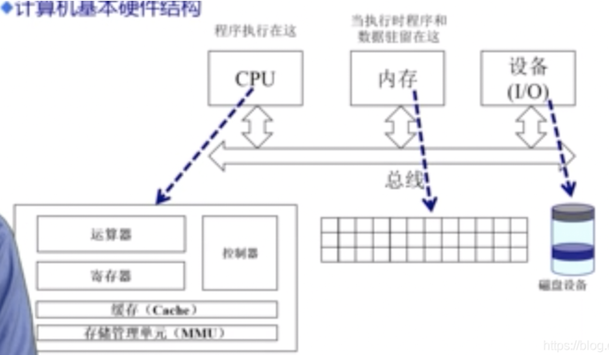
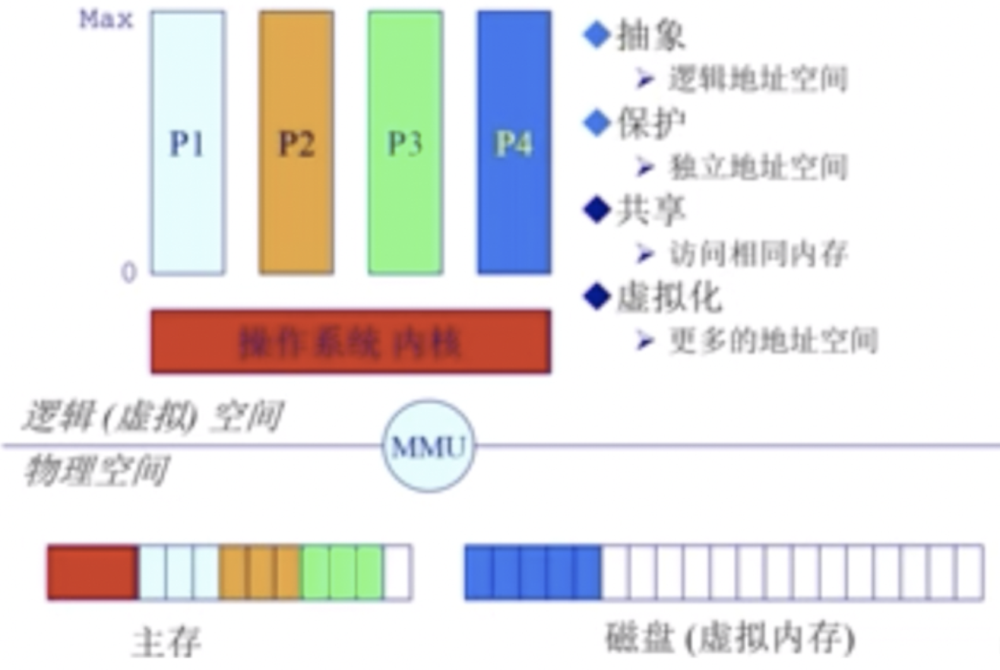
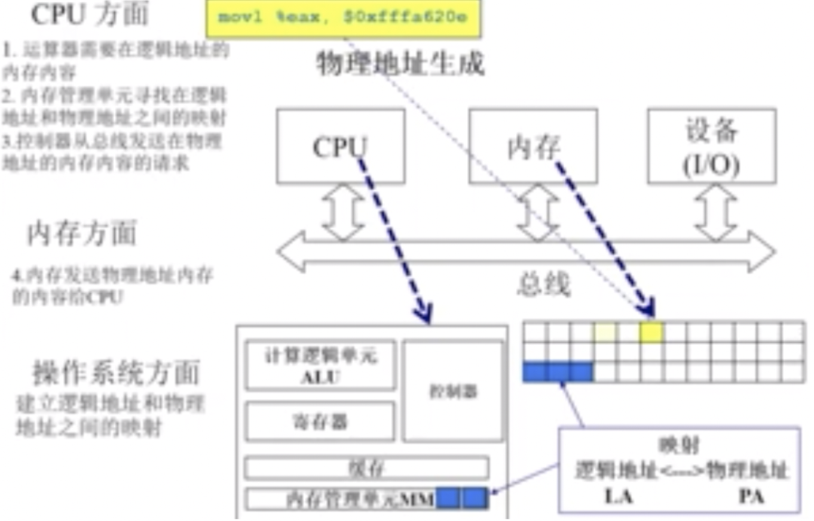
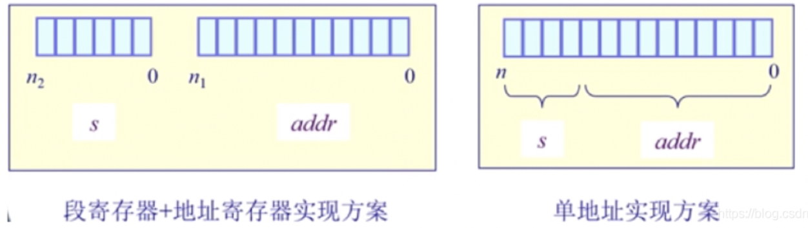

<!-- GFM-TOC -->

* [连续式内存分配](#连续式内存分配)
* [非连续内存分配](#非连续内存分配)
* [分页系统地址映射](#分页系统地址映射)
* [虚拟内存](#虚拟内存)
* [进程的内存](#进程的内存)
* [页面置换算法](#页面置换算法)
    * [1. 最佳](#1-最佳)
    * [2. 最近最久未使用](#2-最近最久未使用)
    * [3. 最近未使用](#3-最近未使用)
    * [4. 先进先出](#4-先进先出)
    * [5. 第二次机会算法](#5-第二次机会算法)
    * [6. 时钟](#6-时钟)
* [分段](#分段)
* [分页（主流方式）](分页（主流方式）)
* [段页式](#段页式)
* [分页与分段的比较](#分页与分段的比较)
<!-- GFM-TOC -->

# 连续式内存分配

## 1. 计算机体系结构及内存分层体系

<div align="center">  </div><br>

<div align="center">  </div><br>
- 结构简要说明

  1、CPU：Central Process Unit中央处理器单元，即CPU属于处理器。

  2、CPU中有寄存器，因此寄存器的速度最快！内存、外存统称为CPU的“外存”。**寄存器**（Register）是[中央处理器](https://zh.wikipedia.org/wiki/中央處理器)内用来暂存指令、[数据](https://zh.wikipedia.org/wiki/數據)和[地址](https://zh.wikipedia.org/wiki/内存地址)的[电脑存储器](https://zh.wikipedia.org/wiki/電腦記憶體)。寄存器的存贮容量有限，读写速度非常快。在[计算机体系结构](https://zh.wikipedia.org/wiki/電腦架構)里，寄存器存储在已知时间点所作计算的中间结果，通过快速地访问数据来加速[计算机程序](https://zh.wikipedia.org/wiki/電腦程式)的运行。而且CPU只与寄存器中进行存取。而寄存器的数据又来源于内存。于是  CPU<--->寄存器<----->内存  这就是它们之间的信息交换。因为如果老是操作内存中的同一址地的数据，就会影响速度。于是就在寄存器与内存之间设置一个缓存。

  - [同样都是晶体管存储设备，为什么寄存器比内存快呢？](http://www.ruanyifeng.com/blog/2013/10/register.html)

    - **距离不同**

      内存离CPU比较远，所以要耗费更长的时间读取。以3GHz的CPU为例，电流每秒钟可以振荡30亿次，每次耗时大约为0.33[纳秒](http://en.wikipedia.org/wiki/Nanosecond)。光在1纳秒的时间内，可以前进30厘米。也就是说，在CPU的一个[时钟周期](http://zh.wikipedia.org/wiki/时钟频率)内，光可以前进10厘米。因此，如果内存距离CPU超过5厘米，就不可能在一个时钟周期内完成数据的读取，这还没有考虑硬件的限制和电流实际上达不到光速。相比之下，寄存器在CPU内部，当然读起来会快一点。

    - **硬件设计不同**

      内存的设计相对简单，每个位就是一个电容和一个晶体管，而寄存器的[设计](http://en.wikipedia.org/wiki/Register_file#Array)则完全不同，多出好几个电子元件。并且通电以后，寄存器的晶体管一直有电，而内存的晶体管只有用到的才有电，没用到的就没电，这样有利于省电。这些设计上的因素，决定了寄存器比内存读取速度更快。

    - **工作方式不同**

      寄存器的工作方式很简单，只有两步：

      （1）找到相关的位，（2）读取这些位。

      内存的工作方式就要复杂得多：

      （1）找到数据的指针。（指针可能存放在寄存器内，所以这一步就已经包括寄存器的全部工作了。）

      （2）将指针送往[内存管理单元](http://zh.wikipedia.org/wiki/内存管理单元)（MMU），由MMU将虚拟的内存地址翻译成实际的物理地址。

      （3）将物理地址送往内存控制器（[memory controller](http://en.wikipedia.org/wiki/Memory_controller)），由内存控制器找出该地址在哪一根内存插槽（bank）上。

      （4）确定数据在哪一个内存块（chunk）上，从该块读取数据。

      （5）数据先送回内存控制器，再送回CPU，然后开始使用。

      内存的工作流程比寄存器多出许多步。每一步都会产生延迟，累积起来就使得内存比寄存器慢得多。

      为了缓解寄存器与内存之间的巨大速度差异，硬件设计师做出了许多努力，包括在CPU内部设置[缓存](http://zh.wikipedia.org/wiki/CPU缓存)、优化CPU工作方式，尽量一次性从内存读取指令所要用到的全部数据等等。

  3、高速缓存是存放在CPU中的，它是介于CPU与内存知己的，以缓解它们之间速度不匹配的矛盾，使得内存访问CPU的时候较快。

  4、缓存是指在内存中划分出一块区域用于存放常使用的输入输出数据，以缓解CPU与外设处理速度不匹配的问题。

  5、CPU与（内存、外存）是不同的概念，CPU是一个独立的概念，而（内存、外存）是指对存储器的划分，内存的速度较外存的速度快，并且内存具有“掉电信息全部消失”的特性，而外存则具有“掉电信息也不会丢失”的特性。
- 操作系统在内存管理要完成的目标

  - [ ] 抽象：逻辑地址空间
  - [ ] 保护：独立地址空间
  - [ ] 共享：访问相同内存
  - [ ] 虚拟化：更多的地址空间

- 操作系统实现内存管理目标的手段

  程序重定位;分段;分页;虚拟内存（它使得[应用程序](https://baike.baidu.com/item/应用程序/5985445)认为它拥有连续的可用的[内存](https://baike.baidu.com/item/内存/103614)（一个连续完整的[地址空间](https://baike.baidu.com/item/地址空间/1423980)），而实际上，它通常是被分隔成多个[物理内存](https://baike.baidu.com/item/物理内存/2502263)碎片，还有部分暂时存储在外部[磁盘存储器](https://baike.baidu.com/item/磁盘存储器/2386684)上，在需要时进行[数据交换](https://baike.baidu.com/item/数据交换/1586256)。目前，大多数[操作系统](https://baike.baidu.com/item/操作系统/192)都使用了虚拟内存，如Windows家族的“虚拟内存”；Linux的“交换空间”等）;按需分页虚拟内存

## 2.地址空间与地址生成

物理地址空间：硬件支持的地址空间。即加载到内存地址寄存器中的地址，内存单元的真正地址。在前端总线上传输的内存地址都是物理内存地址，编号从0开始一直到可用物理内存的最高端。这些数字被北桥(Nortbridge chip)映射到实际的内存条上。物理地址是明确的、最终用在总线上的编号，不必转换，不必分页，也没有特权级检查(no translation, no paging, no privilege checks)。

逻辑地址空间：一个运行的程序所拥有的内存范围。即程序中的段地址，逻辑地址由两部份组成，段标识符和段内[偏移量](https://baike.baidu.com/item/偏移量)，CPU所生成的地址。逻辑地址是内部和编程使用的、并不唯一。例如，你在进行C语言指针编程中，可以读取指针变量本身值(&操作)，实际上这个值就是逻辑地址，它是相对于你当前进程数据段的地址（偏移地址），不和绝对物理地址相干。

<div align="center">  </div><br>

<div align="center">  </div><br>

- 应用程序的逻辑地址是如何映射到物理地址

  <div align="center">  </div><br>
<div align="center">  </div><br>

<div align="center">  </div><br>

- 应用程序的逻辑地址是如何映射到物理地址

  <div align="center">  </div><br>

  =>CPU方面

  a.运算器ALU需要在逻辑地址的内存内容(CPU要逻辑地址)

  b.内存管理单元MMU寻找在逻辑地址和物理地址之间的映射(然后MMU找逻辑和物理地址的关系)

  c. 控制器从总线发送在物理地址的内存内容的请求(关系找到后，去找对应物理地址)

  =>内存方面

  e.内存发送物理地址内存内容给CPU(物理地址找到了，给CPU)

  =>操作系统方面

  f.建立逻辑地址和物理地址之间的映射(确保程序不相互干扰)

<div align="center">  </div><br>
## 3.连续内存分配：内存碎片与分区的动态分配

- 内存碎片问题：空闲内存不能被利用

  外部碎片：在分配单元间的未使用内存

  内部碎片：在分配单元中的未使用内存

- 简单的内存管理方法：

  当一个程序准许运行在内存中时，分配一个连续的区间

  分配一个连续的内存区间给运行的程序以访问数据

- 分区的动态分配策略

  - [ ] 首次适配：现在想分配n字节，从低地址开始找，碰到的第一个空间比n大的空闲块就使用它。

  <div align="center">  </div><br>

  - 要想实现首次分配，需要满足以下条件：

    需要存在一个按地址排序的空闲块列表

    分配需要找一个合适的分区

    重分配需要检查，看看自由分区能不能与相邻的空闲分区合并(形成更大的空闲块)，若有

  - 优点：简单；易于产生更大的空闲块，向着地址空间的结尾

  - 缺点：外部碎片的问题会加剧；不确定性

 

  - [ ] 最佳适配：为了分配n字节，使用最小的可用空闲块，以致块的尺寸比n大。

      <div align="center">  </div><br>

    - 目的：避免分割大的空闲块；最小化外部碎片产生的尺寸。
    
    - 要想实现最佳分配，需要满足以下条件：
    
      按尺寸排列的空闲列表
    
      分配需要寻找一个合适的分区
    
      重分配需要搜索和合并于相邻的空闲分区，若有
    
    - 优点：大部分分配是小尺寸时很有效；简单
    - 缺点：外部碎片；重分配慢；易产生很多没用的微小碎片。

  - [ ] 最差适配：为了分配n字节，使用最大的可用空闲块，以致块的尺寸比n大。

  <div align="center">  </div><br>

    - 目的：避免太多的微小碎片
    
    - 要想实现最差分配，需要满足以下条件：
    
      按尺寸排列的空闲列表
    
      分配很快(获得最大的分区)
    
      重分配需要合并于相邻的空闲分区，若有，然后调整空闲块列表
    
    - 优点：假如分配时是中等尺寸效果最好
    - 缺点：重分配慢；外部碎片；易于破碎大的空闲块以至大分区不能被分割

## 4.连续内存分配：压缩式与交换式碎片整理

- 压缩式碎片整理(紧致)

  重制程序以合并孔洞

  要求所有程序是 动态可重置的

  问题：何时重置；开销。

- 交换式碎片整理

  运行程序需要更多的内存

  抢占等待的程序或回收它们的内存(把暂时不用的内容挪到磁盘里)

# 非连续内存分配

1. 非连续内存分配的优点：
   - 分配给一个程序的物理内存是非连续的
   - 更好的内存利用和管理
   - 允许共享代码和数据(共享库等)
   - 支持动态加载和动态链接

2. 非连续内存分配的缺点：
   - 如何建立虚拟（逻辑）地址和物理地址之间的转换：软件方案(开销大)；硬件方案
3. 硬件方案
   - 分段 Segmentation
   - 分页 Paging

## 分段

虚拟内存采用的是分页技术，也就是将地址空间划分成固定大小的页，每一页再与内存进行映射。

下图为一个编译器在编译过程中建立的多个表，有 4 个表是动态增长的，如果使用分页系统的一维地址空间，动态增长的特点会导致覆盖问题的出现。

<div align="center">  </div><br>

分段的做法是把每个表分成段（不同段按属性分离管理），一个段构成一个独立的地址空间。每个段的长度可以不同，并且可以动态增长。分段可以将内存更好的分离和共享。

<div align="center">  </div><br>

如下图所示，逻辑地址空间是连续的，物理地址是离散的。

<div align="center">  </div><br>

以上开销大，如何用硬件实现：

- 段访问机制：一个段指一个“内存块”，是一个逻辑地址空间。

  程序根据段访问机制访问内存地址需要一个二维的二元组(s段号，addr端内偏移)

  <div align="center">  </div><br>

- 段访问机制的硬件实现方案：

  <div align="center">  </div><br>

## 分页（主流方式）

**分页系统地址映射**

内存管理单元（MMU）管理着地址空间和物理内存的转换，其中的页表（Page table）存储着页（程序地址空间）和页框（物理内存空间）的映射表。

一个虚拟地址分成两个部分，一部分存储页面号，一部分存储偏移量。

下图的页表存放着 16 个页，这 16 个页需要用 4 个比特位来进行索引定位。例如对于虚拟地址（0010 000000000100），前 4 位是存储页面号 2，读取表项内容为（110 1），页表项最后一位表示是否存在于内存中，1 表示存在。后 12 位存储偏移量。这个页对应的页框的地址为 （110 000000000100）。

<div align="center">  </div><br>

1. **分页的地址空间**

   划分物理内存至固定大小的帧

   > ->大小是2的幂，e.g.512，4096，8192

   -划分逻辑地址空间至相同大小的页

   > ->大小是2的幂，e.g.512，4096，8192

   -建立方案：转换逻辑地址为物理地址(pages to frames)

   > ->页表Page Table
   > ->MMU/TLB(快表)

2. **物理地址部分：页帧**

   页帧:物理内存被分割为大小相等的帧(物理地址部分)

   一个内存的物理地址是一个二元组(f,o)，f:帧号(它是F位的，因此意味着一共2F个帧)；o：帧内偏移(它是S位的，因此意味着每帧有2S字节)；物理地址=2^S x f + o。

   <div align="center">  </div><br>

首先有一个物理内存地址(3，6)，帧号是3，它是7位的，说明一共能有2^7个帧，这个帧是其中的第3个；
帧内偏移是6，他是9位的，说明一个帧里可以有2^9个字节，当前地址是在这个帧里的第6个字节；因此，它的物理地址是3 * 2^9 + 6。通过这个例子，可以发现 页帧号 的作用就是通过一个二元组能够找到一个物理地址。

3. **逻辑地址部分：页**

   页：一个程序的逻辑地址空间被划分为大小相等的页(逻辑地址部分)

   (逻辑地址的)页内偏移量=(物理地址的)帧内偏移量

   (逻辑地址的)页号大小可能不等于(物理地址的)帧号大小

   <div align="center">  </div><br>

   通过这个例子，可以发现 页号 的作用就是通过一个二元组能够找到一个逻辑地址。页号和帧号不是相等。

   页寻址机制的实现：

   ​       页表实际上就是一个大的数组/hash表。它的index是 页号，对应的value是 页帧号，首先根据逻辑地址计算得到一个 页号，也就是index，再在页表中找到对应的 页帧号，最后根据 页帧号 计算得到物理地址；由于他们的页/帧内偏移相等，所以页表不需要保存这个数据。通过这种方式能够根据逻辑地址找到对应的物理地址。除此之外，还有一些flags标志位。

   <div align="center">  </div><br>

那页表该如何设计呢？

## 非连续内存分配：页表-概述/TLB

**页表概述**

(1) 通过标志位来判断当前页号的性质。

<div align="center">  </div><br>

(2) 如下图，看下面这个例子。逻辑地址空间是16位64kB，物理地址空间是15位32kB，并不是对

等的，但是一页和一帧的大小是一样的，都是10位1kB。

> ->逻辑地址(4,0),页号4对应的二进制是100，它的位置对应着flags。根据上图，可知它的dirty bit是1，resident bit是0，clock/reference是0；因此可以知道逻辑地址(4,0)在物理地址中实际是不存在的。如果CPU访问这个逻辑地址会抛出一个内存访问异常；
> ->逻辑地址(3,1034),页号3对应的二进制是011，它的位置(也就是页号的位置)对应着flags。根据上图，可知它的dirty bit是0，resident bit是1，clock/reference是1；因此可以知道逻辑地址(3,1034)在物理地址中存在。再复习一下，页表里存放的是什么。因为由于逻辑地址的页内偏移和物理地址的帧内偏移是一样的，所以页表不需要保存偏移。根据页表，页号3对应的页帧号是4，再加上它们的偏移量相等，所以逻辑地址(3,1034)对应的物理地址是(4,1023)。
> 这个页表是由操作系统维护。

<div align="center">  </div><br>

(3) 上面讲的分页机制的性能问题(缺点)
空间代价和时间代价。

> ->访问一个内存单元需要2次内存访问：一次获取页表项；一次是访问数据。
> ->页表可能会非常大(页表的长度等于2^页号位数)
> 举例，64位机器，如果一页是1024KB，那么页表是多大？
> 假如页号是n位的，那么页表的长度等于2^ n，一页是1024KB，所以页内偏移是10位，一个逻辑地址的长度等于计算机位数，也就是64位，因此剩下的54位是留给页号的；因此页表的长度是2^54，明显CPU装不下。
> 一个程序一个页表，n个程序n个页表，就更大了。
> CPU装不下，只能装在内存里；如果这样，需要访问2次内存，一次访问页表，一次访问程序。

(4) 解决办法

->缓存caching

->间接访问indirecion

**转换后备缓冲区/快表TLB**

本节介绍如何优化页表的**时间开销**问题，解决办法是 缓存。

TLB实际上是CPU的MMU内存管理单元保存的一段缓存，这段缓存保存的内容是 页表 的一部分，

是经常访问到的那部分页表，其余不常用的页表内容保存在内存中。

TLB未命中，也叫TLB miss，这种情况比较少见，因为一页很大，32位系统一页是4K，如果采用

局部性原理，那么访问4k次才会遇到一次TLB miss。

<div align="center">  </div><br>

## 非连续内存分配：页表-二级/多级页表

本节介绍如何优化页表的**空间开**销问题，解决方法是 多级页表。

虽然增加了内存访问次数和开销，但是节省了保存页表的空间(时间换空间，然后在通过TLB来减

少时间消耗)。

(1)二级页表

> 逻辑地址中，页号部分分成了2部分，p1和p2。
> p1存放着二级页表的起始地址，p2的作用就是之前的p。
> p1找二级页表，p2找页，o找地址。
> 这里体现了二级页表的另一个好处，就是p1对应的位置是flags，假如说resident bit是0，那么整个二级页表都不用在内存中保存，这个是一级页表无法实现的！

<div align="center">  </div><br>

(2) 多级页表

例如64位系统采用5级页表。

## 非连续内存分配：页表-反向页表inverted page table

反向页表：

页表来表示物理地址(页帧)号，而不是之前的逻辑地址(页号)，能够减少页表尺寸，但是给映射关

系的建立带来点困难。

**传统页表的缺点**

(1)对于大地址空间，前向映射页表变得繁琐(例如64位系统采用5级页表)。

(2)逻辑地址空间增长速度快于物理地址空间，所以反向页表，也就是index是物理地址，value是

逻辑地址，它的大小会小于传统页表。

**反向页表的实现：基于页寄存器page registers的方案**

<div align="center">  </div><br>

1)每一个帧和一个寄存器关联，它包括：

> residence bit：此帧是否被占用；
> occupier：对应的页号p；
> protection bit：保护位；

(2)举一个例子

> 物理内存大小：4096 * 4096 KB = 16 MB
> 页面大小：4064 bytes = 4 KB
> 页帧数： 4K
> 页寄存器使用的空间(假设是8 bytes的register)：8 * 4096 = 32 KB
> 页寄存器的额外开销：32 KB / 16 MB = 0.2%
> 虚拟内存的大小：任意
> 可以看出内存开销很小。

(3)页寄存器的优点

> 转换表的大小相对于物理内存来说很小；
> 转换表的大小跟逻辑地址空间的大小无关。

(4)页寄存器的缺点

> 需要的信息对调了，如何根据帧号找到页号呢；
> 需要在反向页表里去找想要的页号。

**反向页表的实现：基于关联内存associative memory的方案**

<div align="center">  </div><br>

页号为key，帧号为value。上述方法开销太大。

> 如果帧数较少，页寄存器可以被放置在关联内存中；
> 在关联内存中查找逻辑页号，成功了，帧号就被提取出来；失败了，页错误异常page fault。
> 限制这种方案的因素包括，大量的关联内存非常昂贵(难以在单个时钟周期内完成；耗电)。

**反向页表的实现：基于哈希查找hash的方案**

<div align="center">  </div><br>

上述方法可能导致一个key出现2个以上的value对应。

这种方式仍然需要把反向页表放在内存中，做hash计算的时候还需要在内存中取数，仍然需要多次访问内存。

<div align="center">  </div><br>

# 虚拟内存

虚拟内存的目的是为了让物理内存扩充成更大的逻辑内存，从而让程序获得更多的可用内存。

为了更好的管理内存，操作系统将内存抽象成地址空间。每个程序拥有自己的地址空间，这个地址空间被分割成多个块，每一块称为一页。这些页被映射到物理内存，但不需要映射到连续的物理内存，也不需要所有页都必须在物理内存中。当程序引用到不在物理内存中的页时，由硬件执行必要的映射，将缺失的部分装入物理内存并重新执行失败的指令。

从上面的描述中可以看出，虚拟内存允许程序不用将地址空间中的每一页都映射到物理内存，也就是说一个程序不需要全部调入内存就可以运行，这使得有限的内存运行大程序成为可能。例如有一台计算机可以产生 16 位地址，那么一个程序的地址空间范围是 0\~64K。该计算机只有 32KB 的物理内存，虚拟内存技术允许该计算机运行一个 64K 大小的程序。

<div align="center">  </div><br>

### **起因**

经常出现内存不够了。程序规模的增长大于存储器容量的增长。

**理想的存储器**：更大，更快，更便宜，非易失性存储。

**实际的存储器**：

<div align="center"></img></div>

-把硬盘的空间也用上(扮演内存的作用)

<div align="center"></img></div>

-不常用的放在硬盘上，常用的放在内存上。

**在计算机系统中，尤其是在多道程序运行的环境中，可能会出现内存不够用的情况，怎么办？**

如果程序太大，超过了内存的容量，可以采用 手动的覆盖(overlay) 技术，只把需要的指令和数据保存在内存中

如果是程序太多，超过了内存的容量，可以采用 自动的交换(swapping) 技术，把暂时不能执行的程序送到外存中

如果想在有限容量的内存中，以更小的页粒度为单位装入更多更大的程序，可以采用 自动的虚拟存储技术 。

### 覆盖技术

**目标**

在较小的可用内存中运行较大的程序。常用于多道程序系统，与分区存储管理配合使用。

**原理**

把程序按照其自身逻辑结构，划分为若干个功能上相对独立的程序模块，那些不会同时执行的模块共享同一块内存区域，按时间先后来运行。

必要部分(常用功能)的代码和数据常驻内存

可选部分(不常用功能)在其它程序模块中实现，平时存放在外存中，在需要时才装入内存。

不存在调用关系的模块不必同时装入内存，从而可以相互覆盖，即这些模块共用一个分区。

<div align="center"></img></div>

**缺点**

由程序员来把一个大的程序划分为若干个小的功能模块，并确定各个模块之间的覆盖关系，费时费力，增加了编程的复杂度。

-覆盖模块从外存装入内存，是以时间换空间。

### 交换技术

**目标**

多道程序在内存中时，让正在运行的程序或需要运行的程序获得更多的内存资源。

**方法**

-可将暂时不能运行的程序送到外存，从而获得空闲内存空间。

-操作系统把一个进程的整个地址空间的内容保存到外存中(换出swap out),而将将外存中的某个进程的地址空间读入到内存中(换入swap in)。换入换出内容大小为整个程序的地址空间。

<div align="center"></img></div>

**交换技术实现中的几个问题**

交换时机的确定：只有当内存空间不够或有不够的危险时换出

-交换区的大小：必须足够大以存放所有用户进程的所有内存映像的拷贝，必须能对这些内存映像进行直接存取

-程序换入时的重定位：因为换出换入后的内存位置不一定相同，所以最好采用动态地址映射的方法

**覆盖与交换技术的比较**

覆盖只能发生在那些(程序内)相互之间没有调用关系的程序模块之间，因此程序员必须给出程序内的各个模块之间的逻辑覆盖结构。

-交换技术是以在内存中的程序大小为单位来进行的，它不需要程序员给出各个模块之间的逻辑覆盖结构。

-交换发生在内存中 程序 与 管理程序或操作系统 之间，而覆盖则发色会跟你在运行程序的内部。

-------------------------------------------------------------------------------------------------------------------------------------------------------------------------------------------

早期的操作系统中的内存管理相对简单，基本都是直接将进程一股脑的装进内存中，此时进程中访问的内存地址都是实际的物理地址。这样的内存管理方式容易带来以下几个问题：

- 进程空间隔离问题
  - 由于进程都是直接访问实际的物理内存，所以容易出现越界访问的情况，对其他进程中内存进行修改，造成意想不到的运行错误和异常
- 内存效率和内存不足问题
  - 如果计算机中的内存已经被全部占据，将无法启动新的进程，因为已经没有新的内存分配了
  - 已启动的进程如果处于阻塞或者不可运行状态，占据内存无作为将大大影响计算机的处理效率，此时将内存替换为其他的进程使用将更好。
  - 无法有效并及时分配连续内存 ，虚拟化和离散化将有利于提高内存的使用率
- 程序定位调试和编译运行问题

虚拟地址空间的出现有效地解决上述问题，它为每个进程提供了一个完整的、一致的和私有的地址空间：

- 虚拟内存将主存和磁盘结合起来，磁盘作为磁盘上地址空间的高速缓存，保存活跃进程数据的区域，并根据进程需要在磁盘和主存之间来回传送数据。
- 虚拟内存为每个进程提供了一致的地址空间，从而简化了内存管理。
- 虚拟内存保护了每个进程的地址空间不被其他进程破坏。

<div align="center">  </div><br>

-----

# 进程的内存

进程内存在linux（32位）中的布局：

<div align="center">  </div><br>

最高位的1GB是linux内核空间，用户代码不能写，否则触发段错误。下面的3GB是进程使用的内存。

> Kernel space：linux内核空间内存
> Stack：进程栈空间，程序运行时使用。它向下增长，系统自动管理
> Memory Mapping Segment：内存映射区，通过mmap系统调用，将文件映射到进程的地址空间，或者匿名映射。
> Heap：堆空间。这个就是程序里动态分配的空间。linux下使用malloc调用扩展（用brk/sbrk扩展内存空间），free函数释放（也就是缩减内存空间）
> BSS段：包含未初始化的静态变量和全局变量
> Data段：代码里已初始化的静态变量、全局变量
> Text段：代码段，进程的可执行文件

# 页面置换算法

在程序运行过程中，如果要访问的页面不在内存中，就发生缺页中断从而将该页调入内存中。此时如果内存已无空闲空间，系统必须从内存中调出一个页面到磁盘对换区中来腾出空间。

页面置换算法和缓存淘汰策略类似，可以将内存看成磁盘的缓存。在缓存系统中，缓存的大小有限，当有新的缓存到达时，需要淘汰一部分已经存在的缓存，这样才有空间存放新的缓存数据。

页面置换算法的主要目标是使页面置换频率最低（也可以说缺页率最低）。

### 1. 最佳

> OPT, Optimal replacement algorithm

所选择的被换出的页面将是最长时间内不再被访问，通常可以保证获得最低的缺页率。

是一种理论上的算法，因为无法知道一个页面多长时间不再被访问。

举例：一个系统为某进程分配了三个物理块，并有如下页面引用序列：

```html
7，0，1，2，0，3，0，4，2，3，0，3，2，1，2，0，1，7，0，1
```

开始运行时，先将 7, 0, 1 三个页面装入内存。当进程要访问页面 2 时，产生缺页中断，会将页面 7 换出，因为页面 7 再次被访问的时间最长。

### 2. 最近最久未使用

> LRU, Least Recently Used

虽然无法知道将来要使用的页面情况，但是可以知道过去使用页面的情况。LRU 将最近最久未使用的页面换出。

为了实现 LRU，需要在内存中维护一个所有页面的链表。当一个页面被访问时，将这个页面移到链表表头。这样就能保证链表表尾的页面是最近最久未访问的。

因为每次访问都需要更新链表，因此这种方式实现的 LRU 代价很高。

```html
4，7，0，7，1，0，1，2，1，2，6
```

<div align="center">  </div><br>
### 3. 最近未使用

> NRU, Not Recently Used

每个页面都有两个状态位：R 与 M，当页面被访问时设置页面的 R=1，当页面被修改时设置 M=1。其中 R 位会定时被清零。可以将页面分成以下四类：

- R=0，M=0
- R=0，M=1
- R=1，M=0
- R=1，M=1

当发生缺页中断时，NRU 算法随机地从类编号最小的非空类中挑选一个页面将它换出。

NRU 优先换出已经被修改的脏页面（R=0，M=1），而不是被频繁使用的干净页面（R=1，M=0）。

### 4. 先进先出

> FIFO, First In First Out

选择换出的页面是最先进入的页面。

该算法会将那些经常被访问的页面换出，导致缺页率升高。

### 5. 第二次机会算法

FIFO 算法可能会把经常使用的页面置换出去，为了避免这一问题，对该算法做一个简单的修改：

当页面被访问 (读或写) 时设置该页面的 R 位为 1。需要替换的时候，检查最老页面的 R 位。如果 R 位是 0，那么这个页面既老又没有被使用，可以立刻置换掉；如果是 1，就将 R 位清 0，并把该页面放到链表的尾端，修改它的装入时间使它就像刚装入的一样，然后继续从链表的头部开始搜索。

<div align="center">  </div><br>

### 6. 时钟

> Clock

第二次机会算法需要在链表中移动页面，降低了效率。时钟算法使用环形链表将页面连接起来，再使用一个指针指向最老的页面。

<div align="center">  </div><br>

# 段页式

程序的地址空间划分成多个拥有独立地址空间的段，每个段上的地址空间划分成大小相同的页。这样既拥有分段系统的共享和保护，又拥有分页系统的虚拟内存功能。

# 分页与分段的比较

- 对程序员的透明性：分页透明，但是分段需要程序员显式划分每个段。

- 地址空间的维度：分页是一维地址空间，分段是二维的。

- 大小是否可以改变：页的大小不可变，段的大小可以动态改变。(硬件管理方便)

- 出现的原因：分页主要用于实现虚拟内存，从而获得更大的地址空间；分段主要是为了使程序和数据可以被划分为逻辑上独立的地址空间并且有助于共享和保护。

# 堆与栈

程序运行时，数据和变量都会分配到程序所在的虚拟内存中。动态内存分配器可以让进程在运行时动态的获取额外虚拟内存。它维护着一个进程的虚拟内存区域，称之为堆。分配器将堆视为一组不同大小的虚拟内存片的集合来维护。每个块就是一个连续的虚拟内存片，那么是已分配，要么是空闲的。已经分配的块显式地供应用程序使用。空闲块可用来分配。空闲块保持空闲，直到它显式地被应用所分配。一个已经分配的块保持已分配状态，直到它被释放，这种释放要么是应用显式执行的，要么是内存分配器自身隐式执行的。

所以分配器有两种基本的风格，两种风格都要求应用显式的分配块，它们的不同之处在于程序是否要自己释放已分配的块。

- 显式分配器，要求开发人员显式释放任何已经分配的块，比如 C 语言的 malloc 和 free
- 隐式分配器，要求分配器检测一个已分配的块何时不再被程序所用，那么就释放这个块，也就是一般意义上的垃圾收集器，比如说 Java 和 Go 语言都是这个范畴。

而另一部分存储了函数的入参以及局部变量的内存，被称为栈。栈内的变量会随着函数的入栈而创建，并随着函数的出栈而被销毁。栈内存线性的管理方式使得栈内存的申请和释放都具备极高的效率，然而一般来说，开发人员是无法直接进行栈内存的分配，它是由编译器自动完成。

<div align="center">  </div><br>

通过 BP (栈的基址指针寄存器)和 SP(栈顶指针寄存器)管理栈内存：函数入栈，SP指针向低地址移动划分内存；函数出栈，SP指针向高地址移动到上一函数的栈顶，释放内存。这种线性的内存分配方式与堆内存相比更加快速，开销更小。