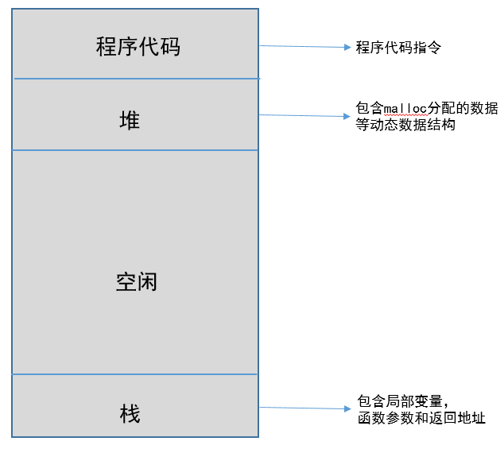
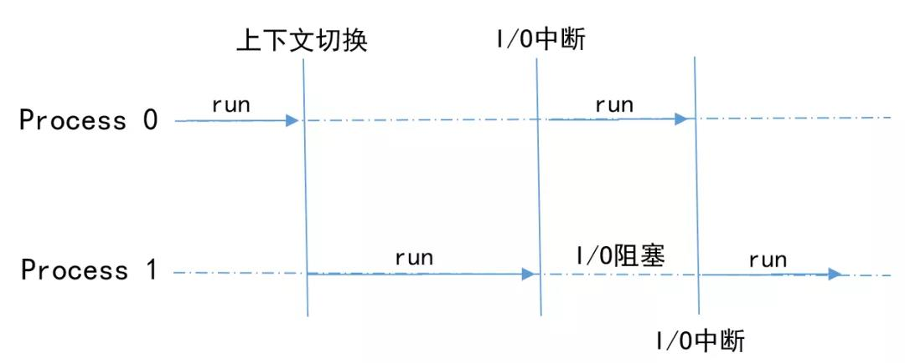
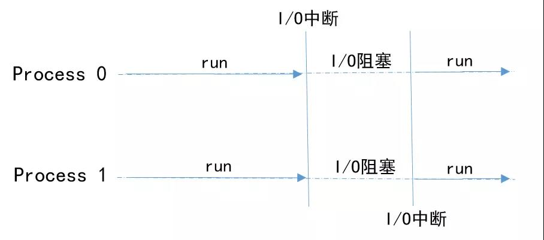
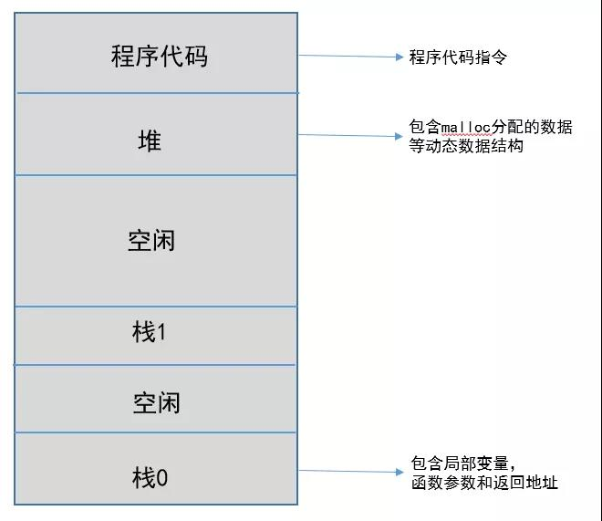
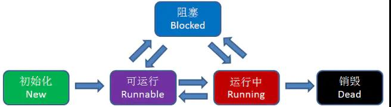
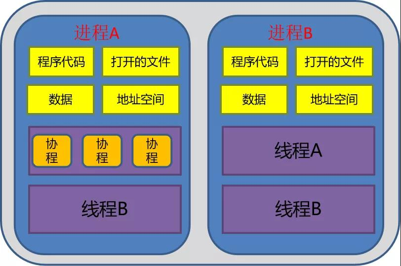
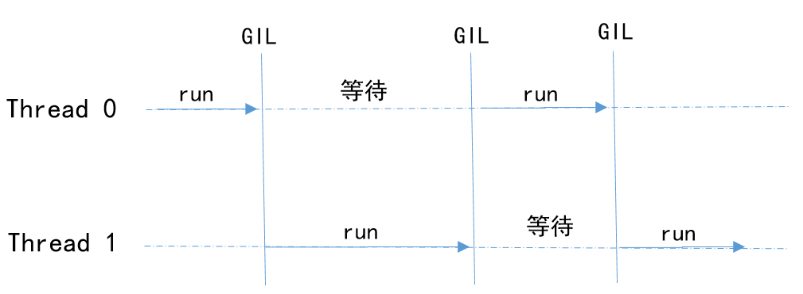
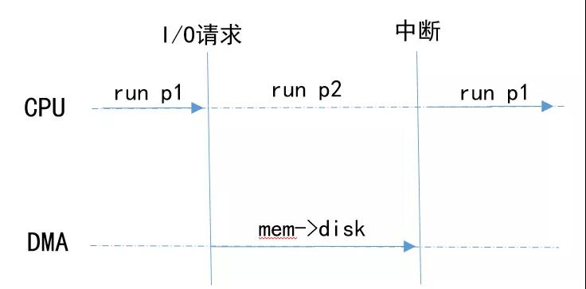
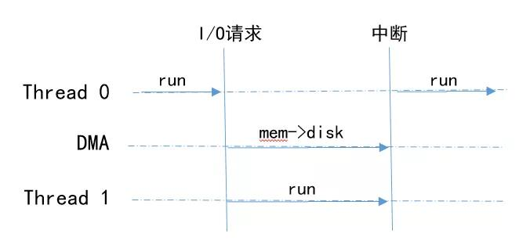

<!-- GFM-TOC -->

* [进程](#进程)

* [进程间的切换](#进程间的切换)

* [进程间数据共享](#进程间数据共享)

* [线程](#线程)

* [进程 VS 线程](#进程 VS 线程)

* [协程](#协程)

* [关于Python](#关于Python)

    <!-- GFM-TOC -->

## 进程

进程-操作系统提供的抽象概念，是系统进行资源分配和调度的基本单位，是操作系统结构的基础。程序是指令、数据及其组织形式的描述，进程是程序的实体。程序本身是没有生命周期的，它只是存在磁盘上的一些指令,程序一旦运行就是进程。

当程序需要运行时，操作系统将代码和所有静态数据记载到内存和进程的地址空间（每个进程都拥有唯一的地址空间，见下图所示）中，通过创建和初始化栈（局部变量，函数参数和返回地址)、分配堆内存以及与IO相关的任务，当前期准备工作完成，启动程序，OS将CPU的控制权转移到新创建的进程，进程开始运行。

<div align="center">  </div><br>

操作系统对进程的控制和管理通过PCB(Processing Control Block)，PCB通常是系统内存占用区中的一个连续存区，它存放着操作系统用于描述进程情况及控制进程运行所需的全部信息(进程标识号,进程状态,进程优先级,文件系统指针以及各个寄存器的内容等)，进程的PCB是系统感知进程的唯一实体。

一个进程至少具有5种基本状态：初始态、执行状态、等待（阻塞）状态、就绪状态、终止状态

- 初始状态：进程刚被创建，由于其他进程正占有CPU所以得不到执行，只能处于初始状态。
- 执行状态：任意时刻处于执行状态的进程只能有一个。
- 就绪状态：只有处于就绪状态的经过调度才能到执行状态
- 等待状态：进程等待某件事件完成
- 停止状态：进程结束

## 进程间的切换

无论是在多核还是单核系统中，一个CPU看上去都像是在并发的执行多个进程，这是通过处理器在进程间切换来实现的。

操作系统对把CPU控制权在不同进程之间交换执行的机制成为上下文切换（context switch），即保存当前进程的上下文，恢复新进程的上下文，然后将CPU控制权转移到新进程，新进程就会从上次停止的地方开始。因此，进程是轮流使用CPU的，CPU被若干进程共享，使用某种调度算法来决定何时停止一个进程，并转而为另一个进程提供服务。

- 单核CPU双进程的情况 

<div align="center">  </div><br>

进程直接特定的机制和遇到I/O中断的情况下，进行上下文切换，轮流使用CPU资源

- 双核CPU双进程的情况

<div align="center">  </div><br>

每一个进程独占一个CPU核心资源，在处理I/O请求的时候，CPU处于阻塞状态

## 进程间数据共享

系统中的进程与其他进程共享CPU和主存资源，为了更好的管理主存，现在系统提供了一种对主存的抽象概念，即为虚拟存储器（VM）。它是一个抽象的概念，它为每一个进程提供了一个假象，即每个进程都在独占地使用主存。

虚拟存储器主要提供了三个能力：　

- 将主存看成是一个存储在磁盘上的高速缓存，在主存中只保存活动区域，并根据需要在磁盘和主存之间来回传送数据，通过这种方式，更高效地使用主存
- 为每个进程提供了一致的地址空间，从而简化了存储器管理
- **保护了每个进程的地址空间不被其他进程破坏**

> 由于进程拥有自己独占的虚拟地址空间，CPU通过地址翻译将虚拟地址转换成真实的物理地址，每个进程只能访问自己的地址空间。因此，在没有其他机制（进程间通信）的辅助下，进程之间是无法共享数据的

以python中multiprocessing为例

```python
import multiprocessing
import threading
import time

n = 0

def count(num):
    global n
    for i in range(100000):
        n += i
    print("Process {0}:n={1},id(n)={2}".format(num, n, id(n)))


if __name__ == '__main__':
    start_time = time.time()
 
    process = list()
    for i in range(5):
        p = multiprocessing.Process(target=count, args=(i,)) # 测试多进程使用
        # p = threading.Thread(target=count, args=(i,))  # 测试多线程使用
        process.append(p)

    for p in process:
        p.start()

    for p in process:
        p.join()

    print("Main:n={0},id(n)={1}".format(n, id(n)))
    end_time = time.time()
    print("Total time:{0}".format(end_time - start_time))
    
# 结果
Process 1:n=4999950000,id(n)=139854202072440
Process 0:n=4999950000,id(n)=139854329146064
Process 2:n=4999950000,id(n)=139854202072400
Process 4:n=4999950000,id(n)=139854201618960
Process 3:n=4999950000,id(n)=139854202069320
Main:n=0,id(n)=9462720
Total time:0.03138256072998047
```

> 变量n在进程p{0,1,2,3,4}和主进程（main）中均拥有唯一的地址空间

## 线程

线程-也是操作系统提供的抽象概念，是程序执行中一个单一的顺序控制流程，是程序执行流的最小单元，是处理器调度和分派的基本单位。一个进程可以有一个或多个线程，同一进程中的多个线程将共享该进程中的全部系统资源，如虚拟地址空间，文件描述符和信号处理等等。但同一进程中的多个线程有各自的调用栈和线程本地存储（如下图所示）。

<div align="center">  </div><br>

系统利用PCB来完成对进程的控制和管理。同样，系统为线程分配一个线程控制块TCB（Thread Control Block）,将所有用于控制和管理线程的信息记录在线程的控制块中，TCB中通常包括：

- 线程标志符
- 一组寄存器
- 线程运行状态
- 优先级
- 线程专有存储区
- 信号屏蔽

<div align="center">  </div><br>

和进程一样，线程同样有五种状态：初始态、执行状态、等待（阻塞）状态、就绪状态和终止状态,线程之间的切换和进程一样也需要上下文切换。

## 进程 VS 线程

- 进程是资源的分配和调度的独立单元。进程拥有完整的虚拟地址空间，当发生进程切换时，不同的进程拥有不同的虚拟地址空间。而同一进程的多个线程是可以共享同一地址空间
- 线程是CPU调度的基本单元，一个进程包含若干线程。
- 线程比进程小，基本上不拥有系统资源。线程的创建和销毁所需要的时间比进程小很多
- 由于线程之间能够共享地址空间，因此，需要考虑同步和互斥操作
- 一个线程的意外终止会影像整个进程的正常运行，但是一个进程的意外终止不会影像其他的进程的运行。因此，多进程程序安全性更高。

> 总之，多进程程序安全性高，进程切换开销大，效率低；多线程程序维护成本高，线程切换开销小，效率高。

## 协程

协程（Coroutine，又称微线程）是一种比线程更加轻量级的存在，协程不是被操作系统内核所管理，而完全是由程序所控制，也就是在用户态执行。这样带来的好处是性能大幅度的提升，因此不会像线程切换那样消耗资源。协程可以比作子程序，但执行过程中，子程序内部可中断，然后转而执行别的子程序，在适当的时候再返回来接着执行。协程之间的切换不需要涉及任何系统调用或任何阻塞调用。协程与线程以及进程的关系见下图所示。


<div align="center">  </div><br>

**优点：**

- 无需线程上下文切换的开销（适合高IO场景）：

  - 进程的切换者是操作系统，切换时机是根据操作系统自己的切换策略，用户是无感知的。进程的切换内容包括页全局目录、内核栈、硬件上下文，切换内容保存在内存中。进程切换过程是由“用户态到内核态到用户态”的方式，切换效率低。
  - 线程的切换者是操作系统，切换时机是根据操作系统自己的切换策略，用户无感知。线程的切换内容包括内核栈和硬件上下文。线程切换内容保存在内核栈中。线程切换过程是由“用户态到内核态到用户态”， 切换效率中等。
  - 协程的切换者是用户（编程者或应用程序），切换时机是用户自己的程序所决定的。协程的切换内容是硬件上下文，切换内存保存在用户自己的变量（用户栈或堆）中。协程的切换过程只有用户态，即没有陷入内核态，因此切换效率高。

  <div align="center">  </div><br>

- 无需原子操作锁定及同步的开销：协程中不存在同时写变量冲突，因此，也就不需要用来守卫关键区块的同步性原语，比如互斥锁、信号量等，并且不需要来自操作系统的支持。

- 方便切换控制流，简化编程模型

- 高并发+高扩展性+低成本：一个CPU支持上万个协程都不是问题，所以很适合高并发处理。

**缺点：**

- 无法利用多核资源：一个线程内的多个协程虽然可以切换，但是多个协程是串行执行的，只能在一个线程内运行，没法利用CPU多核能力。
- 进行**阻塞**操作（如IO阻塞时）会阻塞掉整个程序：当发生IO阻塞，由协程的调度器进行调度，通过将数据流yield掉，并且记录当前栈上的数据，阻塞完后立刻再通过线程恢复栈，并把阻塞的结果放到这个线程上去运行。

----------------------------

C#、Lua、Python 语言都支持 coroutine 特性。coroutine 与 goroutine 在名字上类似，都可以将函数或者语句在独立的环境中运行，但是它们之间有两点不同：

- goroutine 可能发生并行执行；
- 但 coroutine 始终顺序执行。

狭义地说，goroutine 可能发生在多线程环境下，goroutine 无法控制自己获取高优先度支持；coroutine 始终发生在单线程，coroutine 程序需要主动交出控制权，宿主才能获得控制权并将控制权交给其他 coroutine。

goroutine 间使用 channel 通信，coroutine 使用 yield 和 resume 操作。

goroutine 和 coroutine 的概念和运行机制都是脱胎于早期的操作系统。

coroutine 的运行机制属于协作式任务处理，早期的操作系统要求每一个应用必须遵守操作系统的任务处理规则，应用程序在不需要使用 CPU 时，会主动交出 CPU 使用权。如果开发者无意间或者故意让应用程序长时间占用 CPU，操作系统也无能为力，表现出来的效果就是计算机很容易失去响应或者死机。

goroutine 属于抢占式任务处理，已经和现有的多线程和多进程任务处理非常类似。应用程序对 CPU 的控制最终还需要由操作系统来管理，操作系统如果发现一个应用程序长时间大量地占用 CPU，那么用户有权终止这个任务。


py js 的那种纯用户态，m ：1 的模型，只能利用单核，多核机器上碰到 cpu 密集型这种任务立马就 gg。

go 这种 m：n 就肯定强很多了（协程的本质）。但是复杂的就是这个调度算法怎么弄，go 调度算法都演进了好几代。

## 关于Python

在针对不同的场景对比三者的区别之前，首先需要介绍一下python的多线程(一直被程序员所诟病，认为是"假的"多线程)。

> 那为什么认为Python中的多线程是“伪”多线程呢？这就是轮到Cpython（python默认的解释器）中GIL(Global Interpreter Lock,全局解释锁)登场了。

#### GIL

GIL来源于Python设计之初的考虑，为了数据安全(由于内存管理机制中采用引用计数)所做的决定。某个线程想要执行，必须先拿到 GIL。因此，可以把 GIL 看作是“通行证”,并且在一个 Python进程中，GIL 只有一个,拿不到通行证的线程,就不允许进入 CPU 执行。

Cpython解释器在内存管理中采用引用计数，当对象的引用次数为0时，会将对象当作垃圾进行回收。设想这样一种场景：

> 一个进程中含有两个线程，分别为线程0和线程1，两个线程全都引用对象a。当两个线程同时对a发生引用（并未修改，不需要使用同步性原语），就会发生同时修改对象a的引用计数器，造成计数器引用少于实质性的引用，当进行垃圾回收时，造成错误异常。因此，需要一把全局锁（即为GIL）来保证对象引用计数的正确性和安全性。

无论是单核还是多核,一个进程永远只能同时执行一个线程(拿到 GIL 的线程才能执行，如下图所示)，这就是为什么在多核CPU上，Python 的多线程效率并不高的根本原因。

<div align="center">  </div><br>

#### 何时用？

常见的应用场景不外乎三种：

- CPU密集型:程序需要占用CPU进行大量的运算和数据处理；
- I/O密集型:程序中需要频繁的进行I/O操作；例如网络中socket数据传输和读取等；
- CPU密集+I/O密集：以上两种的结合

下面主要解释一下I/O密集型的情况。与I/O设备交互，目前最常用的解决方案就是**DMA**。

#### 什么是DMA

DMA(Direct Memory Access)是系统中的一个特殊设备，它可以协调完成内存到设备间的数据传输，中间过程不需要CPU介入。

以文件写入为例：

- 进程p1发出数据写入磁盘文件的请求
- CPU处理写入请求，通过编程告诉DMA引擎数据在内存的位置，要写入数据的大小以及目标设备等信息
- CPU处理其他进程p2的请求，DMA负责将内存数据写入到设备中
- DMA完成数据传输，中断CPU
- CPU从p2上下文切换到p1,继续执行p1

<div align="center">  </div><br>

#### Python多线程的表现（I/O密集型）

- 线程Thread0首先执行，线程Thread1等待（GIL的存在）
- Thread0收到I/O请求，将请求转发给DMA,DMA执行请求
- Thread1占用CPU资源，继续执行
- CPU收到DMA的中断请求，切换到Thread0继续执行

<div align="center">  </div><br>

与进程的执行模式相似，弥补了GIL带来的不足，又由于线程的开销远远小于进程的开销，因此，在IO密集型场景中，多线程的性能更高。

- **Python 多进程、多线程效率比较**

  Python 界有条不成文的准则： 计算密集型任务适合多进程，IO 密集型任务适合多线程。本篇来作个比较。

  通常来说多线程相对于多进程有优势，因为创建一个进程开销比较大，然而因为在 python 中有 GIL 这把大锁的存在，导致执行计算密集型任务时多线程实际只能是单线程。而且由于线程之间切换的开销导致多线程往往比实际的单线程还要慢，所以在 python 中计算密集型任务通常使用多进程，因为各个进程有各自独立的 GIL，互不干扰。

  而在 IO 密集型任务中，CPU 时常处于等待状态，操作系统需要频繁与外界环境进行交互，如读写文件，在网络间通信等。在这期间 GIL 会被释放，因而就可以使用真正的多线程。

  以上是理论，下面做一个简单的模拟测试： 大量计算用 `math.sin() + math.cos()` 来代替，IO 密集型用 `time.sleep()` 来模拟。 在 Python 中有多种方式可以实现多进程和多线程，这里一并纳入看看是否有效率差异：

  1. 多进程： joblib.multiprocessing, multiprocessing.Pool, multiprocessing.apply_async, concurrent.futures.ProcessPoolExecutor
  2. 多线程： joblib.threading, threading.Thread, concurrent.futures.ThreadPoolExecutor

```python
from multiprocessing import Pool
from threading import Thread
from concurrent.futures import ThreadPoolExecutor, ProcessPoolExecutor
import time, os, math
from joblib import Parallel, delayed, parallel_backend


def f_IO(a):  # IO 密集型
    time.sleep(5)

def f_compute(a):  # 计算密集型
    for _ in range(int(1e7)):
        math.sin(40) + math.cos(40)
    return

def normal(sub_f):
    for i in range(6):
        sub_f(i)
    return

def joblib_process(sub_f):
    with parallel_backend("multiprocessing", n_jobs=6):
        res = Parallel()(delayed(sub_f)(j) for j in range(6))
    return


def joblib_thread(sub_f):
    with parallel_backend('threading', n_jobs=6):
        res = Parallel()(delayed(sub_f)(j) for j in range(6))
    return

def mp(sub_f):
    with Pool(processes=6) as p:
        res = p.map(sub_f, list(range(6)))
    return

def asy(sub_f):
    with Pool(processes=6) as p:
        result = []
        for j in range(6):
            a = p.apply_async(sub_f, args=(j,))
            result.append(a)
        res = [j.get() for j in result]

def thread(sub_f):
    threads = []
    for j in range(6):
        t = Thread(target=sub_f, args=(j,))
        threads.append(t)
        t.start()
    for t in threads:
        t.join()

def thread_pool(sub_f):
    with ThreadPoolExecutor(max_workers=6) as executor:
        res = [executor.submit(sub_f, j) for j in range(6)]

def process_pool(sub_f):
    with ProcessPoolExecutor(max_workers=6) as executor:
        res = executor.map(sub_f, list(range(6)))

def showtime(f, sub_f, name):
    start_time = time.time()
    f(sub_f)
    print("{} time: {:.4f}s".format(name, time.time() - start_time))

def main(sub_f):
    showtime(normal, sub_f, "normal")
    print()
    print("------ 多进程 ------")
    showtime(joblib_process, sub_f, "joblib multiprocess")
    showtime(mp, sub_f, "pool")
    showtime(asy, sub_f, "async")
    showtime(process_pool, sub_f, "process_pool")
    print()
    print("----- 多线程 -----")
    showtime(joblib_thread, sub_f, "joblib thread")
    showtime(thread, sub_f, "thread")
    showtime(thread_pool, sub_f, "thread_pool")


if __name__ == "__main__":
    print("----- 计算密集型 -----")
    sub_f = f_compute
    main(sub_f)
    print()
    print("----- IO 密集型 -----")
    sub_f = f_IO
    main(sub_f)
    
# 结果
----- 计算密集型 -----
normal time: 17.6678s

------ 多进程 ------
joblib multiprocess time: 3.9843s
pool time: 3.4429s
async time: 3.4129s
process_pool time: 3.3793s

----- 多线程 -----
joblib thread time: 16.9600s
thread time: 17.0320s
thread_pool time: 17.0240s

----- IO 密集型 -----
normal time: 30.0345s

------ 多进程 ------
joblib multiprocess time: 6.3534s
pool time: 5.5363s
async time: 5.5150s
process_pool time: 6.2062s

----- 多线程 -----
joblib thread time: 5.0502s
thread time: 5.0134s
thread_pool time: 5.0144s
```

- 多线程的执行效性能高于多进程

> 是不是认为这就结束了？远还没有呢。针对I/O密集型的程序，协程的执行效率更高，因为它是程序自身所控制的，这样将节省线程创建和切换所带来的开销。

以Python中asyncio应用为依赖，使用async/await语法进行协程的创建和使用。程序代码：

```python
import time
import asyncio


async def coroutine():
    await asyncio.sleep(1) ## 模拟IO操作


if __name__ == "__main__":
    start_time = time.time()

    loop = asyncio.get_event_loop()
    tasks = []
    for i in range(5):
        task = loop.create_task(coroutine())
        tasks.append(task)

    loop.run_until_complete(asyncio.wait(tasks))
    loop.close()
    end_time = time.time()
    print("total time:", end_time - start_time)
    
# 结果
total time: 1.001854419708252
```

协程的执行效性能高于多线程

#### 总结

本文从操作系统原理出发结合代码实践讲解了进程，线程和协程以及他们之间的关系。并且，总结和整理了Python实践中针对不同的场景如何选择对应的方案，如下：

- CPU密集型：多进程
- IO密集型：多线程（协程维护成本较高,而且在读写文件方面效率没有显著提升）
- CPU密集和IO密集：多进程+协程