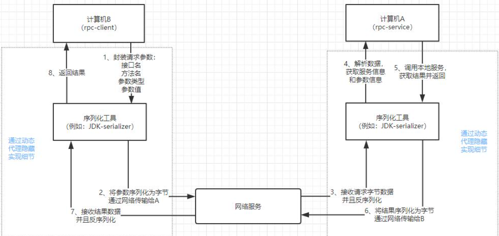

<!-- GFM-TOC -->

* [一 、RPC基础](#一-RPC基础)
  - [1.RPC概述](#1-RPC概述)
  - [2.gRPC](#2-gRPC)
  - [3.Protocol Buffers](#3-Protocol Buffers)
* [二、环境安装](#二-环境安装)

- [三、Demo及其源码分析](#三-Demo及其源码分析)
- [四、Demo源码分析](#四-Demo源码分析)

  - [1.服务端代码分析](#1-服务端代码分析)
  - [2.客户端代码分析](#2-客户端代码分析)
- [Tips](#Tips)
- [参考](#参考)

<!-- GFM-TOC -->

# 一 、RPC基础

## 1.RPC

**1.1 概念**

**RPC**(Remote Procedure Call)：远程过程调用，是一种计算机通信协议。该协议允许运行于一台计算机的程序调用另一台计算机的子程序：计算机A提供一个服务，计算机B可以像调用本地服务那样调用计算机A的服务，在该过程中参数的传递是一个序列化和反序列化的过程。

<div align="center">  </div><br>

**1.2 RPC与HTTP的对比**

|                          | RPC  |                 HTTP                  |
| :----------------------: | :--: | :-----------------------------------: |
|         **格式**         | 灵活 |                 统一                  |
|        **通用性**        |  弱  | 强，没有规定API和语言，跨语言、跨平台 |
| **是否需要关注实现语言** |  是  |        否，只需要遵循rest规范         |
|         **速度**         | 更快 |     较慢，http协议的信息比较臃肿      |

## 2.gRPC

**2.1 概念**

gRPC 是Google开发的一款高性能、开源通用的 RPC 框架，其主要面向移动应用开发并基于HTTP/2协议标准而设计，基于ProtoBuf(Protocol Buffers)序列化协议开发，且支持众多开发语言。该框架具有以下特点：

- ProtoBuf作为IDL进行数据编码，提高数据压缩率
- 使用HTTP2.0弥补HTTP1.1的不足之处
- 对于调用方和服务方的协议，所提供参数的为可选（版本兼容）

<div align="center">  </div><br>

**2.2 gRPC主要有4种请求／响应模式：**

streaming 在 http/1.x 已经出现了，http2 实现了 streaming 的多路复用。grpc 是基于 http2 实现的。所以 grpc 也实现了 streaming 的多路复用，所以 grpc同时支持单边流和双向流

(1) 单项 RPC（Simple RPC）

客户端发起一次请求，服务端响应一个数据，即标准RPC通信。

```
rpc SayHello(HelloRequest) returns (HelloResponse){
}
```

(2) 服务端流式 RPC（Server-side streaming RPC）

这种模式是客户端发起一次请求，服务端返回一段连续的数据流。典型的例子是客户端向服务端发送一个股票代码，服务端就把该股票的实时数据源源不断的返回给客户端。

```
rpc LotsOfReplies(HelloRequest) returns (stream HelloResponse){
}
```

(3) 客户端流式 RPC（Client-side streaming RPC）

与服务端数据流模式相反，这次是客户端源源不断的向服务端发送数据流，而在发送结束后，由服务端返回一个响应。典型的例子是物联网终端向服务器报送数据。

```
rpc LotsOfGreetings(stream HelloRequest) returns (HelloResponse) {
}
```

(4) 双向流式 RPC（Bidirectional streaming RPC）

这是客户端和服务端都可以向对方发送数据流，这个时候双方的数据可以同时互相发送，也就是可以实现实时交互。比如聊天应用。

```
rpc BidiHello(stream HelloRequest) returns (stream HelloResponse){
}
```

2.3 [接口设计](https://github.com/grpc/grpc/blob/master/CONCEPTS.md)

对于远程服务的调用，grpc约定clien 和server首先需约定好service的结构，包括一系列方法的组合，每个方法定义、参数、返回体等。对这个结构的描述，grpc 默认是用Protocol Buffer实现的。

2.4 拦截器

客户端和服务端都可以在初始化时注册拦截器，拦截器也可以叫做中间件，本质就是一个请求的处理方法，我们把用户从请求到响应的整个过程分发到多个中间件中去处理，这样做的目的是提高代码的灵活性，动态可扩展的。

使用拦截器可以使你拥有在 处理业务前 和 处理业务后 插入自己的代码的能力。

比如可以实现各种拦截器: 认证、支持各种日志库、支持一些监控上报、支持调用链路上报、客户端支持重试retry、服务端支持校验和恢复等功能。

在 gRPC 中，大类可分为两种 RPC 方法，与拦截器的对应关系是：

- 普通方法：一元拦截器（grpc.UnaryInterceptor）
- 流方法：流拦截器（grpc.StreamInterceptor）

2.5 负载均衡

负载均衡是基于名字服务的，它的本质是通过一定的负载均衡策略（算法）在一组服务器中选取一个服务端进行服务。
在实践中名字服务一般基于服务发现来实现，比如基于 zookeeper、consul、etcd 等的服务注册和发现。

其基本实现原理：

1. 服务启动后gRPC客户端向命名服务器发出名字解析请求，名称将解析为一个或多个IP地址。
2. 负载均衡策略为每个服务器地址创建一个子通道（channel）。
3. 当有rpc请求时，负载均衡策略决定那个子通道即哪个grpc服务器将接收请求，当可用服务器为空时客户端的请求将被阻塞。

负载均衡的策略是可自定义的，好的策略应该尽量考虑每台服务器的状态，包括但不限 cpu占用、内存占用、IO占用、负载高低、请求时延等，
来避免单台服务机器负载很高的情况。

比如有个服务 `serviceA` 部署了三台机器，负载均衡就是每次请求从三台中选取一台合适的服务端来进行服务。

## 3. Protocol Buffers

**3.1 概念**

gRPC 默认使用 protocol buffers，这是 Google 开源的一套成熟的结构数据序列化机制（也可以使用其他数据格式，如 JSON）。使用 protocol buffers 消息类型来定义方法参数和返回类型，具体协议格式可参照 [Protocol Buffers 文档](https://developers.google.com/protocol-buffers/docs/overview)。建议使用[proto3 ]((http://doc.oschina.net/https：//developers.google.com/protocol-buffers/docs/proto3))版本的 protocol buffers，它拥有轻量简化的语法、一些有用的新功能，并且支持更多新语言，可兼容默认的proto2。

3.2 特点

- 语言无关、平台无关： 支持 Java、C++、Python 等多种语言，支持多个平台
- 高效：比 XML 更小（3 ~ 10倍）、更快（20 ~ 100倍）、更为简单

- 扩展性、兼容性好：可更新数据结构，而不影响和破坏原有的旧程序

3.3 示例

- 定义一个message(一种消息结构)

  ```protobuf
  // 指定使用proto3，如果不指定的话，编译器会使用proto2去编译
  syntax = "proto3";
  package pb; // 包名
  
  message SearchRequests {
      // 定义SearchRequests的成员变量，需要指定：变量类型、变量名、变量Tag
      // 消息定义中的每个字段都有一个唯一的编号。这些数字用于标识消息二进制格式的字段
      string query = 1;
      int32 page_number = 2;
      int32 result_per_page = 3;
  }
  ```
  
- 定义多个message类型

  ```protobuf
  message SearchResponse {
      message Result {
          string url = 1;
          string title = 2;
          repeated string snippets = 3;
      }
      repeated Result results = 1;
  }
  // message 可以嵌套定义
  message SomeOtherMessage {
      SearchResponse.Result result = 1;
  }
  ```


## 4. HTTP/2

- grpc 的协议层是基于 HTTP/2 设计的，因此grpc协议支持流量控制也是基于 http2 的 flow control 机制。

  各个版本的HTTP协议本质上都是利用TCP作为底层协议进行通信。

- HTTP/1.0的不足（对比HTTP/2而非HTTPS）

  TCP连接数量过多（只能一问一答）；HTTP头部内容过多重复；使用文本协议。

- HTTP/1.1以入长连接（keep-alive），减少了建立和关闭连接的消耗和延迟。

- 有关HTTP2：

  **帧：**HTTP/2 数据通信的最小单位消息：指 HTTP/2 中逻辑上的 HTTP 消息。例如请求和响应等，消息由一个或多个帧组成。

  **流：**存在于连接中的一个虚拟通道。流可以承载双向消息，每个流都有一个唯一的整数ID。

- [HTTP/2 相比 1.0 有哪些重大改进？](https://www.zhihu.com/question/34074946)

  1. 二进制分帧特性

     HTTP/2 采用二进制格式传输数据，而非 HTTP 1.x 的文本格式，二进制协议解析起来更高效。 HTTP/2 将请求和响应数据分割为更小的帧，并且它们采用二进制编码。因此，相比HTTP 1.x相同的前提下发送数据量更小，传输效率更高效。

     简单的说就是多加了一层，专门将消息分成了更小的二进制编码的帧。减少了传输量。

     <div align="center">  </div><br>

     <div align="center">  </div><br>

  2. 多路复用 (Multiplexing)

     多路复用允许同时通过单一的 HTTP/2 连接发起多重的请求-响应消息。也就是说一个TCP连接可以一次发送和接受多个请求拉。这样实际上就避免了突发性和短时性的HTTP连接性能差的问题了(因为TCP协议里面有慢启动，开始都很慢的)。

     <div align="center">  </div><br>

     因此HTTP/2可以很容易的实现多流并行而不依赖建立多个TCP连接，HTTP/2通过二进制的帧并行地在同一个TCP连接上**双向交换**信息。

  3. 压缩首部

     HTTP是无状态协议，因此会产生很多相同/相似的HTTP请求重复发送。因此，HTTP/2使用HPACK压缩算法，减小首部大小，提升发送效率。

     <div align="center">  </div><br>

  4. 服务端推送（Server Push）

     服务端推送是一种在客户端请求之前发送数据的机制（再也不用被动等待一问再一答了）。客户端请求一个资源，服务端把客户端可能需要请求的其他资源一起主动发给它，减少了交互次数。另外服务端还能缓存这样的资源，提升效率。

     <div align="center">  </div><br>

  5. 流量控制（Flow Control）

     疑问：[HTTP/2构建于tcp之上，tcp协议已经提供了流量控制机制，HTTP/2的流量控制有何不同？](https://laosijikaichele.github.io/2018/06/27/%E7%90%86%E8%A7%A3HTTP-2%E6%B5%81%E9%87%8F%E6%8E%A7%E5%88%B6.html)

     简单来说，HTTP/2利用流来实现多路复用，这引入了对TCP连接的使用争夺，会造成流被阻塞。流量控制方案确保在同一连接上的多个流之间不会造成破坏性的干扰。流量控制会用于各个独立的流，也会用于整个连接。

     每个 HTTP/2的stream 都有自己公示的流量窗口，对于每个 stream 来说，client 和 server 都必须互相告诉对方自己能够处理的窗口大小，stream中的数据帧大小不得超过能处理的窗口值。

  6. RESET请求

     很多app客户端都有取消图片下载的功能场景，对于http1.x来说，是通过设置tcp segment里的reset flag来通知对端关闭连接的。这种方式会直接断开连接，下次再发请求就必须重新建立连接。http2.0引入RST_STREAM类型的frame，可以在不断开连接的前提下取消某个request的stream，表现更好，从而避免了浪费带宽和中断已有的连接。

# 二、环境安装

1. **安装gRPC**

   ```shell
   go get -u google.golang.org/grpc
   ```

2. **安装proto和protoc-gen-go(protoc的Go插件)**

   ```shell
   go get -u github.com/golang/protobuf/{proto,protoc-gen-go}
   ```

3. **安装[protoc](https://github.com/protocolbuffers/protobuf/releases)**

   ```shell
   tar zvxf protobuf-all-3.6.1.tar.gz
   cd protobuf-3.6.1
    
   ./configure –prefix=/usr/local/
    
   sudo make  
   sudo make check
   sudo make install
   ```

   使用 protoc 工具可以把编写好的 proto 文件“编译”为Java, Python, C++, Go, Ruby, JavaNano, Objective-C,或C#代码，使用方式如下：

   ```shell
   protoc --proto_path=IMPORT_PATH --cpp_out=DST_DIR --java_out=DST_DIR --python_out=DST_DIR --go_out=DST_DIR --ruby_out=DST_DIR --javanano_out=DST_DIR --objc_out=DST_DIR --csharp_out=DST_DIR path/to/file.proto
   ```

   参数说明：

   - IMPORT_PATH：指定 proto 文件的路径，如果没有指定， protoc 会从当前目录搜索对应的 proto 文件，如果有多个路径，那么可以指定多次`--proto_path`
   - 指定各语言代码的输出路径 
     - –cpp_out：生成c++代码
     - java_out ：生成java代码
     - python_out ：生成python代码
     - go_out ：生成go代码
     - ruby_out ：生成ruby代码
     - javanano_out ：适合运行在有资源限制的平台（如Android）的java代码
     - objc_out ：生成 Objective-C代码
     - csharp_out ：生成C#代码
     - php_out ：生成PHP代码

# 三、Demo

本节选用Golang语言的官方Demo（gRPC Hello World）进行说明，[代码连接](https://github.com/grpc/grpc-go/tree/master/examples)。多种响应方式Demo可详见[grpc/grpc-go/examples/cpp/route_guide](https://github.com/grpc/grpc-go/tree/master/examples/route_guide)

1. 定义PB协议，使用命令`protoc --go_out=./ helloworld.proto` 生成 helloworld.pb.go

   ```protobuf
   syntax = "proto3";
   
   option go_package = "google.golang.org/grpc/examples/helloworld/helloworld";
   option java_multiple_files = true;
   option java_package = "io.grpc.examples.helloworld";
   option java_outer_classname = "HelloWorldProto";
   
   package helloworld;
   
   // The greeting service definition.
   service Greeter {
     // Sends a greeting
     rpc SayHello (HelloRequest) returns (HelloReply) {}
   }
   
   // The request message containing the user's name.
   message HelloRequest {
     string name = 1;
   }
   
   // The response message containing the greetings
   message HelloReply {
     string message = 1;
   }
   ```

2. 服务端代码：定义并启动gRPC服务

   ```Go
   // Package main implements a server for Greeter service.
   package main
   
   import (
   	"context"
   	"log"
   	"net"
   
   	"google.golang.org/grpc"
   	pb "google.golang.org/grpc/examples/helloworld/helloworld"
   )
   
   const (
   	port = ":50051" // 监听的端口
   )
   
   // server is used to implement helloworld.GreeterServer.
   type server struct {
   	pb.UnimplementedGreeterServer
   }
   
   // SayHello implements helloworld.GreeterServer
   func (s *server) SayHello(ctx context.Context, in *pb.HelloRequest) (*pb.HelloReply, error) {
   	log.Printf("Received: %v", in.GetName())
   	return &pb.HelloReply{Message: "Hello " + in.GetName()}, nil
   }
   
   func main() {
   	lis, err := net.Listen("tcp", port)
   	if err != nil {
   		log.Fatalf("failed to listen: %v", err)
   	}
       // server端建立连接的主要三个步骤：
   	s := grpc.NewServer()                  // 创建服务端server
   	pb.RegisterGreeterServer(s, &server{}) // 注册服务
   	if err := s.Serve(lis); err != nil {   // 调用Serve监听端口并处理请求
   		log.Fatalf("failed to serve: %v", err)
   	}
   }
   ```

3. 客户端代码：调用服务端的接口

   ```go
   // Package main implements a client for Greeter service.
   package main
   
   import (
   	"context"
   	"log"
   	"os"
   	"time"
   
   	"google.golang.org/grpc"
   	pb "google.golang.org/grpc/examples/helloworld/helloworld"
   )
   
   const (
   	address     = "localhost:50051"
   	defaultName = "world"
   )
   
   func main() {
   	// Set up a connection to the server.
   	conn, err := grpc.Dial(address, grpc.WithInsecure(), grpc.WithBlock())
   	if err != nil {
   		log.Fatalf("did not connect: %v", err)
   	}
   	defer conn.Close()
   	c := pb.NewGreeterClient(conn)
   
   	// Contact the server and print out its response.
   	name := defaultName
   	if len(os.Args) > 1 {
   		name = os.Args[1]
   	}
   	ctx, cancel := context.WithTimeout(context.Background(), time.Second)
   	defer cancel()
   	r, err := c.SayHello(ctx, &pb.HelloRequest{Name: name})
   	if err != nil {
   		log.Fatalf("could not greet: %v", err)
   	}
   	log.Printf("Greeting: %s", r.GetMessage())
   }
   ```


# 四、Demo源码分析

## **1.服务端代码分析**

```go
func main() {
	lis, err := net.Listen("tcp", port)
	if err != nil {
		log.Fatalf("failed to listen: %v", err)
	}
    // server端建立连接的主要三个步骤：
	s := grpc.NewServer()                  // 创建服务端server
	pb.RegisterGreeterServer(s, &server{}) // 注册服务
	if err := s.Serve(lis); err != nil {   // 调用Serve监听端口并处理请求
		log.Fatalf("failed to serve: %v", err)
	}
}
```

**1.1 创建服务端server**

```go
// NewServer creates a gRPC server which has no service registered and has not
// started to accept requests yet.
func NewServer(opt ...ServerOption) *Server {
	opts := defaultServerOptions
	for _, o := range opt {
		o.apply(&opts)
	}
	s := &Server{
		lis:      make(map[net.Listener]bool),
		opts:     opts,
		conns:    make(map[transport.ServerTransport]bool),
		services: make(map[string]*serviceInfo),
		quit:     grpcsync.NewEvent(),
		done:     grpcsync.NewEvent(),
		czData:   new(channelzData),
	}
	chainUnaryServerInterceptors(s)
	chainStreamServerInterceptors(s)
	s.cv = sync.NewCond(&s.mu)
	if EnableTracing {
		_, file, line, _ := runtime.Caller(1)
		s.events = trace.NewEventLog("grpc.Server", fmt.Sprintf("%s:%d", file, line))
	}

	if s.opts.numServerWorkers > 0 {
		s.initServerWorkers()
	}

	if channelz.IsOn() {
		s.channelzID = channelz.RegisterServer(&channelzServer{s}, "")
	}
	return s
}
```

创建服务端server的核心是创建了个server结构体，再为结构体的属性赋值。

```go
// Server is a gRPC server to serve RPC requests.
type Server struct {
    // serverOptions 描述协议的各种参数选项：发送和接受的消息大小、buffer大小等，与http header类似  
	opts serverOptions
	mu       sync.Mutex // guards following 互斥锁
	lis      map[net.Listener]bool
	conns    map[transport.ServerTransport]bool
	serve    bool      // server是否在处理一个请求
	drain    bool
	cv       *sync.Cond              // signaled when connections close for GracefulStop
	services map[string]*serviceInfo // service name -> service info
	events   trace.EventLog

	quit               *grpcsync.Event
	done               *grpcsync.Event
	channelzRemoveOnce sync.Once
	serveWG            sync.WaitGroup // counts active Serve goroutines for GracefulStop

	channelzID int64 // channelz unique identification number
	czData     *channelzData

	serverWorkerChannels []chan *serverWorkerData
}
```

比较重要的内容是存放listener、connection和service的map，其他字段为协议描述及并发控制相关内容。

关注`services map[string]*serviceInfo`的`serviceInfo`结构体，主要包含了`MethodDesc`和`StreamDesc`结构体：

```go
// serviceInfo wraps information about a service. It is very similar to
// ServiceDesc and is constructed from it for internal purposes.
type serviceInfo struct {
	// Contains the implementation for the methods in this service.
	serviceImpl interface{}
	methods     map[string]*MethodDesc
	streams     map[string]*StreamDesc
	mdata       interface{}
}
```

**1.2 server服务注册**

server的注册调用`RegisterGreeterServer`方法（存在于pb.go文件中），上述方法又调用了`RegisterService`方法并传入`ServiceDesc`结构体

```go
func RegisterGreeterServer(s grpc.ServiceRegistrar, srv GreeterServer) {
	s.RegisterService(&Greeter_ServiceDesc, srv)
}

// Greeter_ServiceDesc is the grpc.ServiceDesc for Greeter service.
// It's only intended for direct use with grpc.RegisterService,
// and not to be introspected or modified (even as a copy)
var Greeter_ServiceDesc = grpc.ServiceDesc{
	ServiceName: "helloworld.Greeter",
	HandlerType: (*GreeterServer)(nil),
	Methods: []grpc.MethodDesc{
		{
			MethodName: "SayHello",
			Handler:    _Greeter_SayHello_Handler,
		},
	},
	Streams:  []grpc.StreamDesc{},
	Metadata: "examples/helloworld/helloworld/helloworld.proto",
}
```

再回头看下调用的`RegisterService`的方法，在该方法中调用了`register`方法。在`register`方法中，以方法名为key将方法注入到server的service map中。因此，server处理不同的rpc请求，是根据service中不同的serviceName在service map中取出不同的handler进行处理。

```go
// RegisterService registers a service and its implementation to the gRPC
// server. It is called from the IDL generated code. This must be called before
// invoking Serve. If ss is non-nil (for legacy code), its type is checked to
// ensure it implements sd.HandlerType.
func (s *Server) RegisterService(sd *ServiceDesc, ss interface{}) {
	if ss != nil {
		ht := reflect.TypeOf(sd.HandlerType).Elem()
		st := reflect.TypeOf(ss)
		if !st.Implements(ht) {
			logger.Fatalf("grpc: Server.RegisterService found the handler of type %v that does not satisfy %v", st, ht)
		}
	}
	s.register(sd, ss)
}

func (s *Server) register(sd *ServiceDesc, ss interface{}) {
	s.mu.Lock()
	defer s.mu.Unlock()
	s.printf("RegisterService(%q)", sd.ServiceName)
	if s.serve {
		logger.Fatalf("grpc: Server.RegisterService after Server.Serve for %q", sd.ServiceName)
	}
	if _, ok := s.services[sd.ServiceName]; ok {
		logger.Fatalf("grpc: Server.RegisterService found duplicate service registration for %q", sd.ServiceName)
	}
	info := &serviceInfo{
		serviceImpl: ss,
		methods:     make(map[string]*MethodDesc),
		streams:     make(map[string]*StreamDesc),
		mdata:       sd.Metadata,
	}
	for i := range sd.Methods {
		d := &sd.Methods[i]
		info.methods[d.MethodName] = d
	}
	for i := range sd.Streams {
		d := &sd.Streams[i]
		info.streams[d.StreamName] = d
	}
	s.services[sd.ServiceName] = info
}
```

**1.3 调用Serve监听端口并处理请求**

C/S模式的通信过程大同小异：server通过死循环的方式在某一端口实现监听，client再对该接口发起连接请求，握手成功后建立连接，server最后处理client发送过来的请求数据，根据请求类型和参数，调用不同的handler进行处理，并返回数据。所以，对 server 端来说，主要是了解其如何实现监听，如何为请求分配不同的 handler 和 回写响应数据。上面我们得知 server 调用了 Serve 方法来进行处理

因此，关注`serve`for循环：

```go
for {
		rawConn, err := lis.Accept() //监听端口
		.... //省略部分代码
		s.serveWG.Add(1)
		go func() {
			s.handleRawConn(rawConn)
			s.serveWG.Done()
		}()
	}
```

server 的监听果然是通过一个死循环 调用了 lis.Accept() 进行端口监听。新发起的协程调用了`handleRawConn`方法，其中实现了HTTP/2：

```go
// handleRawConn forks a goroutine to handle a just-accepted connection that
// has not had any I/O performed on it yet.
func (s *Server) handleRawConn(rawConn net.Conn) {
	...
	conn, authInfo, err := s.useTransportAuthenticator(rawConn)
	...
	// Finish handshaking (HTTP2)
	st := s.newHTTP2Transport(conn, authInfo)
	if st == nil {
		return
	}

	...
	go func() {
		s.serveStreams(st)
		s.removeConn(st)
	}()
}
```

可以看到 handleRawConn 里面实现了 http 的 handshake，还记得之前我们说过，再次验证grpc 是基于 http2 实现。又新发起的协程调用了`serveStreams`方法，其中调用`handleStream`：

```go
func (s *Server) serveStreams(st transport.ServerTransport) {
    defer st.Close()
    var wg sync.WaitGroup
    st.HandleStreams(func(stream *transport.Stream) {
        wg.Add(1)
        go func() {
            defer wg.Done()
            s.handleStream(st, stream, s.traceInfo(st, stream))
        }()
    }, func(ctx context.Context, method string) context.Context {
        if !EnableTracing {
            return ctx
        }
        tr := trace.New("grpc.Recv."+methodFamily(method), method)
        return trace.NewContext(ctx, tr)
    })
    wg.Wait()
}
```

其实它主要调用了 handleStream ，继续跟进 handleStream 方法，如下：

```go
func (s *Server) handleStream(t transport.ServerTransport, stream *transport.Stream, trInfo *traceInfo) {
	sm := stream.Method()
	...
	service := sm[:pos]
	method := sm[pos+1:]
	
    // 重点：根据serviceName取出handler，不涉及stream，直接传给processUnaryRPC进行处理
	srv, knownService := s.m[service]
	if knownService {
		if md, ok := srv.md[method]; ok {
			s.processUnaryRPC(t, stream, srv, md, trInfo)
			return
		}
		if sd, ok := srv.sd[method]; ok {
			s.processStreamingRPC(t, stream, srv, sd, trInfo)
			return
		}
	}
	...
}
```

`processUnaryRPC`方法：

```go
func (s *Server) processUnaryRPC(t transport.ServerTransport, stream *transport.Stream, srv *service, md *MethodDesc, trInfo *traceInfo) (err error) {
	sh := s.opts.statsHandler // handler对rpc的处理
	if sh != nil || trInfo != nil || channelz.IsOn() {
		if channelz.IsOn() {
			s.incrCallsStarted()
		}
		var statsBegin *stats.Begin
		if sh != nil {
			beginTime := time.Now()
			statsBegin = &stats.Begin{
				BeginTime: beginTime,
			}
			sh.HandleRPC(stream.Context(), statsBegin) // handler对rpc的处理
		}
		if trInfo != nil {
			trInfo.tr.LazyLog(&trInfo.firstLine, false)
		}
		// The deferred error handling for tracing, stats handler and channelz are
		// combined into one function to reduce stack usage -- a defer takes ~56-64
		// bytes on the stack, so overflowing the stack will require a stack
		// re-allocation, which is expensive.
		//
		// To maintain behavior similar to separate deferred statements, statements
		// should be executed in the reverse order. That is, tracing first, stats
		// handler second, and channelz last. Note that panics *within* defers will
		// lead to different behavior, but that's an acceptable compromise; that
		// would be undefined behavior territory anyway.
		defer func() {
			if trInfo != nil {
				if err != nil && err != io.EOF {
					trInfo.tr.LazyLog(&fmtStringer{"%v", []interface{}{err}}, true)
					trInfo.tr.SetError()
				}
				trInfo.tr.Finish()
			}

			if sh != nil {
				end := &stats.End{
					BeginTime: statsBegin.BeginTime,
					EndTime:   time.Now(),
				}
				if err != nil && err != io.EOF {
					end.Error = toRPCErr(err)
				}
				sh.HandleRPC(stream.Context(), end) // handler对rpc的处理
			}

			if channelz.IsOn() {
				if err != nil && err != io.EOF {
					s.incrCallsFailed()
				} else {
					s.incrCallsSucceeded()
				}
			}
		}()
	}
	... 
    // 返回（回写）
	if err := s.sendResponse(t, stream, reply, cp, opts, comp); err != nil {
		if err == io.EOF {
			// The entire stream is done (for unary RPC only).
			return err
		}
		if sts, ok := status.FromError(err); ok {
			if e := t.WriteStatus(stream, sts); e != nil {
				channelz.Warningf(s.channelzID, "grpc: Server.processUnaryRPC failed to write status: %v", e)
			}
		} else {
			switch st := err.(type) {
			case transport.ConnectionError:
				// Nothing to do here.
			default:
				panic(fmt.Sprintf("grpc: Unexpected error (%T) from sendResponse: %v", st, st))
			}
		}
		if binlog != nil {
			h, _ := stream.Header()
			binlog.Log(&binarylog.ServerHeader{
				Header: h,
			})
			binlog.Log(&binarylog.ServerTrailer{
				Trailer: stream.Trailer(),
				Err:     appErr,
			})
		}
		return err
	}
	...
}
```

server端的逻辑：请求-监听-处理handler-response回写

## **2.客户端代码分析**

客户端如何发出并接受请求

```go
func main() {
	// Set up a connection to the server.
    // 创建一个客户端连接conn
	conn, err := grpc.Dial(address, grpc.WithInsecure(), grpc.WithBlock())
	if err != nil {
		log.Fatalf("did not connect: %v", err)
	}
	defer conn.Close()
    // 通过一个conn创建客户端
	c := pb.NewGreeterClient(conn)

	// Contact the server and print out its response.
	name := defaultName
	if len(os.Args) > 1 {
		name = os.Args[1]
	}
	ctx, cancel := context.WithTimeout(context.Background(), time.Second)
	defer cancel()
    // 发起rpc调用
	r, err := c.SayHello(ctx, &pb.HelloRequest{Name: name})
	if err != nil {
		log.Fatalf("could not greet: %v", err)
	}
	log.Printf("Greeting: %s", r.GetMessage())
}
```

2.1 创建一个客户端连接conn

其中先调用了`Dial`方法，里面再调用`DialContext`方法，其中先对`ClientConn`结构体实例化（**主要为 ClientConn 的 dopts 的各个属性进行初始化赋值**）

```go
cc := &ClientConn{
	target:            target,
	csMgr:             &connectivityStateManager{},
	conns:             make(map[*addrConn]struct{}),
	dopts:             defaultDialOptions(),
	blockingpicker:    newPickerWrapper(),
	czData:            new(channelzData),
	firstResolveEvent: grpcsync.NewEvent(),
}
```

ClientConn 的结构：

```go
// A ClientConn encapsulates a range of functionality including name
// resolution, TCP connection establishment (with retries and backoff) and TLS
// handshakes. It also handles errors on established connections by
// re-resolving the name and reconnecting.
type ClientConn struct {
	ctx    context.Context
	cancel context.CancelFunc

	target       string
	parsedTarget resolver.Target
	authority    string
	dopts        dialOptions // 客户端属性设置（压缩解压缩、认证、超时等）
	csMgr        *connectivityStateManager

	balancerBuildOpts balancer.BuildOptions
	blockingpicker    *pickerWrapper

	mu              sync.RWMutex
	resolverWrapper *ccResolverWrapper
	sc              *ServiceConfig
	conns           map[*addrConn]struct{}
	// Keepalive parameter can be updated if a GoAway is received.
	mkp             keepalive.ClientParameters
	curBalancerName string
	balancerWrapper *ccBalancerWrapper
	retryThrottler  atomic.Value

	firstResolveEvent *grpcsync.Event

	channelzID int64 // channelz unique identification number
	czData     *channelzData

	lceMu               sync.Mutex // protects lastConnectionError
	lastConnectionError error
}
```

dialOptions 其实就是对客户端属性的一些设置，包括压缩解压缩、是否需要认证、超时时间、是否重试等信息。

这里我们来看一下初始化了哪些属性：

**connectivityStateManager**

```go
// 连接的状态管理器
// 每个连接具有 “IDLE”、“CONNECTING”、“READY”、“TRANSIENT_FAILURE”、“SHUTDOW N”、“Invalid-State” 这几种状态
// connectivityStateManager keeps the connectivity.State of ClientConn.
// This struct will eventually be exported so the balancers can access it.
type connectivityStateManager struct {
	mu         sync.Mutex
	state      connectivity.Statego
	notifyChan chan struct{}
	channelzID int64
}
```

**pickerWrapper**

```go
type pickerWrapper struct {
	mu         sync.Mutex
	done       bool
	blockingCh chan struct{}
	picker     balancer.Picker
}
```

pickerWrapper 是对 balancer.Picker 的一层封装，balancer.Picker 其实是一个负载均衡器，它里面只有一个 Pick 方法，它返回一个 SubConn 连接。

```go
// pickerWrapper is a wrapper of balancer.Picker. It blocks on certain pick
// actions and unblock when there's a picker update.
type Picker interface {
	Pick(info PickInfo) (PickResult, error)
}

// PickResult contains information related to a connection chosen for an RPC.
type PickResult struct {
	// SubConn is the connection to use for this pick, if its state is Ready.
	// If the state is not Ready, gRPC will block the RPC until a new Picker is
	// provided by the balancer (using ClientConn.UpdateState).  The SubConn
	// must be one returned by ClientConn.NewSubConn.
	SubConn SubConn

	// Done is called when the RPC is completed.  If the SubConn is not ready,
	// this will be called with a nil parameter.  If the SubConn is not a valid
	// type, Done may not be called.  May be nil if the balancer does not wish
	// to be notified when the RPC completes.
	Done func(DoneInfo)
}
```

在分布式环境下，可能会存在多个 client 和 多个 server，client 发起一个 rpc 调用之前，需要通过 balancer 去找到一个 server 的 address，balancer 的 Picker 类返回一个 SubConn，SubConn 里面包含了多个 server 的 address，假如返回的 SubConn 是 “READY” 状态，grpc 会发送 RPC 请求，否则则会阻塞，等待 UpdateBalancerState 这个方法更新连接的状态并且通过 picker 获取一个新的 SubConn 连接。

**channelz**

主要用來檢測server和channel的状态，[参考](https://github.com/grpc/proposal/blob/master/A14-channelz.md)

```go
if channelz.IsOn() {
		if cc.dopts.channelzParentID != 0 {
			cc.channelzID = channelz.RegisterChannel(&channelzChannel{cc}, cc.dopts.channelzParentID, target)
			channelz.AddTraceEvent(logger, cc.channelzID, 0, &channelz.TraceEventDesc{
				Desc:     "Channel Created",
				Severity: channelz.CtInfo,
				Parent: &channelz.TraceEventDesc{
					Desc:     fmt.Sprintf("Nested Channel(id:%d) created", cc.channelzID),
					Severity: channelz.CtInfo,
				},
			})
		} else {
			cc.channelzID = channelz.RegisterChannel(&channelzChannel{cc}, 0, target)
			channelz.Info(logger, cc.channelzID, "Channel Created")
		}
		cc.csMgr.channelzID = cc.channelzID
	}
```

**Authentication**

以下段落是对认证信息的初始化校验，[参考](https://grpc.io/docs/guides/auth/)

```go
	if !cc.dopts.insecure {
		if cc.dopts.copts.TransportCredentials == nil && cc.dopts.copts.CredsBundle == nil {
			return nil, errNoTransportSecurity
		}
		if cc.dopts.copts.TransportCredentials != nil && cc.dopts.copts.CredsBundle != nil {
			return nil, errTransportCredsAndBundle
		}
	} else {
		if cc.dopts.copts.TransportCredentials != nil || cc.dopts.copts.CredsBundle != nil {
			return nil, errCredentialsConflict
		}
		for _, cd := range cc.dopts.copts.PerRPCCredentials {
			if cd.RequireTransportSecurity() {
				return nil, errTransportCredentialsMissing
			}
		}
	}
```

**Dialer**

`DialContext`中的`Dialer`主要用來发起rpc的调用器，在其中实现了对rpc请求调用的具体细节（建立连接、地址解析、服务发现、长连接等策略）。

```go
	// Determine the resolver to use.
	cc.parsedTarget = grpcutil.ParseTarget(cc.target, cc.dopts.copts.Dialer != nil)
	channelz.Infof(logger, cc.channelzID, "parsed scheme: %q", cc.parsedTarget.Scheme)
	resolverBuilder := cc.getResolver(cc.parsedTarget.Scheme)
	if resolverBuilder == nil {
		// If resolver builder is still nil, the parsed target's scheme is
		// not registered. Fallback to default resolver and set Endpoint to
		// the original target.
		channelz.Infof(logger, cc.channelzID, "scheme %q not registered, fallback to default scheme", cc.parsedTarget.Scheme)
		cc.parsedTarget = resolver.Target{
			Scheme:   resolver.GetDefaultScheme(),
			Endpoint: target,
		}
		resolverBuilder = cc.getResolver(cc.parsedTarget.Scheme)
		if resolverBuilder == nil {
			return nil, fmt.Errorf("could not get resolver for default scheme: %q", cc.parsedTarget.Scheme)
		}
	}
```

其中的`resolver`进行服务发现。这里值得一提的是，通过 DialContext 可以看出，这里的 dial 有两种请求方式，一种是 dialParallel , 另一种是 dialSerial。dialParallel 发出两个完全相同的请求，采用第一个返回的结果，抛弃掉第二个请求。dialSerial 则是发出一串（多个）请求。然后采取第一个返回的请求结果（ 成功或者失败）。

**scChan**

`DialContext`中的`scChan`是dialOptions中的一个属性，可以看到其实他是一个 ServiceConfig类型的一个 channel，那么 ServiceConfig 是什么呢？源码中对这个类的介绍如下：

```
scChan  <-chan ServiceConfig

// ServiceConfig is provided by the service provider and contains parameters for how clients that connect to the service should behave.
```

通过介绍得知 ServiceConfig 是服务提供方约定的一些参数。这里说明 client 提供给 server 一个可以通过 channel 来修改这些参数的入口。这里在服务发现时可以细讲，在这里只需要知道 client 的某些属性是可以被 server 修改的就行了

```GO
if cc.dopts.scChan != nil {
	// Try to get an initial service config.
	select {
        // ServiceConfig is provided by the service provider and contains parameters for how
		// clients that connect to the service should behave.
	case sc, ok := <-cc.dopts.scChan:
		if ok {
			cc.sc = &sc
			scSet = true
		}
	default:
	}	
}
```

**2.2  通过一个conn创建客户端**

这一步骤就是pb中生成的代码，本质就是创建一个`greeterClient`的客户端。

```go
type greeterClient struct {
	cc grpc.ClientConnInterface
}

func NewGreeterClient(cc grpc.ClientConnInterface) GreeterClient {
	return &greeterClient{cc}
}
```

**2.3 发起rpc调用**

前面创建Dialer时，已将请求的target解析成address，猜测这一步应该会向指定address发起rpc求请求了。下面进行探索验证：

`SayHello`方法通过调用`Invoke`的方法发起rpc调用，在`Invoke`方法中调用`invoke`，在里面有`SendMsg`和`RecvMsg`接口，这两个接口在`clientStream`中被实现。

```go
func (c *greeterClient) SayHello(ctx context.Context, in *HelloRequest, opts ...grpc.CallOption) (*HelloReply, error) {
	out := new(HelloReply)
	err := c.cc.Invoke(ctx, "/helloworld.Greeter/SayHello", in, out, opts...)
	if err != nil {
		return nil, err
	}
	return out, nil
}

// Invoke sends the RPC request on the wire and returns after response is
// received.  This is typically called by generated code.
//
// All errors returned by Invoke are compatible with the status package.
func (cc *ClientConn) Invoke(ctx context.Context, method string, args, reply interface{}, opts ...CallOption) error {
	// allow interceptor to see all applicable call options, which means those
	// configured as defaults from dial option as well as per-call options
	opts = combine(cc.dopts.callOptions, opts)

	if cc.dopts.unaryInt != nil {
		return cc.dopts.unaryInt(ctx, method, args, reply, cc, invoke, opts...)
	}
	return invoke(ctx, method, args, reply, cc, opts...)
}

func invoke(ctx context.Context, method string, req, reply interface{}, cc *ClientConn, opts ...CallOption) error {
	cs, err := newClientStream(ctx, unaryStreamDesc, cc, method, opts...)
	if err != nil {
		return err
	}
	if err := cs.SendMsg(req); err != nil {
		return err
	}
	return cs.RecvMsg(reply)
}
```

`SendMsg`

```go
func (cs *clientStream) SendMsg(m interface{}) (err error) {
	...
	// load hdr, payload, data
	hdr, payload, data, err := prepareMsg(m, cs.codec, cs.cp, cs.comp)
	if err != nil {
		return err
	}

	...
	op := func(a *csAttempt) error {
		err := a.sendMsg(m, hdr, payload, data)
		// nil out the message and uncomp when replaying; they are only needed for
		// stats which is disabled for subsequent attempts.
		m, data = nil, nil
		return err
	}
	...
}
```

先准备数据，再调用`csAttempt`结构体的`sendMsg`方法，最终是通过 a.t.Write 发出的数据写操作，a.t 是一个 ClientTransport 类型，所以最终是通过 ClientTransport 这个结构体的 Write 方法发送数据

```go
func (a *csAttempt) sendMsg(m interface{}, hdr, payld, data []byte) error {
	cs := a.cs
	if a.trInfo != nil {
		a.mu.Lock()
		if a.trInfo.tr != nil {
			a.trInfo.tr.LazyLog(&payload{sent: true, msg: m}, true)
		}
		a.mu.Unlock()
	}
	if err := a.t.Write(a.s, hdr, payld, &transport.Options{Last: !cs.desc.ClientStreams}); err != nil {
		if !cs.desc.ClientStreams {
			// For non-client-streaming RPCs, we return nil instead of EOF on error
			// because the generated code requires it.  finish is not called; RecvMsg()
			// will call it with the stream's status independently.
			return nil
		}
		return io.EOF
	}
	if a.statsHandler != nil {
		a.statsHandler.HandleRPC(cs.ctx, outPayload(true, m, data, payld, time.Now()))
	}
	if channelz.IsOn() {
		a.t.IncrMsgSent()
	}
	return nil
}
```

`RecvMsg`方法，其中调用了`recv`方法，再调用`recvAndDecompress`方法：

```go
func (a *csAttempt) recvMsg(m interface{}, payInfo *payloadInfo) (err error) {
	...
	err = recv(a.p, cs.codec, a.s, a.dc, m, *cs.callInfo.maxReceiveMessageSize, payInfo, a.decomp)
	...
	if a.statsHandler != nil {
		a.statsHandler.HandleRPC(cs.ctx, &stats.InPayload{
			Client:   true,
			RecvTime: time.Now(),
			Payload:  m,
			// TODO truncate large payload.
			Data:       payInfo.uncompressedBytes,
			WireLength: payInfo.wireLength + headerLen,
			Length:     len(payInfo.uncompressedBytes),
		})
	}
	...
}

// For the two compressor parameters, both should not be set, but if they are,
// dc takes precedence over compressor.
// TODO(dfawley): wrap the old compressor/decompressor using the new API?
func recv(p *parser, c baseCodec, s *transport.Stream, dc Decompressor, m interface{}, maxReceiveMessageSize int, payInfo *payloadInfo, compressor encoding.Compressor) error {
	d, err := recvAndDecompress(p, s, dc, maxReceiveMessageSize, payInfo, compressor)
	...
}
```

`recvAndDecompress`方法再调用`recvMsg`：

```go
func recvAndDecompress(p *parser, s *transport.Stream, dc Decompressor, maxReceiveMessageSize int, payInfo *payloadInfo, compressor encoding.Compressor) ([]byte, error) {
	pf, d, err := p.recvMsg(maxReceiveMessageSize)
	...
}


// recvMsg reads a complete gRPC message from the stream.
//
// It returns the message and its payload (compression/encoding)
// format. The caller owns the returned msg memory.
//
// If there is an error, possible values are:
//   * io.EOF, when no messages remain
//   * io.ErrUnexpectedEOF
//   * of type transport.ConnectionError
//   * an error from the status package
// No other error values or types must be returned, which also means
// that the underlying io.Reader must not return an incompatible
// error.
func (p *parser) recvMsg(maxReceiveMessageSize int) (pf payloadFormat, msg []byte, err error) {
	if _, err := p.r.Read(p.header[:]); err != nil {
		return 0, nil, err
	}
	...
}
```

这里可以明显看到最后是调用了`p.r.Read`方法，`p.r`是一个`io.Reader`类型，即根本上还是要落实到IO上。

接收数据是调用 io.Reader ，但同理发送数据应该也是调用 io.Writer 才对。追溯到ClientTransport，它是个接口类型但并没有实现Write方法：

```go
// Write sends the data for the given stream. A nil stream indicates
// the write is to be performed on the transport as a whole.
Write(s *Stream, hdr []byte, data []byte, opts *Options) error
```

在`ClientTransport`来源的过程中发现，在`Serve`方法的`handleRawConn`中的`newHTTP2Transport`方法中，创建了一个HTTP2Transport，再通过`serveStreams`方法将HTTP2Transport透传下去。

```GO
	// Finish handshaking (HTTP2)
	st := s.newHTTP2Transport(conn, authInfo)
	if st == nil {
		return
	}

	rawConn.SetDeadline(time.Time{})
	if !s.addConn(st) {
		return
	}
	go func() {
		s.serveStreams(st)
		s.removeConn(st)
	}()
```

在`newHTTP2Transport`方法返回的`ServerTransport`结构体中的write方法（也就是HTTP/2发送给客户端的内容），可以看到最后是将data放到一个controlBuf的结构体中：

```go
// Write converts the data into HTTP2 data frame and sends it out. Non-nil error
// is returns if it fails (e.g., framing error, transport error).
func (t *http2Server) Write(s *Stream, hdr []byte, data []byte, opts *Options) error {
	...
	df := &dataFrame{
		streamID:    s.id,
		h:           hdr,
		d:           data,
		onEachWrite: t.setResetPingStrikes,
	}
	if err := s.wq.get(int32(len(hdr) + len(data))); err != nil {
		select {
		case <-t.done:
			return ErrConnClosing
		default:
		}
		return ContextErr(s.ctx.Err())
	}
	return t.controlBuf.put(df)
}
```


# Tips

介绍一些在使用gRPC开发过程中的实用小工具，助开发事半功倍~

1. [ghz](https://github.com/bojand/ghz)：一款对gRPC接口压测的工具，使用方便

   <div align="center">  </div><br>

2. [ db2struct](https://github.com/Shelnutt2/db2struct)：从给定的数据库表中生成可用的golang结构

   ```shell
   db2struct --host $yourhost -d $dbname -t $tbname --struct $stname -p $yourpasswd --user=$user --guregu --gorm
   ```

3. [mysql-protobuf](https://github.com/google/mysql-protobuf)：将mysql库表中的字段生成ProtoBuf的messag。

4. [bloomrpc](https://github.com/uw-labs/bloomrpc): gRPC接口调试工具，简单易用。


# 参考

http://doc.oschina.net/grpc?t=58008

http://doc.oschina.net/grpc?t=60133

https://smallnest.gitbooks.io/go-rpc-programming-guide/content/

