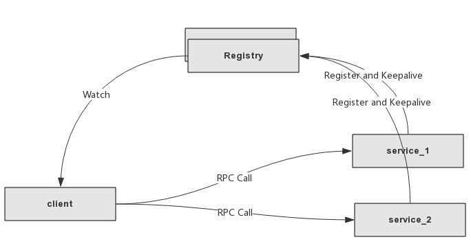
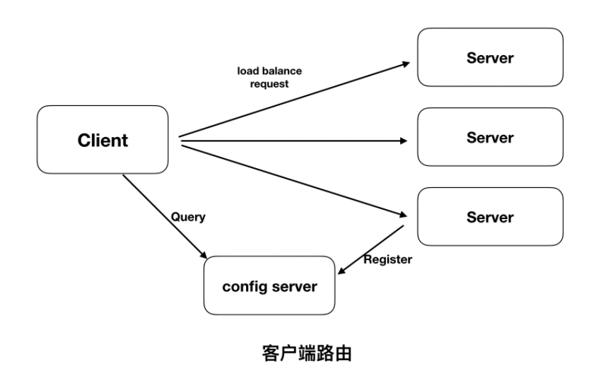
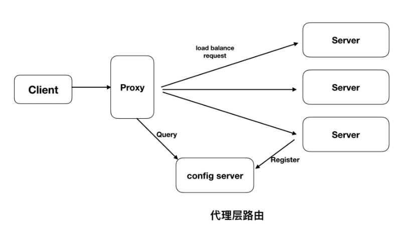
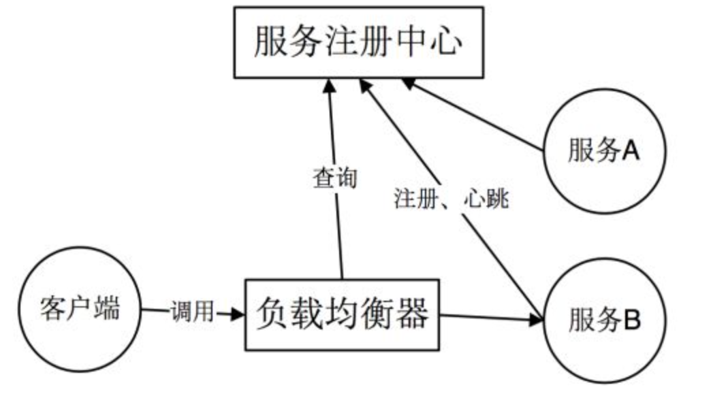

<!-- GFM-TOC -->

* [一 、服务发现概述](#一-服务发现概述)
* [二、服务发现的路由方式](#二-服务发现的路由方式)

  - [1.客户端路由](#1-客户端路由)
  - [2.代理层路由（服务端发现）](#1-代理层路由（服务端发现）)
* [三、gRPC服务发现](#三-gRPC服务发现)

<!-- GFM-TOC -->

# 一、服务发现概述

**1.1 解决的问题**

服务注册与发布主要解决的服务依赖问题,通常意义上,如果A服务调用B服务时,最直接的做法是配置IP地址和端口.但随着服务依赖变多时,配置将会十分庞杂,且当服务发生迁移时,那么所有相关服务的配置均需要修改,这将十分难以维护以及容易出现问题.因此为了解决这种服务依赖关系,服务注册与发现应运而生.该过程至少需要两个步骤：

服务注册 — 存储服务的主机和端口信息

服务发现 — 允许其他用户发现服务注册阶段存储的信息

服务发现的主要优点是可以无需了解架构的部署拓扑环境，只通过服务的名字就能够使用服务，提供了一种服务发布与查找的协调机制。服务发现除了提供服务注册、目录和查找三大关键特性，还需要能够提供健康监控、多种查询、实时更新和高可用性等。

**1.2 分布式系统中解决的问题**

在一个分布式系统中，服务注册与发现组件主要解决两个问题：服务注册和服务发现。

- 服务注册：服务端的服务实例将自身服务信息注册到注册中心。这部分服务信息包括服务所在主机IP和提供服务的Port，以及暴露服务自身状态以及访问协议等信息。

- 服务发现：服务实例请求注册中心获取所依赖服务信息。服务实例通过注册中心，获取到注册到其中的服务实例的信息，通过这些信息去请求它们提供的服务。就是新注册的这个服务模块能够及时的被其他调用者发现。不管是服务新增和服务删减都能实现自动发现。

  ```c++
  //服务注册
  NameServer->register(newServer); 
  
  //服务发现
  NameServer->getAllServer(); 
  ```

除此之外，服务注册与发现需要关注监控服务实例运行状态、负载均衡等问题。

- 监控：微服务应用中，服务处于动态变化的情况，需要一定机制处理无效的服务实例。一般来讲，服务实例与注册中心在注册后通过心跳的方式维系联系，一旦心跳缺少，对应的服务实例会被注册中心剔除。
- 负载均衡：同一服务可能同时存在多个实例，需要正确处理对该服务的负载均衡。

**1.3 CAP原则**

CAP原则，指的是在一个分布式系统中，Consistency(一致性)、Availability(可用性)、Partition Tolerance(分区容错性)，不能同时成立。

- 一致性：它要求在同一时刻点，分布式系统中的所有数据备份都处于同一状态。
- 可用性：在系统集群的一部分节点宕机后，系统依然能够响应用户的请求。
- 分区容错性：在网络区间通信出现失败，系统能够容忍。
- 一般来讲，基于网络的不稳定性，分布容错是不可避免的，所以我们默认CAP中的P总是成立的。

一致性的强制数据统一要求，必然会导致在更新数据时部分节点处于被锁定状态，此时不可对外提供服务，影响了服务的可用性，反之亦然。因此一致性和可用性不能同时满足。
我们接下来介绍的服务注册和发现组件中，Eureka满足了其中的AP，Consul和Zookeeper满足了其中的CP。

**1.4 机制**

<div align="center">  </div><br>

服务注册与发现主要分为以下几点.

- 服务信息发布

  这里主要是服务的服务名,IP信息,以及一些附件元数据.通过注册接口注册到服务注册发布中心.

- 存活检测

  当服务意外停止时,客户端需要感知到服务停止,并将服务的IP地址踢出可用的IP地址列表,这里可以使用定时心跳去实现.

- 客户端负载均衡

  通过服务注册与发布,可以实现一个服务部署多台实例,客户端实现在实例直接的负载均衡,从而实现服务的横向扩展.

  因此,服务注册与发布可以概括为,服务将信息上报,客户端拉取服务信息,通过服务名进行调用,当服务宕机时客户端踢掉故障服务,服务新上线时客户端自动添加到调用列表.

  gRPC 本身没有提供注册中心，但为开发者提供了实现注册中心的接口，开发者是要实现其接口。
  
  grpc-go的整个实现大量使用go的接口特性,因此通过扩展接口,可以很容易的实现服务的注册与发现,这里服务注册中心考虑到可用性以及一致性,一般采用etcd或zookeeper来实现,这里实现etcd的版本.

# 二、服务发现的路由方式

## 1. 客户端路由

客户端路由模式，也就是调用方负责获取被调用方的地址信息，并使用相应的负载均衡算法发起请求。调用方访问服务注册服务，获取对应的服务 IP 地址和端口，可能还包括对应的服务负载信息（负载均衡算法、服务实例权重等）。调用方通过负载均衡算法选取其中一个发起请求。如下：

<div align="center">  </div><br>

优点：架构简单，扩展灵活，方便实现负载均衡功能。
缺点：强耦合，有一定开发成本

## 2. 代理层路由（服务端发现）

代理层路由，不是由调用方去获取被调方的地址，而是通过代理的方式，由代理去获取被调方的地址、发起调用请求。client 只是会对代理层发起简单请求，代理层去进行 server 寻址、负载均衡等。如下：

<div align="center">  </div><br>

即客户端向load balancer 发送请求。load balancer 查询服务注册中心找到可用的服务，然后转发请求到该服务上。和客户端发现一样，服务都要到注册中心进行服务注册和注销。
优点：服务的发现逻辑对客户端是透明的。
缺点：需要额外部署和维护高可用的负载均衡器。

<div align="center">  </div><br>


****

grpc 官方介绍的服务发现流程图可以看出，grpc 是使用客户端路由的方式：

<div align="center">  </div><br>

1、启动时，grpc client 通过服名字解析服务得到一个 address list，每个 address 将指示它是服务器地址还是负载平衡器地址，以及指示要哪个客户端负载平衡策略的服务配置（例如，round_robin 或 grpclb）

2、客户端实例化负载均衡策略 如果解析程序返回的任何一个地址是负载均衡器地址，则无论 service config 中定义了什么负载均衡策略，客户端都将使用grpclb策略。否则，客户端将使用 service config 中定义的负载均衡策略。如果服务配置未请求负载均衡策略，则客户端将默认使用选择第一个可用服务器地址的策略。

3、负载平衡策略为每个服务器地址创建一个 subchannel，假如是 grpclb 策略，客户端会根据名字解析服务返回的地址列表，请求负载均衡器，由负载均衡器决定请求哪个 subConn，然后打开一个数据流，对这个 subConn 中的所有服务器 adress 都建立连接，从而实现 client stream 的效果

4、当有rpc请求时，负载均衡策略决定哪个子通道即grpc服务器将接收请求，当可用服务器为空时客户端的请求将被阻塞。

# 三、gRPC服务发现

在`grpc client`的`DialContext`的方法中，有这一段关于`resolver`(命名解析)的代码：

```go
// Determine the resolver to use.
	cc.parsedTarget = grpcutil.ParseTarget(cc.target, cc.dopts.copts.Dialer != nil)
	channelz.Infof(logger, cc.channelzID, "parsed scheme: %q", cc.parsedTarget.Scheme)
	resolverBuilder := cc.getResolver(cc.parsedTarget.Scheme)
	if resolverBuilder == nil {
		// If resolver builder is still nil, the parsed target's scheme is
		// not registered. Fallback to default resolver and set Endpoint to
		// the original target.
		channelz.Infof(logger, cc.channelzID, "scheme %q not registered, fallback to default scheme", cc.parsedTarget.Scheme)
		cc.parsedTarget = resolver.Target{
			Scheme:   resolver.GetDefaultScheme(),
			Endpoint: target,
		}
		resolverBuilder = cc.getResolver(cc.parsedTarget.Scheme)
		if resolverBuilder == nil {
			return nil, fmt.Errorf("could not get resolver for default scheme: %q", cc.parsedTarget.Scheme)
		}
	}
```

 这段代码主要干了两件事情，ParseTarget和 getResolver 获取了一个 resolverBuilder

ParseTarget其实就是将 target 赋值给了 resolver target 对象的 endpoint 属性，如下：

```go
func ParseTarget(target string, skipUnixColonParsing bool) (ret resolver.Target) {
	var ok bool
	ret.Scheme, ret.Endpoint, ok = split2(target, "://")
	if !ok {
		if strings.HasPrefix(target, "unix:") && !skipUnixColonParsing {
			// Handle the "unix:[path]" case, because splitting on :// only
			// handles the "unix://[/absolute/path]" case. Only handle if the
			// dialer is nil, to avoid a behavior change with custom dialers.
			return resolver.Target{Scheme: "unix", Endpoint: target[len("unix:"):]}
		}
		return resolver.Target{Endpoint: target}
	}
	ret.Authority, ret.Endpoint, ok = split2(ret.Endpoint, "/")
	if !ok {
		return resolver.Target{Endpoint: target}
	}
	if ret.Scheme == "unix" {
		// Add the "/" back in the unix case, so the unix resolver receives the
		// actual endpoint.
		ret.Endpoint = "/" + ret.Endpoint
	}
	return ret
}
```

 getResolver的resolver.Get 方法 ，这里从一个 map 中取出了一个 Builder

```go
var (
	// m is a map from scheme to resolver builder.
	m = make(map[string]Builder)
	// defaultScheme is the default scheme to use.
	defaultScheme = "passthrough"
)

// Get returns the resolver builder registered with the given scheme.
//
// If no builder is register with the scheme, nil will be returned.
func Get(scheme string) Builder {
	if b, ok := m[scheme]; ok {
		return b
	}
	return nil
}
```

**resolver**

Resolver可以用来获取和更新连接地址，特别的当连接地址需要通过ZK等的注册中心，或者一些第三方的负载均衡服务获取时，就可以通过定制Resolver来解析。

```go
// Package resolver defines APIs for name resolution in gRPC.
// All APIs in this package are experimental.
```

resolver 主要提供了一个名字解析的规范，所有的名字解析服务可以实现这个规范，包括 dns 解析类 dns_resolver 就是实现了这个规范的一个解析器。

resolver 中定义了 Builder ，通过调用 Build 去获取一个 resolver 实例

```go
// Builder creates a resolver that will be used to watch name resolution updates.
type Builder interface {
    // Build creates a new resolver for the given target.
    //
    // gRPC dial calls Build synchronously, and fails if the returned error is
    // not nil.
    Build(target Target, cc ClientConn, opts BuildOption) (Resolver, error)
    // Scheme returns the scheme supported by this resolver.
    // Scheme is defined at https://github.com/grpc/grpc/blob/master/doc/naming.md.
    Scheme() string
}
```

在调用 Dial 方法发起 rpc 请求之前需要创建一个 ClientConn 连接，在 DialContext 这个方法中对 ClientConn 各属性进行了赋值，其中有一行代码就完成了 build resolver 的工作。

```go
// Build the resolver.
rWrapper, err := newCCResolverWrapper(cc, resolverBuilder)

// newCCResolverWrapper uses the resolver.Builder to build a Resolver and
// returns a ccResolverWrapper object which wraps the newly built resolver.
func newCCResolverWrapper(cc *ClientConn, rb resolver.Builder) (*ccResolverWrapper, error) {
	ccr := &ccResolverWrapper{
		cc:   cc,
		done: grpcsync.NewEvent(),
	}

	var credsClone credentials.TransportCredentials
	if creds := cc.dopts.copts.TransportCredentials; creds != nil {
		credsClone = creds.Clone()
	}
	rbo := resolver.BuildOptions{
		DisableServiceConfig: cc.dopts.disableServiceConfig,
		DialCreds:            credsClone,
		CredsBundle:          cc.dopts.copts.CredsBundle,
		Dialer:               cc.dopts.copts.Dialer,
	}

	var err error
	// We need to hold the lock here while we assign to the ccr.resolver field
	// to guard against a data race caused by the following code path,
	// rb.Build-->ccr.ReportError-->ccr.poll-->ccr.resolveNow, would end up
	// accessing ccr.resolver which is being assigned here.
	ccr.resolverMu.Lock()
	defer ccr.resolverMu.Unlock()
	ccr.resolver, err = rb.Build(cc.parsedTarget, ccr, rbo)
	if err != nil {
		return nil, err
	}
	return ccr, nil
}
```

不出意料，我们之前通过 get 去获取了一个 Builder， 这里调用了 Builder 的 Build 方法产生一个 resolver。

**register**

上面我们说到了，resolver 通过 get 方法，根据一个 string key 去一个 builder map 中获取一个 builder，这个 map 在 resolver 中初始化如下，那么是怎么进行赋值的呢？

```go
var (
    // m is a map from scheme to resolver builder.
    m = make(map[string]Builder)
    // defaultScheme is the default scheme to use.
    defaultScheme = "passthrough"
)
```

猜测肯定会有一个服务注册的过程，果然看到了一个 Register 方法

```go
func Register(b Builder) {
    m[b.Scheme()] = b
}
```

所有的 resolver 实现类通过 Register 方法去**实现 Builder 的注册**，比如 grpc 提供的 dnsResolver 这个类中调用了 init 方法，在服务初始化时实现了 Builder 的注册

```go
func init() {
    resolver.Register(NewBuilder())
}
```

**获取服务地址**

resolver 和 builder 都是 interface，也就是说它们只是定义了一套规则。具体实现由实现他们的子类去完成。例如在 helloworld 例子中，默认是通过默认的 passthrough 这个 scheme 去获取的 passthroughResolver 和 passthroughBuilder，我们来看 passthroughBuilder 的 Build 方法返回了一个带有 address 的 resolver，这个地址就是 server 的地址列表。在 helloworld demo 中，就是 “localhost:50051”。

```go
func (*passthroughBuilder) Build(target resolver.Target, cc resolver.ClientConn, opts resolver.BuildOption) (resolver.Resolver, error) {
    r := &passthroughResolver{
        target: target,
        cc:     cc,
    }
    r.start()
    return r, nil
}
func (r *passthroughResolver) start() {
    r.cc.UpdateState(resolver.State{Addresses: []resolver.Address{{Addr: r.target.Endpoint}}})
}
```

**dns_resolver**

grpc 支持自定义 resolver 实现服务发现。同时 grpc 官方提供了一个基于 dns 的服务发现 resolver，这就是 dns_resolver，dns_resolver 通过 Build() 创建一个 resolver 实例，具体看一下 Build() 方法：

```go
// Build creates and starts a DNS resolver that watches the name resolution of the target.
func (b *dnsBuilder) Build(target resolver.Target, cc resolver.ClientConn, opts resolver.BuildOption) (resolver.Resolver, error) {
    host, port, err := parseTarget(target.Endpoint, defaultPort)
    if err != nil {
        return nil, err
    }
    // IP address.
    if net.ParseIP(host) != nil {
        host, _ = formatIP(host)
        addr := []resolver.Address{{Addr: host + ":" + port}}
        i := &ipResolver{
            cc: cc,
            ip: addr,
            rn: make(chan struct{}, 1),
            q:  make(chan struct{}),
        }
        cc.NewAddress(addr)
        go i.watcher()
        return i, nil
    }
    // DNS address (non-IP).
    ctx, cancel := context.WithCancel(context.Background())
    d := &dnsResolver{
        freq:                 b.minFreq,
        backoff:              backoff.Exponential{MaxDelay: b.minFreq},
        host:                 host,
        port:                 port,
        ctx:                  ctx,
        cancel:               cancel,
        cc:                   cc,
        t:                    time.NewTimer(0),
        rn:                   make(chan struct{}, 1),
        disableServiceConfig: opts.DisableServiceConfig,
    }
    if target.Authority == "" {
        d.resolver = defaultResolver
    } else {
        d.resolver, err = customAuthorityResolver(target.Authority)
        if err != nil {
            return nil, err
        }
    }
    d.wg.Add(1)
    go d.watcher()
    return d, nil
}
```

在 Build 方法中，我们没有看到对 server address 寻址的过程，仔细找找，发现了一个 watcher （服务发现）方法，如下：

```go
go d.watcher()
```

看一下 watcher 方法，发现它其实是一个监控进程，顾名思义作用是监控我们产生的 resolver 的状态，这里使用了一个 for 循环无限监听，通过 chan 进行消息通知。

```go
func (d *dnsResolver) watcher() {
	defer d.wg.Done()
	for {
		select {
		case <-d.ctx.Done():
			return
		case <-d.rn:
		}
		// 初始化balancer
		state, err := d.lookup()
		if err != nil {
			d.cc.ReportError(err)
		} else {
			d.cc.UpdateState(*state)
		}

		// Sleep to prevent excessive re-resolutions. Incoming resolution requests
		// will be queued in d.rn.
		t := time.NewTimer(minDNSResRate)
		select {
		case <-t.C:
		case <-d.ctx.Done():
			t.Stop()
			return
		}
	}
}
```

定位到里面的 lookup 方法，进入 lookup 方法，发现它调用了 lookupSRV 这个方法：

```go
func (d *dnsResolver) lookup() (*resolver.State, error) {
	srv, srvErr := d.lookupSRV()
	addrs, hostErr := d.lookupHost()
	if hostErr != nil && (srvErr != nil || len(srv) == 0) {
		return nil, hostErr
	}

	state := resolver.State{Addresses: addrs}
	if len(srv) > 0 {
		state = grpclbstate.Set(state, &grpclbstate.State{BalancerAddresses: srv})
	}
	if !d.disableServiceConfig {
		state.ServiceConfig = d.lookupTXT()
	}
	return &state, nil
}
```

继续追踪，lookupSRV 这个方法最终其实调用了 go 源码包 net 包下的 的 lookupSRV 方法，这个方法实现了 dns 协议对指定的service服务，protocol协议以及name域名进行srv查询，返回server 的 address 列表。经过层层解剖，我们终于找到了返回 server 的 address list 的代码。

```go
    _, srvs, err := d.resolver.LookupSRV(d.ctx, "grpclb", "tcp", d.host)
    ...
    func (r *Resolver) LookupSRV(ctx context.Context, service, proto, name string) (cname string, addrs []*SRV, err error) {
        return r.lookupSRV(ctx, service, proto, name)
    }
```

### 总结

总结一下， grpc 的服务发现，主要通过 resolver 接口去定义，支持业务自己实现服务发现的 resolver。 grpc 提供了默认的 passthrough_resolver，不进行地址解析，直接将 client 发起请求时指定的 address （例如 helloworld client 指定地址为 “localhost:50051” ）当成 server address。同时，假如业务使用 dns 进行服务发现，grpc 提供了 dns_resolver，通过对指定的service服务，protocol协议以及name域名进行srv查询，来返回 server 的 address 列表。


# 参考

[gRPC服务发现&负载均衡](https://colobu.com/2017/03/25/grpc-naming-and-load-balance/#gRPC%E6%9C%8D%E5%8A%A1%E5%8F%91%E7%8E%B0%E5%8F%8A%E8%B4%9F%E8%BD%BD%E5%9D%87%E8%A1%A1%E5%AE%9E%E7%8E%B0)

[基于 gRPC 的服务注册与发现和负载均衡的原理与实战](https://jishuin.proginn.com/p/763bfbd32fe6)

[gRPC 注册中心](https://learnku.com/articles/34777)

[RPC框架解析：gRPC服务发现](http://ldaysjun.com/2020/04/21/rpc/rpc5/)