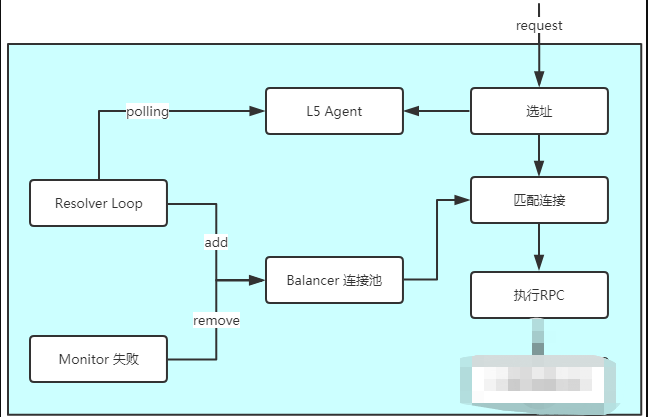

从前面两节内容可对gRPC的服务发现与负载均衡的主要内容（gRPC 本身没有提供注册中心，但为开发者提供了实现注册中心的接口，开发者是要实现其接口），下面将对流程进行梳理。gRPC版本为1.14.0（与前面代码不同，但流程大体一致）

#### 1. 接口定义

 **Picker**接口，一般来说每个GRPC负载均衡器都会带一个Picker，其唯一的Pick方法用来根据一定的条件选取一个PickResult的连接(SubConn)，也就是寻址。在负载均衡器初始化时，以及连接状态变化时，会触发更新Picker.定义如下：

```go
// The pickers used by gRPC can be updated by ClientConn.UpdateState().
type Picker interface {
	// Pick returns the connection to use for this RPC and related information.
	//
	// Pick should not block.  If the balancer needs to do I/O or any blocking
	// or time-consuming work to service this call, it should return
	// ErrNoSubConnAvailable, and the Pick call will be repeated by gRPC when
	// the Picker is updated (using ClientConn.UpdateState).
	//
	// If an error is returned:
	//
	// - If the error is ErrNoSubConnAvailable, gRPC will block until a new
	//   Picker is provided by the balancer (using ClientConn.UpdateState).
	//
	// - If the error is a status error (implemented by the grpc/status
	//   package), gRPC will terminate the RPC with the code and message
	//   provided.
	//
	// - For all other errors, wait for ready RPCs will wait, but non-wait for
	//   ready RPCs will be terminated with this error's Error() string and
	//   status code Unavailable.
	Pick(info PickInfo) (PickResult, error)
}
```

**Balancer**是负载均衡器所需要实现的接口:

```go
// UpdateClientConnState, ResolverError, UpdateSubConnState, and Close are
// guaranteed to be called synchronously from the same goroutine.  There's no
// guarantee on picker.Pick, it may be called anytime.
type Balancer interface {
	// 当连接状态发生变化时会调用此方法, 要求负载均衡器更具状态变化更新自身的连接策略和连接池(如果有的话)
	// 同时也需要更新对应的Picker
	UpdateClientConnState(ClientConnState) error
	// ResolverError is called by gRPC when the name resolver reports an error.
	ResolverError(error)
	// UpdateSubConnState is called by gRPC when the state of a SubConn
	// changes.
	UpdateSubConnState(SubConn, SubConnState)
	// Close closes the balancer. The balancer is not required to call
	// ClientConn.RemoveSubConn for its existing SubConns.
	Close()
}
```

简单来说一个**Balancer**要做的就两件事情:

- ​    1.管理客户端连接(SubConn)，当连接状态变化时更新自身的连接策略和连接池(如果有的话)；
- ​    2.创建和维护Picker

**Resolver**可以用来获取和更新连接地址，特别的当连接地址需要通过ZK等的注册中心，或者一些第三方的负载均衡服务获取时，就可以通过定制Resolver来解析。

```go
type Builder interface {
	// 在Dial方法中会异步调用该方法，构造一个Resolver
	Build(target Target, cc ClientConn, opts BuildOptions) (Resolver, error)
	// Scheme returns the scheme supported by this resolver.
	// Scheme is defined at https://github.com/grpc/grpc/blob/master/doc/naming.md.
	Scheme() string
}

type Resolver interface {
	// 在GRPC建立新的Transport时，会触发调用这个方法，用来获取或者生成一批新的客户端地址
	// 何为Transport？后面的篇幅会有解释
	ResolveNow(ResolveNowOptions)
	// Close closes the resolver.
	Close()
}
```


#### 2. 源码+流程

**2.2.1 Resolver和Balancer**

 先从Dial方法入手，Dial方法调用了DialContext方法，该主要用来初始化一个ClientConn对象，略去源码中我们不关心的部分，将重点部分添加注释如下：

```go
func DialContext(ctx context.Context, target string, opts ...DialOption) (conn *ClientConn, err error) {
    // 初始化 ClientConn, 这里将ClientConn变量命名为cc, 记住这个名字, 后续会有很多地方出现
	cc := &ClientConn{
		target:            target,
		csMgr:             &connectivityStateManager{},
        // 初始化地址池
		conns:             make(map[*addrConn]struct{}),
		dopts:             defaultDialOptions(),
        // 初始化一个空的 PickerWrapper ，PickerWrapper内聚了Picker，但是Picker并不在此时创建
        // 这里使用了策略模式，将Picker的具体算法独立成接口，Golang GRPC中使用了大量类似的策略模式
		blockingpicker:    newPickerWrapper(),
		czData:            new(channelzData),
		firstResolveEvent: grpcsync.NewEvent(),
	}
	// ... 略去一坨proxy, agency, 超时控制等相关的代码

	if cc.dopts.resolverBuilder == nil {
		// ... 略去一坨 获取默认resolverBuilder的代码
		}
	} else {
		cc.parsedTarget = resolver.Target{Endpoint: target}
	}
	// ... 略去一坨auth相关的代码

	// 新建 ResolverWrapper 和 resolver. 这又是一个策略模式（后面的具体方法）
	rWrapper, err := newCCResolverWrapper(cc, resolverBuilder)
	if err != nil {
		return nil, fmt.Errorf("failed to build resolver: %v", err)
	}
    // 启动ResolverWrapper内部的watcher协程 处理地址以及连接状态的变更
    // 现版本将start放到了build过程中
	cc.resolverWrapper.start()

	// ...阻塞模式下 阻塞等待连接完成的代码

	return cc, nil
}
```

由此可见，当使用非阻塞模式时，此方法并没有真正创建连接，只是把连接的上下文信息都设置好了。接下来再看看DialContext方法中调用的newCCResolverWrapper 方法：

```go
// newCCResolverWrapper uses the resolver.Builder to build a Resolver and
// returns a ccResolverWrapper object which wraps the newly built resolver.
func newCCResolverWrapper(cc *ClientConn, rb resolver.Builder) (*ccResolverWrapper, error) {
   ccr := &ccResolverWrapper{
      cc:   cc,
      done: grpcsync.NewEvent(),
   }

   var credsClone credentials.TransportCredentials
   if creds := cc.dopts.copts.TransportCredentials; creds != nil {
      credsClone = creds.Clone()
   }
   rbo := resolver.BuildOptions{
      DisableServiceConfig: cc.dopts.disableServiceConfig,
      DialCreds:            credsClone,
      CredsBundle:          cc.dopts.copts.CredsBundle,
      Dialer:               cc.dopts.copts.Dialer,
   }

   var err error
   // We need to hold the lock here while we assign to the ccr.resolver field
   // to guard against a data race caused by the following code path,
   // rb.Build-->ccr.ReportError-->ccr.poll-->ccr.resolveNow, would end up
   // accessing ccr.resolver which is being assigned here.
   ccr.resolverMu.Lock()
   defer ccr.resolverMu.Unlock()
   ccr.resolver, err = rb.Build(cc.parsedTarget, ccr, rbo)
   if err != nil {
      return nil, err
   }
   return ccr, nil
}
```

 可以看到这里通过调用resolverBuilder的Build方法，创建了Resolver，再来看resolverWrapper.start()方法，该方法启动了一个协程调用resolverWrapper的watcher：

```go
// watcher processes address updates and service config updates sequentially.
// Otherwise, we need to resolve possible races between address and service
// config (e.g. they specify different balancer types).
func (ccr *ccResolverWrapper) watcher() {
   for {
      select {
      case <-ccr.done:
         return
      default:
      }

      select {
      case addrs := <-ccr.addrCh:
         select {
         case <-ccr.done:
            return
         default:
         }
         grpclog.Infof("ccResolverWrapper: sending new addresses to cc: %v", addrs)
         ccr.cc.handleResolvedAddrs(addrs, nil)
      case sc := <-ccr.scCh:
         select {
         case <-ccr.done:
            return
         default:
         }
         grpclog.Infof("ccResolverWrapper: got new service config: %v", sc)
         ccr.cc.handleServiceConfig(sc)
      case <-ccr.done:
         return
      }
   }
}
```

 当有新的地址或者当有服务状态变更时，分别调用了ClientConn的handleResolvedAddrs和handleServiceConfig。首先来看看ccr.addrCh和ccr.scCh这两个通道的值什么时候插入，分析其调用链：

- ResolverBuilder.Build/Resolver的watcher Loop -> resolverWrapper.NewAddress -> add new addr to addrCh
- ResolverBuilder.Build/Resolver的watcher Loop -> resolverWrapper.NewServiceConfig -> add new addr to scCh

​    也即resolver获取到新的地址或者服务状态变更后，会将信息传递给resolverWrapper，resolverWrapper则进一步将信息传递给ClientConn处理，那么再来看ClientConn的handleResolvedAddrs和handleServiceConfig，先看handleResolvedAddrs：

```go
func (cc *ClientConn) handleResolvedAddrs(addrs []resolver.Address, err error) {
   cc.mu.Lock()
   defer cc.mu.Unlock()
   if cc.conns == nil {
     // cc was closed.
		return
	}
    
    // 如果当前地址和新地址一致 则什么都不做
	if reflect.DeepEqual(cc.curAddresses, addrs) {
		return
	}

	cc.curAddresses = addrs

	if cc.dopts.balancerBuilder == nil {
		// ... 省略一坨代码 当balancerBuilder为nil时 后去一个默认的
	} else if cc.balancerWrapper == nil {
		// 初始化balancerWrapper和balancer 又是类似的策略模式
      cc.balancerWrapper = newCCBalancerWrapper(cc, cc.dopts.balancerBuilder, cc.balancerBuildOpts)
   }

   cc.balancerWrapper.handleResolvedAddrs(addrs, nil)
}

func newCCBalancerWrapper(cc *ClientConn, b balancer.Builder, bopts balancer.BuildOptions) *ccBalancerWrapper {
	ccb := &ccBalancerWrapper{
		cc:               cc,
		stateChangeQueue: newSCStateUpdateBuffer(),
		resolverUpdateCh: make(chan *resolverUpdate, 1),
		done:             make(chan struct{}),
		subConns:         make(map[*acBalancerWrapper]struct{}),
	}
	go ccb.watcher()
	ccb.balancer = b.Build(ccb, bopts)
	return ccb
}
```

这里终于看到balancer的出场了，最终由resolver获取到的新地址交由balancerWrapper的handleResolvedAddrs处理：

```go
func (ccb *ccBalancerWrapper) handleResolvedAddrs(addrs []resolver.Address, err error) {
	select {
	case <-ccb.resolverUpdateCh:
	default:
	}
	ccb.resolverUpdateCh <- &resolverUpdate{
		addrs: addrs,
		err:   err,
	}
}
```

balancerWrapper只是简单的将获取到的地址信息丢入其内部的一个通道，对于这个通道的处理则在balancerWrapper的watcher方法中：

```go
func (ccb *ccBalancerWrapper) watcher() {
	for {
		select {
		case t := <-ccb.stateChangeQueue.get():
			ccb.stateChangeQueue.load()
			select {
			case <-ccb.done:
				ccb.balancer.Close()
				return
			default:
			}
			ccb.balancer.HandleSubConnStateChange(t.sc, t.state)
		case t := <-ccb.resolverUpdateCh:
			select {
			case <-ccb.done:
				ccb.balancer.Close()
				return
			default:
			}
			ccb.balancer.HandleResolvedAddrs(t.addrs, t.err)
		case <-ccb.done:
		}

		select {
		case <-ccb.done:
			ccb.balancer.Close()
			ccb.mu.Lock()
			scs := ccb.subConns
			ccb.subConns = nil
			ccb.mu.Unlock()
			for acbw := range scs {
				ccb.cc.removeAddrConn(acbw.getAddrConn(), errConnDrain)
			}
			return
		default:
		}
	}
}

```

这些代码是不是看起来很眼熟，没错和resolverWrapper的设计模式时一致的。对于接受到的新地址，最终会调用balancer.HandleResolvedAddrs，也即是交由各个负载均衡器处理。我们先来理一下这条调用路径：

- resolverWrapper.handleResolvedAddrs - balancerWrapper.handleResolvedAddrs - balancer.HandleResolvedAddrs

​    handleServiceConfig的调用路径也是类似的，这里就不再详细描述了：

- resolverWrapper.handleServiceConfig - balancerWrapper.handleResolvedAddrs - balancer.HandleSubConnStateChange

​    整理下通过resolver更新balancer地址池的调用路径：

<div align="center">  </div><br>

**2.2.2 Picker**

Picker一般都是和Balancer成对出现，因此我来看下GRPC默认的一个RoundRobin Balancer实现:

```go
// Name is the name of round_robin balancer.
const Name = "round_robin"

// newBuilder creates a new roundrobin balancer builder.
func newBuilder() balancer.Builder {
   return base.NewBalancerBuilder(Name, &rrPickerBuilder{})
}

func init() {
   balancer.Register(newBuilder())
}

type rrPickerBuilder struct{}

func (*rrPickerBuilder) Build(readySCs map[resolver.Address]balancer.SubConn) balancer.Picker {
   grpclog.Infof("roundrobinPicker: newPicker called with readySCs: %v", readySCs)
   var scs []balancer.SubConn
   for _, sc := range readySCs {
      scs = append(scs, sc)
   }
   return &rrPicker{
      subConns: scs,
   }
}

type rrPicker struct {
   // subConns is the snapshot of the roundrobin balancer when this picker was
   // created. The slice is immutable. Each Get() will do a round robin
   // selection from it and return the selected SubConn.
   subConns []balancer.SubConn

   mu   sync.Mutex
   next int
}

func (p *rrPicker) Pick(ctx context.Context, opts balancer.PickOptions) (balancer.SubConn, func(balancer.DoneInfo), error) {
   if len(p.subConns) <= 0 {
      return nil, nil, balancer.ErrNoSubConnAvailable
   }

   p.mu.Lock()
   sc := p.subConns[p.next]
   p.next = (p.next + 1) % len(p.subConns)
   p.mu.Unlock()
   return sc, nil, nil
}
```

很简单Build方法创建了一个Picker，Pick方法则使用RoundRobin 选取一个连接。那么Build方法什么时候被调用，Pick方法又是什么时候被调用呢？ 先看Build方法，如果使用GRPC默认的实现，在base.balancer中：

```go
// regeneratePicker takes a snapshot of the balancer, and generates a picker
// from it. The picker is
//  - errPicker with ErrTransientFailure if the balancer is in TransientFailure,
//  - built by the pickerBuilder with all READY SubConns otherwise.
func (b *baseBalancer) regeneratePicker() {
   if b.state == connectivity.TransientFailure {
      b.picker = NewErrPicker(balancer.ErrTransientFailure)
      return
   }
   readySCs := make(map[resolver.Address]balancer.SubConn)

   // 获取所有可用的连接 放到readySCs中 传给pickerBuilder.Build
   for addr, sc := range b.subConns {
      if st, ok := b.scStates[sc]; ok && st == connectivity.Ready {
         readySCs[addr] = sc
      }
   }
   b.picker = b.pickerBuilder.Build(readySCs)
}

func (b *baseBalancer) HandleSubConnStateChange(sc balancer.SubConn, s connectivity.State) {
   grpclog.Infof("base.baseBalancer: handle SubConn state change: %p, %v", sc, s)
   oldS, ok := b.scStates[sc]
   if !ok {
      grpclog.Infof("base.baseBalancer: got state changes for an unknown SubConn: %p, %v", sc, s)
      return
   }
   b.scStates[sc] = s
   switch s {
   case connectivity.Idle:
      sc.Connect()
   case connectivity.Shutdown:
      // When an address was removed by resolver, b called RemoveSubConn but
      // kept the sc's state in scStates. Remove state for this sc here.
       // 删除关闭的连接
      delete(b.scStates, sc)
   }

   oldAggrState := b.state
   b.state = b.csEvltr.recordTransition(oldS, s)

   // Regenerate picker when one of the following happens:
   //  - this sc became ready from not-ready
   //  - this sc became not-ready from ready
   //  - the aggregated state of balancer became TransientFailure from non-TransientFailure
   //  - the aggregated state of balancer became non-TransientFailure from TransientFailure
   if (s == connectivity.Ready) != (oldS == connectivity.Ready) ||
      (b.state == connectivity.TransientFailure) != (oldAggrState == connectivity.TransientFailure) {
      b.regeneratePicker()
   }

   b.cc.UpdateBalancerState(b.state, b.picker)
}
```

可以看到是由Balancer接口的HandleSubConnStateChange触发的，这里还有个信息就是Picker所获取到的连接一定是当前可用的。

​     再来看Pick的调用链：

- call.go invoke - stream.go newClientStream - ClientConn  getTransport - pickerWrapper.pick - Picker.pick

​    那么call.go invoke又是什么时候调用的呢，查看GPRC从proto文件自动生成的代码：

```go
func (c *greeterClient) SayHello(ctx context.Context, in *HelloRequest, opts ...grpc.CallOption) (*HelloReply, error) {
   out := new(HelloReply)
   err := c.cc.Invoke(ctx, "/helloworld.Greeter/SayHello", in, out, opts...)
   if err != nil {
      return nil, err
   }
   return out, nil
}
```

每次调用GRPC请求都会触发pick方法

**2.2.3 执行连接**

好像始终没有看到真正执行连接的代码。其实真正的连接要从Balancer内部看，会到我们上面的调用路径，看下balancer.HandleResolvedAddrs到底干了什么，再来看base.balancer的实现：

```go
func (b *baseBalancer) HandleResolvedAddrs(addrs []resolver.Address, err error) {
   if err != nil {
      grpclog.Infof("base.baseBalancer: HandleResolvedAddrs called with error %v", err)
      return
   }
   grpclog.Infoln("base.baseBalancer: got new resolved addresses: ", addrs)
   // addrsSet is the set converted from addrs, it's used for quick lookup of an address.
   addrsSet := make(map[resolver.Address]struct{})
   for _, a := range addrs {
      addrsSet[a] = struct{}{}
      if _, ok := b.subConns[a]; !ok {
         // 如果是新地址才会建立连接, 连接池中已有的地址会保留
         sc, err := b.cc.NewSubConn([]resolver.Address{a}, balancer.NewSubConnOptions{})
         if err != nil {
            grpclog.Warningf("base.baseBalancer: failed to create new SubConn: %v", err)
            continue
         }
         b.subConns[a] = sc
         b.scStates[sc] = connectivity.Idle
         sc.Connect()
      }
   }
   for a, sc := range b.subConns {
      // a was removed by resolver.
      if _, ok := addrsSet[a]; !ok {
         b.cc.RemoveSubConn(sc)
         delete(b.subConns, a)
         // Keep the state of this sc in b.scStates until sc's state becomes Shutdown.
         // The entry will be deleted in HandleSubConnStateChange.
      }
   }
}
```

这里要注意，如果获取到的新地址，已经存在于balancer的连接池中，则不会重新连接，直接沿用旧的连接。具体的连接动作则调用cc.NewSubConn，这里的cc其实是一个ccBalancerWrapper，在ccBalancerWrapper的NewSubConn中，调用了ClientConn的newAddrConn创建了addrConn对象：

```go
// newAddrConn creates an addrConn for addrs and adds it to cc.conns.
//
// Caller needs to make sure len(addrs) > 0.
func (cc *ClientConn) newAddrConn(addrs []resolver.Address) (*addrConn, error) {
   ac := &addrConn{
      cc:    cc,
      addrs: addrs,
      dopts: cc.dopts,
   }
   ac.ctx, ac.cancel = context.WithCancel(cc.ctx)
   // Track ac in cc. This needs to be done before any getTransport(...) is called.
   cc.mu.Lock()
   if cc.conns == nil {
      cc.mu.Unlock()
      return nil, ErrClientConnClosing
   }
   if channelz.IsOn() {
      ac.channelzID = channelz.RegisterSubChannel(ac, cc.channelzID, "")
   }
   cc.conns[ac] = struct{}{}
   cc.mu.Unlock()
   return ac, nil
}
```

 可以看到这里也只是设置了上下文，然后放入ClientConn内部的地址池，真正连接的动作再回到balancer.HandleResolvedAddrs，获取到addrConn对象之后，调用acBalancerWrapper.Connect()-addrConn.connect()执行连接，绕了一大圈终于找着了：

```go
// connect starts to creating transport and also starts the transport monitor
// goroutine for this ac.
// It does nothing if the ac is not IDLE.
// TODO(bar) Move this to the addrConn section.
// This was part of resetAddrConn, keep it here to make the diff look clean.
func (ac *addrConn) connect() error {
   ac.mu.Lock()
   if ac.state == connectivity.Shutdown {
      ac.mu.Unlock()
      return errConnClosing
   }
   if ac.state != connectivity.Idle {
      ac.mu.Unlock()
      return nil
   }
   ac.state = connectivity.Connecting
   ac.cc.handleSubConnStateChange(ac.acbw, ac.state)
   ac.mu.Unlock()

   // Start a goroutine connecting to the server asynchronously.
   go func() {
      if err := ac.resetTransport(); err != nil {
         grpclog.Warningf("Failed to dial %s: %v; please retry.", ac.addrs[0].Addr, err)
         if err != errConnClosing {
            // Keep this ac in cc.conns, to get the reason it's torn down.
            ac.tearDown(err)
         }
         return
      }
      ac.transportMonitor()
   }()
   return nil
}
```

再往下看resetTransport方法，发现还不是重点，重点是resetTransport方法中调用了createTransport方法，代码很长，还是挑重点看：

```go
// createTransport creates a connection to one of the backends in addrs.
// It returns true if a connection was established.
func (ac *addrConn) createTransport(connectRetryNum, ridx int, backoffDeadline, connectDeadline time.Time, addrs []resolver.Address, copts transport.ConnectOptions) (bool, error) {
   for i := ridx; i < len(addrs); i++ {
      addr := addrs[i]
      target := transport.TargetInfo{
         Addr:      addr.Addr,
         Metadata:  addr.Metadata,
         Authority: ac.cc.authority,
      }
      done := make(chan struct{})
       
    	// ... 省略若干行
       
      newTr, err := transport.NewClientTransport(connectCtx, ac.cc.ctx, target, copts, onPrefaceReceipt)
      if err != nil {
       	// ... 略去部分处理连接失败的代码
      }
      if ac.dopts.waitForHandshake {
      	// ... 略去部分代码，waitForHandshake为true时会阻塞等待server返回initial settings frame

      }
      ac.mu.Lock()
      if ac.state == connectivity.Shutdown {
         ac.mu.Unlock()
         // ac.tearDonn(...) has been invoked.
         newTr.Close()
         return false, errConnClosing
      }
      ac.printf("ready")
     // 连接成功后调用 handleSubConnStateChange 触发balancer的HandleResolvedAddrs

      ac.state = connectivity.Ready
      ac.cc.handleSubConnStateChange(ac.acbw, ac.state)
      ac.transport = newTr
      ac.curAddr = addr
      if ac.ready != nil {
         close(ac.ready)
         ac.ready = nil
      }
      select {
      case <-done:
         // If the server has responded back with preface already,
         // don't set the reconnect parameters.
      default:
         ac.connectRetryNum = connectRetryNum
         ac.backoffDeadline = backoffDeadline
         ac.connectDeadline = connectDeadline
         ac.reconnectIdx = i + 1 // Start reconnecting from the next backend in the list.
      }
      ac.mu.Unlock()
      return true, nil
   }
   ac.mu.Lock()
   if ac.state == connectivity.Shutdown {
      ac.mu.Unlock()
      return false, errConnClosing
   }
   ac.state = connectivity.TransientFailure
   ac.cc.handleSubConnStateChange(ac.acbw, ac.state)
   ac.cc.resolveNow(resolver.ResolveNowOption{})
   if ac.ready != nil {
      close(ac.ready)
      ac.ready = nil
   }
   ac.mu.Unlock()
   timer := time.NewTimer(backoffDeadline.Sub(time.Now()))
   select {
   case <-timer.C:
   case <-ac.ctx.Done():
      timer.Stop()
      return false, ac.ctx.Err()
   }
   return false, nil
}
```

大致就是调用了NewClientTransport，连接成功后触发balancer的HandleResolvedAddrs。再看NewClientTransport：

```go
func NewClientTransport(connectCtx, ctx context.Context, target TargetInfo, opts ConnectOptions, onSuccess func()) (ClientTransport, error) {
   return newHTTP2Client(connectCtx, ctx, target, opts, onSuccess)
}
```

在newHTTP2Client看到了熟悉的TCP连接以及Handshake.

<div align="center">  </div><br>

<div align="center">  </div><br>

#### 参考

[grpc 源码笔记 01： balancer](https://zhuanlan.zhihu.com/p/104060740)

