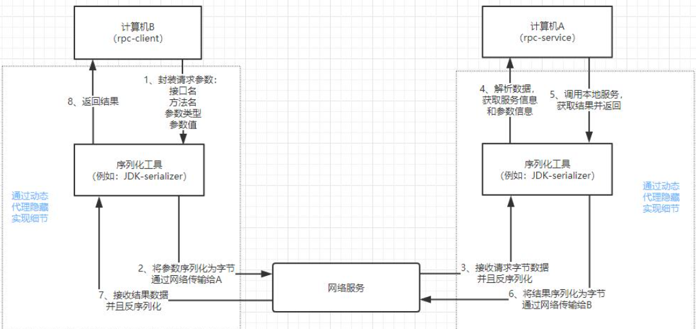
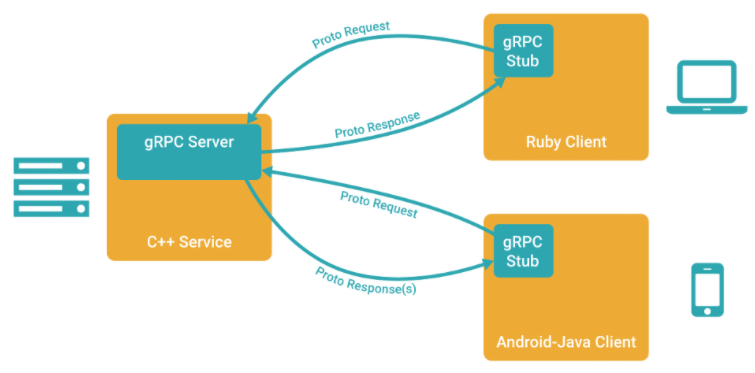
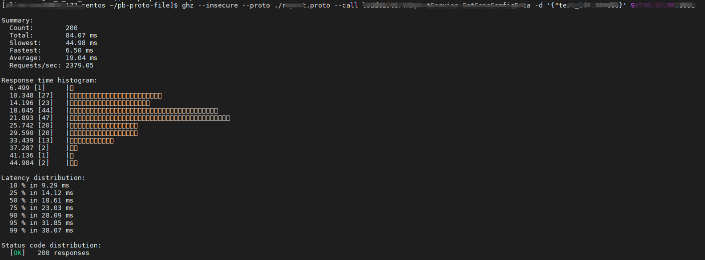

<!-- GFM-TOC -->

* [一 、RPC基础](#一-RPC基础)
  - [1.RPC概述](#1-RPC概述)
  - [2.gRPC](#2-gRPC)
  - [3.Protocol Buffers](#3-Protocol Buffers)
* [二、环境安装](#二-环境安装)

- [三、Demo](#三-Demo)
- [Tips](#Tips)
- [参考](#参考)

<!-- GFM-TOC -->

# 一 、RPC基础

## 1.RPC

1.1 概念

**RPC**(Remote Procedure Call)：远程过程调用，是一种计算机通信协议。该协议允许运行于一台计算机的程序调用另一台计算机的子程序：计算机A提供一个服务，计算机B可以像调用本地服务那样调用计算机A的服务，在该过程中参数的传递是一个序列化和反序列化的过程。

<div align="center">  </div><br>

1.2 RPC与HTTP的对比

|                          | RPC  |                 HTTP                  |
| :----------------------: | :--: | :-----------------------------------: |
|         **格式**         | 灵活 |                 统一                  |
|        **通用性**        |  弱  | 强，没有规定API和语言，跨语言、跨平台 |
| **是否需要关注实现语言** |  是  |        否，只需要遵循rest规范         |
|         **速度**         | 更快 |     较慢，http协议的信息比较臃肿      |

## 2.gRPC

2.1 概念

gRPC 是Google开发的一款高性能、开源通用的 RPC 框架，其主要面向移动应用开发并基于HTTP/2协议标准而设计，基于ProtoBuf(Protocol Buffers)序列化协议开发，且支持众多开发语言。该框架具有以下特点：

- ProtoBuf作为IDL进行数据编码，提高数据压缩率
- 使用HTTP2.0弥补HTTP1.1的不足之处
- 对于调用方和服务方的协议，所提供参数的为可选（版本兼容）

<div align="center">  </div><br>

2.2 gRPC主要有4种请求／响应模式：

(1) 单项 RPC（Simple RPC）

客户端发起一次请求，服务端响应一个数据，即标准RPC通信。

```
rpc SayHello(HelloRequest) returns (HelloResponse){
}
```

(2) 服务端流式 RPC（Server-side streaming RPC）

这种模式是客户端发起一次请求，服务端返回一段连续的数据流。典型的例子是客户端向服务端发送一个股票代码，服务端就把该股票的实时数据源源不断的返回给客户端。

```
rpc LotsOfReplies(HelloRequest) returns (stream HelloResponse){
}
```

(3) 客户端流式 RPC（Client-side streaming RPC）

与服务端数据流模式相反，这次是客户端源源不断的向服务端发送数据流，而在发送结束后，由服务端返回一个响应。典型的例子是物联网终端向服务器报送数据。

```
rpc LotsOfGreetings(stream HelloRequest) returns (HelloResponse) {
}
```

(4) 双向流式 RPC（Bidirectional streaming RPC）

这是客户端和服务端都可以向对方发送数据流，这个时候双方的数据可以同时互相发送，也就是可以实现实时交互。比如聊天应用。

```
rpc BidiHello(stream HelloRequest) returns (stream HelloResponse){
}
```

## 3. Protocol Buffers

3.1 概念

gRPC 默认使用 protocol buffers，这是 Google 开源的一套成熟的结构数据序列化机制（也可以使用其他数据格式，如 JSON）。使用 protocol buffers 消息类型来定义方法参数和返回类型，具体协议格式可参照 [Protocol Buffers 文档](https://developers.google.com/protocol-buffers/docs/overview)。建议使用[proto3 ]((http://doc.oschina.net/https：//developers.google.com/protocol-buffers/docs/proto3))版本的 protocol buffers，它拥有轻量简化的语法、一些有用的新功能，并且支持更多新语言，可兼容默认的proto2。

3.2 特点

- 语言无关、平台无关： 支持 Java、C++、Python 等多种语言，支持多个平台
- 高效：比 XML 更小（3 ~ 10倍）、更快（20 ~ 100倍）、更为简单

- 扩展性、兼容性好：可更新数据结构，而不影响和破坏原有的旧程序

3.3 示例

- 定义一个message(一种消息结构)

  ```protobuf
  // 指定使用proto3，如果不指定的话，编译器会使用proto2去编译
  syntax = "proto3";
  package pb; // 包名
  
  message SearchRequests {
      // 定义SearchRequests的成员变量，需要指定：变量类型、变量名、变量Tag
      // 消息定义中的每个字段都有一个唯一的编号。这些数字用于标识消息二进制格式的字段
      string query = 1;
      int32 page_number = 2;
      int32 result_per_page = 3;
  }
  ```
  
- 定义多个message类型

  ```protobuf
  message SearchResponse {
      message Result {
          string url = 1;
          string title = 2;
          repeated string snippets = 3;
      }
      repeated Result results = 1;
  }
  // message 可以嵌套定义
  message SomeOtherMessage {
      SearchResponse.Result result = 1;
  }
  ```

  

# 二、环境安装

1. 安装gRPC

   ```shell
   go get -u google.golang.org/grpc
   ```

2. 安装proto和protoc-gen-go(protoc的Go插件)

   ```shell
   go get -u github.com/golang/protobuf/{proto,protoc-gen-go}
   ```

3. 安装[protoc](https://github.com/protocolbuffers/protobuf/releases)

   ```shell
   tar zvxf protobuf-all-3.6.1.tar.gz
   cd protobuf-3.6.1
    
   ./configure –prefix=/usr/local/
    
   sudo make  
   sudo make check
   sudo make install
   ```

   使用 protoc 工具可以把编写好的 proto 文件“编译”为Java, Python, C++, Go, Ruby, JavaNano, Objective-C,或C#代码，使用方式如下：

   ```shell
   protoc --proto_path=IMPORT_PATH --cpp_out=DST_DIR --java_out=DST_DIR --python_out=DST_DIR --go_out=DST_DIR --ruby_out=DST_DIR --javanano_out=DST_DIR --objc_out=DST_DIR --csharp_out=DST_DIR path/to/file.proto
   ```

   参数说明：

   - IMPORT_PATH：指定 proto 文件的路径，如果没有指定， protoc 会从当前目录搜索对应的 proto 文件，如果有多个路径，那么可以指定多次`--proto_path`
   - 指定各语言代码的输出路径 
     - –cpp_out：生成c++代码
     - java_out ：生成java代码
     - python_out ：生成python代码
     - go_out ：生成go代码
     - ruby_out ：生成ruby代码
     - javanano_out ：适合运行在有资源限制的平台（如Android）的java代码
     - objc_out ：生成 Objective-C代码
     - csharp_out ：生成C#代码
     - php_out ：生成PHP代码

# 三、Demo

本节选用Golang语言的官方Demo（gRPC Hello World）进行说明，[代码连接](https://github.com/grpc/grpc-go/tree/master/examples)。多种响应方式Demo可详见[grpc/grpc-go/examples/cpp/route_guide](https://github.com/grpc/grpc-go/tree/master/examples/route_guide)

1. 定义PB协议，使用命令`protoc --go_out=./ helloworld.proto` 生成 helloworld.pb.go

   ```protobuf
   syntax = "proto3";
   
   option go_package = "google.golang.org/grpc/examples/helloworld/helloworld";
   option java_multiple_files = true;
   option java_package = "io.grpc.examples.helloworld";
   option java_outer_classname = "HelloWorldProto";
   
   package helloworld;
   
   // The greeting service definition.
   service Greeter {
     // Sends a greeting
     rpc SayHello (HelloRequest) returns (HelloReply) {}
   }
   
   // The request message containing the user's name.
   message HelloRequest {
     string name = 1;
   }
   
   // The response message containing the greetings
   message HelloReply {
     string message = 1;
   }
   ```

2. 服务端代码：定义并启动gRPC服务

   ```Go
   // Package main implements a server for Greeter service.
   package main
   
   import (
   	"context"
   	"log"
   	"net"
   
   	"google.golang.org/grpc"
   	pb "google.golang.org/grpc/examples/helloworld/helloworld"
   )
   
   const (
   	port = ":50051" // 监听的端口
   )
   
   // server is used to implement helloworld.GreeterServer.
   type server struct {
   	pb.UnimplementedGreeterServer
   }
   
   // SayHello implements helloworld.GreeterServer
   func (s *server) SayHello(ctx context.Context, in *pb.HelloRequest) (*pb.HelloReply, error) {
   	log.Printf("Received: %v", in.GetName())
   	return &pb.HelloReply{Message: "Hello " + in.GetName()}, nil
   }
   
   func main() {
   	lis, err := net.Listen("tcp", port)
   	if err != nil {
   		log.Fatalf("failed to listen: %v", err)
   	}
   	s := grpc.NewServer() // 创建服务端
   	pb.RegisterGreeterServer(s, &server{}) // 注册服务
   	if err := s.Serve(lis); err != nil {
   		log.Fatalf("failed to serve: %v", err)
   	}
   }
   ```

3. 客户端代码：调用服务端的接口

   ```go
   // Package main implements a client for Greeter service.
   package main
   
   import (
   	"context"
   	"log"
   	"os"
   	"time"
   
   	"google.golang.org/grpc"
   	pb "google.golang.org/grpc/examples/helloworld/helloworld"
   )
   
   const (
   	address     = "localhost:50051"
   	defaultName = "world"
   )
   
   func main() {
   	// Set up a connection to the server.
   	conn, err := grpc.Dial(address, grpc.WithInsecure(), grpc.WithBlock())
   	if err != nil {
   		log.Fatalf("did not connect: %v", err)
   	}
   	defer conn.Close()
   	c := pb.NewGreeterClient(conn)
   
   	// Contact the server and print out its response.
   	name := defaultName
   	if len(os.Args) > 1 {
   		name = os.Args[1]
   	}
   	ctx, cancel := context.WithTimeout(context.Background(), time.Second)
   	defer cancel()
   	r, err := c.SayHello(ctx, &pb.HelloRequest{Name: name})
   	if err != nil {
   		log.Fatalf("could not greet: %v", err)
   	}
   	log.Printf("Greeting: %s", r.GetMessage())
   }
   ```

   

# Tips

介绍一些在使用gRPC开发过程中的实用小工具，助开发事半功倍~

1. [ghz](https://github.com/bojand/ghz)：一款对gRPC接口压测的工具，使用方便

   <div align="center">  </div><br>

2. [ db2struct](https://github.com/Shelnutt2/db2struct)：从给定的数据库表中生成可用的golang结构

   ```shell
   db2struct --host $yourhost -d $dbname -t $tbname --struct $stname -p $yourpasswd --user=$user --guregu --gorm
   ```

3. [mysql-protobuf](https://github.com/google/mysql-protobuf)：将mysql库表中的字段生成ProtoBuf的messag。


# 参考

http://doc.oschina.net/grpc?t=58008

http://doc.oschina.net/grpc?t=60133

https://smallnest.gitbooks.io/go-rpc-programming-guide/content/

