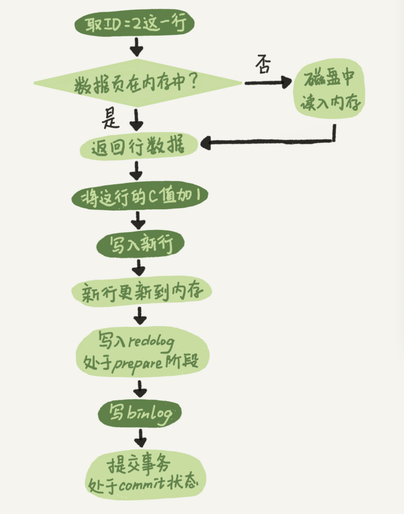

## 一、MySQL数据存储和查询流程

假如说现在我们建了如下一张表

```sql
CREATE TABLE `student` (
  `id` int(11) NOT NULL AUTO_INCREMENT COMMENT '学号',
  `name` varchar(10) NOT NULL COMMENT '学生姓名',
  `age` int(11) NOT NULL COMMENT '学生年龄',
  PRIMARY KEY (`id`),
  KEY `idx_name` (`name`)
) ENGINE=InnoDB;
```

插入如下sql

```sql
insert into student (`name`, `age`) value('a', 10);
insert into student (`name`, `age`) value('c', 12);
insert into student (`name`, `age`) value('b', 9);
insert into student (`name`, `age`) value('d', 15);
insert into student (`name`, `age`) value('h', 17);
insert into student (`name`, `age`) value('l', 13);
insert into student (`name`, `age`) value('k', 12);
insert into student (`name`, `age`) value('x', 9);
```

<div align="center">  </div><br>

这些数据最终会持久化到文件中，那么这些数据在文件中是如何组织的？难道是一行一行追加到文件中的？其实并不是，**「数据其实是存到页中的，一页的大小为16k，一个表由很多页组成，这些页组成了B+树」**，最终的组织形式如下所示。

<div align="center">  </div><br>

那么SQL语句是如何执行的呢？MySQL的逻辑架构图如下所示：

<div align="center">  </div><br>

详细结构如为：

<div align="center">  </div><br>

**「当我们想更新某条数据的时候，难道是从磁盘中加载出来这条数据，更新后再持久化到磁盘中吗？」**

如果这样搞的话，那一条sql的执行过程可太慢了，因为对一个大磁盘文件的读写操作是要耗费几百万毫秒的

真实的执行过程是，当我们想更新或者读取某条数据的时候，会把对应的页加载到内存中的Buffer Pool缓冲池中（默认为128m，当然为了提高系统的并发度，你可以把这个值设大一点）。

<div align="center">  </div><br>

之所以加载页到Buffer Pool中，是考虑到当你使用这个页的数据时，这个页的其他数据使用到的概率页很大，随机IO的耗时很长，所以多加载一点数据到Buffer Pool。

<div align="center">  </div><br>

当更新数据的时候，如果对应的页在Buffer Pool中，则直接更新Buffer Pool中的页即可，对应的页不在Buffer Pool中时，才会从磁盘加载对应的页到Buffer Pool，然后再更新，**「此时Buffer Pool中的页和磁盘中的页数据是不一致的，被称为脏页」**。这些脏页是要被刷回到磁盘中的

**「这些脏页是多会刷回到磁盘中的？」** 有如下几个时机

1. Buffer Pool不够用了，要给新加载的页腾位置了，所以会利用改进的后的LRU算法，将一些脏页刷回磁盘
2. 后台线程会在MySQL不繁忙的时候，将脏页刷到磁盘中
3. redolog写满时（redolog的作用后面会提到）
4. 数据库关闭时会将所有脏页刷回到磁盘

这样搞，效率是不是高很多了？

当需要更新的数据所在的页已经在Buffer Pool中时，只需要操作内存即可，效率不是一般的高

**「看到这小伙伴们可能会有一个疑问？如果对应的脏页还没有被刷到磁盘中，数据库就宕机了，那我们的更改不就丢失了？」**

如果这个时候，能够在有一个文件，当 buffer pool 中的 dirty page 变更结束后，**把相应修改记录记录到这个文件**（注意，记录日志是**顺序 IO**），那么当 DB 服务发生 crash 的情况，恢复 DB 的时候，也可以根据这个文件的记录内容，重新应用到磁盘文件，数据保持一致。这个文件就是 redo log ，**用于记录数据修改后的记录**，顺序记录。

既然都打算说redolog了，索性一块说说mysql中的三种日志binlog（归档日志），redo log（重做日志）和undo log（回滚日志）。

<div align="center">  </div><br>

### 1.1两阶段提交

所谓的两阶段提交，从字面意思来看应该是有两个步骤来进行约束的。事实上也是如此。这两个步骤中的主角就是我们今天要讲的重要角色中的两位：**binlog 和 redo log**。

提到两阶段提交，SQL 语句的执行流程就绕不过去了。没辙，虽然提了很多遍，但还得再拉出来溜溜。只不过这次的侧重点和前面的会有些不同。

具体到操作流程上是这样的：

当执行某个写操作的 SQL 时，引擎将这行数据更新到内存的同时把对应的操作记录到 redo log 里面，然后处于 prepare 状态。并把完成信息告知给执行器。

执行器生成对应操作的 binlog，并把 binlog 写入磁盘里。然后调用引擎的提交事务接口，变更 redo log 状态为 commit，这样操作就算完成了。

<div align="center">  </div><br>

好了，知道了两阶段提交后，我们接下来看看这些日志文件的真面目。

## 二、undolog：如何让更新的数据可以回滚？

根据字面意思，你应该能猜出来它是干啥的。回滚嘛，也就是给你一次后悔的机会。在进行数据修改时，同时记录 undo log，即同时记录相反操作的逻辑日志。你可以理解为操作 update 的时候，写一条对应相反的 update 记录，操作 delete 的时候，写一条对应的 insert 记录。

当事务回滚时。从 undo log 中读取到对应的逻辑记录就可以进行回滚操作了。

以上面的student表为例，当我们想把id=1的name从a变为abc时，会把原来的值id=1，name=a写入到undo log中。当这条更新语句在事务中执行，当事务回滚时，就可以通过undolog将数据恢复为原来的模样。

<div align="center">  </div><br>

此外，undo log在mvcc的实现中也扮演了重要的作用，见文章《[面试官：MVCC是如何实现的？](https://mp.weixin.qq.com/s?__biz=MzIxMzk3Mjg5MQ==&mid=2247487338&idx=2&sn=495be2257ea355c52cb0771368159b75&chksm=97afed9ea0d8648867b0080d821de6bf0530669718046f57d838836eb0a3614e6d6674c5615a&token=1799676751&lang=zh_CN&scene=21#wechat_redirect)》

## 三、redolog：系统宕机了，如何避免数据丢失？

位于存储引擎层的 **redo log，**它是用来记录在"数据页做了什么修改"的物理日志文件。又称重做日志文件，用于记录事务操作的变化，记录的是数据修改之后的值，不管事务是否提交都会记录下来。在实例和介质失败（media failure）时，redo log文件就能派上用场，如数据库掉电，InnoDB存储引擎会使用redo log恢复到掉电前的时刻，以此来保证数据的完整性。

### 3.1WAL 技术

提到 redo log，WAL 技术必然是绕不过去的，全称是 Write-Ahead Logging。也就是在同步磁盘前先写日志，然后系统再根据一定的策略将日志里的记录同步到磁盘里。

### 3.2存在的必要性

从上边的两阶段提交的过程里，我们可以看到 WAL 技术的使用场景。不知道你有没有疑惑，为什么中间非要写 redo log，直接将更新结果同步到磁盘里不行吗？傻孩子，同步到磁盘里就意味着每次写操作就得产生随机写盘操作，速度得多慢啊。

机智的你可能会说了，那我能不能一定的时间后从内存再同步到磁盘里，这种方式不行吗？来，先给你个脑瓜崩，你想想，我服务重启了，这些数据还在不？内存是易失的，不知道什么异常情况就会导致数据丢失。所以这时候就需要一个能持久化的中间文件，起到"缓冲"的作用，并且写入速度还不慢。

那么 redo log 就应运而生了。虽然同样存储在磁盘上，但是顺序写入在速度上并不受影响（疑惑的同学可以了解下磁盘的随机与顺序读写的区别）。

当然 redo log 除了能起到"延迟"同步磁盘文件的作用外，在数据库服务器宕机时，还可以用来恢复数据。


接着上面的问题，如果对应的脏页还没有被刷到磁盘中，数据库就宕机了，那我们的更改不久丢失了？为了解决这个问题，我们需要把内存所做的修改写入到 redo log buffer中，这是内存里的一个缓冲区，用来存在redo日志。redo log记录了你对数据所做的修改，如“将id=1这条数据的name从a变为abc”，物理日志哈，后面会再提一下。**「redo log是顺序写所以比随机写效率高」**

### 3.3写入方式

简单介绍下写入的方式。在 Innodb 中，redo log 的大小是固定的，那么就只能是以循环的方式进行写入了。假如当前我有 4 个文件，从第一个文件开始写入，直到最后一个文件写满为止，再回到开头将数据同步至文件后擦除掉继续写。

**「InnoDB的redo log是固定大小的」**，比如可以配置为一组 4 个文件，每个文件的大小是 1GB，那么总大小为4GB。从头开始写，写到末尾就又回到开头循环写，如下面这个图所示。

<div align="center">  </div><br>

- write pos是当前要写的位置，随着不断写入逐渐后移写到最后一个文件末尾后就回到 0 号文件开头；

- checkpoint是要擦除的位置，擦除前要把对应的脏页刷回到磁盘中。

write pos和checkpoint中间的位置是可以写的位置。当写到 ib_logfile_3号文件时，整个 redo log 就被写满了（ write pos 追上 checkpoint）。此时更新操作就会被阻塞。系统根据 check point 标记位来擦除掉一些记录（当然前提是把这些记录同步至磁盘）。Redo log 文件是循环写入的，在覆盖写之前，总是要**保证对应的脏页已经刷到了磁盘**。

总得来看 redo log 的写入方式就是一个不断写入，写满后擦除，又写入的过程。

当我们的系统能支持的并发比较低时，可以看看对应的redo log是不是设置的太小了。太小的话会导致频繁的刷脏页，影响并发，可以通过工具监控redo log的大小。在非常大的负载下，Redo log 可能产生的速度非常快，导致频繁的**刷脏操作**，进而导致性能下降。通常在未做 checkpoint 的日志超过文件总大小的 76% 之后，InnoDB 认为这可能是个不安全的点，会强制的 preflush 脏页，导致大量用户线程 stall 住。如果可预期会有这样的场景，我们建议调大 redo log 文件的大小。可以做一次干净的 shutdown，然后修改 Redo log 配置，重启实例。

redolog的大小=innodb_log_file_size*innodb_log_files_in_group（默认为2）

<div align="center">  </div><br>

### 3.4写入时机

谈到写入时机，是不是更疑惑了，难倒不是更新完内存就写入 redo log 文件吗？答案确实不是，因为中间还有一个 redo log buffer（内存中） 。Mysql 每执行一条语句，会先将记录写入 redo log buffer，后续执行 commit 操作时会以一定的时机写入到 redo log 文件（磁盘上）中。

**值得注意的是，redo log buffer 里的数据是在执行 commit 操作时写入到 redo log 文件中的。**

**「接下来我们详细聊聊，redolog是如何避免数据丢失的」**

事务未提交，MySQL宕机，这种情况Buffer Pool中的数据丢失，并且redo log buffer中的日志也会丢失，不会影响数据

提交事务成功，redo log buffer中的数据没有刷到磁盘，此时会导致事务提交的数据丢失。

**「鉴于这种情况，可以通过设置innodb_flush_log_at_trx_commit来决定redo log的刷盘策略（写入时机）」**

查看innodb_flush_log_at_trx_commit的配置

```sql
SHOW GLOBAL VARIABLES LIKE 'innodb_flush_log_at_trx_commit'
```

<div align="center">  </div><br>

<div align="center">  </div><br>

应为0和2都可能会造成事务更新丢失，redo log 用于保证 crash-safe 能力。innodb_flush_log_at_trx_commit 这个参数设置成 1 的时候，表示每次事务的 redo log 都直接持久化到磁盘。这个参数建议设置成 1，这样可以保证 MySQL 异常重启之后数据不丢失。

有了 redo log，InnoDB 就可以保证即使数据库发生异常重启，之前提交的记录都不会丢失，这个能力称为 `crash-safe`。

CrashSafe 能够保证 MySQL 服务器宕机重启后：

- 所有已经提交的事务的数据仍然存在。
- 所有没有提交的事务的数据自动回滚。

## 四、binlog：主从库之间如何同步数据？

说完了 redo log，我们再来看看另一个位于服务层的二进制日志文件 binlog，这位大兄弟扮演的角色是存储逻辑日志的，又称为归档日志，是以二进制的形式记录的是这个语句的原始逻辑，binlog是没有crash-safe能力的。可以简单认为就是执行过的事务中的 sql 语句。但又不完全是 sql 语句这么简单，而是包括了执行的 sql 语句（增删改）反向的信息。也就意味着 delete 对应着 delete 本身和其反向的 insert；update 对应着 update 执行前后的版本的信息；insert 对应着 delete 和 insert 本身的信息。

**例如：对 id = 1 的字段进行更新操作。**

当然除了记录操作过程外，它还有支持**主从同步**及**数据异常恢复**的能力。当我们把mysql主库的数据同步到从库，或者其他数据源时，如es，bi库时，只需要订阅主库的binlog即可。参考了《MySQL实战45讲》的02节

<div align="center">  </div><br>

### 4.1与 redo log 的关联&写入方式

在上面的两阶段提交里我们有提到过在写入binlog 后会调用引擎的提交事务接口，变更 redo log 状态为 commit。那么它是如何找到对应的记录，或者换句话说，它们两者是怎么关联起来的呢？

答案是通过一个共同的字段 XID，不仅在事务提交时，在崩溃恢复的时候如果遇到仅写入 prepare 而没有 commit 的 redo log，也可以通过 XID 去寻找对应的事务。

**为什么要有redo和bin两种日志呢？其实这都是由历史原因决定的**

因为最开始 MySQL 里并没有 InnoDB 引擎。MySQL 自带的引擎是 MyISAM，但是 MyISAM 没有 crash-safe 的能力，binlog 日志只能用于归档。而 InnoDB 是另一个公司以插件形式引入 MySQL 的，既然只依靠 binlog 是没有 crash-safe 能力的，所以 InnoDB 使用另外一套日志系统——也就是 redo log 来实现 crash-safe 能力。假如MySQL中只有一个InnoDB引擎，说不定就能用redo log来实现归档了，此时就可以将redo log和 binlog合并到一块了

这两种日志的区别如下：

1. redo log是InnoDB存储引擎特有，binglog是MySQL的server层实现的，所有引擎都可以使用
2. redo log是物理日志，记录的是数据页上的修改（值）。binlog是逻辑日志，记录的是语句的原始逻辑，如给id=2的这一行的c字段加1。
3. **写入方式**redo log是固定空间，循环写。binlog是追加写，当binlog文件写到一定大小后会切换到下一个，并不会覆盖以前的日志。
4. binlog是为了做数据恢复，后者复制； redolog是为了提升性能和crash-safe。

sync_binlog 这个参数设置成 1 的时候，表示每次事务的 binlog 都持久化到磁盘。这个参数我也建议你设置成 1，这样可以保证 MySQL 异常重启之后 binlog 不丢失。

**「我们可以通过设置sync_binlog来决定binlog的刷盘策略」**

| sync_binlog值 | 作用                                                         |
| :------------ | :----------------------------------------------------------- |
| 0             | 不立即刷盘，将binlog写入os buffer，由操作系统决定何时刷盘 ，有可能会丢失多个事务的数据 |
| 1             | 将binlog写入os buffer，每n个事务提交后，将os buffer的数据刷盘 |

一般情况下将sync_binlog的值设为1即可。

### 4.2写入模式

binlog 中有三种写入模式，我们分别来看下有什么不同及对应的优缺点：

<div align="center">  </div><br>

### 4.3回顾下写流程

到这里我们有必要回顾下写流程的操作，以更新某个字段为例：

<div align="center">  </div><br>

## 五、两阶段提交 

接着我们来看一下将id=2的行c字段加1的执行流程。

<div align="center">  </div><br>

有了对这两个日志的概念性理解，我们再来看执行器和 InnoDB 引擎在执行这个简单的 update 语句时的内部流程。

1. 执行器先找引擎取 ID=2 这一行。ID 是主键，引擎直接用树搜索找到这一行。如果 ID=2 这一行所在的数据页本来就在内存中，就直接返回给执行器；否则，需要先从磁盘读入内存，然后再返回。
2. 执行器拿到引擎给的行数据，把这个值加上 1，比如原来是 N，现在就是 N+1，得到新的一行数据，再调用引擎接口写入这行新数据。
3. 引擎将这行新数据更新到内存中，同时将这个更新操作记录到 redo log 里面，此时 redo log 处于 prepare 状态。然后告知执行器执行完成了，随时可以提交事务。
4. 执行器生成这个操作的 binlog，并把 binlog 写入磁盘。
5. 执行器调用引擎的提交事务接口，引擎把刚刚写入的 redo log 改成提交（commit）状态，更新完成。

重点说一下最后三个阶段

**「为什么要把relog的写入拆成2个步骤？即prepare和commit，两阶段提交」**

因为不管你先写redolog还是binlog，奔溃发生后，最终其实都有可能会造成原库和用日志恢复出来的库不一致

**「而两阶段提交可以避免这个问题」**

> redolog和binlog具有关联性，在恢复数据时，redolog用于恢复主机故障时的未更新的物理数据，binlog用于备份操作。每个阶段的log操作都是记录在磁盘的，在恢复数据时，redolog 状态为commit则说明binlog也成功，直接恢复数据；如果redolog是prepare，则需要查询对应的binlog事务是否成功，决定是回滚还是执行。

<div align="center">  </div><br>

**详细说明为什么需要两阶段提交：**
这是为了让两份日志之间的逻辑一致。要说明这个问题，得从问题说起：**怎样让数据库恢复到半个月内任意一秒的状态？**

前面我们说过了，binlog 会记录所有的逻辑操作，并且是采用“追加写”的形式。如果你的 DBA 承诺说半个月内可以恢复，那么备份系统中一定会保存最近半个月的所有 binlog，同时系统会定期做整库备份。这里的“定期”取决于系统的重要性，可以是一天一备，也可以是一周一备。

当需要恢复到指定的某一秒时，比如某天下午两点发现中午十二点有一次误删表，需要找回数据，那你可以这么做：

首先，找到最近的一次全量备份，如果你运气好，可能就是昨天晚上的一个备份，从这个备份恢复到临时库；
然后，从备份的时间点开始，将备份的 binlog 依次取出来，重放到中午误删表之前的那个时刻。

这样你的临时库就跟误删之前的线上库一样了，然后你可以把表数据从临时库取出来，按需要恢复到线上库去。

好了，说完了数据恢复过程，我们回来说说，为什么日志需要“两阶段提交”。这里不妨用反证法来进行解释。

由于 redo log 和 binlog 是两个独立的逻辑，如果不用两阶段提交，要么就是先写完 redo log 再写 binlog，或者采用反过来的顺序。我们看看这两种方式会有什么问题。
仍然用前面的 update 语句来做例子。假设当前 ID=2 的行，字段 c 的值是 0，再假设执行 update 语句过程中在写完第一个日志后，第二个日志还没有写完期间发生了 crash，会出现什么情况呢？

1.先写 redo log 后写 binlog。假设在 redo log 写完，binlog 还没有写完的时候，MySQL 进程异常重启。由于我们前面说过的，redo log 写完之后，系统即使崩溃，仍然能够把数据恢复回来，所以恢复后这一行 c 的值是 1。但是由于 binlog 没写完就 crash 了，这时候 binlog 里面就没有记录这个语句。因此，之后备份日志的时候，存起来的 binlog 里面就没有这条语句。然后你会发现，如果需要用这个 binlog 来恢复临时库的话，由于这个语句的 binlog 丢失，这个临时库就会少了这一次更新，恢复出来的这一行 c 的值就是 0，与原库的值不同。

2.先写 binlog 后写 redo log。如果在 binlog 写完之后 crash，由于 redo log 还没写，崩溃恢复以后这个事务无效，所以这一行 c 的值是 0。但是 binlog 里面已经记录了“把 c 从 0 改成 1”这个日志。所以，在之后用 binlog 来恢复的时候就多了一个事务出来，恢复出来的这一行 c 的值就是 1，与原库的值不同。

可以看到，如果不使用“两阶段提交”，那么数据库的状态就有可能和用它的日志恢复出来的库的状态不一致。

你可能会说，这个概率是不是很低，平时也没有什么动不动就需要恢复临时库的场景呀？

其实不是的，不只是误操作后需要用这个过程来恢复数据。当你需要扩容的时候，也就是需要再多搭建一些备库来增加系统的读能力的时候，现在常见的做法也是用全量备份加上应用 binlog 来实现的，这个“不一致”就会导致你的线上出现主从数据库不一致的情况。

简单说，redo log 和 binlog 都可以用于表示事务的提交状态，而两阶段提交就是让这两个状态保持逻辑上的一致。

## 六、总结

**两阶段提交**

- 两阶段提交过程中，更新内存的同时把对应操作记录到 redo log 中，并把生成的binlog 写入磁盘后提交事务。

**重做日志**

- redo log 是位于存储引擎层的物理日志，用来记录在“数据页做了什么修改”的物理日志文件。采用循环写的方式，记录数据被修改后的样子。同时还提供数据恢复的能力。

**二进制日志**

- binlog是位于服务层的逻辑日志，用来记录“对数据做了什么修改”的日志文件。与 redo log 不同的是，可以一直进行追加写入。同时还提供主从同步及数据异常恢复的能力。

**回滚日志**

- 在数据修改时，同时记录 undo log，可以确保在事务回滚操作时进行数据还原。

**binlog和redo log都可以数据恢复，有什么区别？**

redo log是恢复在内存更新后，还没来得及刷到磁盘的数据。
binlog是存储所有数据变更的情况，理论上只要记录在binlog上的数据，都可以恢复。

举例，如不小心整个数据库的数据被删除了，能使用redo log文件恢复数据吗？

不可以使用redo log文件恢复，只能使用binlog文件恢复。因为redo log文件不会存储历史所有的数据的变更，当内存数据刷新到磁盘中，redo log的数据就失效了，也就是redo log文件内容是会被覆盖的。

## 七、如何恢复数据

当需要恢复到指定的某一秒时，比如某天下午两点发现中午十二点有一次误删表，需要找回数据，那你可以这么做：

1、首先，找到最近的一次全量备份，如果你运气好，可能就是昨天晚上的一个备份，从这个备份恢复到临时库；

2、然后，从备份的时间点开始，将备份的 binlog 依次取出来，重放到中午误删表之前的那个时刻。

这样你的临时库就跟误删之前的线上库一样了，然后你可以把表数据从临时库取出来，按需要恢复到线上库去。

当遇到 crash 时，恢复的过程也非常简单：

1、扫描最后一个 Binlog 文件，提取其中的 xid；
2、重做检查点以后的 redo 日志，搜集处于 prepare 阶段的事务链表，将事务的 xid 与 binlog 中的 xid 对比，若存在，则提交，否则就回滚；

总结一下，基本顶多会出现下面是几种情况：

- 当事务在 prepare 阶段 crash，数据库 recovery 的时候该事务未写入 Binary log 并且存储引擎未提交，将该事务 rollback。
- 当事务在 binlog 阶段 crash，此时日志还没有成功写入到磁盘中，启动时会 rollback 此事务。
- 当事务在 binlog 日志已经 fsync 到磁盘后 crash，但是 InnoDB 没有来得及 commit，此时 MySQL 数据库 recovery 的时候将会读出 binlog 中的 xid，然后告诉 InnoDB 提交这些 xid 的事务，InnoDB 提交完这些事务后会回滚其它的事务，使存储引擎和二进制日志始终保持一致。

总结起来说就是如果一个事务在 prepare 阶段中落盘成功，并在 MySQL Server 层中的 binlog 也写入成功，那这个事务必定 commit 成功。

## 踩坑

**「1. 数据库支持的并发度不高」**

在一些并发要求高的系统中，可以调高Buffer Pool和redo log，这样可以避免频繁的刷脏页，提高并发

**「2. 事务提交很慢」**

原来我负责的一个系统跑的挺正常的，直到上游系统每天2点疯狂调我接口，然后我这边都是事务方法，事务提交很慢。监控到Buffer Pool和redo log的设置都很合理，并没有太小，所以问题出在哪了？我也不知道

**「后来dba排查到原因，把复制方式从半同步复制改为异步复制解决了这个问题」**

**「异步复制」**：MySQL默认的复制即是异步的，主库在执行完客户端提交的事务后会立即将结果返给给客户端，并不关心从库是否已经接收并处理，这样就会有一个问题，主如果crash掉了，此时主上已经提交的事务可能并没有传到从库上，如果此时，强行将从提升为主，可能导致新主上的数据不完整。

**「半同步复制」**：是介于全同步复制与全异步复制之间的一种，主库只需要等待至少一个从库节点收到并且 Flush Binlog 到 Relay Log 文件即可，主库不需要等待所有从库给主库反馈。同时，这里只是一个收到的反馈，而不是已经完全完成并且提交的反馈，如此，节省了很多时间

**「全同步复制」**：指当主库执行完一个事务，所有的从库都执行了该事务才返回给客户端。因为需要等待所有从库执行完该事务才能返回，所以全同步复制的性能必然会收到严重的影响

**「3. 在一个方法中，我先插入了一条数据，然后过一会再查一遍，结果插入成功，却没有查出来」**

这个比较容易排查，如果系统中采用了数据库的读写分离时，写插入的是主库，读的却是从库，binlog同步比较慢时，就会出现这种情况，此时只需要让这个方法强制走主库即可。
