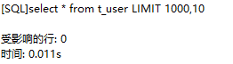
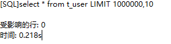
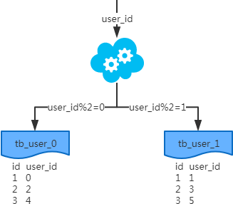
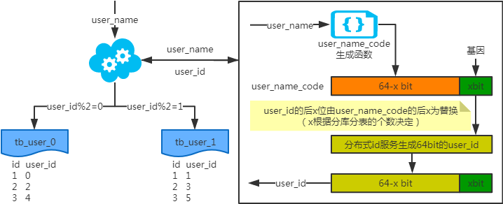

## 一、优化TIPS

**1. 优化可能带来的问题**

- 优化不总是对一个单纯的环境进行，还很可能是一个复杂的已投产的系统。
- 优化手段本来就有很大的风险，只不过你没能力意识到和预见到！
- 任何的技术可以解决一个问题，但必然存在带来一个问题的风险！
- 对于优化来说解决问题而带来的问题,控制在可接受的范围内才是有成果。
- 保持现状或出现更差的情况都是失败！

**2. 优化的需求**

- 稳定性和业务可持续性,通常比性能更重要！
- 优化不可避免涉及到变更，变更就有风险！
- 优化使性能变好，维持和变差是等概率事件！
- 切记优化，应该是各部门协同，共同参与的工作，任何单一部门都不能对数据库进行优化！
- 所以优化工作,是由业务需要驱使的！！！

**3. 优化由谁参与**

在进行数据库优化时，应由数据库管理员、业务部门代表、应用程序架构师、应用程序设计人员、应用程序开发人员、硬件及系统管理员、存储管理员等，业务相关人员共同参与。

## 二、优化思路

**1. 优化什么**

在数据库优化上有两个主要方面：即安全与性能。

- 安全 ---> 数据可持续性
- 性能 ---> 数据的高性能访问

**2. 优化的范围有哪些**

**存储、主机和操作系统方面:**

- 主机架构稳定性
- I/O 规划及配置
- Swap 交换分区
- OS 内核参数和网络问题

**应用程序方面:**

- 应用程序稳定性
- SQL 语句性能
- 串行访问资源
- 性能欠佳会话管理
- 这个应用适不适合用 MySQL

**数据库优化方面:**

- 内存
- 数据库结构(物理&逻辑)
- 实例配置

说明：不管是在设计系统，定位问题还是优化，都可以按照这个顺序执行。

**3. 优化维度**

数据库优化维度有四个：

硬件、系统配置、数据库表结构、SQL 及索引。

<div align="center">  </div><br>

**优化选择：**

- 优化成本:硬件>系统配置>数据库表结构>SQL 及索引
- 优化效果:硬件<系统配置<数据库表结构<SQL 及索引

## 三、优化工具

**1. 数据库层面**

**检查问题常用工具：**

<div align="center">  </div><br>

**不常用但好用的工具：**

<div align="center">  </div><br>

**2. 数据库层面问题解决思路**

**一般应急调优的思路：**

针对突然的业务办理卡顿，无法进行正常的业务处理！需要立马解决的场景！

- 1、show processlist
- 2、explain select id ,name from stu where name='clsn'; # ALL id name age sex
  select id,name from stu where id=2-1 函数 结果集>30;
  show index from table;
- 3、通过执行计划判断，索引问题(有没有、合不合理)或者语句本身问题
- 4、show status like '%lock%'; # 查询锁状态
  kill SESSION_ID; # 杀掉有问题的session

**常规调优思路：**

针对业务周期性的卡顿，例如在每天 10-11 点业务特别慢，但是还能够使用，过了这段时间就好了。《[MySQL 调优/优化的 101 个建议！](http://mp.weixin.qq.com/s?__biz=MzI3ODcxMzQzMw==&mid=2247485442&idx=1&sn=98f292095b0ab352bfa73c011fb56f97&chksm=eb538d34dc2404227836a57cde62ad347bad6ef7c44823f50305046c8a8f4b2f5e695dfa6570&scene=21#wechat_redirect)》了解下。

- 1、查看 slowlog，分析 slowlog，分析出查询慢的语句。
- 2、按照一定优先级，进行一个一个的排查所有慢语句。
- 3、分析 top sql，进行 explain 调试，查看语句执行时间。
- 4、调整索引或语句本身。

**3. 系统层面**

**cpu方面：**

vmstat、sar top、htop、nmon、mpstat

**内存：**

free 、ps -aux 、

**IO 设备(磁盘、网络)：**

iostat 、 ss 、 netstat 、 iptraf、iftop、lsof、

**vmstat 命令说明：**

- Procs：r 显示有多少进程正在等待 CPU 时间。b 显示处于不可中断的休眠的进程数量。在等待 I/O
- Memory：swpd 显示被交换到磁盘的数据块的数量。未被使用的数据块，用户缓冲数据块，用于操作系统的数据块的数量
- Swap：操作系统每秒从磁盘上交换到内存和从内存交换到磁盘的数据块的数量。s1 和 s0 最好是 0
- Io：每秒从设备中读入 b1 的写入到设备 b0 的数据块的数量。反映了磁盘 I/O
- System：显示了每秒发生中断的数量(in)和上下文交换(cs)的数量
- Cpu：显示用于运行用户代码，系统代码，空闲，等待 I/O 的 CPU 时间

**iostat 命令说明**

实例命令： iostat -dk 1 5

iostat -d -k -x 5 (查看设备使用率(%util)和响应时间(await))

- tps：该设备每秒的传输次数。“一次传输”意思是“一次 I/O 请求”。多个逻辑请求可能会被合并为“一次 I/O 请求”。
- iops ：硬件出厂的时候，厂家定义的一个每秒最大的 IO 次数,"一次传输"请求的大小是未知的。
- kB_read/s：每秒从设备(drive expressed)读取的数据量；
- KB_wrtn/s：每秒向设备(drive expressed)写入的数据量；
- kB_read：读取的总数据量；
- kB_wrtn：写入的总数量数据量；这些单位都为 Kilobytes。

**4. 系统层面问题解决办法**

你认为到底负载高好，还是低好呢？

在实际的生产中，一般认为 cpu 只要不超过 90% 都没什么问题 。《[MySQL数据库开发的 36 条军规！](./MySQL数据库开发的三十六条军规-石展.pdf)》了解下。

当然不排除下面这些特殊情况：

**问题一：cpu 负载高，IO 负载低**

- 内存不够
- 磁盘性能差
- SQL 问题 ------>去数据库层，进一步排查 sql 问题
- IO 出问题了(磁盘到临界了、raid 设计不好、raid 降级、锁、在单位时间内 tps 过高)
- tps 过高: 大量的小数据 IO、大量的全表扫描

**问题二：IO 负载高，cpu 负载低**

- 大量小的 IO 写操作：
- autocommit ，产生大量小 IO
- IO/PS 磁盘的一个定值，硬件出厂的时候，厂家定义的一个每秒最大的 IO 次数。
- 大量大的 IO 写操作
- SQL 问题的几率比较大

**问题三：IO 和 cpu 负载都很高**

硬件不够了或 SQL 存在问题。

## 四、基础优化

**1. 优化思路**

**定位问题点:**

硬件 --> 系统 --> 应用 --> 数据库 --> 架构(高可用、读写分离、分库分表)

**处理方向：**

明确优化目标、性能和安全的折中、防患未然

**2. 硬件优化**

**主机方面：**

- 根据数据库类型，主机 CPU 选择、内存容量选择、磁盘选择
- 平衡内存和磁盘资源
- 随机的 I/O 和顺序的 I/O
- 主机 RAID 卡的 BBU(Battery Backup Unit)关闭

**cpu 的选择：**

- cpu 的两个关键因素：核数、主频
- 根据不同的业务类型进行选择：
- cpu 密集型：计算比较多，OLTP 主频很高的 cpu、核数还要多
- IO 密集型：查询比较，OLAP 核数要多，主频不一定高的

**内存的选择：**

- OLAP 类型数据库，需要更多内存，和数据获取量级有关。
- OLTP 类型数据一般内存是 cpu 核心数量的 2 倍到 4 倍，没有最佳实践。

**存储方面：**

- 根据存储数据种类的不同，选择不同的存储设备
- 配置合理的 RAID 级别(raid 5、raid 10、热备盘)
- 对与操作系统来讲，不需要太特殊的选择，最好做好冗余(raid1)(ssd、sas 、sata)

**raid 卡：主机 raid 卡选择：**

- 实现操作系统磁盘的冗余(raid1)
- 平衡内存和磁盘资源
- 随机的 I/O 和顺序的 I/O
- 主机 RAID 卡的 BBU(Battery Backup Unit)要关闭

**网络设备方面：**

使用流量支持更高的网络设备(交换机、路由器、网线、网卡、HBA 卡)

注意：以上这些规划应该在初始设计系统时就应该考虑好。

**3. 服务器硬件优化**

- 1、物理状态灯：
- 2、自带管理设备：远程控制卡(FENCE 设备：ipmi ilo idarc)，开关机、硬件监控。
- 3、第三方的监控软件、设备(snmp、agent)对物理设施进行监控
- 4、存储设备：自带的监控平台。EMC2(hp 收购了)， 日立(hds)，IBM 低端 OEM hds，高端存储是自己技术，华为存储

**4. 系统优化**

**Cpu：**

基本不需要调整，在硬件选择方面下功夫即可。

**内存：**

基本不需要调整，在硬件选择方面下功夫即可。

**SWAP：**

MySQL 尽量避免使用 swap。阿里云的服务器中默认 swap 为 0

**IO ：**

- raid、no lvm、 ext4 或 xfs、ssd、IO 调度策略
- Swap 调整(不使用 swap 分区)

<div align="center">  </div><br>

这个参数决定了 Linux 是倾向于使用 swap，还是倾向于释放文件系统 cache。在内存紧张的情况下，数值越低越倾向于释放文件系统 cache。当然，这个参数只能减少使用 swap 的概率，并不能避免 Linux 使用 swap。

修改 MySQL 的配置参数 innodb_flush_method，开启 O_DIRECT 模式。这种情况下，InnoDB 的 buffer pool 会直接绕过文件系统 cache 来访问磁盘，但是redo log 依旧会使用文件系统 cache。值得注意的是，Redo log 是覆写模式的，即使使用了文件系统的 cache，也不会占用太多。

**IO 调度策略：**

<div align="center">  </div><br>

**5. 系统参数调整**

Linux 系统内核参数优化：

<div align="center">  </div><br>

用户限制参数(MySQL 可以不设置以下配置)：

<div align="center">  </div><br>

**6. 应用优化**

业务应用和数据库应用独立,防火墙：iptables、selinux 等其他无用服务(关闭)：

<div align="center">  </div><br>

安装图形界面的服务器不要启动图形界面 runlevel 3,另外，思考将来我们的业务是否真的需要 MySQL，还是使用其他种类的数据库。

## 五、数据库优化

#### **SQL 优化方向：**

执行计划、索引、SQL 改写

#### **架构优化方向：**

高可用架构、高性能架构、分库分表

**1. 数据库参数优化**

**调整：**

实例整体(高级优化，扩展)

<div align="center">  </div><br>

**连接层(基础优化)**

设置合理的连接客户和连接方式

<div align="center">  </div><br>

**SQL 层(基础优化)**

- query_cache_size： 查询缓存
- OLAP 类型数据库,需要重点加大此内存缓存
- 但是一般不会超过 GB
- 对于经常被修改的数据，缓存会立马失效
- 我们可以实用内存数据库(redis、memecache)，替代他的功能

**2.存储引擎层(innodb 基础优化参数)**

<div align="center">  </div><br>

## 六、SQL慢查询的原因

<div align="center">  </div><br>

### 1 写操作

**刷脏页**

脏页的定义是这样的：内存数据页和磁盘数据页不一致时，那么称这个内存数据页为脏页。

那为什么会出现脏页，刷脏页又怎么会导致 SQL 变慢呢？那就需要我们来看看写操作时的流程是什么样的。

对于一条写操作的 SQL 来说，执行的过程中涉及到写日志，内存及同步磁盘这几种情况。

<div align="center">  </div><br>

这里要提到一个日志文件，那就是 redo log，位于存储引擎层，用来存储物理日志。在写操作的时候，存储引擎（这里讨论的是 Innodb）会将记录写入到 redo log 中，并更新缓存，这样更新操作就算完成了。后续操作存储引擎会在适当的时候把操作记录同步到磁盘里。

看到这里你可能会有个疑问，redo log 不是日志文件吗，日志文件就存储在磁盘上，那写的时候岂不很慢吗？

其实，写redo log 的过程是顺序写磁盘的，磁盘顺序写减少了寻道等时间，速度比随机写要快很多（ 类似Kafka存储原理），因此写 redo log 速度是很快的。

好了，让我们回到开始时候的问题，为什么会出现脏页，并且脏页为什么会使 SQL 变慢。你想想，redo log 大小是一定的，且是循环写入的。在高并发场景下，redo log 很快被写满了，但是数据来不及同步到磁盘里，这时候就会产生脏页，并且还会阻塞后续的写入操作。SQL 执行自然会变慢。

**锁**

写操作时 SQL 慢的另一种情况是可能遇到了锁，这个很容易理解。举个例子，你和别人合租了一间屋子，只有一个卫生间，你们俩同时都想去，但对方比你早了一丢丢。那么此时你只能等对方出来后才能进去。

对应到 Mysql 中，当某一条 SQL 所要更改的行刚好被加了锁，那么此时只有等锁释放了后才能进行后续操作。

但是还有一种极端情况，你的室友一直占用着卫生间，那么此时你该怎么整，总不能尿裤子吧，多丢人。对应到Mysql 里就是遇到了死锁或是锁等待的情况。这时候该如何处理呢？

Mysql 中提供了查看当前锁情况的方式：

```sql
select * from information_schema.INNODB_TRX;
```

通过在命令行执行图中的语句，可以查看当前运行的事务情况，这里介绍几个查询结果中重要的参数：

<div align="center">  </div><br>

当前事务如果等待时间过长或出现死锁的情况，可以通过 「**kill 线程ID**」 的方式释放当前的锁。

这里的线程 ID 指表中 **trx_mysql_thread_id** 参数。

### 2. 读操作

说完了写操作，读操作大家可能相对来说更熟悉一些。SQL 慢导致读操作变慢的问题在工作中是经常会被涉及到的。

在讲读操作变慢的原因之前我们先来看看是如何定位慢 SQL 的。Mysql 中有一个叫作**慢查询日志**的东西，它是用来记录超过指定时间的 SQL 语句的。默认情况下是关闭的，通过手动配置才能开启慢查询日志进行定位。
具体的配置方式是这样的：

- 查看当前慢查询日志的开启情况：

<div align="center">  </div><br>

- 开启慢查询日志（临时）：

  ```sql
  set global slow_query_log='ON';
  ```

  <div align="center">  </div><br>

  注意这里只是临时开启了慢查询日志，如果 mysql 重启后则会失效。可以 my.cnf 中进行配置使其永久生效。

**存在原因**

**（1）未命中索引**

SQL 查询慢的原因之一是可能未命中索引，关于使用索引为什么能使查询变快以及使用时的注意事项，见下。

**（2）脏页问题**

另一种还是我们上边所提到的刷脏页情况，只不过和写操作不同的是，是在读时候进行刷脏页的。

是不是有点懵逼，别急，听我娓娓道来：

为了避免每次在读写数据时访问磁盘增加 IO 开销，Innodb 存储引擎通过把相应的数据页和索引页加载到内存的缓冲池（buffer pool）中来提高读写速度。然后按照最近最少使用原则来保留缓冲池中的缓存数据。

那么当要读入的数据页不在内存中时，就需要到缓冲池中申请一个数据页，但缓冲池中数据页是一定的，当数据页达到上限时此时就需要把最久不使用的数据页从内存中淘汰掉。但如果淘汰的是脏页呢，那么就需要把脏页刷到磁盘里才能进行复用。你看，又回到了刷脏页的情况，读操作时变慢你也能理解了吧？

**防患于未然**

首先来看未命中索引的情况：

不知道大家有没有使用 Mysql 中 explain 的习惯，反正我是每次都会用它来查看下当前 SQL 命中索引的情况。避免其带来一些未知的隐患。这里简单介绍下其使用方式，通过在所执行的 SQL 前加上 explain 就可以来分析当前 SQL 的执行计划：

<div align="center">  </div><br>

执行后的结果对应的字段概要描述如下图所示：

<div align="center">  </div><br>

这里需要重点关注以下几个字段：

**1、type**

表示 MySQL 在表中找到所需行的方式。其中常用的类型有：ALL、index、range、 ref、eq_ref、const、system、NULL 这些类型从左到右，性能逐渐变好。

- ALL：Mysql 遍历全表来找到匹配的行；
- index：与 ALL 区别为 index 类型只遍历索引树；
- range：只检索给定范围的行，使用一个索引来选择行；
- ref：表示上述表的连接匹配条件，哪些列或常量被用于查找索引列上的值；
- eq_ref：类似ref，区别在于使用的是否为唯一索引。对于每个索引键值，表中只有一条记录匹配，简单来说，就是多表连接中使用 primary key 或者 unique key作为关联条件；
- const、system：当 Mysql 对查询某部分进行优化，并转换为一个常量时，使用这些类型访问。如将主键置于 where 列表中，Mysql 就能将该查询转换为一个常量，system 是 const类型的特例，当查询的表只有一行的情况下，使用system；
- NULL：Mysql 在优化过程中分解语句，执行时甚至不用访问表或索引，例如从一个索引列里选取最小值可以通过单独索引查找完成。

**2、possible_keys**：查询时可能使用到的索引（但不一定会被使用，没有任何索引时显示为 NULL）。

**3、key**：实际使用到的索引。

**4、rows**：估算查找到对应的记录所需要的行数。

**5、Extra**

比较常见的是下面几种：

- Useing index：表明使用了覆盖索引，无需进行回表；
- Using where：不用读取表中所有信息，仅通过索引就可以获取所需数据，这发生在对表的全部的请求列都是同一个索引的部分的时候，表示mysql服务器将在存储引擎检索行后再进行过滤；
- Using temporary：表示MySQL需要使用临时表来存储结果集，常见于排序和分组查询，常见 group by，order by；
- Using filesort：当Query中包含 order by 操作，而且无法利用索引完成的排序操作称为“文件排序”。

对于刷脏页的情况，我们需要控制脏页的比例，不要让它经常接近 75%。同时还要控制 redo log 的写盘速度，并且通过设置 innodb_io_capacity 参数告诉 InnoDB 你的磁盘能力。

**总结**

**写操作**

- 当 redo log 写满时就会进行刷脏页，此时写操作也会终止，那么 SQL 执行自然就会变慢。
- 遇到所要修改的数据行或表加了锁时，需要等待锁释放后才能进行后续操作，SQL 执行也会变慢。

**读操作**

- 读操作慢很常见的原因是未命中索引从而导致全表扫描，可以通过 explain 方式对 SQL 语句进行分析。
- 另一种原因是在读操作时，要读入的数据页不在内存中，需要通过淘汰脏页才能申请新的数据页从而导致执行变慢。

## 七、案例分析：单表优化-海量数据场景优化

除非单表数据未来会一直不断上涨，否则不要一开始就考虑拆分，拆分会带来逻辑、部署、运维的各种复杂度。一般以整型值为主的表在千万级以下，字符串为主的表在五百万以下是没有太大问题的，而事实上很多时候MySQL单表的性能依然有不少优化空间，甚至能正常支撑千万级以上的数据量

### 1. 准备表数据

建一张用户表，表中的字段有用户ID、用户名、地址、记录创建时间，写一个存储过程插入一百万条数据。

```sql
CREATE TABLE `t_user` (
  `id` int NOT NULL,
  `user_name` varchar(32) CHARACTER SET utf8 COLLATE utf8_general_ci DEFAULT NULL,
  `address` varchar(255) DEFAULT NULL,
  `create_time` datetime DEFAULT NULL ON UPDATE CURRENT_TIMESTAMP,
  PRIMARY KEY (`id`)
) ENGINE=InnoDB DEFAULT CHARSET=utf8;


DELIMITER ;;
CREATE PROCEDURE user_insert()
BEGIN
DECLARE i INT DEFAULT 0;
WHILE i<1000000
DO
INSERT INTO t_user(id, user_name, address,  create_time) VALUES (i, CONCAT('mayun',i), '浙江杭州', now());
SET i=i+1;
END WHILE ;
commit;
END;;
CALL user_insert();
```

### 2. 优化

### 2.1 SQL查询优化

可通过开启慢查询日志来找出较慢的SQL；

sql语句尽可能简单：一条sql只能在一个cpu运算；大语句拆小语句，减少锁时间；一条大sql可以堵死整个库；

不用函数和触发器（mysql为什么还有二者的存在？），在应用程序实现；

#### 1. 分页

列表数据不要拿全表，要使用LIMIT来分页，每页数量也不要太大。

##### 1.1 使用自增id代替offset

**1.OFFSET 和 LIMIT 有什么问题？**

OFFSET 和 LIMIT 对于数据量少的项目来说是没问题的。但当数据库中的数据量超过服务器内存能够存储的能力，并需要对所有数据进行分页，就会出现问题。为了实现分页，每次收到分页请求时，数据库都需要进行低效的全表扫描。

> 什么是全表扫描？全表扫描 (又称顺序扫描) 就是在数据库中进行逐行扫描，顺序读取表中的每一行记录，然后检查各个列是否符合查询条件。这种扫描是已知最慢的，因为需要进行大量的磁盘 I/O，而且从磁盘到内存的传输开销也很大。

这意味着，如果你有 1 亿个用户，OFFSET 是 5 千万，那它需要获取所有这些记录 (包括那么多根本不需要的数据)，将它们放入内存，然后获取 LIMIT 指定的 20 条结果。也就是说，为了获取一页的数据：10万行中的第5万行到第5万零20行需要先获取 5 万行。这么做是多么低效？可以看看这个[例子](https://www.db-fiddle.com/f/3JSpBxVgcqL3W2AzfRNCyq/1?ref=hackernoon.com)：左边的 Schema SQL 将插入 10 万行数据，右边有一个性能很差的查询和一个较好的解决方案。只需单击顶部的 Run，就可以比较它们的执行时间。第一个查询的运行时间至少是第二个查询的 30 倍。

数据越多，情况就越糟。看看我对 10 万行数据进行的 [PoC](https://github.com/IvoPereira/Efficient-Pagination-SQL-PoC?ref=hackernoon.com)。因此：OFFSET 越高，查询时间就越长。

**2.替代方案**

```sql
select * from table_name where id > ? limit ?;
```

这是一种基于指针的分页。在本地保存上一次接收到的主键 (通常是一个 ID) 和 LIMIT，而不是 OFFSET 和 LIMIT，那么每一次的查询可能都与此类似。为什么？因为通过显式告知数据库最新行，数据库就确切地知道从哪里开始搜索（基于有效的索引），而不需要考虑目标范围之外的记录。

要使用这种基于游标的分页，需要有一个惟一的序列字段 (或多个)，比如惟一的整数 ID 或时间戳，但在某些特定情况下可能无法满足这个条件。建议是，不管怎样都要考虑每种解决方案的优缺点，以及需要执行哪种查询。

如果需要基于大量数据做查询操作，Rick James 的[文章](http://mysql.rjweb.org/doc.php/lists)提供了更深入的指导。

如果我们的表没有主键，比如是具有多对多关系的表，那么就使用传统的 OFFSET/LIMIT 方式，只是这样做存在潜在的慢查询问题。我建议在需要分页的表中使用自动递增的主键，即使只是为了分页。

##### 1.2 案例

- limit 1000时

<div align="center">  </div><br>

- limit 1000000时

<div align="center">  </div><br>

可以看到limit值越大，耗时越长.

- 子查询优化

<div align="center">  </div><br>

可以看到比起之前 limit 1000000时的0.218s 效率提高了很多

- 使用JOIN分页

<div align="center">  </div><br>

可以看到比起之前 limit 1000000时的0.218s 效率也同样提高了很多

- 使用前一次查询的最大ID

<div align="center">  </div><br>

可以看到这种方法效率最高，但依赖于需要知道最大ID，这种适合点击下一页查询（类似于滚动加载数据）的场景

- 通过伪列对ID进行分页

<div align="center">  </div><br>

然后可以开启多个线程去进行最高效率查询语句的批量查询操作 0~10000，10001-20000.... 这样子的话可以快速把全量数据查询出来同步至缓存中。

**分页优化总结：** 使用前一次查询的最大ID进行查询优化是效率最高的方法，但这种方法只适用于下一页点击的这种操作，对于同步全量数据来说建议的方式使用伪列对ID进行分页，然后开启多个线程同时查询，把全量数据加载到缓存，以后面试官问你如何 **快速获取海量数据并加载到缓存** 你该知道怎么回答了吧。

#### 2. SQL语句中IN包含的值不应过多

MySQL对于IN做了相应的优化，即将IN中的常量全部存储在一个数组里面，而且这个数组是排好序的。但是如果数值较多，产生的消耗也是比较大的。再例如：`select id from table_name where num in(1,2,3)` 对于连续的数值，能用 between 就不要用 `in` 了；再或者使用连接来替换。

#### 3. SELECT语句务必指明字段名称

SELECT *增加很多不必要的消耗（cpu、io、内存、网络带宽）

增加了使用覆盖索引的可能性；

当表结构发生改变时，前端也需要更新。

#### 4. 当只需要一条数据的时候，使用limit 1

这是为了使EXPLAIN中type列达到const类型

#### 5. 如果排序字段没有用到索引，就尽量少排序

#### 6. 如果限制条件中其他字段没有索引，尽量少用or

or两边的字段中，如果有一个不是索引字段，而其他条件也不是索引字段，会造成该查询不走索引的情况。很多时候使用 union all 或者是union(必要的时候)的方式来代替“or”会得到更好的效果。

<div align="center">  </div><br>

可以看到这条语句没有使用到索引，是因为当or左右查询字段只有一个是索引，该索引失效，只有当or左右查询字段均为索引时，才会生效。

OR改写成IN：OR的效率是n级别，IN的效率是log(n)级别，IN的个数建议控制在200以内；

#### 7. 尽量用union all代替union

`union`和`union all`的差异主要是前者需要将结果集合并后再进行唯一性过滤操作，这就会涉及到排序，增加大量的CPU运算，加大资源消耗及延迟。当然，`union all`的前提条件是两个结果集没有重复数据。

#### 8. 区分in和exists， not in和not exists

```sql
select * from 表A where id in (select id from 表B)
```

上面sql语句相当于

```sql
select * from 表A where exists
(select * from 表B where 表B.id=表A.id)
```

区分in和exists主要是造成了驱动顺序的改变（这是性能变化的关键），如果是exists，那么以外层表为驱动表，先被访问，如果是IN，那么先执行子查询。所以IN适合于外表大而内表小的情况；EXISTS适合于外表小而内表大的情况。

> 关于not in和not exists，推荐使用not exists，不仅仅是效率问题，not in可能存在逻辑问题。如何高效的写出一个替代not exists的sql语句？

原sql语句

```sql
select colname … from A表 
where a.id not in (select b.id from B表)
```

高效的sql语句

```sql
select colname … from A表 Left join B表 on 
where a.id = b.id where b.id is null
```

取出的结果集如下图表示，A表不在B表中的数据

<div align="center">  </div><br>

#### 9. 不使用ORDER BY RAND()

```sql
select id from `table_name` 
order by rand() limit 1000;
```

上面的sql语句，可优化为

```sql
select id from `table_name` t1 join 
(select rand() * (select max(id) from `table_name`) as nid) t2 
on t1.id > t2.nid limit 1000;
```

#### 10. 分段查询

在一些用户选择页面中，可能一些用户选择的时间范围过大，造成查询缓慢。主要的原因是扫描行数过多。这个时候可以通过程序，分段进行查询，循环遍历，将结果合并处理进行展示。

如下图这个sql语句，扫描的行数成百万级以上的时候就可以使用分段查询

<div align="center">  </div><br>

#### 11. 避免在 where 子句中对字段进行 null 值判断

对于null的判断会导致引擎放弃使用索引而进行全表扫描。

#### 12. 不建议使用%前缀模糊查询

例如`LIKE “%name”`或者`LIKE “%name%”`，这种查询会导致索引失效而进行全表扫描。

<div align="center">  </div><br>

但是可以使用`LIKE “name%”`。那如何查询`%name%`？

如下图所示，虽然给secret字段添加了索引，但在explain结果果并没有使用

<div align="center">  </div><br>

那么如何解决这个问题呢，答案：使用全文索引

在我们查询中经常会用到`select id,fnum,fdst from table_name where user_name like '%zhangsan%';`。这样的语句，普通索引是无法满足查询需求的。庆幸的是在MySQL中，有全文索引来帮助我们。

创建全文索引的sql语法是：

```sql
ALTER TABLE `table_name` ADD FULLTEXT INDEX `idx_user_name` (`user_name`);
```

使用全文索引的sql语句是：

```sql
select id,fnum,fdst from table_name 
where match(user_name) against('zhangsan' in boolean mode);
```

> 注意：在需要创建全文索引之前，请联系DBA确定能否创建。同时需要注意的是查询语句的写法与普通索引的区别

#### 13. 避免在where子句中对字段进行表达式操作

比如

```
select user_id,user_project from table_name where age*2=36;
```

中对字段就行了算术运算，这会造成引擎放弃使用索引，建议改成

```
select user_id,user_project from table_name where age=36/2;
```

任何对列的操作都将导致表扫描，它包括数据库教程函数、计算表达式等等，查询时要尽可能将操作移至等号右边；

#### 14. 避免隐式类型转换

where 子句中出现 column 字段的类型和传入的参数类型不一致的时候发生的类型转换，建议先确定where中的参数类型。

使用同类型进行比较，比如用'123'和'123'比，123和123比；

<div align="center">  </div><br>

#### 15. 对于联合索引来说，要遵守最左前缀法则

举列来说索引含有字段`id`,`name`,`school`，可以直接用id字段，也可以`id`,`name`这样的顺序，但是`name`，`school`都无法使用这个索引。所以在创建联合索引的时候一定要注意索引字段顺序，常用的查询字段放在最前面。

<div align="center">  </div><br>

ref:这个连接类型只有在查询使用了不是惟一或主键的键或者是这些类型的部分（比如，利用最左边前缀）时发生。没有值说明没有利用最左前缀原则

再来看个使用了最左前缀的例子

<div align="center">  </div><br>

#### 16. 必要时可以使用force index来强制查询走某个索引

有的时候MySQL优化器采取它认为合适的索引来检索sql语句，但是可能它所采用的索引并不是我们想要的。这时就可以采用force index来强制优化器使用我们制定的索引。

#### 17. 注意范围查询语句

对于联合索引来说，如果存在范围查询，比如`between not <> !=`等条件时，会造成后面的索引字段失效。

#### 18. 分解关联查询 例如这条语句

<div align="center">  </div><br>

​	可以分解成

<div align="center">  </div><br>

#### 19. 关于JOIN优化（少用JOIN）

<div align="center">  </div><br>

- LEFT JOIN A表为驱动表
- INNER JOIN MySQL会自动找出那个数据少的表作用驱动表
- RIGHT JOIN B表为驱动表

> 注意：MySQL中没有full join，可以用以下方式来解决

```sql
select * from A left join B on B.name = A.name where B.name is null
 union all
select * from B;
```

**尽量使用inner join，避免left join**

参与联合查询的表至少为2张表，一般都存在大小之分。如果连接方式是inner join，在没有其他过滤条件的情况下MySQL会自动选择小表作为驱动表，但是left join在驱动表的选择上遵循的是左边驱动右边的原则，即left join左边的表名为驱动表。

**合理利用索引**

**被驱动表的索引字段作为on的限制字段。**

**利用小表去驱动大表**: 即小的数据集驱动大的数据集。如：以t_user，t_order两表为例，两表通过 t_user的id字段进行关联。

```sql
当 t_order表的数据集小于t_user表时,用 in 优化 exist,使用 in,两表执行顺序是先查 t_order 表,再查t_user表
select * from t_user where id in (select user_id from t_order)
 
当 t_user 表的数据集小于 t_order 表时，用 exist 优化 in,使用 exists,两表执行顺序是先查 t_user  表,再查 t_order  表
select * from t_user where exists (select 1 from B where t_order.user_id= t_user.id)
```

<div align="center">  </div><br>

从原理图能够直观的看出如果能够减少驱动表的话，减少嵌套循环中的循环次数，以减少 IO总量及CPU运算的次数。

**巧用STRAIGHT_JOIN**

`inner join`是由mysql选择驱动表，但是有些特殊情况需要选择另个表作为驱动表，比如有`group by`、`order by`等`「Using filesort」`、`「Using temporary」`时。`STRAIGHT_JOIN`来强制连接顺序，在`STRAIGHT_JOIN`左边的表名就是驱动表，右边则是被驱动表。在使用`STRAIGHT_JOIN`有个前提条件是该查询是内连接，也就是`inner join`。其他链接不推荐使用`STRAIGHT_JOIN`，否则可能造成查询结果不准确。

<div align="center">  </div><br>

这个方式有时可能减少3倍的时间。

#### 20. 关于字段

- 尽量使用TINYINT、SMALLINT、MEDIUM_INT作为整数类型而非INT，如果非负则加上UNSIGNED；
- VARCHAR的长度只分配真正需要的空间；
- 使用枚举或整数代替字符串类型；
- 尽量使用TIMESTAMP而非DATETIME；
- 单表不要有太多字段，建议在20以内；
- 避免使用NULL字段，很难查询优化且占用额外索引空间；
- 用整型来存IP。

#### 21. 关于索引

- 索引并不是越多越好，要根据查询有针对性的创建，考虑在WHERE和ORDER BY命令上涉及的列建立索引，可根据EXPLAIN来查看是否用了索引还是全表扫描；
- 应尽量避免在WHERE子句中对字段进行NULL值判断，否则将导致引擎放弃使用索引而进行全表扫描；
- 值分布很稀少的字段不适合建索引，例如“性别”这种只有两三个值的字段；
- 字符字段只建前缀索引；
- 字符字段最好不要做主键；
- 不用外键，由程序保证约束；
- 尽量不用UNIQUE，由程序保证约束；
- 使用多列索引时主意顺序和查询条件保持一致，同时删除不必要的单列索引。
- 尽量选择区分度高的列作为索引,区分度的公式是count(distinct col)/count(*)，表示字段不重复的比例，比例越大我们扫描的记录数越少，唯一键的区分度是1，而一些状态、性别字段可能在大数据面前区分度就是0，那可能有人会问，这个比例有什么经验值吗？使用场景不同，这个值也很难确定，一般需要join的字段我们都要求是0.1以上，即平均1条扫描10条记录

##### 索引设置原则

程序员的角度和存储引擎的角度是不一样的，索引写的好，SQL跑得快。

- **索引区分度低**

假如表中有1000w记录，其中有status字段表示状态，可能90%的数据status=1，可以不将status作为索引，因为其对数据记录区分度很低。

- **切忌过多创建索引**

每个索引都需要占用磁盘空间，修改表数据时会对索引进行更新，索引越多，更新越复杂。

> 因为每添加一个索引，.ibd文件中就需要多维护一个B+Tree索引树，如果某一个table中存在10个索引，那么就需要维护10棵B+Tree，写入效率会降低，并且会浪费磁盘空间。

- **常用查询字段建索引**

如果某个字段经常用来做查询条件，那么该字段的查询速度会影响整个表的查询速度，属于热门字段，为其建立索引非常必要。

- **常排序/分组/去重字段建索引**

对于需要经常使用ORDER BY、GROUP BY、DISTINCT和UNION等操作的字段建立索引，可以有效借助B+树的特性来加速执行。

- **主键和外键建索引**

主键可以用来创建聚集索引，外键也是唯一的且常用于表关联的字段，也需要建索引来提高性能。

##### SQL的优化

如果数据库表的索引设置比较合理，SQL语句书写不当会造成索引失效，甚至造成全表扫描，迅速拉低性能。

###### 索引失效

我们在写SQL的时候在某些情况下会出现索引失效的情况：

- **对索引使用函数**

> select id from std upper(name) = 'JIM';

- **对索引进行运算**

> select id from std where id+1=10;

- **对索引使用<> 、not in 、not exist、!=**

> select id from std where name != 'jim';

- **对索引进行前导模糊查询**

> select id from std name like '%jim';

- **隐式转换会导致不走索引**

> 比如：字符串类型索引字段不加引号，select id from std name = 100;保持变量类型与字段类型一致

- **非索引字段的or连接**

> 并不是所有的or都会使索引失效，如果or连接的所有字段都设置了索引，是会走索引的，一旦有一个字段没有索引，就会走全表扫描。

- **联合索引仅包含复合索引非前置列**

> 联合索引包含key1，key2，key3三列，但SQL语句没有key1，根据联合索引的最左匹配原则，不会走联合索引。
> select name from table where key2=1 and key3=2;

###### 好的建议

- **使用连接代替子查询**

> 对于数据库来说，在绝大部分情况下，连接会比子查询更快，使用连接的方式，MySQL优化器一般可以生成更佳的执行计划，更高效地处理查询
> 而子查询往往需要运行重复的查询，子查询生成的临时表上也没有索引， 因此效率会更低。

- **LIMIT偏移量过大的优化**

> 禁止分页查询偏移量过大，如limit 100000,10

- **使用覆盖索引**
  减少select * 借助覆盖索引，减少回表查询次数。
- **多表关联查询时，小表在前，大表在后**

> 在MySQL中，执行from后的表关联查询是从左往右执行的，第一张表会涉及到全表扫描，所以将小表放在前面，先扫小表，扫描快效率较高，在扫描后面的大表，或许只扫描大表的前100行就符合返回条件并return了。

- **调整Where字句中的连接顺序**

> MySQL采用从左往右的顺序解析where子句，可以将过滤数据多的条件放在前面，最快速度缩小结果集。

- **使用小范围事务，而非大范围事务**
- **遵循最左匹配原则**
- **使用联合索引，而非建立多个单独索引**

#### 22. =和in可以乱序，比如a = 1 and b = 2 and c = 3 建立(a,b,c)索引可以任意顺序，mysql的查询优化器会帮你优化成索引可以识别的形式

### 2.2 普通索引优化

先来看没索引优化的情况下的查询效率

<div align="center">  </div><br>

可以看到这时没用索引的情况，用了0.305S接下来看看加了索引后的结果

- 普通索引优化

<div align="center">  </div><br>

只需要0.024S，我们可以EXPLAIN看下，可以看到使用了普通索引后查询效率明显增加。

<div align="center">  </div><br>

### 2.3 复合索引优化

复合索引什么时候用

1. 单表中查询、条件语句中具有较多个字段
2. 使用索引会影响写的效率，需要研究建立最优秀的索引

建一个复合索引

<div align="center">  </div><br>

MySQL建立复合索引时实际建立了(user_name)、（user_name,address）、(user_name,address,create_time)三个索引,我们都知道每多一个索引，都会增加写操作的开销和磁盘空间的开销，对于海量数据的表，这可是不小的开销，所以你会发现我们在这里使用复合索引一个顶三个，又能减少写操作的开销和磁盘空间的开销。

当我们select user_name,address,create_time from t_user where user_name=xx and address = xxx时，MySQL可以直接通过遍历索引取得数据，无需回表，这减少了很多的随机IO操作。所以，在真正的实际应用中，这就是覆盖索引，是复合索引中主要的提升性能的优化手段之一。

### MySQL中，什么情况下“全表扫描”要比“索引”效率高？

全表扫描可以顺序读取磁盘，一次读一大块。

索引很可能只能随机读取磁盘，一次读一条。

优化器基于代价模型，选它认为更快的方式执行。

由于索引扫描后要利用索引中的指针去逐一访问记录，假设每个记录都使用索引访问，则读取磁盘的次数是查询包含的记录数T，而如果表扫描则读取磁盘的次数是存储记录的块数B，如果T>B 的话索引就没有优势了。对于大多数数据库来说，这个比例是10%（oracle，postgresql等），即先对结果数量估算，如果小于这个比例用索引，大于的话即直接表扫描。

### 2.4 事务优化

首先了解下事务的隔离级别，数据库共定义了四种隔离级别：

1. Serializable：可避免脏读、不可重复读、虚读情况的发生。（串行化）
2. Repeatable read：可避免脏读、不可重复读情况的发生。（可重复读）
3. Read committed：可避免脏读情况发生（读已提交）。
4. Read uncommitted：最低级别，以上情况均无法保证。(读未提交)

可以通过 set transaction isolation level 设置事务隔离级别来提高性能

### 2.5  数据库性能优化

**开启查询缓存**

在解析一个查询语句前，如果查询缓存是打开的，那么MySQL会检查这个查询语句是否命中查询缓存中的数据。如果当前查询恰好命中查询缓存，在检查一次用户权限后直接返回缓存中的结果。这种情况下，查询不会被解析，也不会生成执行计划，更不会执行。MySQL将缓存存放在一个引用表（不要理解成table，可以认为是类似于HashMap的数据结构），通过一个哈希值索引，这个哈希值通过查询本身、当前要查询的数据库、客户端协议版本号等一些可能影响结果的信息计算得来。所以两个查询在任何字符上的不同（例如：空格、注释），都会导致缓存不会命中。

如果查询中包含任何用户自定义函数、存储函数、用户变量、临时表、mysql库中的系统表，其查询结果都不会被缓存。比如函数NOW()或者CURRENT_DATE()会因为不同的查询时间，返回不同的查询结果，再比如包含CURRENT_USER或者CONNECION_ID()的查询语句会因为不同的用户而返回不同的结果，将这样的查询结果缓存起来没有任何的意义。

既然是缓存，就会失效，那查询缓存何时失效呢？MySQL的查询缓存系统会跟踪查询中涉及的每个表，如果这些表（数据或结构）发生变化，那么和这张表相关的所有缓存数据都将失效。

正因为如此，在任何的写操作时，MySQL必须将对应表的所有缓存都设置为失效。如果查询缓存非常大或者碎片很多，这个操作就可能带来很大的系统消耗，甚至导致系统僵死一会儿。而且查询缓存对系统的额外消耗也不仅仅在写操作，读操作也不例外：

- 任何的查询语句在开始之前都必须经过检查，即使这条SQL语句永远不会命中缓存 　
- 如果查询结果可以被缓存，那么执行完成后，会将结果存入缓存，也会带来额外的系统消耗 

基于此，我们要知道并不是什么情况下查询缓存都会提高系统性能，缓存和失效都会带来额外消耗，只有当缓存带来的资源节约大于其本身消耗的资源时，才会给系统带来性能提升。但要如何评估打开缓存是否能够带来性能提升是一件非常困难的事情，也不在本文讨论的范畴内。如果系统确实存在一些性能问题，可以尝试打开查询缓存，并在数据库设计上做一些优化，比如：

- 用多个小表代替一个大表，注意不要过度设计
- 批量插入代替循环单条插入
-  合理控制缓存空间大小，一般来说其大小设置为几十兆比较合适。
- 可以通过SQL\_CACHE和SQL\_NO\_CACHE来控制某个查询语句是否需要进行缓存  

最后的忠告是不要轻易打开查询缓存，特别是写密集型应用。如果你实在是忍不住，可以将query\_cache\_type设置为DEMAND，这时只有加入SQL\_CACHE的查询才会走缓存，其他查询则不会，这样可以非常自由地控制哪些查询需要被缓存。  当然查询缓存系统本身是非常复杂的，这里讨论的也只是很小的一部分，其他更深入的话题，比如：缓存是如何使用内存的？如何控制内存的碎片化？事务对查询缓存有何影响等等，读者可以自行阅读相关资料，这里权当抛砖引玉吧。  **语法解析和预处理**

MySQL通过关键字将SQL语句进行解析，并生成一颗对应的解析树。这个过程解析器主要通过语法规则来验证和解析。比如SQL中是否使用了错误的关键字或者关键字的顺序是否正确等等。预处理则会根据MySQL规则进一步检查解析树是否合法。比如检查要查询的数据表和数据列是否存在等等。

### 2.6 系统内核参数优化

可以使用下面几个工具来做基准测试：

- **[sysbench](https://github.com/akopytov/sysbench)：**一个模块化，跨平台以及多线程的性能测试工具。
- **[iibench-mysql](https://github.com/tmcallaghan/iibench-mysql)：**基于Java的MySQL / Percona / MariaDB 索引进行插入性能测试工具。
- **[tpcc-mysql](https://github.com/Percona-Lab/tpcc-mysql)：**Percona开发的TPC-C测试工具。

具体的调优参数内容较多，具体可参考官方文档，这里介绍一些比较重要的参数：

- **back_log：**back_log值可以指出在MySQL暂时停止回答新请求之前的短时间内多少个请求可以被存在堆栈中。也就是说，如果MySQL的连接数据达到max_connections时，新来的请求将会被存在堆栈中，以等待某一连接释放资源，该堆栈的数量即back_log，如果等待连接的数量超过back_log，将不被授予连接资源。可以从默认的50升至500。
- **wait_timeout：**数据库连接闲置时间，闲置连接会占用内存资源。可以从默认的8小时减到半小时。
- **max_user_connection：**最大连接数，默认为0无上限，最好设一个合理上限。
- **thread_concurrency：**并发线程数，设为CPU核数的两倍。
- **skip_name_resolve：**禁止对外部连接进行DNS解析，消除DNS解析时间，但需要所有远程主机用IP访问。
- **key_buffer_size：**索引块的缓存大小，增加会提升索引处理速度，对MyISAM表性能影响最大。对于内存4G左右，可设为256M或384M，通过查询show status like 'key_read%'，保证key_reads / key_read_requests在0.1%以下最好。
- **innodb_buffer_pool_size：**缓存数据块和索引块，对InnoDB表性能影响最大。通过查询show status like 'Innodb_buffer_pool_read%'，保证 (Innodb_buffer_pool_read_requests – Innodb_buffer_pool_reads) / Innodb_buffer_pool_read_requests越高越好。
- **innodb_additional_mem_pool_size：**InnoDB存储引擎用来存放数据字典信息以及一些内部数据结构的内存空间大小，当数据库对象非常多的时候，适当调整该参数的大小以确保所有数据都能存放在内存中提高访问效率，当过小的时候，MySQL会记录Warning信息到数据库的错误日志中，这时就需要该调整这个参数大小。
- **innodb_log_buffer_size：**InnoDB存储引擎的事务日志所使用的缓冲区，一般来说不建议超过32MB。 
- **query_cache_size：**缓存MySQL中的ResultSet，也就是一条SQL语句执行的结果集，所以仅仅只能针对select语句。当某个表的数据有任何任何变化，都会导致所有引用了该表的select语句在Query Cache中的缓存数据失效。所以，当我们数据变化非常频繁的情况下，使用Query Cache可能得不偿失。根据命中率(Qcache_hits/(Qcache_hits+Qcache_inserts)*100))进行调整，一般不建议太大，256MB可能已经差不多了，大型的配置型静态数据可适当调大。可以通过命令show status like 'Qcache_%'查看目前系统Query catch使用大小。
- **read_buffer_size：**MySQL读入缓冲区大小。对表进行顺序扫描的请求将分配一个读入缓冲区，MySQL会为它分配一段内存缓冲区。如果对表的顺序扫描请求非常频繁，可以通过增加该变量值以及内存缓冲区大小提高其性能。
- **sort_buffer_size：**MySQL执行排序使用的缓冲大小。如果想要增加ORDER BY的速度，首先看是否可以让MySQL使用索引而不是额外的排序阶段。如果不能，可以尝试增加sort_buffer_size变量的大小。
- **read_rnd_buffer_size：**MySQL的随机读缓冲区大小。当按任意顺序读取行时(例如按照排序顺序)，将分配一个随机读缓存区。进行排序查询时，MySQL会首先扫描一遍该缓冲，以避免磁盘搜索，提高查询速度，如果需要排序大量数据，可适当调高该值。但MySQL会为每个客户连接发放该缓冲空间，所以应尽量适当设置该值，以避免内存开销过大。
- **record_buffer：**每个进行一个顺序扫描的线程为其扫描的每张表分配这个大小的一个缓冲区。如果你做很多顺序扫描，可能想要增加该值。
- **thread_cache_size：**保存当前没有与连接关联但是准备为后面新的连接服务的线程，可以快速响应连接的线程请求而无需创建新的。
- **table_cache：**类似于thread_cache _size，但用来缓存表文件，对InnoDB效果不大，主要用于MyISAM。

~~~ini
```bash
#基础配置
datadir=/data/datafile
socket=/var/lib/mysql/mysql.sock
log-error=/data/log/mysqld.log
pid-file=/var/run/mysqld/mysqld.pid
character_set_server=utf8
#允许任意IP访问
bind-address = 0.0.0.0
#是否支持符号链接，即数据库或表可以存储在my.cnf中指定datadir之外的分区或目录，为0不开启
#symbolic-links=0
#支持大小写
lower_case_table_names=1
#二进制配置
server-id = 1
log-bin = /data/log/mysql-bin.log
log-bin-index =/data/log/binlog.index
log_bin_trust_function_creators=1
expire_logs_days=7
#sql_mode定义了mysql应该支持的sql语法，数据校验等
#mysql5.0以上版本支持三种sql_mode模式：ANSI、TRADITIONAL和STRICT_TRANS_TABLES。
#ANSI模式：宽松模式，对插入数据进行校验，如果不符合定义类型或长度，对数据类型调整或截断保存，报warning警告。
#TRADITIONAL模式：严格模式，当向mysql数据库插入数据时，进行数据的严格校验，保证错误数据不能插入，报error错误。用于事物时，会进行事物的回滚。
#STRICT_TRANS_TABLES模式：严格模式，进行数据的严格校验，错误数据不能插入，报error错误。
sql_mode=STRICT_TRANS_TABLES,NO_ZERO_IN_DATE,NO_ZERO_DATE,ERROR_FOR_DIVISION_BY_ZERO,NO_AUTO_CREATE_USER,NO_ENGINE_SUBSTITUTION
#InnoDB存储数据字典、内部数据结构的缓冲池，16MB已经足够大了。
innodb_additional_mem_pool_size = 16M
#InnoDB用于缓存数据、索引、锁、插入缓冲、数据字典等
#如果是专用的DB服务器，且以InnoDB引擎为主的场景，通常可设置物理内存的60%
#如果是非专用DB服务器，可以先尝试设置成内存的1/4
innodb_buffer_pool_size = 4G
#InnoDB的log buffer，通常设置为 64MB 就足够了
innodb_log_buffer_size = 64M
#InnoDB redo log大小，通常设置256MB 就足够了
innodb_log_file_size = 256M
#InnoDB redo log文件组，通常设置为 2 就足够了
innodb_log_files_in_group = 2
#共享表空间:某一个数据库的所有的表数据，索引文件全部放在一个文件中，默认这个共享表空间的文件路径在data目录下。默认的文件名为:ibdata1 初始化为10M。
#独占表空间:每一个表都将会生成以独立的文件方式来进行存储，每一个表都有一个.frm表描述文件，还有一个.ibd文件。其中这个文件包括了单独一个表的数据内容以及索引内容，默认情况下它的存储位置也是在表的位置之中。
#设置参数为1启用InnoDB的独立表空间模式，便于管理
innodb_file_per_table = 1
#InnoDB共享表空间初始化大小，默认是 10MB，改成 1GB，并且自动扩展
innodb_data_file_path = ibdata1:1G:autoextend
#设置临时表空间最大4G
innodb_temp_data_file_path=ibtmp1:500M:autoextend:max:4096M
#启用InnoDB的status file，便于管理员查看以及监控
innodb_status_file = 1
#当设置为0，该模式速度最快，但不太安全，mysqld进程的崩溃会导致上一秒钟所有事务数据的丢失。
#当设置为1，该模式是最安全的，但也是最慢的一种方式。在mysqld 服务崩溃或者服务器主机crash的情况下，binary log 只有可能丢失最多一个语句或者一个事务。
#当设置为2，该模式速度较快，也比0安全，只有在操作系统崩溃或者系统断电的情况下，上一秒钟所有事务数据才可能丢失。
innodb_flush_log_at_trx_commit = 1
#设置事务隔离级别为 READ-COMMITED，提高事务效率，通常都满足事务一致性要求
#transaction_isolation = READ-COMMITTED
#max_connections：针对所有的账号所有的客户端并行连接到MYSQL服务的最大并行连接数。简单说是指MYSQL服务能够同时接受的最大并行连接数。
#max_user_connections : 针对某一个账号的所有客户端并行连接到MYSQL服务的最大并行连接数。简单说是指同一个账号能够同时连接到mysql服务的最大连接数。设置为0表示不限制。
#max_connect_errors：针对某一个IP主机连接中断与mysql服务连接的次数，如果超过这个值，这个IP主机将会阻止从这个IP主机发送出去的连接请求。遇到这种情况，需执行flush hosts。
#执行flush host或者 mysqladmin flush-hosts，其目的是为了清空host cache里的信息。可适当加大，防止频繁连接错误后，前端host被mysql拒绝掉
#在 show global 里有个系统状态Max_used_connections,它是指从这次mysql服务启动到现在，同一时刻并行连接数的最大值。它不是指当前的连接情况，而是一个比较值。如果在过去某一个时刻，MYSQL服务同时有10
00个请求连接过来，而之后再也没有出现这么大的并发请求时，则Max_used_connections=1000.请注意与show variables 里的max_user_connections的区别。#Max_used_connections / max_connections * 100% ≈ 85%
max_connections=600
max_connect_errors=1000
max_user_connections=400
#设置临时表最大值，这是每次连接都会分配，不宜设置过大 max_heap_table_size 和 tmp_table_size 要设置一样大
max_heap_table_size = 100M
tmp_table_size = 100M
#每个连接都会分配的一些排序、连接等缓冲，一般设置为 2MB 就足够了
sort_buffer_size = 2M
join_buffer_size = 2M
read_buffer_size = 2M
read_rnd_buffer_size = 2M
#建议关闭query cache，有些时候对性能反而是一种损害
query_cache_size = 0
#如果是以InnoDB引擎为主的DB，专用于MyISAM引擎的 key_buffer_size 可以设置较小，8MB 已足够
#如果是以MyISAM引擎为主，可设置较大，但不能超过4G
key_buffer_size = 8M
#设置连接超时阀值，如果前端程序采用短连接，建议缩短这2个值，如果前端程序采用长连接，可直接注释掉这两个选项，是用默认配置(8小时)
#interactive_timeout = 120
#wait_timeout = 120
#InnoDB使用后台线程处理数据页上读写I/0请求的数量,允许值的范围是1-64
#假设CPU是2颗4核的，且数据库读操作比写操作多，可设置
#innodb_read_io_threads=5
#innodb_write_io_threads=3
#通过show engine innodb status的FILE I/O选项可查看到线程分配
#设置慢查询阀值，单位为秒
long_query_time = 120
slow_query_log=1 #开启mysql慢sql的日志
log_output=table,File #日志输出会写表，也会写日志文件，为了便于程序去统计，所以最好写表
slow_query_log_file=/data/log/slow.log
##针对log_queries_not_using_indexes开启后，记录慢sql的频次、每分钟记录的条数
#log_throttle_queries_not_using_indexes = 5
##作为从库时生效,从库复制中如何有慢sql也将被记录
#log_slow_slave_statements = 1
##检查未使用到索引的sql
#log_queries_not_using_indexes = 1
#快速预热缓冲池
innodb_buffer_pool_dump_at_shutdown=1
innodb_buffer_pool_load_at_startup=1
#打印deadlock日志
innodb_print_all_deadlocks=1
~~~

这些参数可按照自己的实际服务器以及数据库的大小进行适当调整，主要起参考作用

### 2.7 表字段优化

很多系统一开始并没有考虑表字段拆分的问题，因为拆分会带来逻辑、部署、运维的各种复杂度，一般以整型值为主的表在千万级以下，字符串为主的表在五百万以下，而事实上很多时候MySQL单表的性能依然有不少优化空间，甚至能正常支撑千万级以上的数据量：

下面直接看下如何去优化字段

1. 尽量使用TINYINT、SMALLINT、MEDIUM_INT作为整数类型而非INT，如果非负则加上UNSIGNED
2. 单表不要有太多字段，建议在15以内
3. 尽量使用TIMESTAMP而非DATETIME
4. 使用枚举或整数代替字符串类型
5. VARCHAR的长度只分配真正需要的空间
6. 避免使用NULL字段，很难查询优化且占用额外索引空间
7. 用整型来存IP

### 2.8 分布式场景下常用优化手段

1. 升级硬件

Scale up，这个不多说了，根据MySQL是CPU密集型还是I/O密集型，通过提升CPU和内存、使用SSD，都能显著提升MySQL性能

2. 读写分离

也是目前常用的优化，从库读主库写，一般不要采用双主或多主引入很多复杂性，尽量采用文中的其他方案来提高性能。同时目前很多拆分的解决方案同时也兼顾考虑了读写分离

3. 使用缓存

缓存可以发生在这些层次：

MySQL内部：在系统内核参数优化介绍了相关设置

数据访问层：比如MyBatis针对SQL语句做缓存，而Hibernate可以精确到单个记录，这里缓存的对象主要是持久化对象Persistence Object

应用服务层：这里可以通过编程手段对缓存做到更精准的控制和更多的实现策略，这里缓存的对象是数据传输对象Data Transfer Object

Web层：针对web页面做缓存

浏览器客户端：用户端的缓存

可以根据实际情况在一个层次或多个层次结合加入缓存。这里重点介绍下服务层的缓存实现，目前主要有两种方式：

直写式（Write Through）：在数据写入数据库后，同时更新缓存，维持数据库与缓存的一致性。这也是当前大多数应用缓存框架如Spring Cache的工作方式。这种实现非常简单，同步好，但效率一般。

回写式（Write Back）：当有数据要写入数据库时，只会更新缓存，然后异步批量的将缓存数据同步到数据库上。这种实现比较复杂，需要较多的应用逻辑，同时可能会产生数据库与缓存的不同步，但效率非常高。

4. 水平拆分。

## 八、表分区

**概念：**

分区是将一个表的数据按照某种方式，比如按照时间上的月份，分成多个较小的，更容易管理的部分，但是逻辑上仍是一个表。

分区有利于管理非常大的表，它采用分而治之的逻辑，分区引入了分区键的概念，分区键用于根据某个区间值(或者范围值)、特定值列表或者hash函数值执行数据的聚集，让数据根据规则分布在不同的分区中，让一个大对象变成一些小对象。

MySQL分区既可以对数据进行分区也可以对索引进行分区。


MySQL在5.1版引入的分区是一种简单的水平拆分，用户需要在建表的时候加上分区参数，对应用是透明的无需修改代码。

对用户来说，分区表是一个独立的逻辑表，但是底层由多个物理子表组成，实现分区的代码实际上是通过对一组底层表的对象封装，但对SQL层来说是一个完全封装底层的黑盒子。MySQL实现分区的方式也意味着索引也是按照分区的子表定义，没有全局索引。

<div align="center">  </div><br>

用户的SQL语句是需要针对分区表做优化，SQL条件中要带上分区条件的列，从而使查询定位到少量的分区上，否则就会扫描全部分区，可以通过EXPLAIN PARTITIONS来查看某条SQL语句会落在那些分区上，从而进行SQL优化，如下图5条记录落在两个分区上：

```shell
mysql> explain partitions select count(1) from user_partition where id in (1,2,3,4,5);

+----+-------------+----------------+------------+-------+---------------+---------+---------+------+------+--------------------------+

| id | select_type | table      | partitions | type  | possible_keys | key   | key_len | ref  | rows | Extra           |

+----+-------------+----------------+------------+-------+---------------+---------+---------+------+------+--------------------------+

|  1 | SIMPLE    | user_partition | p1,p4    | range | PRIMARY    | PRIMARY | 8    | NULL |   5 | Using where; Using index |

+----+-------------+----------------+------------+-------+---------------+---------+---------+------+------+--------------------------+

1 row in set (0.00 sec)
```

**分区原理：**

分区表上的操作按照下面的操作逻辑进行：

- SELECT查询：当查询一个分区表时，分区层先打开并锁住所有的底层表，优化器先判断是否可以过滤部分分区，然后再调用对应的存储引擎接口访问各个分区的数据。
- INSERT操作：当写入一条记录时，分区层先打开并锁住所有的底层表，然后确定哪个分区接收这条记录，再将记录写入对应底层表。
- DELETE操作：当删除一条记录时，分区层先打开并锁住所有的底层表，然后确定数据对应的分区，最后对相应底层表进行删除操作。
- UPDATE操作：当更新一条记录时，分区层先打开并锁住所有的底层表，MySQL先确定需要更新的记录在哪个分区，然后取出数据并更新，再判断更新后的数据应该放在哪个分区，最后对底层表进行写入操作，并对原数据所在的底层表进行删除操作。

虽然每个操作都会“先打开并锁住所有的底层表”，但这并不是说分区表在处理过程中是锁住全表的。如果存储引擎能够自己实现行级锁，例如InnoDB，则会在分区层释放对应表锁。这个加锁和解锁过程与普通InnoDB上的查询类似。

**1 分区的好处是：**

- 可以让单表存储更多的数据；
- 分区表的数据更容易维护，可以通过清楚整个分区批量删除大量数据，也可以增加新的分区来支持新插入的数据，另外，还可以对一个独立分区进行优化、检查、修复等操作；
- 部分查询能够从查询条件确定只落在少数分区上，速度会很快；
- 分区表的数据还可以分布在不同的物理设备上，从而搞笑利用多个硬件设备；
- 可以使用分区表赖避免某些特殊瓶颈，例如InnoDB单个索引的互斥访问、ext3文件系统的inode锁竞争；
- 可以备份和恢复单个分区。

**2 分区的限制和缺点：**

- 一个表最多只能有1024个分区；
- 如果分区字段中有主键或者唯一索引的列，那么所有主键列和唯一索引列都必须包含进来；
- 分区表无法使用外键约束；
- NULL值会使分区过滤无效；
- 所有分区必须使用相同的存储引擎。

**3 分区的类型：**

- **RANGE分区：**基于属于一个给定连续区间的列值，把多行分配给分区。
- **LIST分区：**类似于按RANGE分区，区别在于LIST分区是基于列值匹配一个离散值集合中的某个值来进行选择。
- **HASH分区：**基于用户定义的表达式的返回值来进行选择的分区，该表达式使用将要插入到表中的这些行的列值进行计算。这个函数可以包含MySQL中有效的、产生非负整数值的任何表达式。
- **KEY分区：**类似于按HASH分区，区别在于KEY分区只支持计算一列或多列，且MySQL服务器提供其自身的哈希函数。必须有一列或多列包含整数值。

**4 分区适合的场景有：**

- 最适合的场景数据的时间序列性比较强，则可以按时间来分区，如下所示：

```sql
CREATE TABLE members (
    firstname VARCHAR(25) NOT NULL,
    lastname VARCHAR(25) NOT NULL,
    username VARCHAR(16) NOT NULL,
    email VARCHAR(35),
    joined DATE NOT NULL
)PARTITION BY RANGE( YEAR(joined) ) (
    PARTITION p0 VALUES LESS THAN (1960),
    PARTITION p1 VALUES LESS THAN (1970),
    PARTITION p2 VALUES LESS THAN (1980),
    PARTITION p3 VALUES LESS THAN (1990),
    PARTITION p4 VALUES LESS THAN MAXVALUE
);
```

查询时加上时间范围条件效率会非常高，同时对于不需要的历史数据能很容的批量删除。

- 如果数据有明显的热点，而且除了这部分数据，其他数据很少被访问到，那么可以将热点数据单独放在一个分区，让这个分区的数据能够有机会都缓存在内存中，查询时只访问一个很小的分区表，能够有效使用索引和缓存。

另外MySQL有一种早期的简单的分区实现 - 合并表（merge table），限制较多且缺乏优化，不建议使用，应该用新的分区机制来替代。

**5 分区与分库的区别：**

1.分表是将一个大表按照一定的规则分解成多张具有独立存储空间的实体表，我们可以称为子表，每个表都对应三个文件，MYD数据文件，.MYI索引文件，.frm表结构文件。这些子表可以分布在同一块磁盘上，也可以在不同的机器上。

2.分区和分表相似，都是按照规则分解表。不同在于分表将大表分解为若干个独立的实体表，而分区是将数据分段划分在多个位置存放，可以是同一块磁盘也可以在不同的机器。分区后，表面上还是一张表，但数据散列到多个位置了。

## 九、分片：垂直、水平分库分表

### 1 数据库瓶颈

不管是IO瓶颈，还是CPU瓶颈，最终都会导致数据库的活跃连接数增加，进而逼近甚至达到数据库可承载活跃连接数的阈值。在业务Service来看就是，可用数据库连接少甚至无连接可用。接下来就可以想象了吧（并发量、吞吐量、崩溃）。

**IO瓶颈**

第一种：磁盘读IO瓶颈，热点数据太多，数据库缓存放不下，每次查询时会产生大量的IO，降低查询速度 -> **分库和垂直分表**。

第二种：网络IO瓶颈，请求的数据太多，网络带宽不够 -> **分库**。

**CPU瓶颈**

第一种：SQL问题，如SQL中包含join，group by，order by，非索引字段条件查询等，增加CPU运算的操作 -> [SQL优化](http://mp.weixin.qq.com/s?__biz=MzI3ODcxMzQzMw==&mid=2247489266&idx=2&sn=46c56b45a404dd9158291826bfe4efa6&chksm=eb5393c4dc241ad2c936a7661bdeec8fb491a1ac1e4b0cb3b162c5178e9e3e6f868b00655af5&scene=21#wechat_redirect)，建立合适的索引，在业务Service层进行业务计算。

第二种：单表数据量太大，查询时扫描的行太多，SQL效率低，增加CPU运算的操作 -> **水平分表**。

### 2 分库分表

- **水平分库**

<div align="center">  </div><br>

1、概念：以**字段**为依据，按照一定策略（hash、range等），将一个**库**中的数据拆分到多个**库**中。

2、结果：

- 每个**库**的**结构**都一样；
- 每个**库**的**数据**都不一样，没有交集；
- 所有**库**的**并集**是全量数据；

3、场景：系统绝对并发量上来了，分表难以根本上解决问题，并且还没有明显的业务归属来垂直分库。

4、分析：库多了，io和cpu的压力自然可以成倍缓解。

- **水平分表**

<div align="center">  </div><br>

1、概念：以**字段**为依据，按照一定策略（hash、range等），将一个**表**中的数据拆分到多个**表**中。

2、结果：

- 每个**表**的**结构**都一样；
- 每个**表**的**数据**都不一样，没有交集；
- 所有**表**的**并集**是全量数据；

3、场景：系统绝对并发量并没有上来，只是单表的数据量太多，影响了SQL效率，加重了CPU负担，以至于成为瓶颈。

4、分析：表的数据量少了，单次SQL执行效率高，自然减轻了CPU的负担。

**水平拆分的优点是：**

- 不存在单库大数据和高并发的性能瓶颈；
- 应用端改造较少；
- 提高了系统的稳定性和负载能力。

**缺点是：**

- 分片事务一致性难以解决；
- 跨节点Join性能差，逻辑复杂；
- 数据多次扩展难度跟维护量极大。

- **垂直分库**

<div align="center">  </div><br>

1、概念：以**表**为依据，按照业务归属不同，将不同的**表**拆分到不同的**库**中。

2、结果：

- 每个**库**的**结构**都不一样；
- 每个**库**的**数据**也不一样，没有交集；
- 所有**库**的**并集**是全量数据；

3、场景：系统绝对并发量上来了，并且可以抽象出单独的业务模块。

4、分析：到这一步，基本上就可以服务化了。例如，随着业务的发展一些公用的配置表、字典表等越来越多，这时可以将这些表拆到单独的库中，甚至可以服务化。再有，随着业务的发展孵化出了一套业务模式，这时可以将相关的表拆到单独的库中，甚至可以服务化。

- **垂直分表**

<div align="center">  </div><br>

1、**概念**：以**字段**为依据，按照字段的活跃性，将**表**中字段拆到不同的**表**（主表和扩展表）中。

2、**结果**：

2.1、每个**表**的**结构**都不一样；

2.2、每个**表**的**数据**也不一样，一般来说，每个表的**字段**至少有一列交集，一般是主键，用于关联数据；

2.3、所有**表**的**并集**是全量数据；

3、**场景**：系统绝对并发量并没有上来，表的记录并不多，但是字段多，并且热点数据和非热点数据在一起，单行数据所需的存储空间较大。以至于数据库缓存的数据行减少，查询时会去读磁盘数据产生大量的随机读IO，产生IO瓶颈。

4、**分析**：可以用列表页和详情页来帮助理解。垂直分表的拆分原则是将热点数据（可能会冗余经常一起查询的数据）放在一起作为主表，非热点数据放在一起作为扩展表。这样更多的热点数据就能被缓存下来，进而减少了随机读IO。拆了之后，要想获得全部数据就需要关联两个表来取数据。

但记住，千万别用join，因为join不仅会增加CPU负担并且会讲两个表耦合在一起（必须在一个数据库实例上）。关联数据，应该在业务Service层做文章，分别获取主表和扩展表数据然后用关联字段关联得到全部数据。

**垂直拆分的优点是：**

- 可以使得行数据变小，一个数据块(Block)就能存放更多的数据，在查询时就会减少I/O次数(每次查询时读取的Block 就少)；
- 可以达到最大化利用Cache的目的，具体在垂直拆分的时候可以将不常变的字段放一起，将经常改变的放一起；
- 数据维护简单。

**缺点是：**

- 主键出现冗余，需要管理冗余列；
- 会引起表连接JOIN操作（增加CPU开销）可以通过在业务服务器上进行join来减少数据库压力；
- 依然存在单表数据量过大的问题（需要水平拆分）。
- 事务处理复杂。


### 3 分库分表工具

1、sharding-sphere：jar，前身是sharding-jdbc；2、TDDL：jar，Taobao Distribute Data Layer；3、Mycat：中间件。

注：工具的利弊，请自行调研，官网和社区优先。

### 4 分库分表步骤

根据容量（当前容量和增长量）评估分库或分表个数 -> 选key（均匀）-> 分表规则（hash或range等）-> 执行（一般双写）-> 扩容问题（尽量减少数据的移动）。

### 5 分库分表问题

**1、非partition key的查询问题（水平分库分表，拆分策略为常用的hash法）**

1、**端上**除了partition key只有一个非partition key作为条件查询

**映射法**

<div align="center">  </div><br>

**基因法**

<div align="center">  </div><br>

**注**：写入时，基因法生成userid，如图。关于xbit基因，例如要分8张表，23=8，故x取3，即3bit基因。根据userid查询时可直接取模路由到对应的分库或分表。根据username查询时，先通过usernamecode生成函数生成username_code再对其取模路由到对应的分库或分表。id生成常用**snowflake算法**。[分布式ID生成器的解决方案总结](http://mp.weixin.qq.com/s?__biz=MzI3ODcxMzQzMw==&mid=2247485071&idx=1&sn=c27a1a0a5f0215dafe0232eb85e98929&chksm=eb5383b9dc240aaf96c66feab1fcb8000aacb54c9e34ae8f3b8b6893a9aa96a9c787627e8480&scene=21#wechat_redirect)，推荐看下这篇。

2、**端上**除了partition key不止一个非partition key作为条件查询

**映射法**

<div align="center">  </div><br>

**冗余法**

<div align="center">  </div><br>

注：按照orderid或buyerid查询时路由到dbobuyer库中，按照sellerid查询时路由到dbo_seller库中。感觉有点本末倒置！有其他好的办法吗？改变技术栈呢？

3、**后台**除了partition key还有各种非partition key组合条件查询

**NoSQL法**

<div align="center">  </div><br>

**冗余法**

<div align="center">  </div><br>

**2、非partition key跨库跨表分页查询问题（水平分库分表，拆分策略为常用的hash法）**

注：用**NoSQL法**解决（ES等）。

**3、扩容问题（水平分库分表，拆分策略为常用的hash法）**

1、水平扩容库（升级从库法）

<div align="center">  </div><br>

注：扩容是成倍的。

2、水平扩容表（双写迁移法）

<div align="center">  </div><br>

第一步：（同步双写）应用配置双写，部署；

第二步：（同步双写）将老库中的老数据复制到新库中；

第三步：（同步双写）以老库为准校对新库中的老数据；第四步：（同步双写）应用去掉双写，部署；

注：**双写**是通用方案。

### 6 分库分表总结

1、分库分表，首先得知道瓶颈在哪里，然后才能合理地拆分（分库还是分表？水平还是垂直？分几个？）。且不可为了分库分表而拆分。

2、选key很重要，既要考虑到拆分均匀，也要考虑到非partition key的查询。

3、只要能满足需求，拆分规则越简单越好。

### 7 分片原则

- 能不分就不分，参考单表优化；
- 分片数量尽量少，分片尽量均匀分布在多个数据结点上，因为一个查询SQL跨分片越多，则总体性能越差，虽然要好于所有数据在一个分片的结果，只在必要的时候进行扩容，增加分片数量；
- 分片规则需要慎重选择做好提前规划，分片规则的选择，需要考虑数据的增长模式，数据的访问模式，分片关联性问题，以及分片扩容问题，最近的分片策略为范围分片，枚举分片，一致性Hash分片，这几种分片都有利于扩容；
- 尽量不要在一个事务中的SQL跨越多个分片，分布式事务一直是个不好处理的问题；
- 查询条件尽量优化，尽量避免Select * 的方式，大量数据结果集下，会消耗大量带宽和CPU资源，查询尽量避免返回大量结果集，并且尽量为频繁使用的查询语句建立索引；
- 通过数据冗余和表分区赖降低跨库Join的可能。

这里特别强调一下分片规则的选择问题，如果某个表的数据有明显的时间特征，比如订单、交易记录等，则他们通常比较合适用时间范围分片，因为具有时效性的数据，我们往往关注其近期的数据，查询条件中往往带有时间字段进行过滤，比较好的方案是，当前活跃的数据，采用跨度比较短的时间段进行分片，而历史性的数据，则采用比较长的跨度存储。

总体上来说，分片的选择是取决于最频繁的查询SQL的条件，因为不带任何Where语句的查询SQL，会遍历所有的分片，性能相对最差，因此这种SQL越多，对系统的影响越大，所以我们要尽量避免这种SQL的产生。

### 8 解决方案

由于水平拆分牵涉的逻辑比较复杂，当前也有了不少比较成熟的解决方案。这些方案分为两大类：客户端架构和代理架构。

**客户端架构**

通过修改数据访问层，如JDBC、Data Source、MyBatis，通过配置来管理多个数据源，直连数据库，并在模块内完成数据的分片整合，一般以Jar包的方式呈现。

这是一个客户端架构的例子：

<div align="center">  </div><br>

可以看到分片的实现是和应用服务器在一起的，通过修改Spring JDBC层来实现。

**客户端架构的优点是：**

- 应用直连数据库，降低外围系统依赖所带来的宕机风险；
- 集成成本低，无需额外运维的组件。

**缺点是：**

- 限于只能在数据库访问层上做文章，扩展性一般，对于比较复杂的系统可能会力不从心；
- 将分片逻辑的压力放在应用服务器上，造成额外风险。

**代理架构**

通过独立的中间件来统一管理所有数据源和数据分片整合，后端数据库集群对前端应用程序透明，需要独立部署和运维代理组件。

这是一个代理架构的例子：

<div align="center">  </div><br>

代理组件为了分流和防止单点，一般以集群形式存在，同时可能需要Zookeeper之类的服务组件来管理。

**代理架构的优点是：**

- 能够处理非常复杂的需求，不受数据库访问层原来实现的限制，扩展性强；
- 对于应用服务器透明且没有增加任何额外负载。

**缺点是：**

- 需部署和运维独立的代理中间件，成本高；
- 应用需经过代理来连接数据库，网络上多了一跳，性能有损失且有额外风险。

目前来说，业界还是有很多的方案可供选择，但应该如何进行选择？我认为，可以按以下思路来考虑：

- 确定是使用代理架构还是客户端架构。中小型规模或是比较简单的场景倾向于选择客户端架构，复杂场景或大规模系统倾向选择代理架构。
- 具体功能是否满足，比如需要跨节点ORDER BY，那么支持该功能的优先考虑。
- 不考虑一年内没有更新的产品，说明开发停滞，甚至无人维护和技术支持。
- 最好按大公司→社区→小公司→个人这样的出品方顺序来选择。
- 选择口碑较好的，比如github星数、使用者数量质量和使用者反馈。
- 开源的优先，往往项目有特殊需求可能需要改动源代码。

## 十、缓存

缓存可以发生在这些层次：

- **MySQL内部：**在系统调优参数介绍了相关设置；
- **数据访问层：**比如MyBatis针对SQL语句做缓存，而Hibernate可以精确到单个记录，这里缓存的对象主要是持久化对象Persistence Object；
- **应用服务层：**可以通过编程手段对缓存做到更精准的控制和更多的实现策略，这里缓存的对象是数据传输对象Data Transfer Object；
- **Web层：**针对web页面做缓存；
- **浏览器客户端：**用户端的缓存。

可以根据实际情况在一个层次或多个层次结合加入缓存。这里重点介绍下服务层的缓存实现，目前主要有两种方式：

- **直写式（Write Through）：**在数据写入数据库后，同时更新缓存，维持数据库与缓存的一致性。这也是当前大多数应用缓存框架如Spring Cache的工作方式。这种实现非常简单，同步好，但效率一般。 
- **回写式（Write Back）：**当有数据要写入数据库时，只会更新缓存，然后异步批量的将缓存数据同步到数据库上。这种实现比较复杂，需要较多的应用逻辑，同时可能会产生数据库与缓存的不同步，但效率非常高。

## 十一、Scheme设计与数据类型优化

选择数据类型只要遵循小而简单的原则就好，越小的数据类型通常会更快，占用更少的磁盘、内存，处理时需要的CPU周期也更少。越简单的数据类型在计算时需要更少的CPU周期，比如，整型就比字符操作代价低，因而会使用整型来存储ip地址，使用DATETIME来存储时间，而不是使用字符串。

这里总结几个可能容易理解错误的技巧：

- 通常来说把可为NULL的列改为NOT NULL不会对性能提升有多少帮助，只是如果计划在列上创建索引，就应该将该列设置为NOT NULL。
- 对整数类型指定宽度，比如INT(11)，没有任何卵用。INT使用32位（4个字节）存储空间，那么它的表示范围已经确定，所以INT(1)和INT(20)对于存储和计算是相同的。
- UNSIGNED表示不允许负值，大致可以使正数的上限提高一倍。比如TINYINT存储范围是-128 ~ 127，而UNSIGNED TINYINT存储的范围却是0 - 255。
- 通常来讲，没有太大的必要使用DECIMAL数据类型。即使是在需要存储财务数据时，仍然可以使用BIGINT。比如需要精确到万分之一，那么可以将数据乘以一百万然后使用BIGINT存储。这样可以避免浮点数计算不准确和DECIMAL精确计算代价高的问题。
- TIMESTAMP使用4个字节存储空间，DATETIME使用8个字节存储空间。因而，TIMESTAMP只能表示1970 - 2038年，比DATETIME表示的范围小得多，而且TIMESTAMP的值因时区不同而不同。
- 大多数情况下没有使用枚举类型的必要，其中一个缺点是枚举的字符串列表是固定的，添加和删除字符串（枚举选项）必须使用ALTER TABLE（如果只只是在列表末尾追加元素，不需要重建表）。
- schema的列不要太多。原因是存储引擎的API工作时需要在服务器层和存储引擎层之间通过行缓冲格式拷贝数据，然后在服务器层将缓冲内容解码成各个列，这个转换过程的代价是非常高的。如果列太多而实际使用的列又很少的话，有可能会导致CPU占用过高。
- 大表ALTER TABLE非常耗时，MySQL执行大部分修改表结果操作的方法是用新的结构创建一个张空表，从旧表中查出所有的数据插入新表，然后再删除旧表。尤其当内存不足而表又很大，而且还有很大索引的情况下，耗时更久。当然有一些奇技淫巧可以解决这个问题，有兴趣可自行查阅。


