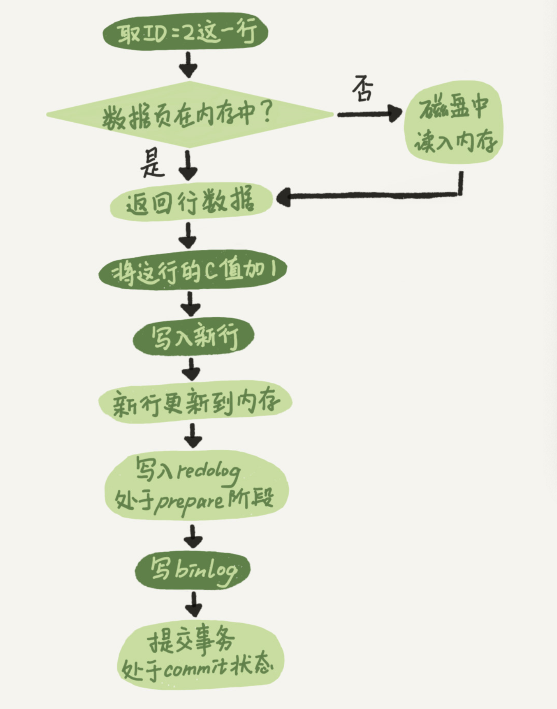
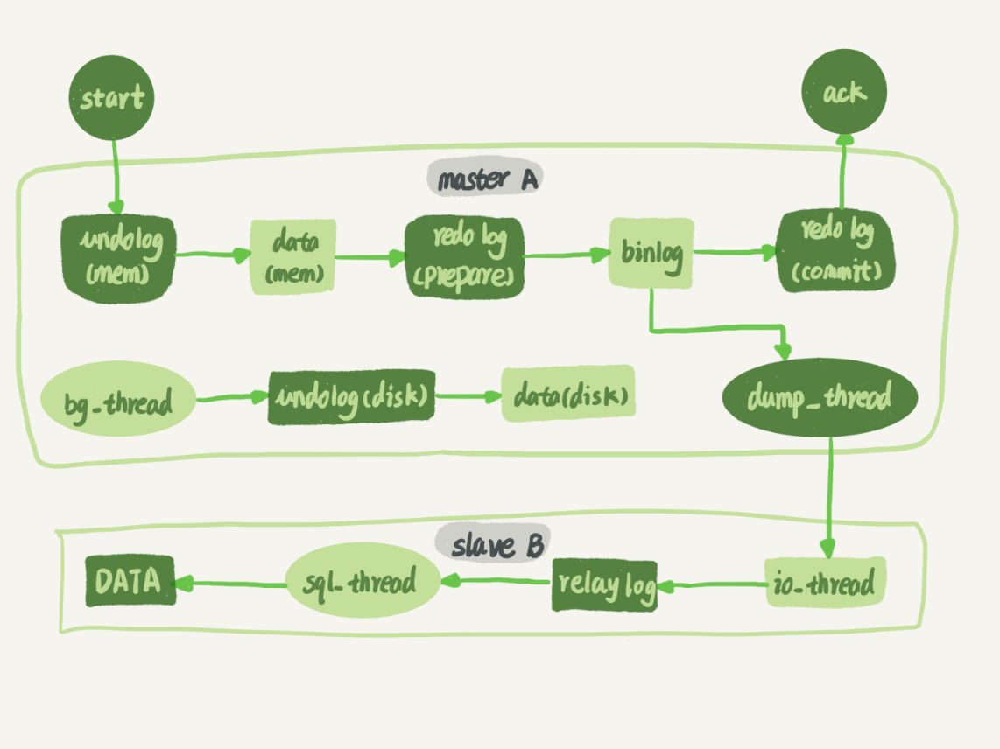
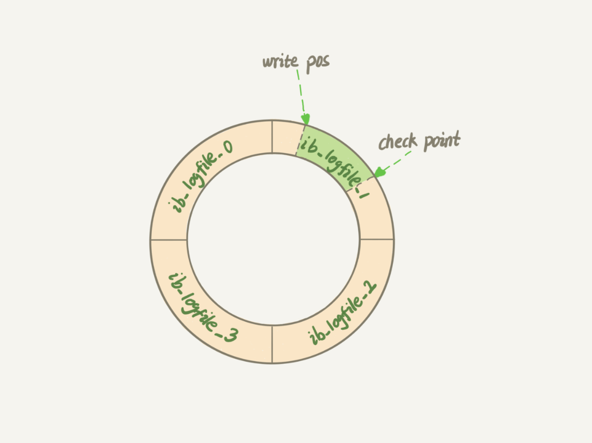
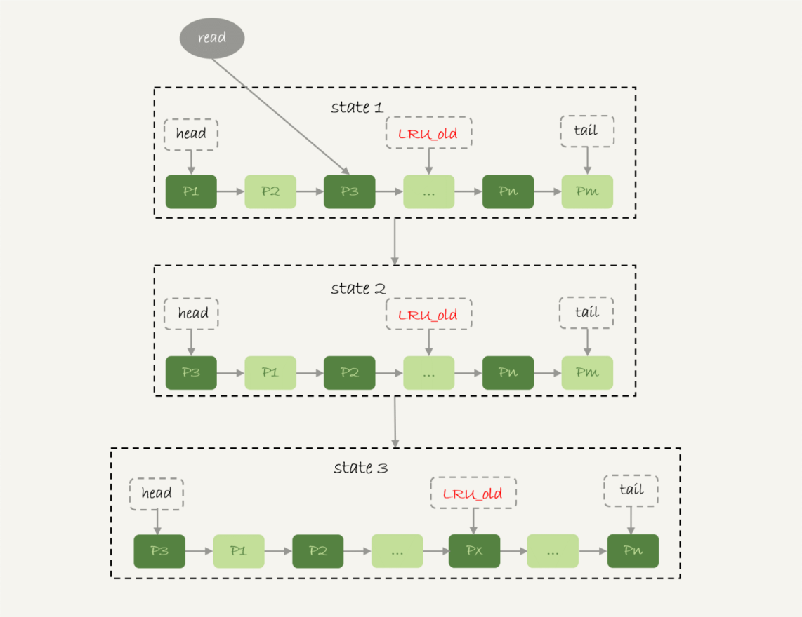
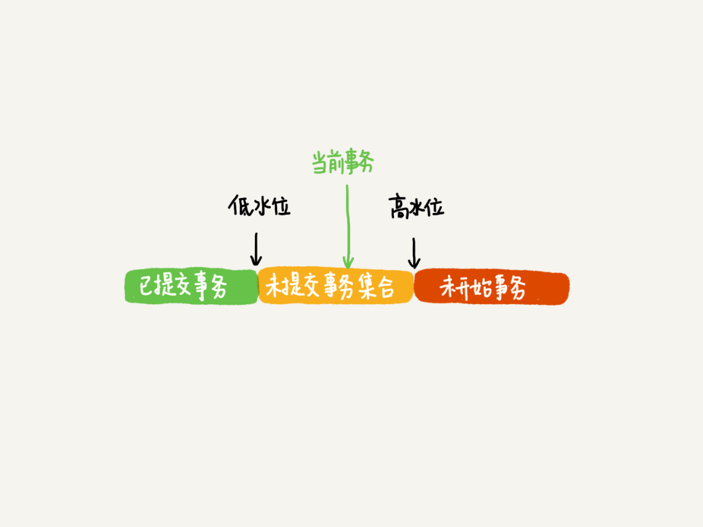
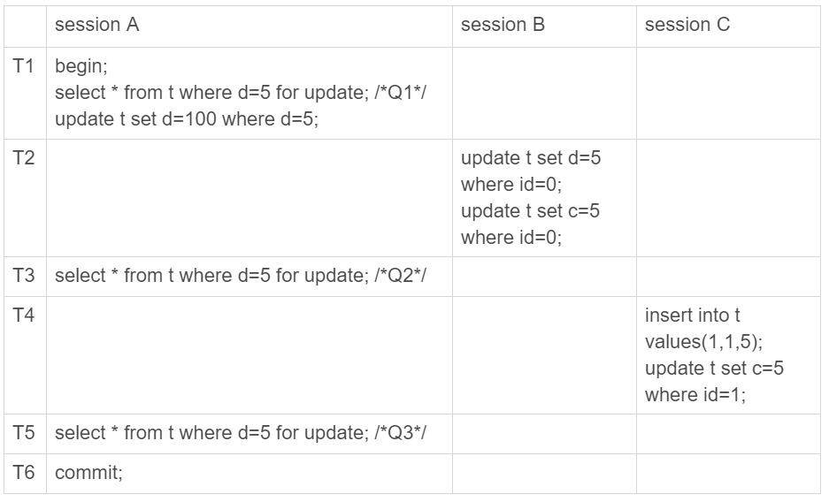
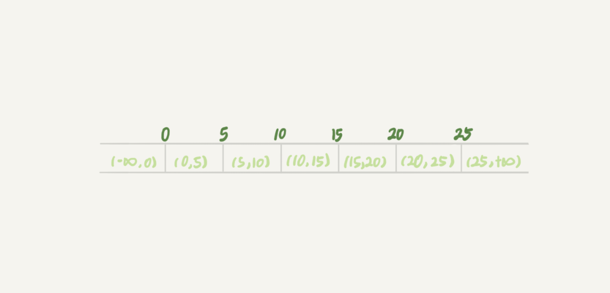
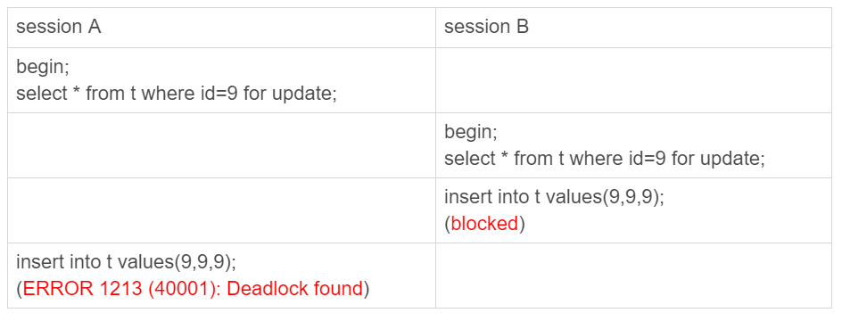

# 一、 高可用

## 1.1 crash-safe

 对于数据库来讲，Crash-safe能力最重要的是保证数据库崩溃重启之后，数据不丢，不乱。这一点MySQL是怎么做到的呢？我们都知道我们对数据库的操作一旦完成，数据就被写入到“磁盘”了。那么即使断电磁盘的数据也是存在的，因此这部分数据大家会觉得肯定没问题。那么我们对数据的存储过程再深究一点，讨论两个问题：第一，如果我们的一个操作进行到一半，数据库就崩溃了，这时数据库会否因为执行到中间状态而写入了脏数据；第二，数据库真的是在响应给我们数据操作的结果之后，就立刻把数据写到磁盘了吗，如果不是，是否可能存在数据没有持久化就丢失了的场景。

### binlog、redo log与undo log

在说明InnoDB是怎么确保crash-safe之前，需要先介绍三个日志模块: binlog（归档日志），redo log（重做日志）和undo log（回滚日志）。可以理解为binlog是记录对MySQL所有操作的逻辑日志，他描述在一段时间内我们对MySQL“做了什么”，binlog是MySQL Server层的日志，与使用的引擎无关。每次对binlog日志的新增都是append。binlog可以用于MySQL数据replica，也可用于我们将MySQL的数据恢复到之前的某一个时刻（恢复数据还需要借助定时保存的MySQL数据镜像，有了恢复数据的能力，就不用害怕程序员删库跑路了...）。redo log则是对MySQL操作的物理记录，redo log会记录数据更新实际上是将某个数据页地址的数据修改为某个值，侧重于描述MySQL“怎么做”，为了能够回滚所做的操作，每条redo log会伴随产生一条undo log，告诉系统在回滚时应该“怎么做”。redo log的日志新增不是无限append的，当记录数据到达设定的大小时，redo log会从日志开始覆盖，类似一个环，关于这个部分，我会在下面高性能的部分再进行说明。redo log和undo log是InnoDB引擎产生的日志。

### 两阶段提交 

一般的数据提交过程是：1. 执行器通过引擎拿到要修改的数据（可能需要读盘）；2. 引擎将数据更新后更新到内存中，同时将操作记录到redo log里面，此时redo log处于prepare状态，然后告知执行器执行结束，随时可以提交事务；3. 执行器生成这个操作的binlog，并把binlog写入磁盘；4. 执行器调用引擎的提交事务接口，引擎把redo log的状态改为commit，更新完成。这就是“两阶段提交”的过程。这里以一个具体的case 将ID=2的数据加1为例以流程图说明这个过程：

<div align="center">  </div><br>

如果没有两阶段提交，大家可以试试用反证法得到数据不一致的情况，更详细的分析大家可以参考 《[MySQL中binlog和redo log的一致性问题 》](https://blog.csdn.net/huangjw_806/article/details/100927097)

 为了说明redo log和binlog是如何在crash情况下作用的，我们来分析两个场景：

1. 写binlog之前crash。MySQL恢复后，检查redo log和binlog不完备，此时根据undo log执行回滚，数据一致。

2. 将redo log状态改为commit之前crash。MySQL恢复后，检查redo log和binlog，此时如果binlog不完整，则和场景1过程一致；如果binlog完整，将redo log状态置为commit，数据一致。

## 1.2 集群

 大家都知道要实现系统的高可用，系统一定要具备应对单点故障的能力。也就说系统需要以集群的形态对外提供服务，当单节点故障时，需要系统能自动剔除故障节点并对外提供新的可用节点。如果集群中每个节点都是无状态的，那么切换过程相对简单。而MySQL由于提供了数据服务，需要确保集群各节点的数据至少能达到最终一致性。常见的MySQL集群结构是一主N备，这里我们以一主一备的情况进行说明。

### 主备一致

<div align="center">  </div><br>

上图描述了主备数据同步的过程，备库 B 跟主库 A 之间维持了一个长连接。主库 A 内部有一个线程，专门用于服务备库 B 的这个长连接。一个事务日志同步的完整过程是这样的：

1. 在备库 B 上通过 change master 命令，设置主库 A 的 IP、端口、用户名、密码，以及要从哪个位置开始请求 binlog，这个位置包含文件名和日志偏移量。

2. 在备库 B 上执行 start slave 命令，这时候备库会启动两个线程，就是图中的 io_thread 和 sql_thread。其中 io_thread 负责与主库建立连接。

3. 主库 A 校验完用户名、密码后，开始按照备库 B 传过来的位置，从本地读取 binlog，发给 B。

4. 备库 B 拿到 binlog 后，写到本地文件，称为中转日志（relay log）。

5. sql_thread 读取中转日志，解析出日志里的命令，并执行。

上面描述的是MySQL的M-S结构，在M-S结构中，数据同步的路径是固定的M->S，即主Server数据同步到备Server，如果发生了Master failover，需要修改主备关系，客户端连接使用新的Master Server。实际上生产环境还有一种结构是M-M结构，互为主备的结构，在切换时，就不用修改主备关系了，但是在M-M的结构中，如果避免数据循环复制，是值得我们思考的问题：  一个解决方案是在生成binlog的数据中，标识出这条binlog最初产生的service id是什么，不同server的server id需要确保不同。比如server_A产生了一条insert操作，id=2。那么server_B在收到binlog的insert操作 id=2时，就知道这条数据是server_A产生的，且会把包含server id的信息也保存下来。当server_B再把binlog insert操作 id=2发送出去，server_A收到这条数据，且发现server id就是自己时，就可以直接忽略掉这条数据了。

除了上述这种方式，之外我最近听到的美团技术团队在讲述他们是如何实现异地多活场景下的数据同步时，是用的另外一种思路：生成数据时，也需要标识出这条数据是由哪个server生成的，但是server在对外同步数据时，会判断这条数据是不是我自己生成的，如果是，我才发送，如果不是，我就过滤掉这条数据，不再扩散。相比于上面的方案，这种方案会减少一些不必要的数据发送，且在多M-M结构中实现起来更简单。

### 主备切换

 有了主备一致的方案，我们已经具备了主备切换的基础。但是现实场景中主备不可避免的数据数据延迟，考虑到主备延迟的场景，当现实需要我们进行主备切换了，如何操作也有两种思路，供大家参考：

1. 可靠性优先原则。按照可靠性优先原则，主库A切换到备库B的过程如下：

 （1）判断备库 B 现在的 seconds_behind_master，如果小于某个值（比如 5 秒）继续下一步，否则持续重试这一步；

 （2）把主库 A 改成只读状态，即把 readonly 设置为 true；

 （3）判断备库 B 的 seconds_behind_master 的值，直到这个值变成 0 为止；

 （4）把备库 B 改成可读写状态，也就是把 readonly 设置为 false；

 （5）把业务请求切到备库 B。

​	seconds_behind_master是执行show slave status之后可以查询到的参数，表示主备延迟时间（严格意义上，seconds_behind_master其实不能完全代表主备之间的延迟，可以认为这个参数其实是代表备库拿到主库最新的binlog和备库现在执行到的binlog位置之间的估算差距，所以如果主备同步网络出现了问题，备库当前其实已经落后主库了，但seconds_behind_master仍然可能为0）

2. 可用性优先原则。如果强行把步骤 4、5 调整到最开始执行，也就是说不等主备数据同步，直接把连接切到备库 B，并且让备库 B 可以读写，那么系统几乎就没有不可用时间了。这么做的代价是可能会出现数据不一致。

 一般情况下，我们对数据的要求都是可靠性优先，因此切换时我们优先考虑可靠性优先原则。但在部分场景中，比如系统的执行流程依赖某个数据（比如日志）写入到数据库，但我们可以接受这个数据少量的丢失或不一致，而不想因为输出数据导致系统整体性能的减弱，这个时候可以考虑可用性优先。但这种场景一般比较少，如果真的存在，我不建议放到系统的同步阻塞流程中执行。

## 1.3 读写分离

 在生产环境中，一般会让MySQL主Server提供线上实时业务的读写服务，备Server提供只读服务以减轻对主Server的压力。一般情况下，我们默认能够容忍从备库读到的数据较主库可能有一定的延迟，但在某些场景下，我们需要备库的数据严格与主库一致，应该如何操作呢？

备选的方案有：（1）从主库读数据；（2）延迟n秒读备库；（3）半同步+seconds_behind_master来判断主从是否已同步。除了seconds_behind_master，还可以使用主备日志位点，主备GTID集合来判断主从是否已完成更新；（4）等GTID方案。这里介绍一下方案（4）。

 MySQL 中同样提供了以下命令

```sql
select wait_for_executed_gtid_set(gtid_set, );
```

这条命令的逻辑是：等待，直到这个库执行的事务中包含传入的 gtid_set，返回 0；超时返回 1。MySQL 5.7.6 版本开始，允许在执行完更新类事务后，把这个事务的 GTID 返回给客户端。等 GTID 的执行流程是：trx1 事务更新完成后，从返回包直接获取这个事务的 GTID，记为 gtid1；选定一个从库执行查询语句；在从库上执行上述命令。如果返回值是 0，则在这个从库执行查询语句；否则，到主库执行查询语句。

如果你的服务，读写是完全分离的，即在执行读数据前，你拿不到gtid，这个时候方案（4）就不适用了。但是基于方案（4）我们稍加变形，也是可以实现目标的，这里的关键是我们如何自己制造一个gtid。我们可以在缓存中记录数据主键对应的更新时间戳，把更新时间戳存入DB中，从备库拿到数据后，比较一下缓存的时间戳和数据的更新时间戳是否完全一致。如果不一致则从主库再读取数据。当然这个方案对性能是有一定影响的。

# 2. 高性能

## 2.1 数据持久化

 我们都知道MySQL的写入操作在一般情况下是很快的，但是我们同时又知道MySQL在写操作时，将数据持久化到磁盘。MySQL是如何做到高效的呢

### WAL技术

 上文提到MySQL在执行事务操作时，会先写redo log，redo log是记录数据修改时的物理操作，写入redo log之后需要等数据真的执行了物理操作之后再执行下一步操作吗？显然不是这样。redo log其实只是记录如何操作物理数据的日志，MySQL通过写redo log避免直接写磁盘，大大提高了写入速度，这个技术就是Write-Ahead Logging。在InnoDB觉得时机“适当”时，才会把redo log的内容更新到磁盘。这里的“适当”一般来说，有四种情况

1. 系统空闲时。

2. redo log快被写满时。回顾上一节里介绍redo log时提到的，redo log的空间类似一个环，所以当redo log被写满时，就会从头开始覆盖之前的redo log数据，此时如果这部分的redo log数据还没有同步到磁盘，就相当于数据丢失了。InnoDB为了解决这个问题，使用了write pos和checkpoint两个标记为来控制redo log日志的更新覆盖。write pos是当前记录的位置，也就是要这次操作要开始写redo log的位置；checkpoint是redo log数据已经同步到磁盘的位置。如果write pos追上了checkpoint，此时就需要等redo log同步新的数据到磁盘，把checkpoint往后推进之后，才能继续接收新的数据。

<div align="center">  </div><br>

3. 内存快被写满时。我们可以假设，如果是我们自己来设计MySQL，为了更快地读取数据，我们一定会把每次更新写入“缓存”来提高读取这些数据的速度，InnoDB也是这也想的，所以每次更新redo log之后，会把数据立刻更新到内存对应的数据页中，之后我们读数据也是从内存读。此时内存数据页的数据是不同于磁盘的，我们称之为“脏页”。当内存快被写满时，为了加载新的数据页，就会淘汰一些旧的数据页，如果旧的数据页恰好是脏页，此时就需要先将脏页flush到磁盘之后，再执行淘汰命令。写到这里，有的同学可能会想到，既然内存页也有同步到磁盘的过程，那么时候还需要在redo log write pos追上checkpoint时执行数据同步的操作呢？答案是需要的。这也是为什么redo log 作为InnoDB crash-safe保障的手段，试想如果没有redo log，如果刷脏页的过程还没执行完毕，设备就crash了，此时内存的数据也就全部丢失了（严谨一点，这里我再补充说明一下，redo log和binlog本身也是需要持久化的，MySQL在更新这两个日志时，也会根据参数判断是否写到cache即可，所以理论上，如果你设置的redo log和binlog持久化的策略是比较lazy的，那么也可能存在断电丢失日志数据的场景，如何设置redo log和binlog持久化的参数，需要考虑性能和数据一致性之间的平衡）。

4. MySQL关闭时。

   通过分析我们知道，当出现 2、3两种情况时，系统就需要让我们等一等先把数据更新到磁盘。为了提高MySQL执行性能，我们看下这里可以进行什么样的优化。对于2的情况，我们可以适当调大redo log的大小；对于3的情况可以有以下几个手段：（1）使用比较大的内存的设备；（2）调整刷脏页的速度，这里不再赘述，有兴趣的同学可以搜索或者和我线下沟通；（3）设置 innodb_flush_neighbors =1，设置该参数表示，如果刷脏页时，恰好该数据页的相邻数据页也是脏页，就可以被一起刷掉。

   最后小结一下，大家可能会有疑惑WAL技术虽然不需要把更新的数据实时持久化，但是也需要写日志，而日志本身也是持久化的，写磁盘的次数似乎总体上并没有减少，甚至可能增加，这种想法本身是正确的，但是WAL技术之所以能提高数据更新的效率，主要原因在于写日志是一个顺序读写的过程，而要更新的数据页本身是随机的；另一个原因是MySQL对于持久化redo log和binlog也做了优化，使用了组提交减少fsync的次数。

## 2.2 内存管理

### Buffer Pool与LRU

 上面提到了，MySQL直接读写其实是操作的内存数据页，这些内存数据页被Buffer Pool所管理。Buffer Pool除了能让数据的更新操作更快，也能让数据的读取速度更快。和我们常见的cache一样，MySQL会首先从Buffer Pool读取数据，所以发现数据页缺页，就会从磁盘load数据页到Buffer Pool。为了提高Buffer Pool命中率，Buffer Pool在因为加载新数据页而空间不足时，就需要淘汰掉某些数据页。InnoDB管理Buffer Pool使用了LRU算法。普通的LRU算法这里就再详细介绍了，但是在MySQL的场景中，LRU算法可能存在一个问题：假如我现在查询的结果包含了大量数据，这些数据可能把Buffer Pool的数据都淘汰掉，但这个查询的结果可能只用一次就不再用到了，这样会导致Buffer Pool命中率下降且频繁换页。InnoDB对传统的LRU算法做了改进：

<div align="center">  </div><br>

 InnoDB按照5:3的比例将LRU队列分为了young区和old区。上图的LRU old指向的是old区的起始位置，是整个链表的5/8处。优化之后的LRU算法如下：

1. 如果访问的数据在young区，将数据插入到链表头部，返回数据。

2. 如果访问的数据在old区，如果数据待在old区的时间超过了参数（innodb_old_blocks_time）设定的时间，将数据插入到链表头部，然后返回数据；否则，数据所处的位置不变，返回数据。

3. 如果访问的数据在LRU队列中不存在，则将数据插入到LRU old的位置，即old区的起始位置，并返回数据。

 通过上述这种策略，就可以保证在查询大量数据时，不会导致Buffer Pool命中率急剧下降。

## 2.3 并行复制策略

 在官方的 5.6 版本之前，MySQL 只支持单线程复制，由此在主库并发高、TPS 高时就会出现严重的主备延迟问题。

### MySQL5.6的策略

 直到官方MySQL5.6版本，MySQL才开始支持主备数据的并行复制策略，只是支持的粒度是按库并行。简单来说，当在执行的命令是更新不同的库，那么他们就可以并发执行；操作同一个库的命令退化为单线程。这个策略的并行效果，取决于压力模型。如果在主库上有多个 DB，并且各个 DB 的压力均衡，使用这个策略的效果会很好。

### MySQL5.7的策略

 5.7的版本在5.6的基础上，新增了一个并行复制策略：不关心是否操作同一个库，（1）只要同时处于 prepare 状态的事务，在备库执行时是可以并行的；（2）处于 prepare 状态的事务，与处于 commit 状态的事务之间，在备库执行时也是可以并行的。如果大家对prepare和commit状态有疑惑，可以回顾一下两阶段提交的章节。之所以根据redo log的状态来判断是否可并行复制，是因为如果redo log中处于commit状态之前的多个事务之间如果有竞争，会因为锁冲突而处于prepare之前的锁等待阶段。反之如果多个事务已经同时处于prepare或commit状态就说明事务间不存在冲突，可以并行执行。上文提到，为了提高log的持久化时间，binlog使用了组提交，这里有两个参数可以控制组提交的策略，binlog_group_commit_sync_delay表示延迟多少微秒后才调用fsync，binlog_group_commit_sync_no_delay_count表示累积所少次之后才调用fsync。这两个参数可以控制binlog从write到fsync的时间间隔，也可以用来控制减少binlog的写盘次数。在 MySQL 5.7 的并行复制策略里，它们可以用来制造更多的“同时处于 prepare 阶段的事务”。这样就增加了备库复制的并行度。也就是说，这两个参数，既可以“故意”让主库提交得慢些，又可以让备库执行得快些。在 MySQL 5.7 处理备库延迟的时候，可以考虑调整这两个参数值，来达到提升备库复制并发度的目的。

### MySQL5.7.22的策略

 5.7.22的版本在之前的基础上，增加了一个基于WRITESET的新的并行复制策略。相应地，新增了一个参数 binlog-transaction-dependency-tracking，用来控制是否启用这个新策略。这个参数的可选值有以下三种。（1）COMMIT_ORDER，表示的就是前面介绍的，根据同时进入 prepare 和 commit 来判断是否可以并行的策略；（2）WRITESET，表示的是对于事务涉及更新的每一行，计算出这一行的 hash 值，组成集合 writeset。如果两个事务没有操作相同的行，也就是说它们的 writeset 没有交集，就可以并行；（3）WRITESET_SESSION，是在 WRITESET 的基础上多了一个约束，即在主库上同一个线程先后执行的两个事务，在备库执行的时候，要保证相同的先后顺序。

# 3. 版本控制与锁

## 3.1 数据快照

  多版本并发控制（Multi-Version Concurrency Control, MVCC）是 MySQL 的 InnoDB 存储引擎实现隔离级别的一种具体方式  InnoDB为了实现事务的隔离，需要在每个事务启动时保存一个“数据快照”，而这个数据快照不可能真的把整个数据拷贝一份。因此这里使用了一个“技巧”：版本号。InnoDB 里面每个事务有一个唯一的事务 ID，叫作 transaction id。它是在事务开始的时候向 InnoDB 的事务系统申请的，是按申请顺序严格递增的。而每行数据也都是有多个版本的。每次事务更新数据的时候，都会生成一个新的数据版本，并且把 transaction id 赋值给这个数据版本的事务 ID，记为 row trx_id。MVCC 在每行记录后面都保存着两个隐藏的列，用来存储两个版本号：（1）创建版本号：创建一行数据时，将当前系统版本号作为创建版本号赋值；（2）删除版本号：删除一行数据时，将当前系统版本号作为删除版本号赋值。如果该快照的删除版本号大于当前事务版本号表示该快照有效，否则表示该快照已经被删除了。

这里还需要定义两个概念“快照读”和“当前读”。快照读是指事务开始时保存了一个快照，后续读取的数据都是取自这个快照；当前读是指读取数据时需要检查数据当前的最新值，必要时还需要加锁。

按照可重复读的定义，一个事务启动的时候，能够看到所有已经提交的事务结果。但是之后，这个事务执行期间，其他事务的更新对它不可见。因此，一个事务只需要在启动的时候声明说，“以我启动的时刻为准，如果一个数据版本是在我启动之前生成的，就认；如果是我启动以后才生成的，我就不认，我必须要找到它的上一个版本”。当然，如果“上一个版本”也不可见，那就得继续往前找。还有，如果是这个事务自己更新的数据，它自己还是要认的。在实现上， InnoDB 为每个事务构造了一个数组，用来保存这个事务启动瞬间，当前正在“活跃”的所有事务 ID。“活跃”指的就是，启动了但还没提交。数组里面事务 ID 的最小值记为低水位，当前系统里面已经创建过的事务 ID 的最大值加 1 记为高水位。这个视图数组和高水位，就组成了当前事务的一致性视图（read-view）。而数据版本的可见性规则，就是基于数据的 row trx_id 和这个一致性视图的对比结果得到的。这个视图数组把所有的 row trx_id 分成了几种不同的情况。

<div align="center">  </div><br>

 这样，对于当前事务的启动瞬间来说，一个数据版本的 row trx_id，有以下几种可能：如果落在绿色部分，表示这个版本是已提交的事务或者是当前事务自己生成的，这个数据是可见的；如果落在红色部分，表示这个版本是由将来启动的事务生成的，是肯定不可见的；如果落在黄色部分，那就包括两种情况（1） 若 row trx_id 在数组中，表示这个版本是由还没提交的事务生成的，不可见；（2）若 row trx_id 不在数组中，表示这个版本是已经提交了的事务生成的，可见。有了这个声明后，系统里面随后发生的更新，就跟这个事务看到的内容无关了。InnoDB 利用了“所有数据都有多个版本”的这个特性，实现了“秒级创建快照”的能力。

 上文通过row trx_id过滤的逻辑拿到的数据就是“快照读”，接下来我们分析另一个问题：如果此时我们要修改一行数据，而快照读拿到的数据只是这个数据的历史版本，我们是否能够依据快照读的结果修改这行数据呢？显然是不行的，因为数据在被“快照”之后，可能存在修改，所以InnoDB在处理时，凡是需要对数据进行修改，或者我们对操作加锁时（select ... for update 或 select ... lock in share mode），都要重新读一遍实时数据，这个动作叫做“当前读”。如果多个并发事务都需要对同一个行数据进行“当前读”，此时多个事务间就会进入到常见的锁争用场景。

 熟悉MySQL隔离级别的同学可以想到，可重复读（REPEATABLE READ）相比读提交（READ COMMITTED），能实现这个这个能力的关键就是事务启动时根据row trx_id建立的“快照读”。对于对一行数据只有只读操作的事务，可重复读可以让对这行数据的查询结果在整个事务生命周期中保持一致。大家可能听说过MySQL可重复读隔离级别并不能解决“幻读”现象的产生。但是InnoDB的可重复读级别却解决了“幻读”。在下一小节中，会总结一下InnoDB是如何解决幻读的。

## 3.2 幻读解决

 先引用一下官方对幻读的解释：

> A *phantom read* occurs when, in the course of a transaction, new rows are added or removed by another transaction to the records being read.

 可以看到官方认为幻读主要发生在一个事务进行时，另一个事务产生了新增或删除行的操作。通过上文提到的“快照读”，我们可以推断，一个事务中各个阶段的只读操作，都可以屏蔽掉另一个事务的新增或删除行操作。只通过“快照读”是否已经可以解决幻读了呢，这里考虑一个场景：

```sql
CREATE TABLE `t` (
  `id` int(11) NOT NULL,
  `c` int(11) DEFAULT NULL,
  `d` int(11) DEFAULT NULL,
  PRIMARY KEY (`id`),
  KEY `c` (`c`)
) ENGINE=InnoDB;

insert into t values(0,0,0),(5,5,5),
(10,10,10),(15,15,15),(20,20,20),(25,25,25);
```

<div align="center">  </div><br>

update 的加锁语义和 select …for update 是一致的，所以这时候加上这条 update 语句也很合理。session A 声明说“要给 d=5 的语句加上锁”，就是为了要更新数据，新加的这条 update 语句就是把它认为加上了锁的这一行的 d 值修改成了 100。现在，我们来分析一下图 3 执行完成后，数据库里会是什么结果。

1. 经过 T1 时刻，id=5 这一行变成 (5,5,100)，当然这个结果最终是在 T6 时刻正式提交的 ;

2. 经过 T2 时刻，id=0 这一行变成 (0,5,5);经过 T4 时刻，表里面多了一行 (1,5,5);

3. 其他行跟这个执行序列无关，保持不变。

 这样看，这些数据也没啥问题，但是我们再来看看这时候 binlog 里面的内容。

1. T2 时刻，session B 事务提交，写入了两条语句；

2. T4 时刻，session C 事务提交，写入了两条语句；

3. T6 时刻，session A 事务提交，写入了 update t set d=100 where d=5 这条语句。统一放到一起的话，就是这样的：

```sql
update t set d=5 where id=0; /*(0,0,5)*/
update t set c=5 where id=0; /*(0,5,5)*/

insert into t values(1,1,5); /*(1,1,5)*/
update t set c=5 where id=1; /*(1,5,5)*/

update t set d=100 where d=5;/*所有d=5的行，d改成100*/
```

 好，你应该看出问题了。这个语句序列，不论是拿到备库去执行，还是以后用 binlog 来克隆一个库，这三行的结果，都变成了 (0,5,100)、(1,5,100) 和 (5,5,100)。也就是说，id=0 和 id=1 这两行，发生了数据不一致。这个问题很严重，是不行的。到这里，我们再回顾一下，这个数据不一致到底是怎么引入的？我们分析一下可以知道，这是我们假设“select * from t where d=5 for update 这条语句只给 d=5 这一行，也就是 id=5 的这一行加锁”导致的。为了解决这个问题，我们的初步想法是需要给更多的行加上锁，甚至对于还没有插入的行，也要加上锁。这就引出了InnoDB的间隙锁（Gap Lock）。

 顾名思义，间隙锁，锁的就是两个值之间的空隙。比如文章开头的表 t，初始化插入了 6 个记录，这就产生了 7 个间隙。

<div align="center">  </div><br>

当你执行 select * from t where d=5 for update 的时候，就不止是给数据库中已有的 6 个记录加上了行锁，还同时加了 7 个间隙锁。这样就确保了无法再插入新的记录。也就是说这时候，在一行行扫描的过程中，不仅将给行加上了行锁，还给行两边的空隙，也加上了间隙锁。间隙锁不一样，跟间隙锁存在冲突关系的，是“往这个间隙中插入一个记录”这个操作。间隙锁之间都不存在冲突关系。

 间隙锁和行锁合称 next-key lock，每个 next-key lock 是前开后闭区间。也就是说，我们的表 t 初始化以后，如果用 select * from t for update 要把整个表所有记录锁起来，就形成了 7 个 next-key lock，分别是 (-∞,0]、(0,5]、(5,10]、(10,15]、(15,20]、(20, 25]、(25, +supremum]。

<div align="center">  </div><br>

我们按语句执行顺序来分析一下上图两个session的执行情况：

 （1）session A 执行 select … for update 语句，由于 id=9 这一行并不存在，因此会加上间隙锁 (5,10)；

 （2）session B 执行 select … for update 语句，同样会加上间隙锁 (5,10)，间隙锁之间不会冲突，因此这个语句可以执行成功；

 （3）session B 试图插入一行 (9,9,9)，被 session A 的间隙锁挡住了，只好进入等待；

 （4）session A 试图插入一行 (9,9,9)，被 session B 的间隙锁挡住了。至此，两个 session 进入互相等待状态，形成死锁。当然，InnoDB 的死锁检测马上就发现了这对死锁关系，让 session A 的 insert 语句报错返回了。

 需要说明的是。

（1）解决幻读时有代价的，next-key lock必然会导致并发性能的下降。如果把隔离级别降为读提交，就没有间隙锁了。但同时，要解决可能出现的数据和日志不一致问题，需要把 binlog 格式设置为 row。这也是现在不少公司使用的配置组合。

（2）当使用唯一索引来搜索唯一行的语句时，不需要间隙锁定。如下面语句的id列有唯一索引，此时只会对id值为10的行使用记录锁。

```sql
select * from t where id = 10 for update;
```

 如果，上面语句中id列没有建立索引或者是非唯一索引时，则语句会产生间隙锁；如果，搜索条件里有多个查询条件(即使每个列都有唯一索引)，也是会有间隙锁的。需要注意的是，当id列上没有索引时，SQL会走聚簇索引的全表扫描进行过滤，由于过滤是在MySQL Server层面进行的。因此每条记录（无论是否满足条件）都会被加上X锁。但是，为了效率考量，MySQL做了优化，对于不满足条件的记录，会在判断后放锁，最终持有的，是满足条件的记录上的锁。但是不满足条件的记录上的加锁/放锁动作是不会省略的。所以在没有索引时，不满足条件的数据行会有加锁又放锁的耗时过程。
