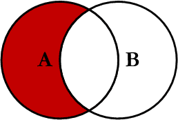

### 1. [JOIN](http://www.codeproject.com/Articles/33052/Visual-Representation-of-SQL-Joins)

**`1.INNER JOIN（内连接）`**

<div align="center">  </div><br>

```sql
SELECT <select_list> 
FROM Table_A A
INNER JOIN Table_B B
ON A.Key = B.Key
```

**`2.LEFT JOIN（左连接）`**

<div align="center">  </div><br>

```sql
SELECT <select_list>
FROM Table_A A
LEFT JOIN Table_B B
ON A.Key = B.Key
```

**`3.RIGHT JOIN（右连接）`**

<div align="center">  </div><br>

```sql
SELECT <select_list>
FROM Table_A A
RIGHT JOIN Table_B B
ON A.Key = B.Key
```

**`4.OUTER JOIN（外连接）`**

<div align="center">  </div><br>

```sql
SELECT <select_list>
FROM Table_A A
FULL OUTER JOIN Table_B B
ON A.Key = B.Key
```

**`5.LEFT JOIN EXCLUDING INNER JOIN（左连接-内连接）`**

<div align="center">  </div><br>

```sql
SELECT <select_list> 
FROM Table_A A
LEFT JOIN Table_B B
ON A.Key = B.Key
WHERE B.Key IS NULL
```

**`6.RIGHT JOIN EXCLUDING INNER JOIN（右连接-内连接）`**

<div align="center">  </div><br>

```sql
SELECT <select_list>
FROM Table_A A
RIGHT JOIN Table_B B
ON A.Key = B.Key
WHERE A.Key IS NULL
```

**`7.OUTER JOIN EXCLUDING INNER JOIN（外连接-内连接）`**

<div align="center">  </div><br>

```sql
SELECT <select_list>
FROM Table_A A
FULL OUTER JOIN Table_B B
ON A.Key = B.Key
WHERE A.Key IS NULL OR B.Key IS NULL
```
