## 表与字段设计

### 数据库基本设计规范

1. 尽量控制单表数据量的大小，建议控制在 500 万以。500 万并不是 MySQL 数据库的限制，过大会造成修改表结构、备份、恢复都会有很大的问题，可以用历史数据归档（应用于日志数据），分库分表（应用于业务数据）等手段来控制数据量大小
2. 谨慎使用 MySQL 分区表。分区表在物理上表现为多个文件，在逻辑上表现为一个表 谨慎选择分区键，跨分区查询效率可能更低 建议采用物理分表的方式管理大数据。
3. 禁止在数据库中存储图片，文件等大的二进制数据。通常文件很大，会短时间内造成数据量快速增长，数据库进行数据库读取时，通常会进行大量的随机 IO 操作，文件很大时，IO 操作很耗时 通常存储于文件服务器，数据库只存储文件地址信息
4. 禁止在线上做数据库压力测试

### 数据库字段设计规范

1. 优先选择符合存储需要的最小的数据类型。列的字段越大，建立索引时所需要的空间也就越大，这样一页中所能存储的索引节点的数量也就越少也越少，在遍历时所需要的 IO 次数也就越多， 索引的性能也就越差
2. 避免使用 TEXT、BLOB 数据类型，最常见的 TEXT 类型可以存储 64k 的数据
3. 尽可能把所有列定义为 NOT NULL

### 索引设计规范

1. 限制每张表上的索引数量，建议单张表索引不超过 5 个
2. 禁止给表中的每一列都建立单独的索引
3. 每个 InnoDB 表必须有个主键
4. 建立索引的目的是：希望通过索引进行数据查找，减少随机 IO，增加查询性能 ，索引能过滤出越少的数据，则从磁盘中读入的数据也就越少。 区分度最高的放在联合索引的最左侧（区分度 = 列中不同值的数量 / 列的总行数）。 尽量把字段长度小的列放在联合索引的最左侧（因为字段长度越小，一页能存储的数据量越大，IO 性能也就越好）。 使用最频繁的列放到联合索引的左侧（这样可以比较少的建立一些索引）。

### 数据库 SQL 开发规范

1. 充分利用表上已经存在的索引,避免使用双 % 号的查询条件。如 a like '%123%'，（如果无前置 %，只有后置 %，是可以用到列上的索引的）
   一个 SQL 只能利用到复合索引中的一列进行范围查询，如：有 a,b,c 列的联合索引，在查询条件中有 a 列的范围查询，则在 b,c 列上的索引将不会被用到，在定义联合索引时，如果 a 列要用到范围查找的话，就要把 a 列放到联合索引的右侧。
   使用 left join 或 not exists 来优化 not in 操作， 因为 not in 也通常会使用索引失效。
2. 禁止使用 SELECT * 必须使用 SELECT <字段列表> 查询
3. 避免使用子查询，可以把子查询优化为 JOIN 操作
4. 避免使用 JOIN 关联太多的表

## 范式与反范式

### 从1NF到3NF

**1NF是数据库表种的任何属性都是原子的，不可再分。**

任何的DBMS都会满足1NF的要求，除非在设计的时候设计一个属性X，属性Y是X的前半段，属性Z是X的后半段，并且Y和Z没有什么使用意义，我想应该没有人当这样的折磨王吧。

**2NF要求数据表里的非主属性都要和这个数据表的候选键有完全依赖关系。**

这里我举一个没有满足2NF的例子。

假设现在有一张球员比赛表，里面包含球员编号，姓名，年龄，比赛编号，比赛时间，比赛场地这些属性。这里的候选键和主键都是（球员编号，比赛编号），可以通过这个候选键决定其他的属性：

（球员编号，比赛编号） → （姓名，年龄，比赛时间，比赛场地）。

但是这个表不满足2NF，因为还存在下面的关系：

（球员编号） → （姓名，年龄）

（比赛编号） → （比赛时间，比赛场地）

也就是说候选键的部分字段决定了非主属性，那这样会产生什么问题？

1. 数据冗余：球员可以参加多场比赛，那么球员的姓名和年龄就重复了多次。同样，一场比赛有多个球员参与，比赛时间和比赛场地就重复了多次。
2. 插入异常：联盟新增了新球员，但是还在休赛期，比赛相关的字段就插入异常。就是候选键部分字段以及他们决定的非主属性有数据，但是候选键其他部分的字段以及其他非主属性还未产生数据时，就插入异常。
3. 删除异常：如果有一场比赛只有一个球员参与，这个球员这个赛季退役了，删除这个球员的时候同时也删除了这场比赛了。
4. 更新异常：当一个球员的年龄变化了，需要更新这个球员参加的所有比赛的行。
5. 总的来说，第1个问题导致了后面3个问题，因为数据冗余，导致数据的增删改查都不对劲。

为满足2NF改正：

将这张表分为3张表

player：球员编号，姓名，年龄，队伍

game：比赛编号，比赛时间，比赛场地

player_game：比赛编号，参赛球员编号，参赛球员得分

将刚才不满足2NF的关系拆分成不同的表，并且使用第3张表进行链接他们。这样每一张表都满足2NF。

**3NF在满足2NF的同时，对任何非主属性都不传递依赖于候选键**

举个例子，现在有个cdn_load的表，其中有自增主键id，时间戳event_timestamp，资源类型cdn_type，加载该资源的页面名称page_name，是不是游戏平台的域名is_game_platform，域名还是具体的链接url_type。

候选键有：（id）和（event_timestamp, cdn_type, page_name, url）

选择id作为主键时

<div align="center">  </div><br>

有以上依赖关系

左边这个关系中，主键id可以决定event_timestamp，url，is_game_platform，但是这里有一个非主属性决定了另一个非主属性，url可以决定is_game_platform，所以is_game_platform通过url传递依赖主键id。

同样右边的关系中，url_type通过url传递依赖主键id。

其实is_game_platform和url_type可以不存入DB，删除is_game_platform和url_type，直接通过程序计算所得即可，这样就满足了3NF。

如果一定要这两个字段并且一定要满足3NF，那么拆分成两张表

cdn_request：除去is_game_platform和url_type的其他字段。

url_info：url，is_game_platform，url_type

这样两张表都满足3NF。

### 范式的优点和缺点

**优点：**

1. 范式化的更新操作通常比反范式化要快
2. 当数据较好地范式化时，就只有很少或者没有重复数据，所以只需要修改更少的数据。
3. 范式化的表通常更小，可以更好地放在内存里，所以执行操作会更快
4. 很少有多余的数据以为这检索列表数据时更少需要distinct或者group by才能获得一份唯一的部门列表，但是如果部门是一张单独的表，则需要简单的查询这张表就行了。

**缺点：**

通常需要关联，稍微复杂一些的查询语句在符合范式的schema上都可能需要至少一次关联，也许更多。这不但代价昂贵，也可能使一些索引策略无效。例如，范式化可能将列存放在不同的表中，而这些列如果在一个表中本可以属于同一个索引。

### 反范式的优点和缺点

反范式化的schema因为所有的数据都在一张表中，可以很好地避免关联。
如果不需要关联表，则对大部分查询最差的情况—–即使表没有使用索引—是全表扫描。当数据比内存大时这可能比关联要快的多。因为这样避免了随机I/O(全表扫描基本上是顺序I/O，但也不是100%的，跟引擎的实现有关。)。单独的表也能使用有效的索引策略。（例子见书籍）
平时工作中，我们通常是将范式和反范式混合使用，相互结合。


## MySQL逻辑架构

<div align="center"> 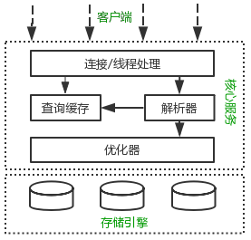 </div><br>

MySQL逻辑架构整体分为三层，最上层为客户端层，并非MySQL所独有，诸如：连接处理、授权认证、安全等功能均在这一层处理。

MySQL大多数核心服务均在中间这一层，包括查询解析、分析、优化、缓存、内置函数(比如：时间、数学、加密等函数)。所有的跨存储引擎的功能也在这一层实现：存储过程、触发器、视图等。

最下层为存储引擎，其负责MySQL中的数据存储和提取。和Linux下的文件系统类似，每种存储引擎都有其优势和劣势。中间的服务层通过API与存储引擎通信，这些API接口屏蔽了不同存储引擎间的差异。

## MySQL查询过程

我们总是希望MySQL能够获得更高的查询性能，最好的办法是弄清楚MySQL是如何优化和执行查询的。一旦理解了这一点，就会发现：很多的查询优化工作实际上就是遵循一些原则让MySQL的优化器能够按照预想的合理方式运行而已。

当向MySQL发送一个请求的时候，MySQL到底做了些什么呢？

<div align="center">  </div><br>

客户端和MySQL服务端的交互过程简介：

1. 客户端发送一条SQL语句给服务端，服务端的连接器先进行账号/密码、权限等环节验证，有异常直接拒绝请求。
2. 服务端查询缓存，如果SQL语句命中了缓存，则返回缓存中的结果，否则继续处理。
3. 服务端对SQL语句进行词法解析、语法解析、预处理来检查SQL语句的合法性。
4. 服务端通过优化器对之前生成的解析树进行优化处理，生成最优的物理执行计划。
5. 将生成的物理执行计划调用存储引擎的相关接口，进行数据查询和处理。
6. 处理完成后将结果返回客户端。

### 客户端/服务端通信协议

MySQL客户端/服务端通信协议是“半双工”的：在任一时刻，要么是服务器向客户端发送数据，要么是客户端向服务器发送数据，这两个动作不能同时发生。一旦一端开始发送消息，另一端要接收完整个消息才能响应它，所以我们无法也无须将一个消息切成小块独立发送，也没有办法进行流量控制。

客户端用一个单独的数据包将查询请求发送给服务器，所以当查询语句很长的时候，需要设置max_allowed_packet参数。但是需要注意的是，如果查询实在是太大，服务端会拒绝接收更多数据并抛出异常。

与之相反的是，服务器响应给用户的数据通常会很多，由多个数据包组成。但是当服务器响应客户端请求时，客户端必须完整的接收整个返回结果，而不能简单的只取前面几条结果，然后让服务器停止发送。因而在实际开发中，尽量保持查询简单且只返回必需的数据，减小通信间数据包的大小和数量是一个非常好的习惯，这也是查询中尽量避免使用SELECT *以及加上LIMIT限制的原因之一。

### 查询缓存

在解析一个查询语句前，如果查询缓存是打开的，那么MySQL会检查这个查询语句是否命中查询缓存中的数据。如果当前查询恰好命中查询缓存，在检查一次用户权限后直接返回缓存中的结果。这种情况下，查询不会被解析，也不会生成执行计划，更不会执行。

MySQL将缓存存放在一个引用表（不要理解成table，可以认为是类似于HashMap的数据结构），通过一个哈希值索引，这个哈希值通过查询本身、当前要查询的数据库、客户端协议版本号等一些可能影响结果的信息计算得来。所以两个查询在任何字符上的不同（例如：空格、注释），都会导致缓存不会命中。

如果查询中包含任何用户自定义函数、存储函数、用户变量、临时表、MySQL库中的系统表，其查询结果都不会被缓存。比如函数NOW()或者CURRENT_DATE()会因为不同的查询时间，返回不同的查询结果，再比如包含CURRENT_USER或者CONNECION_ID()的查询语句会因为不同的用户而返回不同的结果，将这样的查询结果缓存起来没有任何的意义。

既然是缓存，就会失效，那查询缓存何时失效呢？MySQL的查询缓存系统会跟踪查询中涉及的每个表，如果这些表（数据或结构）发生变化，那么和这张表相关的所有缓存数据都将失效。正因为如此，在任何的写操作时，MySQL必须将对应表的所有缓存都设置为失效。如果查询缓存非常大或者碎片很多，这个操作就可能带来很大的系统消耗，甚至导致系统僵死一会儿。而且查询缓存对系统的额外消耗也不仅仅在写操作，读操作也不例外：

- 任何的查询语句在开始之前都必须经过检查，即使这条SQL语句永远不会命中缓存
- 如果查询结果可以被缓存，那么执行完成后，会将结果存入缓存，也会带来额外的系统消耗

基于此，我们要知道并不是什么情况下查询缓存都会提高系统性能，缓存和失效都会带来额外消耗，只有当缓存带来的资源节约大于其本身消耗的资源时，才会给系统带来性能提升。但要如何评估打开缓存是否能够带来性能提升是一件非常困难的事情，也不在本文讨论的范畴内。如果系统确实存在一些性能问题，可以尝试打开查询缓存，并在数据库设计上做一些优化，比如：

- 用多个小表代替一个大表，注意不要过度设计
- 批量插入代替循环单条插入
- 合理控制缓存空间大小，一般来说其大小设置为几十兆比较合适
- 可以通过SQL_CACHE和SQL_NO_CACHE来控制某个查询语句是否需要进行缓存

最后的忠告是不要轻易打开查询缓存，特别是写密集型应用。如果你实在是忍不住，可以将query_cache_type设置为DEMAND，这时只有加入SQL_CACHE的查询才会走缓存，其他查询则不会，这样可以非常自由地控制哪些查询需要被缓存。

当然查询缓存系统本身是非常复杂的，这里讨论的也只是很小的一部分，其他更深入的话题，比如：缓存是如何使用内存的？如何控制内存的碎片化？事务对查询缓存有何影响等等，读者可以自行阅读相关资料，这里权当抛砖引玉吧。

### 语法解析和预处理

MySQL通过关键字将SQL语句进行解析，并生成一颗对应的解析树。这个过程解析器主要通过语法规则来验证和解析。比如SQL中是否使用了错误的关键字或者关键字的顺序是否正确等等。预处理则会根据MySQL规则进一步检查解析树是否合法。比如检查要查询的数据表和数据列是否存在等。

### 查询优化

经过前面的步骤生成的语法树被认为是合法的了，并且由优化器将其转化成查询计划。多数情况下，一条查询可以有很多种执行方式，最后都返回相应的结果。优化器的作用就是找到这其中最好的执行计划。

MySQL使用基于成本的优化器，它尝试预测一个查询使用某种执行计划时的成本，并选择其中成本最小的一个。在MySQL可以通过查询当前会话的last_query_cost的值来得到其计算当前查询的成本。

```mysql
mysql> select * from t_message limit 10;

...省略结果集

mysql> show status like 'last_query_cost';

+-----------------+-------------+

| Variable_name   | Value       |

+-----------------+-------------+

| Last_query_cost | 6391.799000 |

+-----------------+-------------+
————————————————
```

示例中的结果表示优化器认为大概需要做6391个数据页的随机查找才能完成上面的查询。这个结果是根据一些列的统计信息计算得来的，这些统计信息包括：每张表或者索引的页面个数、索引的基数、索引和数据行的长度、索引的分布情况等等。

有非常多的原因会导致MySQL选择错误的执行计划，比如统计信息不准确、不会考虑不受其控制的操作成本（用户自定义函数、存储过程）、MySQL认为的最优跟我们想的不一样（我们希望执行时间尽可能短，但MySQL值选择它认为成本小的，但成本小并不意味着执行时间短）等等。

MySQL的查询优化器是一个非常复杂的部件，它使用了非常多的优化策略来生成一个最优的执行计划：

- 重新定义表的关联顺序（多张表关联查询时，并不一定按照SQL中指定的顺序进行，但有一些技巧可以指定关联顺序）
- 优化MIN()和MAX()函数（找某列的最小值，如果该列有索引，只需要查找B+Tree索引最左端，反之则可以找到最大值，具体原理见下文）
- 提前终止查询（比如：使用Limit时，查找到满足数量的结果集后会立即终止查询）
- 优化排序（在老版本MySQL会使用两次传输排序，即先读取行指针和需要排序的字段在内存中对其排序，然后再根据排序结果去读取数据行，而新版本采用的是单次传输排序，也就是一次读取所有的数据行，然后根据给定的列排序。对于I/O密集型应用，效率会高很多）

随着MySQL的不断发展，优化器使用的优化策略也在不断的进化，这里仅仅介绍几个非常常用且容易理解的优化策略，其他的优化策略，大家自行查阅吧。

### 查询执行引擎

在完成解析和优化阶段以后，MySQL会生成对应的执行计划，查询执行引擎根据执行计划给出的指令逐步执行得出结果。整个执行过程的大部分操作均是通过调用存储引擎实现的接口来完成，这些接口被称为handler API。查询过程中的每一张表由一个handler实例表示。实际上，MySQL在查询优化阶段就为每一张表创建了一个handler实例，优化器可以根据这些实例的接口来获取表的相关信息，包括表的所有列名、索引统计信息等。存储引擎接口提供了非常丰富的功能，但其底层仅有几十个接口，这些接口像搭积木一样完成了一次查询的大部分操作。

### 返回结果给客户端

查询执行的最后一个阶段就是将结果返回给客户端。即使查询不到数据，MySQL仍然会返回这个查询的相关信息，比如该查询影响到的行数以及执行时间等。

如果查询缓存被打开且这个查询可以被缓存，MySQL也会将结果存放到缓存中。

结果集返回客户端是一个增量且逐步返回的过程。有可能MySQL在生成第一条结果时，就开始向客户端逐步返回结果集了。这样服务端就无须存储太多结果而消耗过多内存，也可以让客户端第一时间获得返回结果。需要注意的是，结果集中的每一行都会以一个满足①中所描述的通信协议的数据包发送，再通过TCP协议进行传输，在传输过程中，可能对MySQL的数据包进行缓存然后批量发送。

回头总结一下MySQL整个查询执行过程，总的来说分为6个步骤：

- 客户端向MySQL服务器发送一条查询请求
- 服务器首先检查查询缓存，如果命中缓存，则立刻返回存储在缓存中的结果。否则进入下一阶段
- 服务器进行SQL解析、预处理、再由优化器生成对应的执行计划
- MySQL根据执行计划，调用存储引擎的API来执行查询
- 将结果返回给客户端，同时缓存查询结果

<div align="center">  </div><br>

## MySQL引擎

目前广泛使用的是MyISAM和InnoDB两种引擎：Mysql 底层数据引擎以插件形式设计，最常见的是 Innodb 引擎和 Myisam 引擎，用户可以根据个人需求选择不同的引擎作为 Mysql 数据表的底层引擎。我们刚分析了，B+树作为 Mysql 的索引的数据结构非常合适，但是数据和索引到底怎么组织起来也是需要一番设计，设计理念的不同也导致了 Innodb 和 Myisam 的出现，各自呈现独特的性能。

### MyISAM

MyISAM引擎是MySQL 5.1及之前版本的默认引擎，它的特点是：

- 不支持行锁，读取时对需要读到的所有表加锁，写入时则对表加排它锁；
- 不支持事务；
- 不支持外键；
- 不支持崩溃后的安全恢复；
- 在表有读取查询的同时，支持往表中插入新纪录；
- 支持BLOB和TEXT的前500个字符索引，支持全文索引；
- 支持延迟更新索引，极大提升写入性能；
- 对于不会进行修改的表，支持压缩表，极大减少磁盘空间占用。

MyISAM 虽然数据查找性能极佳，但是不支持事务处理。Innodb 最大的特色就是支持了 ACID 兼容的事务功能，而且他支持行级锁。Mysql 建立表的时候就可以指定引擎，比如下面的例子，就是分别指定了 Myisam 和 Innodb 作为 user 表和 user2 表的数据引擎。

<div align="center">  </div><br>

执行这两个指令后，系统出现了以下的文件，说明这两个引擎数据和索引的组织方式是不一样的。

<div align="center">  </div><br>

Innodb 创建表后生成的文件有：

- frm:创建表的语句
- idb:表里面的数据+索引文件

Myisam 创建表后生成的文件有

- frm:创建表的语句
- MYD:表里面的数据文件（myisam data）
- MYI:表里面的索引文件（myisam index）

从生成的文件看来，这两个引擎底层数据和索引的组织方式并不一样，MyISAM 引擎把数据和索引分开了，一人一个文件，这叫做非聚集索引方式；Innodb 引擎把数据和索引放在同一个文件里了，这叫做聚集索引方式。下面将从底层实现角度分析这两个引擎是怎么依靠 B+树这个数据结构来组织引擎实现的。

**MyISAM 引擎的底层实现（非聚集索引方式）**

MyISAM 用的是非聚集索引方式，即数据和索引落在不同的两个文件上。MyISAM 在建表时以主键作为 KEY 来建立主索引 B+树，树的叶子节点存的是对应数据的物理地址。我们拿到这个物理地址后，就可以到 MyISAM 数据文件中直接定位到具体的数据记录了。

<div align="center">  </div><br>

当我们为某个字段添加索引时，我们同样会生成对应字段的索引树，该字段的索引树的叶子节点同样是记录了对应数据的物理地址，然后也是拿着这个物理地址去数据文件里定位到具体的数据记录。

### InnoDB

InnoDB在MySQL 5.5后成为默认索引，它的特点是：

- 支持行锁，采用MVCC来支持高并发；
- 支持事务；
- 支持外键；
- 支持崩溃后的安全恢复；
- 不支持全文索引。

InnoDB在MySQL 5.6.4支持全文索引

**Innodb引擎的底层实现（聚集索引方式）**

InnoDB是聚集索引方式，因此数据和索引都存储在同一个文件里。首先InnoDB会根据主键ID作为KEY建立索引B+树，如左下图所示，而B+树的叶子节点存储的是主键ID对应的数据，比如在执行select * from user_info where id=15这个语句时，InnoDB就会查询这颗主键ID索引B+树，找到对应的user_name='Bob'。

这是建表的时候InnoDB就会自动建立好主键ID索引树，这也是为什么Mysql在建表时要求必须指定主键的原因。当我们为表里某个字段加索引时InnoDB会怎么建立索引树呢？比如我们要给user_name这个字段加索引，那么InnoDB就会建立user_name索引B+树，节点里存的是user_name这个KEY，叶子节点存储的数据的是主键KEY。注意，叶子存储的是主键KEY！拿到主键KEY后，InnoDB才会去主键索引树里根据刚在user_name索引树找到的主键KEY查找到对应的数据。

<div align="center">  </div><br>

问题来了，为什么 InnoDB 只在主键索引树的叶子节点存储了具体数据，但是其他索引树却不存具体数据呢，而要多此一举先找到主键，再在主键索引树找到对应的数据呢?

其实很简单，因为 InnoDB 需要节省存储空间。一个表里可能有很多个索引，InnoDB 都会给每个加了索引的字段生成索引树，如果每个字段的索引树都存储了具体数据，那么这个表的索引数据文件就变得非常巨大（数据极度冗余了）。从节约磁盘空间的角度来说，真的没有必要每个字段索引树都存具体数据，通过这种看似“多此一举”的步骤，在牺牲较少查询的性能下节省了巨大的磁盘空间，这是非常有值得的。

在进行 InnoDB 和 MyISAM 特点对比时谈到，MyISAM 查询性能更好，从上面索引文件数据文件的设计来看也可以看出原因：MyISAM 直接找到物理地址后就可以直接定位到数据记录，但是 InnoDB 查询到叶子节点后，还需要再查询一次主键索引树，才可以定位到具体数据。等于 MyISAM 一步就查到了数据，但是 InnoDB 要两步，那当然 MyISAM 查询性能更高。

本文首先探讨了哪种数据结构更适合作为 Mysql 底层索引的实现，然后再介绍了 Mysql 两种经典数据引擎 MyISAM 和 InnoDB 的底层实现。最后再总结一下什么时候需要给你的表里的字段加索引吧：

1. 较频繁的作为查询条件的字段应该创建索引；
2. 唯一性太差的字段不适合单独创建索引，即使该字段频繁作为查询条件；
3. 更新非常频繁的字段不适合创建索引。


MyISAM适合SELECT密集型的表，而InnoDB适合INSERT和UPDATE密集型的表。

各个引擎的比较：

<div align="center">  </div><br>

注：上面提到的B树索引并没有指出是B-Tree和B+Tree索引，但是B-树和B+树的定义是有区别的。

在 [MySQL](http://mp.weixin.qq.com/s?__biz=MzI3ODcxMzQzMw==&mid=2247487061&idx=1&sn=0dfc867eb90bb9f79d45faf3d2a470ec&chksm=eb538b63dc2402754308364cae71988ed083c85fe6b26e01ce1dda5c183065d2199c9c3912c5&scene=21#wechat_redirect) 中，主要有四种类型的索引，分别为：B-Tree 索引， Hash 索引， Fulltext 索引和 R-Tree 索引。

B-Tree 索引是 MySQL数据库中使用最为频繁的索引类型，除了 Archive 存储引擎之外的其他所有的存储引擎都支持 B-Tree 索引。Archive 引擎直到 MySQL 5.1 才支持索引，而且只支持索引单个 AUTO_INCREMENT 列。

不仅仅在 MySQL 中是如此，实际上在其他的很多数据库管理系统中B-Tree 索引也同样是作为最主要的索引类型，这主要是因为 B-Tree 索引的存储结构在数据库的数据检索中有非常优异的表现。

一般来说， MySQL 中的 B-Tree 索引的物理文件大多都是以 Balance Tree 的结构来存储的，也就是所有实际需要的数据都存放于 Tree 的 Leaf Node(叶子节点) ，而且到任何一个 Leaf Node 的最短路径的长度都是完全相同的，所以我们大家都称之为 B-Tree 索引。

当然，可能各种数据库（或 MySQL的各种存储引擎）在存放自己的 B-Tree 索引的时候会对存储结构稍作改造。如 Innodb 存储引擎的 B-Tree 索引实际使用的存储结构实际上是 B+Tree，也就是在 B-Tree 数据结构的基础上做了很小的改造，在每一个Leaf Node 上面出了存放索引键的相关信息之外，还存储了指向与该 Leaf Node 相邻的后一个 LeafNode 的指针信息（增加了顺序访问指针），这主要是为了加快检索多个相邻 Leaf Node 的效率考虑。


## 树

### 树的简介

树跟数组、链表、堆栈一样，是一种数据结构。它由有限个节点，组成具有层次关系的集合。因为它看起来像一棵树，所以得其名。一颗普通的树如下:

<div align="center">  </div><br>

树是包含n（n为整数，大于0）个结点， n-1条边的有穷集，它有以下特点：

> - 每个结点或者无子结点或者只有有限个子结点；
> - 有一个特殊的结点,它没有父结点，称为根结点；
> - 每一个非根节点有且只有一个父节点；
> - 树里面没有环路

一些有关于树的概念：

> - 结点的度：一个结点含有的子结点个数称为该结点的度；
> - 树的度：一棵树中，最大结点的度称为树的度；
> - 父结点：若一个结点含有子结点，则这个结点称为其子结点的父结点；
> - 深度：对于任意结点n,n的深度为从根到n的唯一路径长，根结点的深度为0；
> - 高度：对于任意结点n,n的高度为从n到一片树叶的最长路径长，所有树叶的高度为0；

### 树的种类

<div align="center">  </div><br>

按照有序性，可以分为有序树和无序树：

> - 无序树：树中任意节点的子结点之间没有顺序关系
> - 有序树：树中任意节点的子结点之间有顺序关系

按照节点包含子树个数，可以分为B树和二叉树，二叉树可以分为以下几种：

> - 二叉树：每个节点最多含有两个子树的树称为二叉树；
> - 二叉查找树：首先它是一颗二叉树，若左子树不空，则左子树上所有结点的值均小于它的根结点的值；若右子树不空，则右子树上所有结点的值均大于它的根结点的值；左、右子树也分别为二叉排序树；
> - 满二叉树：叶节点除外的所有节点均含有两个子树的树被称为满二叉树；
> - 完全二叉树：如果一颗二叉树除去最后一层节点为满二叉树，且最后一层的结点依次从左到右分布
> - 霍夫曼树：带权路径最短的二叉树。
> - 红黑树：红黑树是一颗特殊的二叉查找树，每个节点都是黑色或者红色，根节点、叶子节点是黑色。如果一个节点是红色的，则它的子节点必须是黑色的。
> - 平衡二叉树（AVL）：一 棵空树或它的左右两个子树的高度差的绝对值不超过1，并且左右两个子树都是一棵平衡二叉树

### Innodb存储背景

动态查找树主要有：二叉查找树（Binary Search Tree），平衡二叉查找树（Balanced Binary Search Tree），红黑树(Red-Black Tree )，B-tree/B+-tree/ B*-tree (B~Tree)。前三者是典型的二叉查找树结构，其查找的时间复杂度O(log2N)与树的深度相关，那么降低树的深度自然会提高查找效率。

但是咱们有面对这样一个实际问题：就是大规模数据存储中，实现索引查询这样一个实际背景下，树节点存储的元素数量是有限的（如果元素数量非常多的话，查找就退化成节点内部的线性查找了），这样导致二叉查找树结构由于树的深度过大而造成磁盘I/O读写过于频繁，进而导致查询效率低下（为什么会出现这种情况，待会在外部存储器-磁盘中有所解释），那么如何减少树的深度（当然是不能减少查询的数据量），一个基本的想法就是：采用多叉树结构（由于树节点元素数量是有限的，自然该节点的子树数量也就是有限的）。

也就是说，因为磁盘的操作费时费资源，如果过于频繁的多次查找势必效率低下。那么如何提高效率，即如何避免磁盘过于频繁的多次查找呢？根据磁盘查找存取的次数往往由树的高度所决定，所以，只要我们通过某种较好的树结构减少树的结构尽量减少树的高度，那么是不是便能有效减少磁盘查找存取的次数呢？那这种有效的树结构是一种怎样的树呢？

这样我们就提出了一个新的查找树结构——多路查找树。根据平衡二叉树的启发，自然就想到平衡多路查找树结构，也就是这篇文章所要阐述的第一个主题B~tree，即B树结构(后面，我们将看到，B树的各种操作能使B树保持较低的高度，从而达到有效避免磁盘过于频繁的查找存取操作，从而有效提高查找效率)。

B-tree（B-tree树即B树，B即Balanced，平衡的意思）这棵神奇的树是在[Rudolf Bayer, Edward M. McCreight](http://en.wikipedia.org/wiki/B-tree)(1970)写的一篇论文《Organization and Maintenance of Large Ordered Indices》中首次提出的。

在开始介绍Btree之前，先了解下相关的硬件知识，才能很好的了解为什么需要Btree这种外存数据结构。 

### 外存储器—磁盘

计算机存储设备一般分为两种：内存储器(main memory)和外存储器(external memory)。 内存存取速度快，但容量小，价格昂贵，而且不能长期保存数据(在不通电情况下数据会消失)。

外存储器—磁盘是一种直接存取的存储设备(DASD)。它是以存取时间变化不大为特征的。可以直接存取任何字符组，且容量大、速度较其它外存设备更快。

【背景事实1】
不同容量的存储器，访问速度差异悬殊。以磁盘和内存为例，访问磁盘的时间大概是ms级的，访问内存的时间大概是ns级的。有个形象的比喻，若一次内存访问需要1秒，则一次外存访问需要1天。所以，现在的存储系统，都是分级组织的。

最常用的数据尽可能放在更高层、更小的存储器中，只有在当前层找不到，才向更低层、更大的存储器中寻找。这也就解释了，当处理大规模数据的时候（指无法将数据一次性存入内存），算法的实际运行时间，往往取决于数据在不同存储级别之间的IO次数。因此，要想提升速度，关键在于减少IO。

【背景事实2】
磁盘读取数据是以数据块(block)（或者：页，page）为基本单位的，位于同一数据块中的所有数据都能被一次性全部读取出来。

换句话说，从磁盘中读1B，与读1KB几乎一样快！因此，想要提升速度，应该利用外存批量访问的特点，在一些文章中，也称其为磁盘预读。系统之所以这么设计，是基于一个著名的局部性原理：

当一个数据被用到时，其附近的数据也通常会马上被使用，程序运行期间所需要的数据通常比较集中。

**磁盘的构造**

磁盘是一个扁平的圆盘(与电唱机的唱片类似)。盘面上有许多称为磁道的圆圈，数据就记录在这些磁道上。磁盘可以是单片的，也可以是由若干盘片组成的盘组，每一盘片上有两个面。如下图11.3中所示的6片盘组为例，除去最顶端和最底端的外侧面不存储数据之外，一共有10个面可以用来保存信息。

<div align="center">  </div><br>

当磁盘驱动器执行读/写功能时。盘片装在一个主轴上，并绕主轴高速旋转，当磁道在读/写头(又叫磁头) 下通过时，就可以进行数据的读 / 写了。

一般磁盘分为固定头盘(磁头固定)和活动头盘。固定头盘的每一个磁道上都有独立的磁头，它是固定不动的，专门负责这一磁道上数据的读/写。

活动头盘 (如上图)的磁头是可移动的。每一个盘面上只有一个磁头(磁头是双向的，因此正反盘面都能读写)。它可以从该面的一个磁道移动到另一个磁道。所有磁头都装在同一个动臂上，因此不同盘面上的所有磁头都是同时移动的(行动整齐划一)。当盘片绕主轴旋转的时候，磁头与旋转的盘片形成一个圆柱体。各个盘面上半径相同的磁道组成了一个圆柱面，我们称为柱面 。因此，柱面的个数也就是盘面上的磁道数。 

**磁盘的读/写原理和效率**

磁盘上数据必须用一个三维地址唯一标示：柱面号、盘面号、块号(磁道上的盘块)。

读/写磁盘上某一指定数据需要下面3个步骤：

(1)  首先移动臂根据柱面号使磁头移动到所需要的柱面上，这一过程被称为定位或查找 。

(2)  如上图11.3中所示的6盘组示意图中，所有磁头都定位到了10个盘面的10条磁道上(磁头都是双向的)。这时根据盘面号来确定指定盘面上的磁道。

(3) 盘面确定以后，盘片开始旋转，将指定块号的磁道段移动至磁头下。

经过上面三个步骤，指定数据的存储位置就被找到。这时就可以开始读/写操作了。

访问某一具体信息，由3部分时间组成：

● 查找时间(seek time) Ts: 完成上述步骤(1)所需要的时间。这部分时间代价最高，最大可达到0.1s左右。

● 等待时间(latency time) Tl: 完成上述步骤(3)所需要的时间。由于盘片绕主轴旋转速度很快，一般为7200转/分(电脑硬盘的性能指标之一, 家用的普通硬盘的转速一般有5400rpm(笔记本)、7200rpm几种)。因此一般旋转一圈大约0.0083s。

● 传输时间(transmission time) Tt: 数据通过系统总线传送到内存的时间，一般传输一个字节(byte)大概0.02us=2*10^(-8)s

磁盘读取数据是以盘块(block)为基本单位的。位于同一盘块中的所有数据都能被一次性全部读取出来。而磁盘IO代价主要花费在查找时间Ts上。因此我们应该尽量将相关信息存放在同一盘块，同一磁道中。或者至少放在同一柱面或相邻柱面上，以求在读/写信息时尽量减少磁头来回移动的次数，避免过多的查找时间Ts。

所以，在大规模数据存储方面，大量数据存储在外存磁盘中，而在外存磁盘中读取/写入块(block)中某数据时，首先需要定位到磁盘中的某块，如何有效地查找磁盘中的数据，需要一种合理高效的外存数据结构，就是下面所要重点阐述的B-tree结构，以及相关的变种结构：B+-tree结构。

#### 随机磁盘IO

MySQL的数据是一行行存储在磁盘上的，并且这些数据并非物理连续地存储，这样的话要查找数据就无法避免随机在磁盘上读取和写入数据。

对于MySQL来说，当出现大量磁盘随机IO时，大部分时间都被浪费到寻道上，磁盘呼噜呼噜转，就是传输不了多少数据。

> 一次磁盘访问由三个动作组成：
>
> - 寻道：磁头移动定位到指定磁道
> - 旋转：等待指定扇区从磁头下旋转经过
> - 数据传输：数据在磁盘与内存之间的实际传输

对于存储引擎来说，如何有效降低随机IO是个非常重要的问题。

### 为什么使用B-Tree（B+Tree）

上文说过，红黑树等数据结构也可以用来实现索引，但是文件系统及数据库系统普遍采用B-/+Tree作为索引结构，这一节将结合计算机组成原理相关知识讨论B-/+Tree作为索引的理论基础。

一般来说，索引本身也很大，不可能全部存储在内存中，因此索引往往以索引文件的形式存储的磁盘上。这样的话，索引查找过程中就要产生磁盘I/O消耗，相对于内存存取，I/O存取的消耗要高几个数量级，所以评价一个数据结构作为索引的优劣最重要的指标就是在查找过程中磁盘I/O操作次数的渐进复杂度。换句话说，索引的结构组织要尽量减少查找过程中磁盘I/O的存取次数。下面先介绍内存和磁盘存取原理，然后再结合这些原理分析B-/+Tree作为索引的效率。

#### 主存存取原理

目前计算机使用的主存基本都是随机读写存储器（RAM），现代RAM的结构和存取原理比较复杂，这里本文抛却具体差别，抽象出一个十分简单的存取模型来说明RAM的工作原理。

<div align="center">  </div><br>

从抽象角度看，主存是一系列的存储单元组成的矩阵，每个存储单元存储固定大小的数据。每个存储单元有唯一的地址，现代主存的编址规则比较复杂，这里将其简化成一个二维地址：通过一个行地址和一个列地址可以唯一定位到一个存储单元。图5展示了一个4 x 4的主存模型。

主存的存取过程如下：

当系统需要读取主存时，则将地址信号放到地址总线上传给主存，主存读到地址信号后，解析信号并定位到指定存储单元，然后将此存储单元数据放到数据总线上，供其它部件读取。

写主存的过程类似，系统将要写入单元地址和数据分别放在地址总线和数据总线上，主存读取两个总线的内容，做相应的写操作。

这里可以看出，主存存取的时间仅与存取次数呈线性关系，因为不存在机械操作，两次存取的数据的“距离”不会对时间有任何影响，例如，先取A0再取A1和先取A0再取D3的时间消耗是一样的。

#### 磁盘存取原理

上文说过，索引一般以文件形式存储在磁盘上，索引检索需要磁盘I/O操作。与主存不同，磁盘I/O存在机械运动耗费，因此磁盘I/O的时间消耗是巨大的。

图6是磁盘的整体结构示意图。

<div align="center">  </div><br>

一个磁盘由大小相同且同轴的圆形盘片组成，磁盘可以转动（各个磁盘必须同步转动）。在磁盘的一侧有磁头支架，磁头支架固定了一组磁头，每个磁头负责存取一个磁盘的内容。磁头不能转动，但是可以沿磁盘半径方向运动（实际是斜切向运动），每个磁头同一时刻也必须是同轴的，即从正上方向下看，所有磁头任何时候都是重叠的（不过目前已经有多磁头独立技术，可不受此限制）。

图7是磁盘结构的示意图。

<div align="center"> 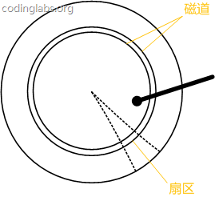 </div><br>

盘片被划分成一系列同心环，圆心是盘片中心，每个同心环叫做一个磁道，所有半径相同的磁道组成一个柱面。磁道被沿半径线划分成一个个小的段，每个段叫做一个扇区，每个扇区是磁盘的最小存储单元。为了简单起见，我们下面假设磁盘只有一个盘片和一个磁头。

当需要从磁盘读取数据时，系统会将数据逻辑地址传给磁盘，磁盘的控制电路按照寻址逻辑将逻辑地址翻译成物理地址，即确定要读的数据在哪个磁道，哪个扇区。为了读取这个扇区的数据，需要将磁头放到这个扇区上方，为了实现这一点，磁头需要移动对准相应磁道，这个过程叫做寻道，所耗费时间叫做寻道时间，然后磁盘旋转将目标扇区旋转到磁头下，这个过程耗费的时间叫做旋转时间。

#### 局部性原理与磁盘预读

由于存储介质的特性，磁盘本身存取就比主存慢很多，再加上机械运动耗费，磁盘的存取速度往往是主存的几百分分之一，因此为了提高效率，要尽量减少磁盘I/O。为了达到这个目的，磁盘往往不是严格按需读取，而是每次都会预读，即使只需要一个字节，磁盘也会从这个位置开始，顺序向后读取一定长度的数据放入内存。这样做的理论依据是计算机科学中著名的局部性原理：

当一个数据被用到时，其附近的数据也通常会马上被使用。

程序运行期间所需要的数据通常比较集中。

由于磁盘顺序读取的效率很高（不需要寻道时间，只需很少的旋转时间），因此对于具有局部性的程序来说，预读可以提高I/O效率。

预读的长度一般为页（page）的整倍数。页是计算机管理存储器的逻辑块，硬件及操作系统往往将主存和磁盘存储区分割为连续的大小相等的块，每个存储块称为一页（在许多操作系统中，页得大小通常为4k），主存和磁盘以页为单位交换数据。当程序要读取的数据不在主存中时，会触发一个缺页异常，此时系统会向磁盘发出读盘信号，磁盘会找到数据的起始位置并向后连续读取一页或几页载入内存中，然后异常返回，程序继续运行。

<div align="center">  </div><br>

##### 磁盘和内存的交互

MySQL中磁盘的数据需要被交换到内存，才能完成一次SQL交互，大致如图：

<div align="center">  </div><br>

- 扇区是硬盘的读写的基本单位，通常情况下每个扇区的大小是 512B
- 磁盘块文件系统读写数据的最小单位，相邻的扇区组合在一起形成一个块，一般是4KB
- 页是内存的最小存储单位，页的大小通常为磁盘块大小的 2^n 倍
- InnoDB页面的默认大小是16KB，是数倍个操作系统的页

<div align="center">  </div><br>

### Mysql 索引底层数据结构选型

#### 哈希表（Hash）

哈希表是做数据快速检索的有效利器。

哈希算法：也叫散列算法，就是把任意值(key)通过哈希函数变换为固定长度的 key 地址，通过这个地址进行具体数据的数据结构。

<div align="center">  </div><br>

考虑这个数据库表 user，表中一共有 7 个数据，我们需要检索 id=7 的数据，SQL 语法是：

```sql
select * fromuserwhereid=7;
```

哈希算法首先计算存储 id=7 的数据的物理地址 addr=hash(7)=4231，而 4231 映射的物理地址是 0x77，0x77 就是 id=7 存储的额数据的物理地址，通过该独立地址可以找到对应 user_name='g'这个数据。这就是哈希算法快速检索数据的计算过程。

但是哈希算法有个数据碰撞的问题，也就是哈希函数可能对不同的 key 会计算出同一个结果，比如 hash(7)可能跟 hash(199)计算出来的结果一样，也就是不同的 key 映射到同一个结果了，这就是碰撞问题。解决碰撞问题的一个常见处理方式就是链地址法，即用链表把碰撞的数据接连起来。计算哈希值之后，还需要检查该哈希值是否存在碰撞数据链表，有则一直遍历到链表尾，直达找到真正的 key 对应的数据为止。

<div align="center">  </div><br>

<div align="center">  </div><br>

从算法时间复杂度分析来看，哈希算法时间复杂度为 O（1），检索速度非常快。比如查找 id=7 的数据，哈希索引只需要计算一次就可以获取到对应的数据，检索速度非常快。但是 Mysql 并没有采取哈希作为其底层算法，这是为什么呢？

因为考虑到数据检索有一个常用手段就是范围查找，比如以下这个 SQL 语句：

```sql
select * fromuserwhereid >3;
```

针对以上这个语句，我们希望做的是找出 id>3 的数据，这是很典型的范围查找。如果使用哈希算法实现的索引，范围查找怎么做呢？一个简单的思路就是一次把所有数据找出来加载到内存，然后再在内存里筛选筛选目标范围内的数据。但是这个范围查找的方法也太笨重了，没有一点效率而言。

所以，使用哈希算法实现的索引虽然可以做到快速检索数据，但是没办法做数据高效范围查找，因此哈希索引是不适合作为 Mysql 的底层索引的数据结构。

#### 二叉搜索树：

二叉搜索树是一种支持数据快速查找的数据结构

1、所有非叶子结点至多拥有两个儿子（Left和Right）；

2、所有结点存储一个关键字；

3、非叶子结点的左指针指向小于其关键字的子树，右指针指向大于其关键字的子树；

如：

<div align="center">  </div><br>

B树的搜索，从根结点开始，如果查询的关键字与结点的关键字相等，那么就命中；否则，如果查询关键字比结点关键字小，就进入左儿子；如果比结点关键字大，就进入右儿子；如果左儿子或右儿子的指针为空，则报告找不到相应的关键字；

​    如果B树的所有非叶子结点的左右子树的结点数目均保持差不多（平衡），那么B树的搜索性能逼近二分查找；但它比连续内存空间的二分查找的优点是，改变B树结构（插入与删除结点）不需要移动大段的内存数据，甚至通常是常数开销。如：

<div align="center">  </div><br>

<div align="center">  </div><br>

右边也是一个B树，但它的搜索性能已经是线性的了；同样的关键字集合有可能导致不同的树结构索引；所以，使用B树还要考虑尽可能让B树保持左图的结构，和避免右图的结构，也就是所谓的“平衡”问题；  

<div align="center">  </div><br>

二叉查找树的时间复杂度是 O(lgn)，比如针对上面这个二叉树结构，我们需要计算比较 3 次就可以检索到 id=7 的数据，相对于直接遍历查询省了一半的时间，从检索效率上看来是能做到高速检索的。此外二叉树的结构能不能解决哈希索引不能提供的范围查找功能呢？

答案是可以的。观察上面的图，二叉树的叶子节点都是按序排列的，从左到右依次升序排列，如果我们需要找 id>5 的数据，那我们取出节点为 6 的节点以及其右子树就可以了，范围查找也算是比较容易实现。

但是普通的二叉查找树有个致命缺点：极端情况下会退化为线性链表，二分查找也会退化为遍历查找，时间复杂退化为 O（N），检索性能急剧下降。比如以下这个情况，二叉树已经极度不平衡了，已经退化为链表了，检索速度大大降低。此时检索 id=7 的数据的所需要计算的次数已经变为 7 了。

<div align="center">  </div><br>

在数据库中，数据的自增是一个很常见的形式，比如一个表的主键是 id，而主键一般默认都是自增的，如果采取二叉树这种数据结构作为索引，那上面介绍到的不平衡状态导致的线性查找的问题必然出现。因此，简单的二叉查找树存在不平衡导致的检索性能降低的问题，是不能直接用于实现 Mysql 底层索引的。

#### AVL 树和红黑树

二叉查找树存在不平衡问题，因此学者提出通过树节点的自动旋转和调整，让二叉树始终保持基本平衡的状态，就能保持二叉查找树的最佳查找性能了。基于这种思路的自调整平衡状态的二叉树有 AVL 树和红黑树。

首先简单介绍红黑树，这是一颗会自动调整树形态的树结构，比如当二叉树处于一个不平衡状态时，红黑树就会自动左旋右旋节点以及节点变色，调整树的形态，使其保持基本的平衡状态（时间复杂度为 O（logn）），也就保证了查找效率不会明显减低。比如从 1 到 7 升序插入数据节点，如果是普通的二叉查找树则会退化成链表，但是红黑树则会不断调整树的形态，使其保持基本平衡状态，如下图所示。下面这个红黑树下查找 id=7 的所要比较的节点数为 4，依然保持二叉树不错的查找效率。

红黑树拥有不错的平均查找效率，也不存在极端的 O(n)情况，那红黑树作为 Mysql 底层索引实现是否可以呢？其实红黑树也存在一些问题，观察下面这个例子。

红黑树顺序插入 1~7 个节点，查找 id=7 时需要计算的节点数为 4。

<div align="center">  </div><br>

红黑树顺序插入 1~16 个节点，查找 id=16 需要比较的节点数为 6 次。观察一下这个树的形态，是不是当数据是顺序插入时，树的形态一直处于“右倾”的趋势呢？从根本上上看，红黑树并没有完全解决二叉查找树虽然这个“右倾”趋势远没有二叉查找树退化为线性链表那么夸张，但是数据库中的基本主键自增操作，主键一般都是数百万数千万的，如果红黑树存在这种问题，对于查找性能而言也是巨大的消耗，我们数据库不可能忍受这种无意义的等待的。

<div align="center">  </div><br>

现在考虑另一种更为严格的自平衡二叉树 AVL 树。因为 AVL 树是个绝对平衡的二叉树，因此他在调整二叉树的形态上消耗的性能会更多。

AVL 树顺序插入 1~7 个节点，查找 id=7 所要比较节点的次数为 3。

<div align="center"> 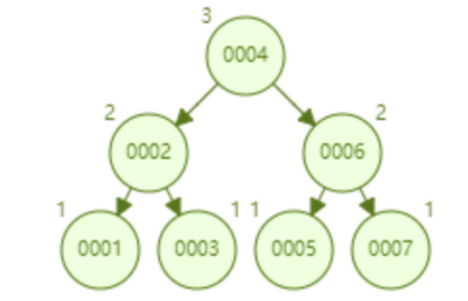 </div><br>

AVL 树顺序插入 1~16 个节点，查找 id=16 需要比较的节点数为 4。从查找效率而言，AVL 树查找的速度要高于红黑树的查找效率（AVL 树是 4 次比较，红黑树是 6 次比较）。从树的形态看来，AVL 树不存在红黑树的“右倾”问题。也就是说，大量的顺序插入不会导致查询性能的降低，这从根本上解决了红黑树的问题。

<div align="center"> 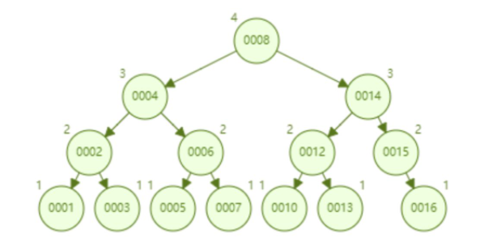 </div><br>

总结一下 AVL 树的优点：

1. 不错的查找性能（O（logn）），不存在极端的低效查找的情况。
2. 可以实现范围查找、数据排序。

看起来 AVL 树作为数据查找的数据结构确实很不错，但是 AVL 树并不适合做 Mysql 数据库的索引数据结构，因为考虑一下这个问题：

数据库查询数据的瓶颈在于磁盘 IO，如果使用的是 AVL 树，我们每一个树节点只存储了一个数据，我们一次磁盘 IO 只能取出来一个节点上的数据加载到内存里，那比如查询 id=7 这个数据我们就要进行磁盘 IO 三次，这是多么消耗时间的。所以我们设计数据库索引时需要首先考虑怎么尽可能减少磁盘 IO 的次数。

磁盘 IO 有个有个特点，就是从磁盘读取 1B 数据和 1KB 数据所消耗的时间是基本一样的，我们就可以根据这个思路，我们可以在一个树节点上尽可能多地存储数据，一次磁盘 IO 就多加载点数据到内存，这就是 B 树，B+树的的设计原理了。

#### B-树

 **什么是B树**

**具体讲解之前，有一点，再次强调下：有的文章里出现的B-树，即为B树。因为B树的原英文名称为B-tree，而国内很多人喜欢把B-tree译作B-树，其实，这是个非常不好的直译，很容易让人产生误解。如人们可能会以为B-树是一种树，而B树又是一种一种树。而事实上是，B-tree就是指的B树。特此说明。**

我们知道，B 树是为了磁盘或其它存储设备（用于对外查找）而设计的一种多叉（下面你会看到，相对于二叉，B树每个内结点有多个分支，即多叉）平衡查找树。与红黑树很相似，但在降低磁盘I/0操作方面要更好一些。许多数据库系统都一般使用B树或者B树的各种变形结构。

 B树与红黑树最大的不同在于，B树的结点可以有许多子女，从几个到几千个。那为什么又说B树与红黑树很相似呢?因为与红黑树一样，一棵含n个结点的B树的高度也为O（lgn），但可能比一棵红黑树的高度小许多，应为它的分支因子比较大。所以，B树可以在O（logn）时间内，实现各种如插入（insert），删除（delete）等动态集合操作。

- 阶数：一个节点最多有多少个孩子节点。(一般用字母m表示)
- 关键字：节点上的数值就是关键字
- 度：一个节点拥有的子节点的数量。

如下图所示，即是一棵B树，一棵关键字为英语中辅音字母的B树，现在要从树种查找字母R（包含n[x]个关键字的内结点x，x有n[x]+1]个子女（也就是说，一个内结点x若含有n[x]个关键字，那么x将含有n[x]+1个子女）。所有的叶结点都处于相同的深度，带阴影的结点为查找字母R时要检查的结点）：

<div align="center">  </div><br>

相信，从上图你能轻易的看到，一个内结点x若含有n[x]个关键字，那么x将含有n[x]+1个子女。如含有2个关键字D H的内结点有3个子女，而含有3个关键字Q T X的内结点有4个子女。

B树的定义，从下文中，你将看到，或者是用阶，或者是用度，如下段文字所述：
Unfortunately, the literature on [B-trees](http://en.wikipedia.org/wiki/Btree#Technical_description) is not uniform in its use of terms relating to B-Trees. (Folk & Zoellick 1992, p. 362) Bayer & McCreight (1972), Comer (1979), and others define the order of B-tree as the minimum number of keys in a non-root node. Folk & Zoellick (1992) points out that terminology is ambiguous because the maximum number of keys is not clear. An order 3 B-tree might hold a maximum of 6 keys or a maximum of 7 keys. (Knuth 1998,TAOCP p. 483) avoids the problem by defining the order to be maximum number of children (which is one more than the maximum number of keys).

<div align="center">  </div><br>

用阶定义的B树：B 树又叫平衡多路查找树。一棵m阶的B 树 (注：切勿简单的认为一棵m阶的B树是m叉树，虽然存在四叉树，八叉树，KD树，及vp/R树/R*树/R+树/X树/M树/线段树/希尔伯特R树/优先R树等空间划分树，但与B树完全不等同)的特性如下：

- 树中每个结点最多含有m个孩子（m>=2）；
- 除根结点和叶子结点外，其它每个结点至少有[ceil(m / 2)]个孩子（其中ceil(x)是一个取上限的函数）；
- 若根结点不是叶子结点，则至少有2个孩子（特殊情况：没有孩子的根结点，即根结点为叶子结点，整棵树只有一个根节点）；
- 所有叶子结点都出现在同一层，叶子结点不包含任何关键字信息(可以看做是外部接点或查询失败的接点，实际上这些结点不存在，指向这些结点的指针都为null)；（读者反馈@冷岳：这里有错，叶子节点只是没有孩子和指向孩子的指针，这些节点也存在，也有元素。@研究者July：其实，关键是把什么当做叶子结点，因为如红黑树中，每一个NULL指针即当做叶子结点，只是没画出来而已）。
- 每个非终端结点中包含有n个关键字信息： (n，P0，K1，P1，K2，P2，......，Kn，Pn)。其中：
      a)   Ki (i=1...n)为关键字，且关键字按顺序升序排序K(i-1)< Ki。
      b)   Pi为指向子树根的接点，且指针P(i-1)指向子树种所有结点的关键字均小于Ki，但都大于K(i-1)。 
      c)   关键字的个数n必须满足： [ceil(m / 2)-1]<= n <= m-1。如下图所示：

<div align="center">  </div><br>

 用度定义的B树：  针对上面的5点，再阐述下：B树中每一个结点能包含的关键字（如之前上面的D H和Q T X）数有一个上界和下界。这个下界可以用一个称作B树的最小度数（算法导论中文版上译作度数，最小度数即内节点中节点最小孩子数目）m（m>=2）表示。

- 每个非根的内结点至多有m个子女，每个非根的结点必须至少含有m-1个关键字，如果树是非空的，则根结点至少包含一个关键字；
- 每个结点可包含至多2m-1个关键字。所以一个内结点至多可有2m个子女。如果一个结点恰好有2m-1个关键字，我们就说这个结点是满的（而稍后介绍的B*树作为B树的一种常用变形，B*树中要求每个内结点至少为2/3满，而不是像这里的B树所要求的至少半满）；
- 当关键字数m=2（t=2的意思是，mmin=2，m可以>=2）时的B树是最简单的（有很多人会因此误认为B树就是二叉查找树，但二叉查找树就是二叉查找树，B树就是B树，B树是一棵含有m（m>=2）个关键字的平衡多路查找树），此时，每个内结点可能因此而含有2个、3个或4个子女，亦即一棵2-3-4树，然而在实际中，通常采用大得多的t值。

B树中的每个结点根据实际情况可以包含大量的关键字信息和分支(当然是不能超过磁盘块的大小，根据磁盘驱动(disk drives)的不同，一般块的大小在1k~4k左右)；这样树的深度降低了，这就意味着查找一个元素只要很少结点从外存磁盘中读入内存，很快访问到要查找的数据。

**B树的类型和节点定义**

B树的类型和节点定义如下图所示：

<div align="center">  </div><br>

<div align="center">  </div><br>

**文件查找的具体过程(**涉及磁盘IO操作**)**

为了简单，这里用少量数据构造一棵3叉树的形式，实际应用中的B树结点中关键字很多的。上面的图中比如根结点，其中17表示一个磁盘文件的文件名；小红方块表示这个17文件内容在硬盘中的存储位置；p1表示指向17左子树的指针。

其结构可以简单定义为：

```C
typedef struct {
    /*文件数*/

    int  file_num;

    /*文件名(key)*/

    char * file_name[max_file_num];

    /*指向子节点的指针*/

     BTNode * BTptr[max_file_num+1];

     /*文件在硬盘中的存储位置*/

     FILE_HARD_ADDR offset[max_file_num];

}BTNode;
```

假如每个盘块可以正好存放一个B树的结点（正好存放2个文件名）。那么一个BTNODE结点就代表一个盘块，而子树指针就是存放另外一个盘块的地址。

下面，咱们来模拟下查找文件29的过程：

1. 根据根结点指针找到文件目录的根磁盘块1，将其中的信息导入内存。【磁盘IO操作 1次】    、
2. 此时内存中有两个文件名17、35和三个存储其他磁盘页面地址的数据。根据算法我们发现：17<29<35，因此我们找到指针p2。
3. 根据p2指针，我们定位到磁盘块3，并将其中的信息导入内存。【磁盘IO操作 2次】    
4. 此时内存中有两个文件名26，30和三个存储其他磁盘页面地址的数据。根据算法我们发现：26<29<30，因此我们找到指针p2。
5. 根据p2指针，我们定位到磁盘块8，并将其中的信息导入内存。【磁盘IO操作 3次】    
6. 此时内存中有两个文件名28，29。根据算法我们查找到文件名29，并定位了该文件内存的磁盘地址。

分析上面的过程，发现需要3次磁盘IO操作和3次内存查找操作。关于内存中的文件名查找，由于是一个有序表结构，可以利用折半查找提高效率。至于IO操作是影响整个B树查找效率的决定因素。

当然，如果我们使用平衡二叉树的磁盘存储结构来进行查找，磁盘4次，最多5次，而且文件越多，B树比平衡二叉树所用的磁盘IO操作次数将越少，效率也越高。

**B树的高度**

  根据上面的例子我们可以看出，对于辅存做IO读的次数取决于B树的高度。而B树的高度由什么决定的呢？

若B树某一非叶子节点包含N个关键字，则此非叶子节点含有N+1个孩子结点，而所有的叶子结点都在第I层，我们可以得出：

1. 因为根至少有两个孩子，因此第2层至少有两个结点。

2. 除根和叶子外，其它结点至少有┌m/2┐个孩子，

3. 因此在第3层至少有2┌m/2┐个结点，

4. 在第4层至少有2(┌m/2┐^2)个结点，

5. 在第 I 层至少有2(┌m/2┐^(l-2) )个结点，于是有： N+1 ≥ 2┌m/2┐I-2；

6. 考虑第L层的结点个数为N+1，那么2*(┌m/2┐^(l-2)）≤N+1，也就是L层的最少结点数刚好达到N+1个，即： I≤ log┌m/2┐((N+1)/2 )+2；

   所以

- 当B树包含N个关键字时，B树的最大高度为l-1（因为计算B树高度时，叶结点所在层不计算在内），即：l - 1 = log┌m/2┐((N+1)/2 )+1。这个B树的高度公式从侧面显示了B树的查找效率是相当高的。


曾在一次面试中被问到，一棵含有N个总关键字数的m阶的B树的最大高度是多少?答曰：log_ceil（m/2）(N+1)/2 + 1 （上面中关于m阶B树的第1点特性已经提到：树中每个结点含有最多含有m个孩子，即m满足：ceil(m/2)<=m<=m。而树中每个结点含孩子数越少，树的高度则越大，故如此）。在2012微软4月份的笔试中也问到了此问题。

此外，还有读者反馈，说上面的B树的高度计算公式与算法导论一书上的不同，而后我特意翻看了算法导论第18章关于B树的高度一节的内容，如下图所示：

<div align="center"> 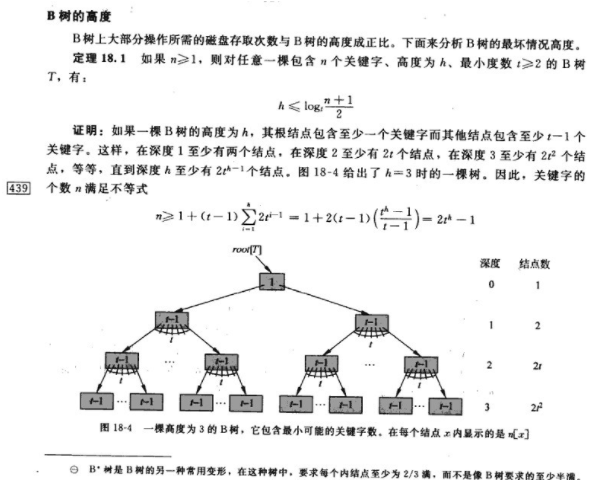 </div><br>

在上图中书上所举的例子中，也许，根据我们大多数人的理解，它的高度应该是4，而书上却说的是“一棵高度为3的B树”。我想，此时，你也就明白了，算法导论一书上的高度的定义是从“0”开始计数的，而我们中国人的习惯是树的高度是从“1”开始计数的。特此说明。

---

B-树是一种多路搜索树（并不是二叉的），一颗m阶的B-树，有以下特征：：

1、定义任意非叶子结点最多只有M个儿子；且M>2；

2、**根结点**的儿子数为[2, M]；

3、除根结点以外的非叶子结点的儿子数为[M/2, M]，向上取整；

4、每个结点存放至少 Math.ceil(m/2)-1 和至多 M-1 个关键字；（至少2个关键字）

5、非叶子结点的关键字个数=指向儿子的**指针个数**-1；结合第二条（根节点的关键字的个数至少为1）

6、非叶子结点的关键字：K[1], K[2], …, K[M-1]；且K[i] < K[i+1]；k个关键字把节点拆成k+1段，分别指向k+1个儿子，同时满足查找树的大小关系。

7、非叶子结点的指针：P[1], P[2], …, P[M]；其中P[1]指向关键字小于K[1]的子树，P[M]指向关键字大于K[M-1]的子树，其它P[i]指向关键字属于(K[i-1], K[i])的子树；

8、所有叶子结点位于同一层；

如：（M=3）

<div align="center">  </div><br>

B-树的搜索，从根结点开始，对结点内的关键字（有序）序列进行二分查找，如果命中则结束，否则进入查询关键字所属范围的儿子结点；重复，直到所对应的儿子指针为空，或已经是叶子结点；

B-树的特性：

1. 关键字集合分布在整颗树中；
2. 任何一个关键字出现且只出现在一个结点中；
3. 搜索有可能在非叶子结点结束；
4. 其搜索性能等价于在关键字全集内做一次二分查找；
5. 自动层次控制；
6. 优秀检索速度，时间复杂度：B 树的查找性能等于 O（h*logn），其中 h 为树高，n 为每个节点关键词的个数；
7. 尽可能少的磁盘 IO，加快了检索速度；
8. 可以支持范围查找。

由于限制了除根结点以外的非叶子结点，至少含有M/2个儿子，确保了结点的至少利用率：

<div align="center">  </div><br>

所以B-树的性能总是等价于二分查找（与M值无关），也就没有B树平衡的问题；[37 个 MySQL 数据库小技巧，](http://mp.weixin.qq.com/s?__biz=MzI3ODcxMzQzMw==&mid=2247487061&idx=1&sn=0dfc867eb90bb9f79d45faf3d2a470ec&chksm=eb538b63dc2402754308364cae71988ed083c85fe6b26e01ce1dda5c183065d2199c9c3912c5&scene=21#wechat_redirect)推荐大家看下。

由于M/2的限制，在插入结点时，如果结点已满，需要将结点分裂为两个各占M/2的结点；删除结点时，需将两个不足M/2的兄弟结点合并；

#### **B+树**

B+-tree：是应文件系统所需而产生的一种B-tree的变形树。

一棵m阶的B+树和m阶的B树的异同点在于：

  1.有n棵子树的结点中含有n-1 个关键字； (此处颇有争议，B+树到底是与B 树n棵子树有n-1个关键字 保持一致，还是不一致：B树n棵子树的结点中含有n个关键字，待后续查证。暂先提供两个参考链接：①wikipedia http://en.wikipedia.org/wiki/B%2B_tree#Overview；②http://hedengcheng.com/?p=525。而下面B+树的图尚未最终确定是否有问题，请读者注意)

  2.所有的叶子结点中包含了全部关键字的信息，及指向含有这些关键字记录的指针，且叶子结点本身依关键字的大小自小而大的顺序链接。 (而B 树的叶子节点并没有包括全部需要查找的信息)

  3.所有的非终端结点可以看成是索引部分，结点中仅含有其子树根结点中最大（或最小）关键字。 (而B 树的非终节点也包含需要查找的有效信息)

<div align="center">  </div><br>

---

B+树是B-树的变体，也是一种多路搜索树，一棵m阶的B+树主要有这些特点：：

1、其定义基本与B-树同，除了：

2、非叶子结点的子树指针与关键字个数相同；

3、非叶子结点的子树指针P[i]，指向关键字值属于[K[i], K[i+1])的子树（B-树是开区间）；

5、为所有叶子结点增加一个链指针；

6、所有关键字都在叶子结点出现；

7、有k个子树的中间节点包含有k个元素（B树中是k-1个元素），每个元素不保存数据，只用来索引，所有数据都保存在叶子节点。

8、B-树中任何一个关键字出现且只出现在一个结点中，而B+树可以出现多次。

B+的搜索与B-树也基本相同，区别是B+树只有达到叶子结点才命中（B-树可以在非叶子结点命中），其性能也等价于在关键字全集做一次二分查找；

B+的特性：

1、所有关键字都出现在叶子结点的链表中（稠密索引），且链表中的关键字恰好是有序的；

2、不可能在非叶子结点命中；

3、非叶子结点相当于是叶子结点的索引（稀疏索引），叶子结点相当于是存储（关键字）数据的数据层；

4、更适合文件索引系统。

#### B*tree

B-tree是B+-tree的变体，在B+树的基础上(所有的叶子结点中包含了全部关键字的信息，及指向含有这些关键字记录的指针)，B树中非根和非叶子结点再增加指向兄弟的指针；B树定义了非叶子结点关键字个数至少为(2/3)M，即块的最低使用率为2/3（代替B+树的1/2）。给出了一个简单实例，如下图所示：

<div align="center">  </div><br>

B+树的分裂：当一个结点满时，分配一个新的结点，并将原结点中1/2的数据复制到新结点，最后在父结点中增加新结点的指针；B+树的分裂只影响原结点和父结点，而不会影响兄弟结点，所以它不需要指向兄弟的指针。

B*树的分裂：当一个结点满时，如果它的下一个兄弟结点未满，那么将一部分数据移到兄弟结点中，再在原结点插入关键字，最后修改父结点中兄弟结点的关键字（因为兄弟结点的关键字范围改变了）；如果兄弟也满了，则在原结点与兄弟结点之间增加新结点，并各复制1/3的数据到新结点，最后在父结点增加新结点的指针。

所以，B*树分配新结点的概率比B+树要低，空间使用率更高。

B树：有序数组+平衡多叉树；

B+树：有序数组链表+平衡多叉树；

B*树：一棵丰满的B+树。

**B 树和 B+树有什么不同呢？**

第一，B 树一个节点里存的是数据，而 B+树存储的是索引（地址），所以 B 树里一个节点存不了很多个数据，但是 B+树一个节点能存很多索引，B+树叶子节点存所有的数据。

第二，B+树的叶子节点是数据阶段用了一个链表串联起来，便于范围查找。

通过 B 树和 B+树的对比我们看出，B+树节点存储的是索引，在单个节点存储容量有限的情况下，单节点也能存储大量索引，使得整个 B+树高度降低，减少了磁盘 IO。其次，B+树的叶子节点是真正数据存储的地方，叶子节点用了链表连接起来，这个链表本身就是有序的，在数据范围查找时，更具备效率。因此 Mysql 的索引用的就是 B+树，B+树在查找效率、范围查找中都有着非常不错的性能。

### 树的分析

#### 平衡二叉树

树形结构是计算机系统里最重要的数据结构。

我们知道，二叉树的查找的时间复杂度是O(log2N)，其查找效率与深度有关，而普通的二叉树可能由于内部节点排列问题退化成链表，这样查找效率就会很低。因此平衡二叉树是更好的选择，因为它保持平衡，即通过旋转调整结构保持最小的深度。其查找的时间复杂度也是O(log2N)。

但实际上，数据库中索引的结构也并非AVL树或更优秀的红黑树，尽管它的查询的时间复杂度很低。

#### 为什么平衡二叉树也不适合作为索引

之前说了平衡树的查找时间复杂度是O(log2N)，已经很不错了，但还是不适合作为索引结构。那么肯定是有一种更适合作为索引的数据结构。那么这个更适合作为索引的数据结构，难道是查找的时间复杂度更低吗？并不是。这种作为索引的数据结构的查找的时间复杂度也近似O(log2N)。

那为什么平衡二叉树不适合作为索引呢？

索引是存在于索引文件中，是存在于磁盘中的。因为索引通常是很大的，因此无法一次将全部索引加载到内存当中，因此每次只能从磁盘中读取一个磁盘页的数据到内存中。而这个磁盘的读取的速度较内存中的读取速度而言是差了好几个级别。

注意，我们说的平衡二叉树结构，指的是逻辑结构上的平衡二叉树，其物理实现是数组。然后由于在逻辑结构上相近的节点在物理结构上可能会差很远。因此，每次读取的磁盘页的数据中有许多是用不上的。因此，查找过程中要进行许多次的磁盘读取操作。

而适合作为索引的结构应该是尽可能少的执行磁盘IO操作，因为执行磁盘IO操作非常的耗时。因此，平衡二叉树并不适合作为索引结构。

#### B-Tree适合作为索引

平衡二叉树不适合作为索引。那么什么才适合作为索引——B树。

平衡二叉树没能充分利用磁盘预读功能，而B树是为了充分利用磁盘预读功能来而创建的一种数据结构，也就是说B树就是为了作为索引才被发明出来的的。

来看看关于“局部性原理与磁盘预读”的知识：

> 局部性原理与磁盘预读：
>
> > 由于存储介质的特性，磁盘本身存取就比主存慢很多，再加上机械运动耗费，磁盘的存取速度往往是主存的几百分分之一，因此为了提高效率，要尽量减少磁盘I/O。为了达到这个目的，磁盘往往不是严格按需读取，而是每次都会预读，即使只需要一个字节，磁盘也会从这个位置开始，顺序向后读取一定长度的数据放入内存。这样做的理论依据是计算机科学中著名的局部性原理： 
> > 当一个数据被用到时，其附近的数据也通常会马上被使用。 
> > 程序运行期间所需要的数据通常比较集中。 
> > 由于磁盘顺序读取的效率很高（不需要寻道时间，只需很少的旋转时间），因此对于具有局部性的程序来说，预读可以提高I/O效率。

搞清楚上面的意思。磁盘预读是具体实现，其理论依据是局部性原理。

为什么说红黑树没能充分利用磁盘预读功能，引用一篇博文的一段话：

> 红黑树这种结构，h明显要深的多。由于逻辑上很近的节点（父子）物理上可能很远，无法利用局部性，所以红黑树的I/O渐进复杂度也为O(h)，效率明显比B-Tree差很多。

也就是说，使用红黑树（平衡二叉树）结构的话，每次磁盘预读中的很多数据是用不上的数据。因此，它没能利用好磁盘预读的提供的数据。然后又由于深度大（较B树而言），所以进行的磁盘IO操作更多。

B树的每个节点可以存储多个关键字，它将节点大小设置为磁盘页的大小，充分利用了磁盘预读的功能。每次读取磁盘页时就会读取一整个节点。也正因每个节点存储着非常多个关键字，树的深度就会非常的小。进而要执行的磁盘读取操作次数就会非常少，更多的是在内存中对读取进来的数据进行查找。

B树的查询，主要发生在内存中，而平衡二叉树的查询，则是发生在磁盘读取中。因此，虽然B树查询查询的次数不比平衡二叉树的次数少，但是相比起磁盘IO速度，内存中比较的耗时就可以忽略不计了。因此，B树更适合作为索引。

#### 比B树更适合作为索引的结构——B+树

比B树更适合作为索引的结构是B+树。MySQL中也是使用B+树作为索引。它是B树的变种，因此是基于B树来改进的。为什么B+树会比B树更加优秀呢？

B+树的关键字全部存放在叶子节点中，非叶子节点用来做索引，而叶子节点中有一个指针指向一下个叶子节点。做这个优化的目的是为了提高区间访问的性能。而正是这个特性决定了B+树更适合用来存储外部数据。

引用一段话：

> 走进搜索引擎的作者梁斌老师针对B树、B+树给出了他的意见（为了真实性，特引用其原话，未作任何改动）： “B+树还有一个最大的好处，方便扫库，B树必须用中序遍历的方法按序扫库，而B+树直接从叶子结点挨个扫一遍就完了，B+树支持range-query非常方便，而B树不支持。这是数据库选用B+树的最主要原因。 
> 比如要查 5-10之间的，B+树一把到5这个标记，再一把到10，然后串起来就行了，B树就非常麻烦。B树的好处，就是成功查询特别有利，因为树的高度总体要比B+树矮。不成功的情况下，B树也比B+树稍稍占一点点便宜。 
> B树比如你的例子中查，17的话，一把就得到结果了， 
> 有很多基于频率的搜索是选用B树，越频繁query的结点越往根上走，前提是需要对query做统计，而且要对key做一些变化。 
> 另外B树也好B+树也好，根或者上面几层因为被反复query，所以这几块基本都在内存中，不会出现读磁盘IO，一般已启动的时候，就会主动换入内存。”

举个例子来对比。 
B树： 

<div align="center">  </div><br>

比如说，我们要查找关键字范围在3到7的关键字，在找到第一个符合条件的数字3后，访问完第一个关键字所在的块后，得遍历这个B树，获取下一个块，直到遇到一个不符合条件的关键字。遍历的过程是比较复杂的。

B+树： 

<div align="center">  </div><br>

相比之下，B+树的基于范围的查询简洁很多。由于叶子节点有指向下一个叶子节点的指针，因此从块1到块2的访问，通过块1指向块2的指针即可。从块2到块3也是通过一个指针即可。

> 数据库索引采用B+树的主要原因是B树在提高了磁盘IO性能的同时并没有解决元素遍历的效率低下的问题。正是为了解决这个问题，B+树应运而生。B+树只要遍历叶子节点就可以实现整棵树的遍历。而且在数据库中基于范围的查询是非常频繁的，而B树不支持这样的操作（或者说效率太低）。

正如上面所说，在数据库中基于范围的查询是非常频繁的，因此MySQL最终选择的索引结构是B+树而不是B树。

### MySQL 面试题： 

#### **为什么 MySQL 的索引要使用 B+ 树而不是其他树形结构？比如 B 树？**

- B树在提高了磁盘IO性能的同时并没有解决元素遍历的效率低下的问题。正是为了解决这个问题，B+树应运而生。B+树只要遍历叶子节点就可以实现整棵树的遍历。而且在数据库中基于范围的查询是非常频繁的，而B树不支持这样的操作（或者说效率太低）。

  - B 树不管叶子节点还是非叶子节点，都会保存数据，这样导致在非叶子节点中能保存的指针数量变少（有些资料也称为扇出）。指针少的情况下要保存大量数据，只能增加树的高度，导致 IO 操作变多，查询性能变低。
  - B+树更适合外部存储。由于内结点不存放真正的数据（只是存放其子树的最大或最小的关键字，作为索引），一个结点可以存储更多的关键字，每个结点能索引的范围更大更精确，也意味着B+树单次磁盘IO的信息量大于B树，I/O的次数相对减少。
  - MySQL是一种关系型数据库，区间访问是常见的一种情况，B+树叶结点增加的链指针，加强了区间访问性，可使用在区间查询的场景；而使用B树则无法进行区间查找。

- B+tree的磁盘读写代价更低

  B+tree的内部结点并没有指向关键字具体信息的指针。因此其内部结点相对B 树更小。如果把所有同一内部结点的关键字存放在同一盘块中，那么盘块所能容纳的关键字数量也越多。一次性读入内存中的需要查找的关键字也就越多。相对来说IO读写次数也就降低了。

  举个例子，假设磁盘中的一个盘块容纳16bytes，而一个关键字2bytes，一个关键字具体信息指针2bytes。一棵9阶B-tree(一个结点最多8个关键字)的内部结点需要2个盘快。而B+ 树内部结点只需要1个盘快。当需要把内部结点读入内存中的时候，B 树就比B+ 树多一次盘块查找时间(在磁盘中就是盘片旋转的时间)。

- B+tree的查询效率更加稳定

  由于非终结点并不是最终指向文件内容的结点，而只是叶子结点中关键字的索引。所以任何关键字的查找必须走一条从根结点到叶子结点的路。所有关键字查询的路径长度相同，导致每一个数据的查询效率相当。

#### 为什么索引结构默认使用B+树，而不是B-Tree，Hash哈希，二叉树，红黑树？

简单版回答如下：

- Hash哈希，只适合等值查询，不适合范围查询。
- 一般二叉树，可能会特殊化为一个链表，相当于全表扫描。
- 红黑树，是一种特化的平衡二叉树，MySQL 数据量很大的时候，索引的体积也会很大，内存放不下的而从磁盘读取，树的层次太高的话，读取磁盘的次数就多了。
- B-Tree，叶子节点和非叶子节点都保存数据，相同的数据量，B+树更矮壮，也是就说，相同的数据量，B+树数据结构，查询磁盘的次数会更少。

#### B-树和B+树的区别

- B-树内部节点是保存数据的;而B+树内部节点是不保存数据的，只作索引作用，它的叶子节点才保存数据。
- B+树相邻的叶子节点之间是通过链表指针连起来的，B-树却不是。
- 查找过程中，B-树在找到具体的数值以后就结束，而B+树则需要通过索引找到叶子结点中的数据才结束
- B-树中任何一个关键字出现且只出现在一个结点中，而B+树可以出现多次。

#### InnoDB一棵B+树可以存放多少行数据？

这个问题的简单回答是：约2千万行。

- 在计算机中，磁盘存储数据最小单元是扇区，一个扇区的大小是512字节。
- 文件系统中，最小单位是块，一个块大小就是4k；
- InnoDB存储引擎最小储存单元是页，一页大小就是16k。

<div align="center">  </div><br>

因为B+树叶子存的是数据，内部节点存的是键值+指针。索引组织表通过非叶子节点的二分查找法以及指针确定数据在哪个页中，进而再去数据页中找到需要的数据；

<div align="center">  </div><br>

假设B+树的高度为2的话，即有一个根结点和若干个叶子结点。这棵B+树的存放总记录数为=根结点指针数*单个叶子节点记录行数。

- 如果一行记录的数据大小为1k，那么单个叶子节点可以存的记录数 =16k/1k =16.
- 非叶子节点内存放多少指针呢？我们假设主键ID为bigint类型，长度为8字节，而指针大小在InnoDB源码中设置为6字节，所以就是8+6=14字节，16k/14B =16*1024B/14B = 1170

因此，一棵高度为2的B+树，能存放1170 * 16=18720条这样的数据记录。同理一棵高度为3的B+树，能存放1170 *1170 *16 =21902400，也就是说，可以存放两千万左右的记录。B+树高度一般为1-3层，已经满足千万级别的数据存储。

### B树的操作

**b树的插入过程**

插入操作是指插入一条记录，即（key, value）的键值对。如果B树中已存在需要插入的键值对，则用需要插入的value替换旧的value。若B树不存在这个key,则一定是在叶子结点中进行插入操作。

1）根据要插入的key的值，找到叶子结点并插入。

2）判断当前结点key的个数是否小于等于m-1，若满足则结束，否则进行第3步。

3）以结点中间的key为中心分裂成左右两部分，然后将这个中间的key插入到父结点中，这个key的左子树指向分裂后的左半部分，这个key的右子支指向分裂后的右半部分，然后将当前结点指向父结点，继续进行第3步。

下面以5阶B树为例，介绍B树的插入操作，在5阶B树中，结点最多有4个key,最少有2个key

------

a）在空树中插入39

<div align="center">  </div><br>

此时根结点就一个key，此时根结点也是叶子结点

------

b）继续插入22，97和41

<div align="center">  </div><br>

根结点此时有4个key

------

c）继续插入53

<div align="center">  </div><br>

插入后超过了最大允许的关键字个数4，所以以key值为41为中心进行分裂，结果如下图所示，分裂后当前结点指针指向父结点，满足B树条件，插入操作结束。当阶数m为偶数时，需要分裂时就不存在排序恰好在中间的key，那么我们选择中间位置的前一个key或中间位置的后一个key为中心进行分裂即可。

<div align="center">  </div><br>

------

d）依次插入13，21，40，同样会造成分裂，结果如下图所示。

<div align="center">  </div><br>

------

e）依次插入30，27, 33 ；36，35，34 ；24，29，结果如下图所示。

<div align="center">  </div><br>

---

f）插入key值为26的记录，插入后的结果如下图所示。

<div align="center">  </div><br>

当前结点需要以27为中心分裂，并向父结点进位27，然后当前结点指向父结点，结果如下图所示。

<div align="center">  </div><br>

进位后导致当前结点（即根结点）也需要分裂，分裂的结果如下图所示。

<div align="center">  </div><br>

分裂后当前结点指向新的根，此时无需调整。

------

g）最后再依次插入key为17,28,29,31,32的记录，结果如下图所示。

<div align="center">  </div><br>

在实现B树的代码中，为了使代码编写更加容易，我们可以将结点中存储记录的数组长度定义为m而非m-1，这样方便底层的结点由于分裂向上层插入一个记录时，上层有多余的位置存储这个记录。同时，每个结点还可以存储它的父结点的引用，这样就不必编写递归程序。

一般来说，对于确定的m和确定类型的记录，结点大小是固定的，无论它实际存储了多少个记录。但是分配固定结点大小的方法会存在浪费的情况，比如key为28,29所在的结点，还有2个key的位置没有使用，但是已经不可能继续在插入任何值了，因为这个结点的前序key是27,后继key是30,所有整数值都用完了。所以如果记录先按key的大小排好序，再插入到B树中，结点的使用率就会很低，最差情况下使用率仅为50%。


**b树的查找过程**


**b树的删除过程**

删除操作是指，根据key删除记录，如果B树中的记录中不存对应key的记录，则删除失败。

1）如果当前需要删除的key位于非叶子结点上，则用后继key（这里的后继key均指后继记录的意思）覆盖要删除的key，然后在后继key所在的子支中删除该后继key。此时后继key一定位于叶子结点上，这个过程和二叉搜索树删除结点的方式类似。删除这个记录后执行第2步

2）该结点key个数大于等于Math.ceil(m/2)-1，结束删除操作，否则执行第3步。

3）如果兄弟结点key个数大于Math.ceil(m/2)-1，则父结点中的key下移到该结点，兄弟结点中的一个key上移，删除操作结束。

否则，将父结点中的key下移与当前结点及它的兄弟结点中的key合并，形成一个新的结点。原父结点中的key的两个孩子指针就变成了一个孩子指针，指向这个新结点。然后当前结点的指针指向父结点，重复上第2步。

有些结点它可能即有左兄弟，又有右兄弟，那么我们任意选择一个兄弟结点进行操作即可。

下面以5阶B树为例，介绍B树的删除操作，5阶B树中，结点最多有4个key,最少有2个key

------

a）原始状态

<div align="center">  </div><br>

------

b）在上面的B树中删除21，删除后结点中的关键字个数仍然大于等2，所以删除结束。

<div align="center"> 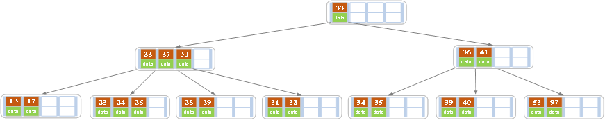 </div><br>

------

c）在上述情况下接着删除27。从上图可知27位于非叶子结点中，所以用27的后继替换它。从图中可以看出，27的后继为28，我们用28替换27，然后在28（原27）的右孩子结点中删除28。删除后的结果如下图所示。

<div align="center">  </div><br>

删除后发现，当前叶子结点的记录的个数小于2，而它的兄弟结点中有3个记录（当前结点还有一个右兄弟，选择右兄弟就会出现合并结点的情况，不论选哪一个都行，只是最后B树的形态会不一样而已），我们可以从兄弟结点中借取一个key。所以父结点中的28下移，兄弟结点中的26上移,删除结束。结果如下图所示。

<div align="center">  </div><br>

------

d）在上述情况下接着32，结果如下图。

<div align="center">  </div><br>

当删除后，当前结点中只key，而兄弟结点中也仅有2个key。所以只能让父结点中的30下移和这个两个孩子结点中的key合并，成为一个新的结点，当前结点的指针指向父结点。结果如下图所示。

<div align="center"> 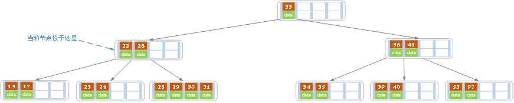 </div><br>

当前结点key的个数满足条件，故删除结束。

------

e）上述情况下，我们接着删除key为40的记录，删除后结果如下图所示。

<div align="center">  </div><br>

同理，当前结点的记录数小于2，兄弟结点中没有多余key，所以父结点中的key下移，和兄弟（这里我们选择左兄弟，选择右兄弟也可以）结点合并，合并后的指向当前结点的指针就指向了父结点。

<div align="center"> 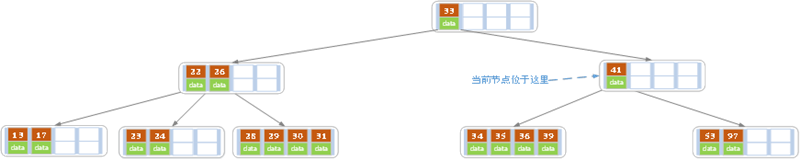 </div><br>

同理，对于当前结点而言只能继续合并了，最后结果如下所示。

<div align="center">  </div><br>

合并后结点当前结点满足条件，删除结束。

### B+树的操作

**b+树的查找过程**

<div align="center">  </div><br>

如图所示，如果要查找数据项29，那么首先会把磁盘块1由磁盘加载到内存，此时发生一次IO，在内存中用二分查找确定29在17和35之间，锁定磁盘块1的P2指针，内存时间因为非常短（相比磁盘的IO）可以忽略不计，通过磁盘块1的P2指针的磁盘地址把磁盘块3由磁盘加载到内存，发生第二次IO，29在26和30之间，锁定磁盘块3的P2指针，通过指针加载磁盘块8到内存，发生第三次IO，同时内存中做二分查找找到29，结束查询，总计三次IO。真实的情况是，3层的b+树可以表示上百万的数据，如果上百万的数据查找只需要三次IO，性能提高将是巨大的，如果没有索引，每个数据项都要发生一次IO，那么总共需要百万次的IO，显然成本非常非常高。

**b+树的插入过程**

1）若为空树，创建一个叶子结点，然后将记录插入其中，此时这个叶子结点也是根结点，插入操作结束。

2）针对叶子类型结点：根据key值找到叶子结点，向这个叶子结点插入记录。插入后，若当前结点key的个数小于等于m-1，则插入结束。否则将这个叶子结点分裂成左右两个叶子结点，左叶子结点包含前m/2个记录，右结点包含剩下的记录，将第m/2+1个记录的key进位到父结点中（父结点一定是索引类型结点），进位到父结点的key左孩子指针向左结点,右孩子指针向右结点。将当前结点的指针指向父结点，然后执行第3步。

3）针对索引类型结点：若当前结点key的个数小于等于m-1，则插入结束。否则，将这个索引类型结点分裂成两个索引结点，左索引结点包含前(m-1)/2个key，右结点包含m-(m-1)/2个key，将第m/2个key进位到父结点中，进位到父结点的key左孩子指向左结点, 进位到父结点的key右孩子指向右结点。将当前结点的指针指向父结点，然后重复第3步。

下面是一颗5阶B树的插入过程，5阶B数的结点最少2个key，最多4个key。

------

a）空树中插入5

<div align="center">  </div><br>

------

b）依次插入8，10，15

<div align="center">  </div><br>

------

c）插入16

<div align="center">  </div><br>

插入16后超过了关键字的个数限制，所以要进行分裂。在叶子结点分裂时，分裂出来的左结点2个记录，右边3个记录，中间key成为索引结点中的key，分裂后当前结点指向了父结点（根结点）。结果如下图所示。

<div align="center">  </div><br>

当然我们还有另一种分裂方式，给左结点3个记录，右结点2个记录，此时索引结点中的key就变为15。

------

d）插入17

<div align="center">  </div><br>

------

e）插入18，插入后如下图所示

<div align="center">  </div><br>

当前结点的关键字个数大于5，进行分裂。分裂成两个结点，左结点2个记录，右结点3个记录，关键字16进位到父结点（索引类型）中，将当前结点的指针指向父结点。

<div align="center"> 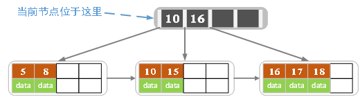 </div><br>

当前结点的关键字个数满足条件，插入结束。

------

f）插入若干数据后

<div align="center">  </div><br>

------

g）在上图中插入7，结果如下图所示

<div align="center">  </div><br>

当前结点的关键字个数超过4，需要分裂。左结点2个记录，右结点3个记录。分裂后关键字7进入到父结点中，将当前结点的指针指向父结点，结果如下图所示。

<div align="center"> 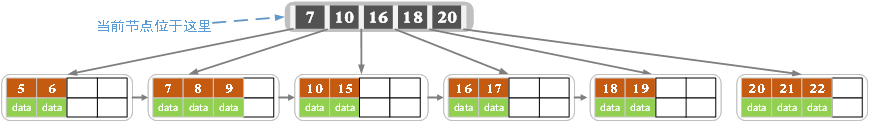 </div><br>

当前结点的关键字个数超过4，需要继续分裂。左结点2个关键字，右结点2个关键字，关键字16进入到父结点中，将当前结点指向父结点，结果如下图所示。

<div align="center">  </div><br>

当前结点的关键字个数满足条件，插入结束。

**b+树的删除过程**

如果叶子结点中没有相应的key，则删除失败。否则执行下面的步骤

1）删除叶子结点中对应的key。删除后若结点的key的个数大于等于Math.ceil(m-1)/2 – 1，删除操作结束,否则执行第2步。

2）若兄弟结点key有富余（大于Math.ceil(m-1)/2 – 1），向兄弟结点借一个记录，同时用借到的key替换父结（指当前结点和兄弟结点共同的父结点）点中的key，删除结束。否则执行第3步。

3）若兄弟结点中没有富余的key,则当前结点和兄弟结点合并成一个新的叶子结点，并删除父结点中的key（父结点中的这个key两边的孩子指针就变成了一个指针，正好指向这个新的叶子结点），将当前结点指向父结点（必为索引结点），执行第4步（第4步以后的操作和B树就完全一样了，主要是为了更新索引结点）。

4）若索引结点的key的个数大于等于Math.ceil(m-1)/2 – 1，则删除操作结束。否则执行第5步

5）若兄弟结点有富余，父结点key下移，兄弟结点key上移，删除结束。否则执行第6步

6）当前结点和兄弟结点及父结点下移key合并成一个新的结点。将当前结点指向父结点，重复第4步。

注意，通过B+树的删除操作后，索引结点中存在的key，不一定在叶子结点中存在对应的记录。

下面是一颗5阶B树的删除过程，5阶B数的结点最少2个key，最多4个key。

------

a）初始状态

<div align="center">  </div><br>

------

b）删除22,删除后结果如下图

<div align="center">  </div><br>

删除后叶子结点中key的个数大于等于2，删除结束

------

c）删除15，删除后的结果如下图所示

<div align="center">  </div><br>

删除后当前结点只有一个key,不满足条件，而兄弟结点有三个key，可以从兄弟结点借一个关键字为9的记录,同时更新将父结点中的关键字由10也变为9，删除结束。

<div align="center"> 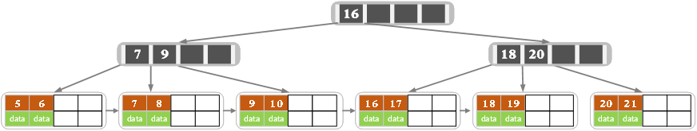 </div><br>

------

d）删除7，删除后的结果如下图所示

<div align="center">  </div><br>

当前结点关键字个数小于2，（左）兄弟结点中的也没有富余的关键字（当前结点还有个右兄弟，不过选择任意一个进行分析就可以了，这里我们选择了左边的），所以当前结点和兄弟结点合并，并删除父结点中的key，当前结点指向父结点。

<div align="center"> 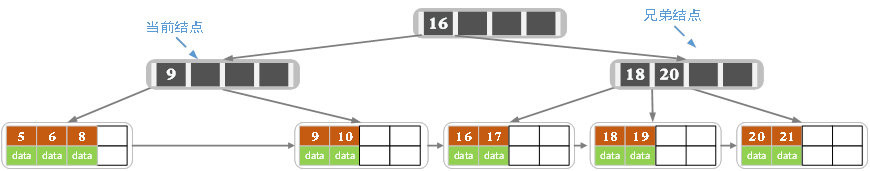 </div><br>

此时当前结点的关键字个数小于2，兄弟结点的关键字也没有富余，所以父结点中的关键字下移，和两个孩子结点合并，结果如下图所示。

<div align="center">  </div><br>

**b+树性质**

1、通过上面的分析，我们知道IO次数取决于b+数的高度h，假设当前数据表的数据为N，每个磁盘块的数据项的数量是m，则有h=㏒(m+1)N，当数据量N一定的情况下，m越大，h越小；而m = 磁盘块的大小 / 数据项的大小，磁盘块的大小也就是一个数据页的大小，是固定的，如果数据项占的空间越小，数据项的数量越多，树的高度越低。这就是为什么每个数据项，即索引字段要尽量的小，比如int占4字节，要比bigint8字节少一半。这也是为什么b+树要求把真实的数据放到叶子节点而不是内层节点，一旦放到内层节点，磁盘块的数据项会大幅度下降，导致树增高。当数据项等于1时将会退化成线性表。

2、当b+树的数据项是复合的数据结构，比如(name,age,sex)的时候，b+数是按照从左到右的顺序来建立搜索树的，比如当(张三,20,F)这样的数据来检索的时候，b+树会优先比较name来确定下一步的所搜方向，如果name相同再依次比较age和sex，最后得到检索的数据；但当(20,F)这样的没有name的数据来的时候，b+树就不知道下一步该查哪个节点，因为建立搜索树的时候name就是第一个比较因子，必须要先根据name来搜索才能知道下一步去哪里查询。比如当(张三,F)这样的数据来检索时，b+树可以用name来指定搜索方向，但下一个字段age的缺失，所以只能把名字等于张三的数据都找到，然后再匹配性别是F的数据了， 这个是非常重要的性质，即索引的最左匹配特性。


