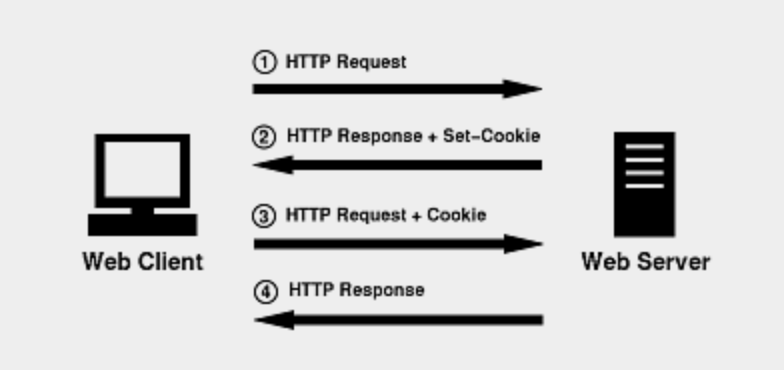
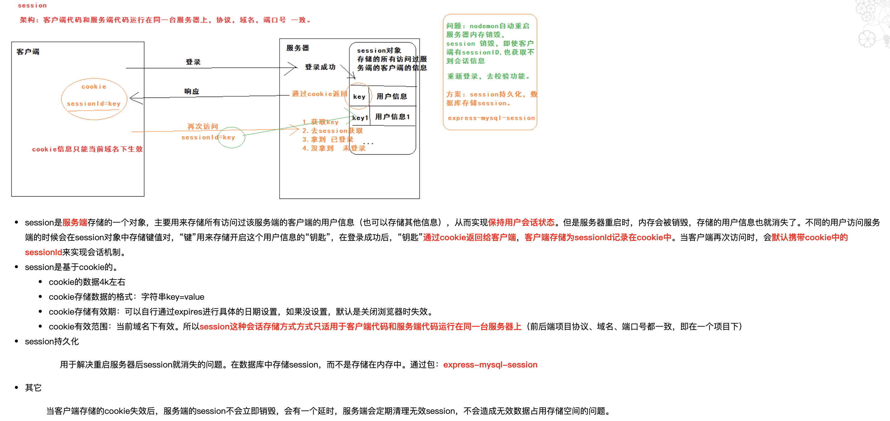
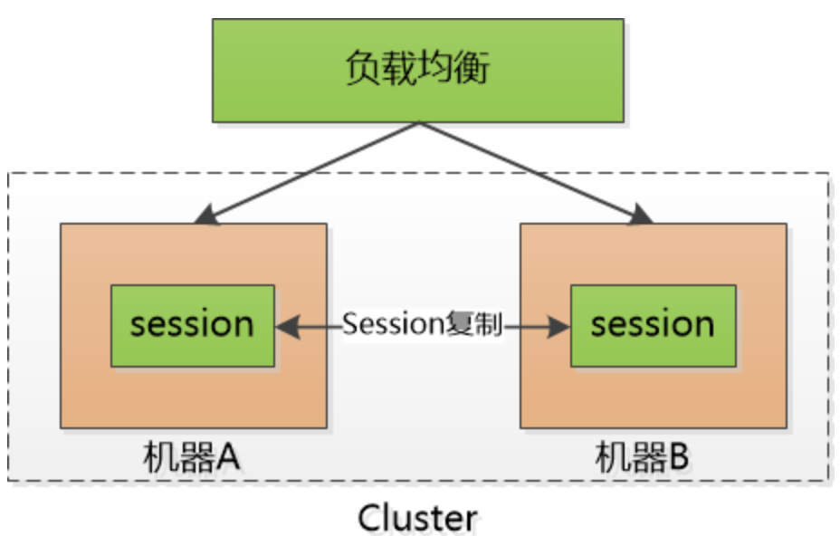
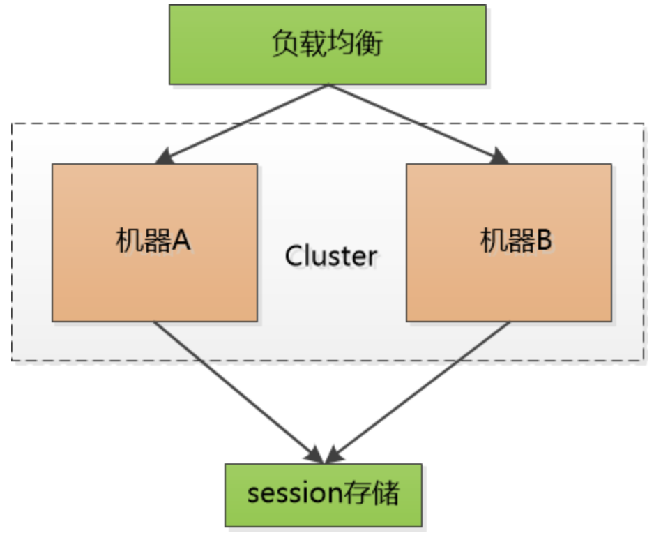
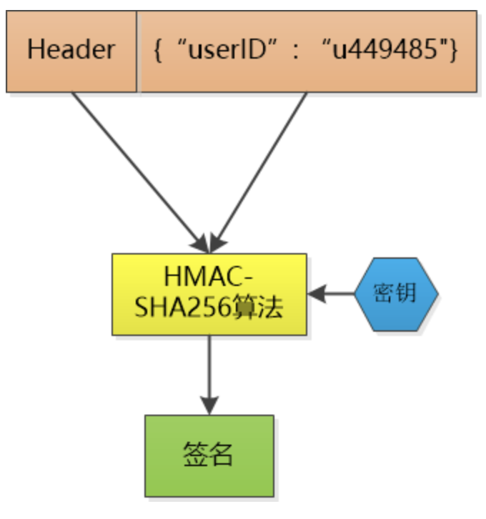
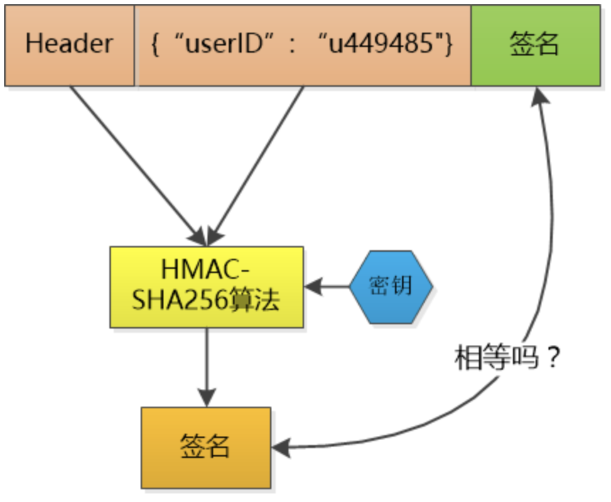
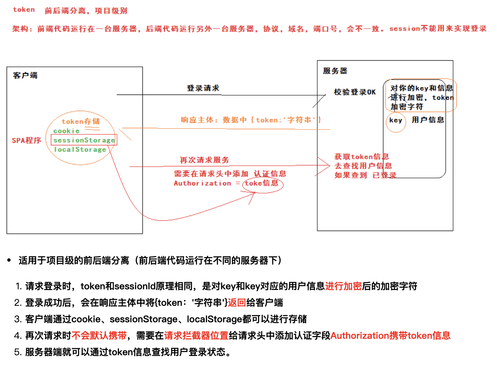
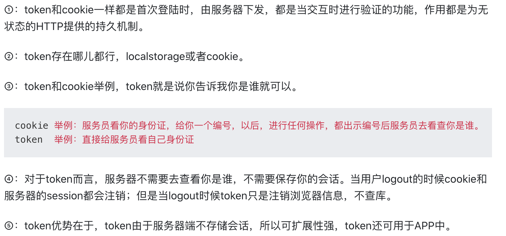

<!-- GFM-TOC -->

* [一、Cookie](#一-Cookie)
* [二、Session](#二-Session)
* [三、Token](#一-Token)

<!-- GFM-TOC -->

# 一、Cookie

**1.1 概述**

Cookie 技术产生源于 HTTP 协议在互联网上的急速发展。随着互联网时代的策马奔腾，带宽等限制不存在了，人们需要更复杂的互联网交互活动，就必须同服务器保持活动状态（简称：保活）。

于是，在浏览器发展初期，为了适应用户的需求技术上推出了各种保持 Web 浏览状态的手段，其中就包括了 Cookie 技术。Cookie 在计算机中是个存储在浏览器目录中的文本文件，当浏览器运行时，存储在 RAM 中发挥作用 （此种 Cookies 称作 Session Cookies），一旦用户从该网站或服务器退出，Cookie 可存储在用户本地的硬盘上 （此种 Cookies 称作 Persistent Cookies）。Cookie仅仅是浏览器实现的一种数据存储功能。

Cookie 起源：1993 年，网景公司雇员 Lou Montulli 为了让用户在访问某网站时，进一步提高访问速度，同时也为了进一步实现个人化网络，发明了今天广泛使用的 Cookie。

Cookie时效性：目前有些 Cookie 是临时的，有些则是在浏览器里面能永久存储的。临时的 Cookie 只在浏览器上保存一段规定的时间，一旦超过规定的时间，该 Cookie 就会被系统清除。

Cookie使用限制：Cookie 必须在 HTML 文件的内容输出之前设置；不同的浏览器 (Netscape Navigator、Internet Explorer) 对 Cookie 的处理不一致，使用时一定要考虑；客户端用户如果设置禁止 Cookie，则 Cookie 不能建立。 并且在客户端，一个浏览器能创建的 Cookie 数量最多为 300 个，并且每个不能超过 4KB，每个 Web 站点能设置的 Cookie 总数不能超过 20 个。

cookie由服务器生成，发送给浏览器，浏览器把cookie以kv形式保存到某个目录下的文本文件内，下一次请求同一网站时会把该cookie发送给服务器。由于cookie是存在客户端上的，所以浏览器加入了一些限制确保cookie不会被恶意使用，同时不会占据太多磁盘空间，所以每个域的cookie数量是有限的。

**HTTP 是无状态的协议（对于事务处理没有记忆能力，每次客户端和服务端会话完成时，服务端不会保存任何会话信息**）：每个请求都是完全独立的，服务端无法确认当前访问者的身份信息，无法分辨上一次的请求发送者和这一次的发送者是不是同一个人。所以服务器与浏览器为了进行会话跟踪（知道是谁在访问我），就必须主动的去维护一个状态，这个状态用于告知服务端前后两个请求是否来自同一浏览器。而这个状态需要通过 cookie 或者 session 去实现。

**cookie 存储在客户端：** cookie 是服务器发送到用户浏览器并保存在本地的一小块数据，它会在浏览器下次向同一服务器再发起请求时被携带并发送到服务器上。

**cookie 是不可跨域的：** 每个 cookie 都会绑定单一的域名，无法在别的域名下获取使用，**一级域名和二级域名之间是允许共享使用的**（**靠的是 domain）**。

**1.2 执行流程**

A：首先，客户端会发送一个http请求到服务器端。

B： 服务器端接受客户端请求后，发送一个http响应到客户端，这个响应头，其中就包含Set-Cookie头部。 

C：在客户端发起的第二次请求（注意：如果服务器需要我们带上Cookie，我们就需要在B步骤上面拿到这个Cookie然后作为请求头一起发起第二次请求），提供给了服务器端可以用来唯一标识客户端身份的信息。这时，服务器端也就可以判断客户端是否启用了cookies。尽管，用户可能在和应用程序交互的过程中突然禁用cookies的使用，但是，这个情况基本是不太可能发生的，所以可以不加以考虑，这在实践中也被证明是对的。

<div align="center">  </div><br>

# 二、Session

**2.1 概述**

> cookie的方案虽然很不错，也很快速方便，但是由于cookie 是存在用户端，而且它本身存储的尺寸大小也有限，最关键是用户可以是可见的，并可以随意的修改，很不安全。那如何又要安全，又可以方便的全局读取信息呢？于是，这个时候，一种新的存储会话机制：session 诞生了。
>
>  Session 就是在一次会话中解决多次HTTP的请求的关联，让它们产生联系，让这些页面都能读取到找个这个全局的session信息。session信息存在于服务器端，所以也就很好的解决了安全问题。

-------------------------------------------------------------------------------------------------------------------------------------------------------------------------------

session 从字面上讲，就是会话。这个就类似于你和一个人交谈，你怎么知道当前和你交谈的是张三而不是李四呢？对方肯定有某种特征（长相等）表明他就是张三。

session 也是类似的道理，服务器要知道当前发请求给自己的是谁。为了做这种区分，服务器就要给每个客户端分配不同的“身份标识”，然后客户端每次向服务器发请求的时候，都带上这个“身份标识”，服务器就知道这个请求来自于谁了。至于客户端怎么保存这个“身份标识”，可以有很多种方式，对于浏览器客户端，大家都默认采用 cookie 的方式。

**session 本质是另一种记录服务器和客户端会话状态的机制。**Session是对于服务端来说的，客户端是没有Session一说的。Session是服务器在和客户端建立连接时添加客户端连接标志，最终会在服务器软件（Apache、Tomcat、JBoss）转化为一个临时Cookie发送给给客户端，当客户端第一请求时服务器会检查是否携带了这个Session（临时Cookie），如果没有则会添加Session，如果有就拿出这个Session来做相关操作。

**session 是基于 cookie 实现的，session 存储在服务器端，sessionId 会被存储到客户端的cookie 中。**

服务器使用session把用户的信息临时保存在了服务器上，用户离开网站后session会被销毁。这种用户信息存储方式相对cookie来说更安全，可是session有一个缺陷：如果web服务器做了负载均衡，那么下一个操作请求到了另一台服务器的时候session会丢失。

<div align="center">  </div><br>

**2.2 session的生成方式**

浏览器第一次访问服务器，服务器会创建一个session，然后同时为该session生成一个唯一的会话的key,也就是sessionid，然后，将sessionid及对应的session分别作为key和value保存到缓存中，也可以持久化到数据库中，然后服务器再把sessionid，以cookie的形式发送给客户端。这样浏览器下次再访问时，会直接带着cookie中的sessionid。然后服务器根据sessionid找到对应的session进行匹配；
还有一种是浏览器禁用了cookie或不支持cookie，这种可以通过URL重写的方式发到服务器；

注意事项：1.sessionID会自动由浏览器带上 2.session需要存储空间

**2.3 使用流程**

使用 Session 维护用户登录状态的过程如下：

- 用户进行登录时，用户提交包含用户名和密码的表单，放入 HTTP 请求报文中；
- 服务器验证该用户名和密码，如果正确则把用户信息存储到 Redis 中，它在 Redis 中的 Key 称为 Session ID；
- 服务器返回的响应报文的 Set-Cookie 首部字段包含了这个 Session ID，客户端收到响应报文之后将该 Cookie 值存入浏览器中；
- 客户端之后对同一个服务器进行请求时会包含该 Cookie 值，服务器收到之后提取出 Session ID，从 Redis 中取出用户信息，继续之前的业务操作。

应该注意 Session ID 的安全性问题，不能让它被恶意攻击者轻易获取，那么就不能产生一个容易被猜到的 Session ID 值。此外，还需要经常重新生成 Session ID。在对安全性要求极高的场景下，例如转账等操作，除了使用 Session 管理用户状态之外，还需要对用户进行重新验证，比如重新输入密码，或者使用短信验证码等方式。

# 三、Token

**3.1 概述**

token是用户身份的验证方式，我们通常叫它：令牌。最简单的token组成:uid(用户唯一的身份标识)、time(当前时间的时间戳)、sign(签名，由token的前几位+盐以哈希算法压缩成一定长的十六进制字符串，可以防止恶意第三方拼接token请求服务器)。还可以把不变的参数也放进token，避免多次查库。

**3.2 发展史**

1. 很久很久以前，Web基本上就是文档的浏览而已，既然是浏览，作为服务器，不需要记录谁在某一段时间里都浏览了什么文档，每次请求都是一个新的HTTP协议，就是请求加响应，尤其是我不用记住是谁刚刚发了HTTP请求，每个请求对我来说都是全新的。这段时间很嗨皮。

2. 但是随着交互式Web应用的兴起，像在线购物网站，需要登录的网站等等，马上就面临一个问题，那就是要管理会话，必须记住哪些人登录系统， 哪些人往自己的购物车中放商品， 也就是说我必须把每个人区分开，这就是一个不小的挑战，因为HTTP请求是无状态的，所以想出的办法就是给大家发一个会话标识(session id), 说白了就是一个随机的字串，每个人收到的都不一样， 每次大家向我发起HTTP请求的时候，把这个字符串给一并捎过来， 这样我就能区分开谁是谁了

3. 这样大家很嗨皮了，可是服务器就不嗨皮了，每个人只需要保存自己的session id，而服务器要保存所有人的session id！如果访问服务器多了，就得由成千上万，甚至几十万个。

   这对服务器说是一个巨大的开销，严重的限制了服务器扩展能力，比如说我用两个机器组成了一个集群，小F通过机器A登录了系统，那session id会保存在机器A上，假设小F的下一次请求被转发到机器B怎么办？机器B可没有小F的session id啊。

   有时候会采用一点小伎俩：**session sticky**，就是让小F的请求一直粘连在机器A上，但是这也不管用，要是机器A挂掉了，还得转到机器B去。那只好做session的复制了，把session id在两个机器之间搬来搬去，快累死了。

<div align="center">  </div><br>

​		后来有个叫Memcached的支了招：把session id集中存储到一个地方，所有的机器都来访问这个地方的数据，这样一来，就不用复		制了，但是增加了单点失败的可能性，要是那个负责session 的机器挂了，所有人都得重新登录一遍，估计得被人骂死。

<div align="center">  </div><br>

​	也尝试把这个单点的机器也搞出集群，增加可靠性，但不管如何，这小小的session 对我来说是一个沉重的负担。

4. 于是有人就一直在思考，我为什么要保存这可恶的session呢，只让每个客户端去保存该多好？

   可是如果不保存这些session id,怎么验证客户端发给我的session id的确是我生成的呢？如果不去验证，我们都不知道他们是不是合法登录的用户，那些不怀好意的家伙们就可以伪造session id,为所欲为了。

   嗯，对了，关键点就是验证 ！

   比如说，小F已经登录了系统，我给他发一个令牌(token)，里边包含了小F的 user id，下一次小F再次通过Http请求访问我的时候，把这个token通过Http header带过来不就可以了。

   不过这和session id没有本质区别啊，任何人都可以可以伪造，所以我得想点儿办法，让别人伪造不了。

   那就对数据做一个签名吧，比如说我用HMAC-SHA256 算法，加上一个只有我才知道的密钥，对数据做一个签名，把这个签名和数据一起作为token，由于密钥别人不知道，就无法伪造token了。

   <div align="center">  </div><br>

   这个token我不保存，当小F把这个token给我发过来的时候，我再用同样的HMAC-SHA256算法和同样的密钥，对数据再计算一次签名，和token中的签名做个比较，如果相同，我就知道小F已经登录过了，并且可以直接取到小F的user id,如果不相同，数据部分肯定被人篡改过，我就告诉发送者：对不起，没有认证。

   <div align="center">  </div><br>

   Token中的数据是明文保存的（虽然我会用Base64做下编码， 但那不是加密），还是可以被别人看到的，所以我不能在其中保存像密码这样的敏感信息。

   当然，如果一个人的token被别人偷走了，那我也没办法，我也会认为小偷就是合法用户，这其实和一个人的session id被别人偷走是一样的。

   这样一来，我就不保存session id了，我只是生成token,然后验证token，我用我的CPU计算时间获取了session 存储空间 ！

   解除了session id这个负担， 可以说是无事一身轻， 我的机器集群现在可以轻松地做水平扩展， 用户访问量增大， 直接加机器就行。 这种无状态的感觉实在是太好了！

   <div align="center">  </div><br>

**3.3 应用场景**

A：当用户首次登录成功（注册也是一种可以适用的场景）之后, 服务器端就会生成一个 token 值，这个值，会在服务器保存token值(保存在数据库中)，再将这个token值返回给客户端.

B：客户端拿到 token 值之后,进行本地保存。（SP存储是大家能够比较支持和易于理解操作的存储，Token 以后可以把它存储起来，比如放在 Cookie 里或者 Local Storage 里）

C：当客户端再次发送网络请求(一般不是登录请求)的时候,就会将这个 token 值附带到参数中发送给服务器.

D：服务器接收到客户端的请求之后,会取出token值与保存在本地(数据库)中的token值（只是存了token值没有其他数据，相对压力小很多）做对比

对比一：如果两个 token 值相同， 说明用户登录成功过!当前用户处于登录状态!

对比二：如果没有这个 token 值, 则说明没有登录成功.

对比三：如果 token 值不同: 说明原来的登录信息已经失效,让用户重新登录.

**3.4 token的生成方式**

浏览器第一次访问服务器，根据传过来的唯一标识userId，服务端会通过一些算法，如常用的HMAC-SHA256算法，然后加一个密钥，生成一个token，然后通过BASE64编码一下之后将这个token发送给客户端；客户端将token保存起来，下次请求时，带着token，服务器收到请求后，然后会用相同的算法和密钥去验证token，如果通过，执行业务操作，不通过，返回不通过信息；

注意事项：1.token需要代码才能带上 2.token可以不需要存储空间(可写入缓存，特别是进行revoke操作时)，通过算法和密钥验证

**3.5 Token的优势**

**无状态、可扩展** 

在客户端存储的Tokens是无状态的，并且能够被扩展。基于这种无状态和不存储Session信息，负载均衡器能够将用户信息从一个服务传到其他服务器上。

如果我们将已验证的用户的信息保存在Session中，则每次请求都需要用户向已验证的服务器发送验证信息(称为Session亲和性)。用户量大时，可能会造成一些拥堵。

但是不要着急。使用tokens之后这些问题都迎刃而解，因为tokens自己hold住了用户的验证信息。

**安全性**

请求中发送token而不再是发送cookie能够防止CSRF(跨站请求伪造)。即使在客户端使用cookie存储token，cookie也仅仅是一个存储机制而不是用于认证。不将信息存储在Session中，让我们少了对session操作。

token是有时效的，一段时间之后用户需要重新验证。我们也不一定需要等到token自动失效，token有撤回的操作，通过token revocataion可以使一个特定的token或是一组有相同认证的token无效。

**可扩展性**

Tokens能够创建与其它程序共享权限的程序。例如，能将一个随便的社交帐号和自己的大号(Fackbook或是Twitter)联系起来。当通过服务登录Twitter(我们将这个过程Buffer)时，我们可以将这些Buffer附到Twitter的数据流上(we are allowing Buffer to post to our Twitter stream)。

使用tokens时，可以提供可选的权限给第三方应用程序。当用户想让另一个应用程序访问它们的数据，我们可以通过建立自己的API，得出特殊权限的tokens。

**多平台跨域**

我们提前先来谈论一下CORS(跨域资源共享)，对应用程序和服务进行扩展的时候，需要介入各种各种的设备和应用程序。

只要用户有一个通过了验证的token，数据和资源就能够在任何域上被请求到。

```
Access-Control-Allow-Origin: *
```

基于标准创建token的时候，你可以设定一些选项。我们在后续的文章中会进行更加详尽的描述，但是标准的用法会在JSON Web Tokens体现。

最近的程序和文档是供给JSON Web Tokens的。它支持众多的语言。这意味在未来的使用中你可以真正的转换你的认证机制。


**Cookie和Session的区别：**

**安全性：** Session 比 Cookie 安全，Session 是存储在服务器端（客户端只存储SessionId），Cookie 是完全存储在客户端的。（将登陆信息等重要信息存放为session；其他信息如果需要保留，可以放在cookie中）

**存取值的类型不同**：Cookie 只支持存字符串数据，想要设置其他类型的数据，需要将其转换成字符串，Session 可以存任意数据类型。

**有效期不同：** Cookie 可设置为长时间保持，比如我们经常使用的默认登录功能，Session 一般失效时间较短，客户端关闭（默认情况下）或者 Session 超时都会失效。

**存储大小不同：** 单个 Cookie 保存的数据不能超过 4K，Session 可存储数据远高于 Cookie，但是当访问量过多，会占用过多的服务器资源。

注意：

​	session很容易失效,用户体验很差;

   虽然cookie不安全,但是可以加密 ;

   cookie也分为永久和暂时存在的;

   浏览器 有禁止cookie功能 ,但一般用户都不会设置;

   一定要设置失效时间,要不然浏览器关闭就消失了;

**Token 和 Session 的区别：**

session和 token并不矛盾，作为身份认证token安全性比session好，因为每个请求都有签名还能防止监听以及重放攻击，而session就必须靠链路层来保障通讯安全了。如上所说，如果你需要实现有状态的会话，仍然可以增加session来在服务器端保存一些状态。

App通常用restful api跟server打交道。Rest是stateless的，也就是app不需要像browser那样用cookie来保存session,因此用session token来标示自己就够了，session/state由api server的逻辑处理。如果你的后端不是stateless的rest api,那么你可能需要在app里保存session.可以在app里嵌入webkit,用一个隐藏的browser来管理cookie session.

Session是一种HTTP存储机制，目的是为无状态的HTTP提供的持久机制。所谓Session认证只是简单的把User信息存储到Session里，因为SID的不可预测性，暂且认为是安全的。这是一种认证手段。

而Token，如果指的是OAuth Token或类似的机制的话，提供的是 认证 和 授权 ，认证是针对用户，授权是针对App。其目的是让 某App有权利访问 某用户 的信息。这里的Token是唯一的。不可以转移到其它App上，也不可以转到其它 用户 上。转过来说Session。

Session只提供一种简单的认证，即有此SID，即认为有此User的全部权利。是需要严格保密的，这个数据应该只保存在站方，不应该共享给其它网站或者第三方App。所以简单来说，如果你的用户数据可能需要和第三方共享，或者允许第三方调用API接口，用Token。如果永远只是自己的网站，自己的App，用什么就无所谓了。

token就是令牌，比如你授权（登录）一个程序时，他就是个依据，判断你是否已经授权该软件；cookie就是写在客户端的一个txt文件，里面包括你登录信息之类的，这样你下次在登录某个网站，就会自动调用cookie自动登录用户名；

session和cookie差不多，只是session是写在服务器端的文件，也需要在客户端写入cookie文件，但是文件里是你的浏览器编号.Session的状态是存储在服务器端，客户端只有session id；而Token的状态是存储在客户端。

**Token 和 Cookie 的区别：**

<div align="center">  </div><br>