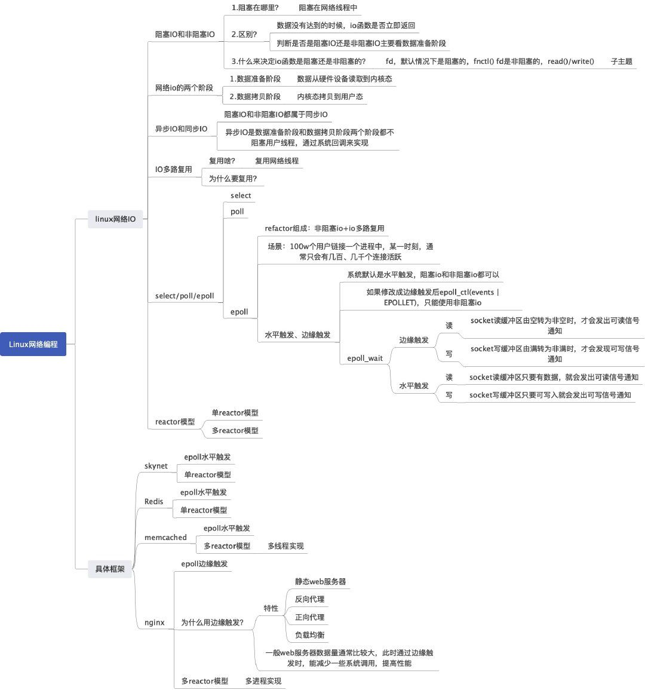
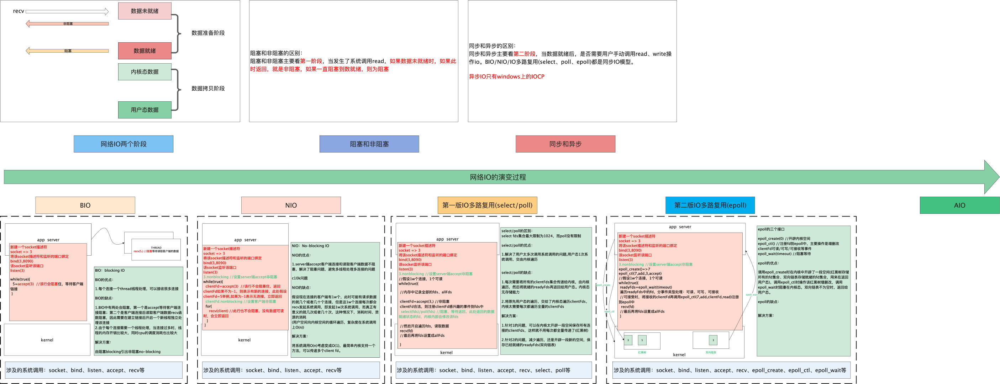
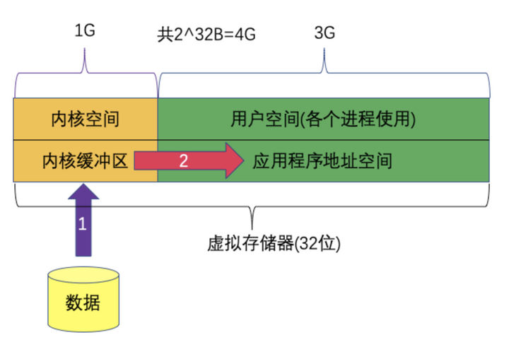
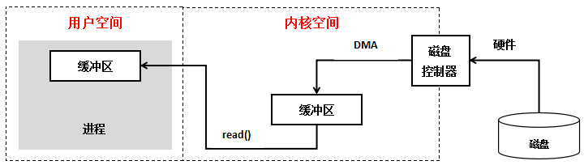
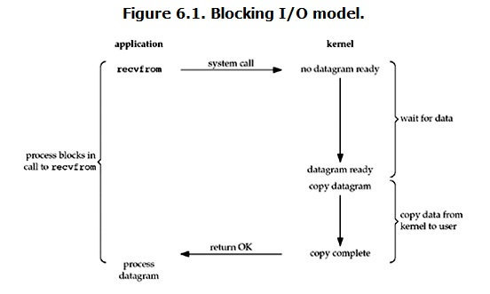
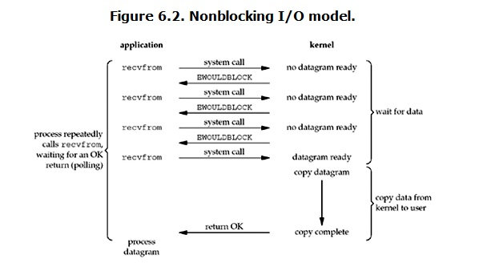

<!-- GFM-TOC -->
* [一 、基本概念](#一 -基本概念)
    * [1.1用户空间与内核空间](#1.1用户空间与内核空间)
    * [1.2进程切换](#1.2进程切换)
    * [1.3进程的阻塞](#1.3进程的阻塞)
    * [1.4文件描述符fd](#1.4文件描述符fd)
    * [1.5缓存 I/O](#1.5缓存 I/O)
* [二 、网络 IO 的发展](#二-网络 IO 的发展)
    * [1.1 网络 IO 的各个发展阶段](#1.1 网络 IO 的各个发展阶段)
    * [2.2 网络的两个阶段](#2.2 网络的两个阶段)
    * [2.3 阻塞 IO 和非阻塞 IO 的区别](#2.3 阻塞 IO 和非阻塞 IO 的区别)
    * [2.4 同步 IO 和异步 IO 的区别](#2.4 同步 IO 和异步 IO 的区别)
* [三、IO模式](#三-IO模式)
    * [3.1 阻塞 I/O（blocking IO，BIO）](#3.1 阻塞 I/O（blocking IO，BIO）)
    * [3.2 非阻塞 I/O（Nonblocking IO，NIO）](#3.2 非阻塞 I/O（Nonblocking IO，NIO）)
    * [3.3 IO 多路复用（ IO multiplexing）](#3.3 IO 多路复用（ IO multiplexing）)
      - [3.3 IO 多路复用](#3.3 IO 多路复用)

* [四、HTTP 首部](#四http-首部)
    * [通用首部字段](#通用首部字段)
    * 
    * [实体首部字段](#实体首部字段)
* [五、具体应用](#五具体应用)
    * [连接管理](#连接管理)
    * [Cookie](#cookie)
    * [缓存](#缓存)
    * [内容协商](#内容协商)
* [参考资料](#参考资料)
<!-- GFM-TOC -->

# 网络 IO 演变过程

在互联网中提起网络，我们都会避免不了讨论高并发、百万连接。而此处的百万连接的实现，脱离不了网络 IO 的选择，因此本文作为一篇个人学习的笔记，特此进行记录一下整个网络 IO 的发展演变过程。以及目前广泛使用的网络模型。

# 一 、基本概念

POSIX(可移植操作系统接口)把同步IO操作定义为导致进程阻塞直到IO完成的操作，反之则是异步IO。

按POSIX的描述似乎把同步和阻塞划等号，异步和非阻塞划等号，但是为什么有的人说同步IO不等于阻塞IO呢？

## 1.1用户空间与内核空间

现在操作系统都是采用虚拟存储器，那么对32位操作系统而言，它的寻址空间（虚拟存储空间）为4G（2的32次方）。操作系统的核心是内核，独立于普通的应用程序，可以访问受保护的内存空间，也有访问底层硬件设备的所有权限。为了保证用户进程不能直接操作内核（kernel），保证内核的安全，操心系统将虚拟空间划分为两部分，一部分为内核空间，一部分为用户空间。针对linux操作系统而言，将最高的1G字节（从虚拟地址0xC0000000到0xFFFFFFFF），供内核使用，称为内核空间，而将较低的3G字节（从虚拟地址0x00000000到0xBFFFFFFF），供各个进程使用，称为用户空间。

## 1.2进程切换

为了控制进程的执行，内核必须有能力挂起正在CPU上运行的进程，并恢复以前挂起的某个进程的执行。这种行为被称为进程切换。因此可以说，任何进程都是在操作系统内核的支持下运行的，是与内核紧密相关的。

从一个进程的运行转到另一个进程上运行，这个过程中经过下面这些变化：

1. 保存处理机上下文，包括程序计数器和其他寄存器。
2. 更新PCB信息。
3. 把进程的PCB移入相应的队列，如就绪、在某事件阻塞等队列。
4. 选择另一个进程执行，并更新其PCB。
5. 更新内存管理的数据结构。
6. 恢复处理机上下文。

**总而言之就是很耗资源**

## 1.3进程的阻塞

正在执行的进程，由于期待的某些事件未发生，如请求系统资源失败、等待某种操作的完成、新数据尚未到达或无新工作做等，则由系统自动执行阻塞原语(Block)，使自己由运行状态变为阻塞状态。可见，进程的阻塞是进程自身的一种主动行为，也因此只有处于运行态的进程（获得CPU），才可能将其转为阻塞状态。`当进程进入阻塞状态，是不占用CPU资源的`。

## 1.4文件描述符fd

文件描述符（File descriptor）是计算机科学中的一个术语，是一个用于表述指向文件的引用的抽象化概念。

文件描述符在形式上是一个非负整数。实际上，它是一个索引值，指向内核为每一个进程所维护的该进程打开文件的记录表。当程序打开一个现有文件或者创建一个新文件时，内核向进程返回一个文件描述符。在程序设计中，一些涉及底层的程序编写往往会围绕着文件描述符展开。但是文件描述符这一概念往往只适用于UNIX、Linux这样的操作系统。

## 1.5缓存 I/O

缓存 I/O 又被称作标准 I/O，大多数文件系统的默认 I/O 操作都是缓存 I/O。在 Linux 的缓存 I/O 机制中，操作系统会将 I/O 的数据缓存在文件系统的页缓存（ page cache ）中，也就是说，数据会先被拷贝到操作系统内核的缓冲区中，然后才会从操作系统内核的缓冲区拷贝到应用程序的地址空间。

至于为什么不能直接让磁盘控制器把数据送到应用程序的地址空间中呢？**最简单的一个原因就是应用程序不能直接操作底层硬件。**

**缓存 I/O 的缺点：**
数据在传输过程中需要在应用程序地址空间和内核进行多次数据拷贝操作，这些数据拷贝操作所带来的 CPU 以及内存开销是非常大的。

# 二 、网络 IO 的发展

在本节内容中，我们将一步一步介绍网络 IO 的演变发展过程。介绍完发展过程后，再对网络 IO 中几组容易混淆的概念进行对比、分析。

  
 

## 2.1 网络 IO 的各个发展阶段

通常，我们在此讨论的网络 IO 一般都是针对 linux 操作系统而言。网络 IO 的发展过程是随着 linux 的内核演变而变化，因此网络 IO 大致可以分为如下几个阶段：

1.  阻塞 IO(BIO)
2. 非阻塞 IO(NIO)
3. IO 多路复用第一版(select/poll)
4. IO 多路复用第二版(epoll)
5. 异步 IO(AIO)

而每一个阶段，都是因为当前的网络有一些缺陷，因此又在不断改进该缺陷。这是**网络 IO 一直演变过程中的本质**。下面将对上述几个阶段进行介绍，并对每个阶段的网络 IO 解决了哪些问题、优点、缺点进行剖析。

  
 

## 2.2 网络的两个阶段

在网络中，我们通常可以将其广义上划分为以下两个阶段：

**第一阶段：数据准备阶段-硬件接口到内核态**
**第二阶段：内核态到用户态-内核空间复制回用户进程缓冲区阶段**

本人理解：我们通常上网，大部分数据都是通过网线传递的。因此对于两台计算机而言，要进行网络通信，其数据都是先从应用程序传递到传输层(TCP/UDP)到达内核态，然后再到网络层、数据链路层、物理层，接着数据传递到硬件网卡，最后通过网络传输介质传递到对端机器的网卡，然后再一步一步数据从网卡传递到内核态，最后再拷贝到用户态。

  
 

## 2.3 阻塞 IO 和非阻塞 IO 的区别

根据 1.2 节的内容，我们可以知道，网络中的数据传输从网络传输介质到达目的机器，需要如上两个阶段。此处我们把从**硬件到内核态**这一阶段，是否发生阻塞等待，可以将网络分为**阻塞 IO**和**非阻塞 IO**。如果用户发起了读写请求，但内核态数据还未准备就绪，该阶段不会阻塞用户操作，内核立马返回，则称为非阻塞 IO。如果该阶段一直阻塞用户操作。直到内核态数据准备就绪，才返回。这种方式称为阻塞 IO。

因此，区分阻塞 IO 和非阻塞 IO 主要看第一阶段是否阻塞用户操作。

## 2.4 同步Synchronous IO 和异步 Asynchronous IO 的区别

从前面我们知道了，数据的传递需要两个阶段，在此处**只要任何一个阶段会阻塞用户请求**，都将其称为同步 IO，两个阶段都不阻塞，则称为异步 IO。

在目前所有的操作系统中，linux 中的 epoll、mac 的 kqueue 都属于同步 IO，因为其在第二阶段(数据从内核态到用户态)都会发生拷贝阻塞。 而只有 windows 中的 IOCP 才真正属于异步 IO，即 AIO。

因此，阻塞IO模型、非阻塞IO模型、IO复用模型(select/poll/epoll)、信号驱动IO模型都属于**同步IO**，因为阶段2是阻塞的(尽管时间很短)。只有异步IO模型是符合POSIX异步IO操作含义的，不管在阶段1还是阶段2都可以干别的事。

# 三 、 IO模式

刚才说了，对于一次IO访问（以read举例：Linux下的系统调用recv。它用于从套接字上接收一个消息，因为是一个系统调用，所以调用时会**从用户进程空间切换到内核空间运行一段时间再切换回来**。默认情况下recv会等到**网络数据到达**并且**复制到用户进程空间**或者发生错误时返回，而第4个参数flags可以让它马上返回。），数据会先被拷贝到操作系统内核的缓冲区中，然后才会从操作系统内核的缓冲区拷贝到应用程序的地址空间。所以说，当一个read操作发生时，它会经历两个阶段：

1. 等待数据准备 (Waiting for the data to be ready)：这时数据可能还没有到达,如还没有收到一个完成的udp包，kernel需要等待.也就是 `数据被拷贝到操作系统内核的缓冲区是需要一个过程`
2. 将数据从内核拷贝到进程（内存）中 (Copying the data from the kernel to the process)：对于synchronous IO 这一步需要用户进程去请求read操作，阻塞。对于asynchronous IO，这一步由kernel主动完成，非阻塞。

**可以认为：阻塞/非阻塞是指阶段1,synchronous/asynchronous是指阶段2**

  
 

正是因为这两个阶段，linux系统产生了下面五种网络模式的方案：

- 阻塞 I/O（blocking IO）
- 非阻塞 I/O（nonblocking IO）
- I/O 多路复用（ IO multiplexing）
- 信号驱动 I/O（ signal driven IO）
- 异步 I/O（asynchronous IO）

注：由于signal driven IO在实际中并不常用，所以这只提及剩下的四种IO Model。

## 3.1 阻塞 I/O（blocking IO，BIO）

**概念：**顾名思义当用户发生了系统调用后，如果数据未从网卡到达内核态，内核态数据未准备好，此时会一直阻塞。直到数据就绪，然后从内核态拷贝到用户态再返回。

根据前面的介绍，阻塞 IO 主要指的是第一阶段(硬件网卡到内核态)。或者说`synchronous阻塞 IO`,这里 `1 2` 阶段都是阻塞的。用户进程请求后等待阶段1阻塞,阶段1完成后等待阶段2仍然阻塞,`整个过程只需要一次系统调用`。

  
 

当用户进程调用了recvfrom这个系统调用，kernel就开始了IO的第一个阶段：准备数据（对于网络IO来说，很多时候数据在一开始还没有到达。比如，还没有收到一个完整的UDP包。这个时候kernel就要等待足够的数据到来）。这个过程需要等待，也就是说数据被拷贝到操作系统内核的缓冲区中是需要一个过程的。而在用户进程这边，整个进程会被阻塞（当然，是进程自己选择的阻塞）。当kernel一直等到数据准备好了，它就会将数据从kernel中拷贝到用户内存，然后kernel返回结果，用户进程才解除block的状态，重新运行起来。

> 以recv函数为例，使用recv的默认参数一直等数据直到拷贝到用户空间，这段时间内进程始终阻塞。比如A同学用杯子装水，打开水龙头装满水然后离开。这一过程就可以看成是使用了阻塞IO模型，因为如果水龙头没有水，他也要等到有水并装满杯子才能离开去做别的事情。很显然，这种IO模型是同步的。
>
> 所以，blocking IO的特点就是在IO执行的两个阶段都被block了。

**优点：**能够及时返回数据，无延迟。

**缺点：**对用户来说处于等待就要付出性能代价。在一般使用阻塞 IO 时，都需要配置多线程来使用，最常见的模型是**阻塞 IO+多线程**，每个连接一个单独的线程进行处理。**我们知道，一般一个程序可以开辟的线程是有限的，而且开辟线程的开销也是比较大的。也正是这种方式，会导致一个应用程序可以处理的客户端请求受限。面对百万连接的情况，是无法处理。**

## 3.2 非阻塞 I/O（Nonblocking IO，NIO）

非阻塞 IO 是为了解决前面提到的阻塞 IO 的缺陷而引出的。非阻塞 IO 是需要系统内核支持的，在创建了连接后，可以调用 setsockop 设置 noblocking。

**概念：**见名知意，就是在第一阶段(网卡-内核态)数据未到达时不等待，然后直接返回。因此非阻塞 IO 需要不断的用户发起请求，询问内核数据好了没，好了没。

`synchronous非阻塞IO`,这里`阶段2`是阻塞的：

1. 用户进程轮询请求数据,没有数据时kernel返回错误状态,用户进程收到后会重试.
2. 某次请求后如果数据到达,kernel返回数据到达状态,`阶段1结束`,用户进程调用read,将数据从kernel拷贝到用户内存

需要`两次`**有效的**系统调用。

  
 

当用户进程发出read操作时，如果kernel中的数据还没有准备好，那么它并不会block用户进程，而是立刻返回一个error。从用户进程角度讲 ，它发起一个read操作后，并不需要等待，而是马上就得到了一个结果。用户进程判断结果是一个error时，它就知道数据还没有准备好，于是它可以再次发送read操作。一旦kernel中的数据准备好了，并且又再次收到了用户进程的system call，那么它马上就将数据拷贝到了用户内存，然后返回。

> 以recv函数为例，让recv不管有没有获取到数据都返回，如果没有数据那么一段时间后再调用recv看看，如此循环。B同学也用杯子装水，打开水龙头后发现没有水，它离开了，过一会他又拿着杯子来看看……在中间离开的这些时间里，B同学离开了装水现场(回到用户进程空间)，可以做他自己的事情。这就是非阻塞IO模型。但是它只有是检查无数据的时候是非阻塞的，在数据到达的时候依然要等待复制数据到用户空间(等着水将水杯装满)，因此它还是同步IO。
>
> 所以，nonblocking IO的特点是用户进程需要**不断的主动询问**kernel数据好了没有。

**优点：**非阻塞 IO 解决了阻塞 IO**每个连接一个线程处理的问题**，所以其最大的优点就是 **一个线程可以处理多个连接**，这也是其非阻塞决定的。能够在等待的时间里去做其他的事情。

**缺点：**需要用户多次发起系统调用。**频繁的系统调用**是比较消耗系统资源的：任务完成的响应延迟增大了，因为每过一段时间去轮询一次read操作，而任务可能在两次轮询之间的任意时间完成，这对导致整体数据吞吐量的降低。

## 3.3 IO 多路复用（ IO multiplexing）

为了解决非阻塞 IO 存在的频繁的系统调用这个问题，随着内核的发展，出现了 IO 多路复用模型。那么我们就需要搞懂几个问题：

1. IO 多路复用到底复用什么？
2. IO 多路复用如何复用？

**IO 多路复用：** 很多人都说，IO 多路复用是用一个线程来管理多个网络连接，但本人不太认可，因为在非阻塞 IO 时，就已经可以实现一个线程处理多个网络连接了，这个是由于其非阻塞而决定的。

**在此处，个人观点，多路复用主要复用的是通过有限次的系统调用来实现管理多个网络连接。最简单来说，我目前有 10 个连接，我可以通过一次系统调用将这 10 个连接都丢给内核，让内核告诉我，哪些连接上面数据准备好了，然后我再去读取每个就绪的连接上的数据。因此，IO 多路复用，复用的是系统调用。通过有限次系统调用判断海量连接是否数据准备好了**

**无论下面的 select、poll、epoll，其都是这种思想实现的，不过在实现上，select/poll 可以看做是第一版，而 epoll 是第二版**

**概念：**IO multiplexing就是我们说的select，poll，epoll，有些地方也称这种IO方式为event driven IO。select/epoll的好处就在于单个process就可以同时处理多个网络连接的IO。它的基本原理就是select，poll，epoll这个function会不断的轮询所负责的所有socket，当某个socket有数据到达了，就通知用户进程。

IO 多路复用和阻塞IO一样是`synchronous阻塞IO,这里的 1 2是阻塞的(今天看过java nio的实现,发现取决于使用的api,阶段1不一定阻塞,比如Selector.selectNow()是非阻塞的,Selector.select()和Selector.select(long timeout)是阻塞的) ,唯一的区别是一个用户进程负责多个socket,也是IO多路复用的优势`

基本原理就是

1. select poll epoll请求数据,`在阶段1被阻塞`,当某个socket有数据到达了就通知用户进程
2. 用户进程调用read操作,将数据从kernel拷贝到用户内存,`在阶段2被阻塞`

阻塞io只需要一次系统调用,IO多路复用需要两次,如果连接数不是很高时 select/epoll不一定比multi-threading+blocking IO更快

  
 

**和第二种一样，调用system call后，并不等待内核的返回结果而是立即返回。虽然返回结果的调用函数是异步的方式，但应用程序会被像select、poll和epoll等具有多个文件描述符的函数阻塞住，一直等到这个system call有结果返回，再通知应用程序。IO复用模型使用select函数等可以为多个文件描述符提供通知。举个例子：例如有一万个并发的read请求，但是网络上仍然没有数据，此时这一万个read会同时各自阻塞，现在用select、poll、epoll这样的函数来专门负责阻塞同时监听这一万个请求的状态，一旦有数据到达了就负责通知，这样就将一万个等待和阻塞转化为一个专门的函数来负责与管理。具体分析：**`当用户进程调用了select，那么整个进程会被block`，而同时，kernel会“监视”所有select负责的socket，当任何一个socket中的数据准备好了，select就会返回。这个时候用户进程再调用read操作，将数据从kernel拷贝到用户进程。

> 以recv函数为例，这里在调用recv前先调用select或者poll，这2个系统调用都可以在内核准备好数据(网络数据到达内核)时告知用户进程，这个时候再调用recv一定是有数据的。因此这一过程中它是**阻塞于select或poll**，而没有阻塞于recv，有人将非阻塞IO定义成在读写操作时没有阻塞于系统调用的IO操作(不包括数据从内核复制到用户空间的阻塞，因为这相对于网络IO来说确实很短暂)，如果按这样理解，这种IO模型也能称之为非阻塞IO模型，但是按POSIX来看，它也是同步IO，那么也和楼上一样称之为同步非阻塞IO吧。
>
> 这种IO模型比较特别，分个段。因为它能同时监听多个文件描述符(fd)。这个时候C同学来装水，发现有一排水龙头，舍管阿姨告诉他这些水龙头都还没有水，等有水了告诉他。于是等啊等(select调用中)，过了一会阿姨告诉他有水了，但不知道是哪个水龙头有水，自己看吧。于是C同学一个个打开，往杯子里装水(recv)。这里再顺便说说鼎鼎大名的epoll(高性能的代名词啊)，epoll也属于IO复用模型，主要区别在于舍管阿姨会告诉C同学哪几个水龙头有水了，不需要一个个打开看(当然还有其它区别)。
>
> 所以，I/O 多路复用的特点是通过一种机制一个进程能同时等待多个文件描述符，而这些文件描述符（套接字描述符）其中的任意一个进入读就绪状态，select()函数就可以返回。

这个图和blocking IO的图其实并没有太大的不同，事实上，还更差一些。因为这里需要使用两个system call (select 和 recvfrom)，而blocking IO只调用了一个system call (recvfrom)。但是，用select的优势在于它可以同时处理多个connection。

所以，如果处理的连接数（并发）不是很高的话，使用select/epoll的web server不一定比使用multi-threading + blocking IO的web server性能更好，可能延迟还更大。select/epoll的优势并不是对于单个连接能处理得更快，而是在于能处理更多的连接。**高并发的程序一般使用同步非阻塞模式**，而不是**多线程+同步阻塞模式**。要理解这点，先弄明白并发和并行的区别：比如去某部门办事需要依次去几个窗口，办事大厅的人数就是并发数，而窗口的个数就是并行度。就是说并发是同时进行的任务数（如同时服务的http请求），而并行数就是可以同时工作的物理资源数量（如cpu核数）。通过合理调度任务的不同阶段，并发数可以远远大于并行度。这就是区区几个CPU可以支撑上万个用户并发请求的原因。在高并发的情况下，为每个用户请求创建一个进程或者线程的开销非常大。而同步非阻塞方式可以把多个IO请求丢到后台去，这样一个CPU就可以服务大量的并发IO请求。

IO多路复用在阻塞到select阶段时，用户进程是主动等待并调用select函数来获取就绪状态消息，并且其进程状态为阻塞。所以**IO多路复用是同步阻塞模式**。

在IO multiplexing Model中，实际中，对于每一个socket，一般都设置成为non-blocking，但是，如上图所示，整个用户的process其实是一直被block的。只不过process是被select这个函数block，而不是被socket IO给block。

  
 

