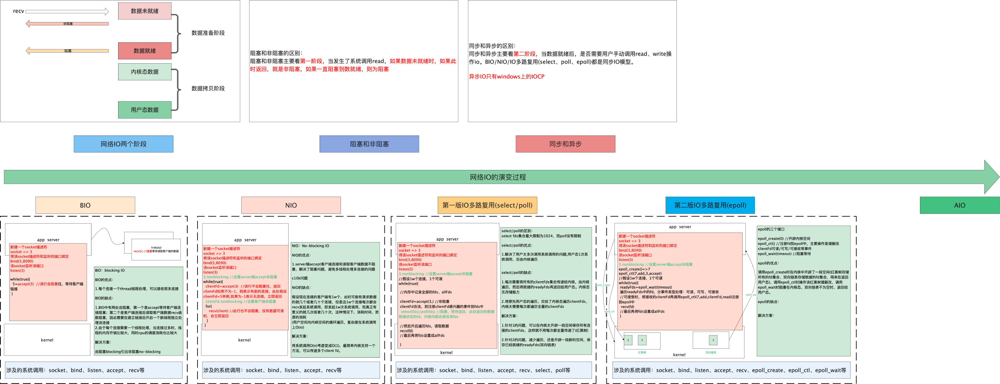
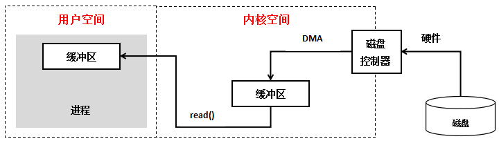
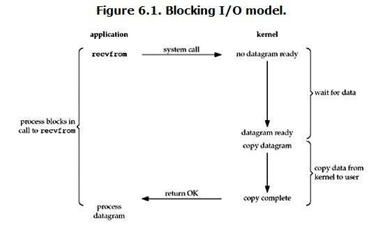
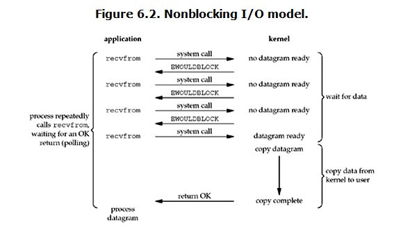
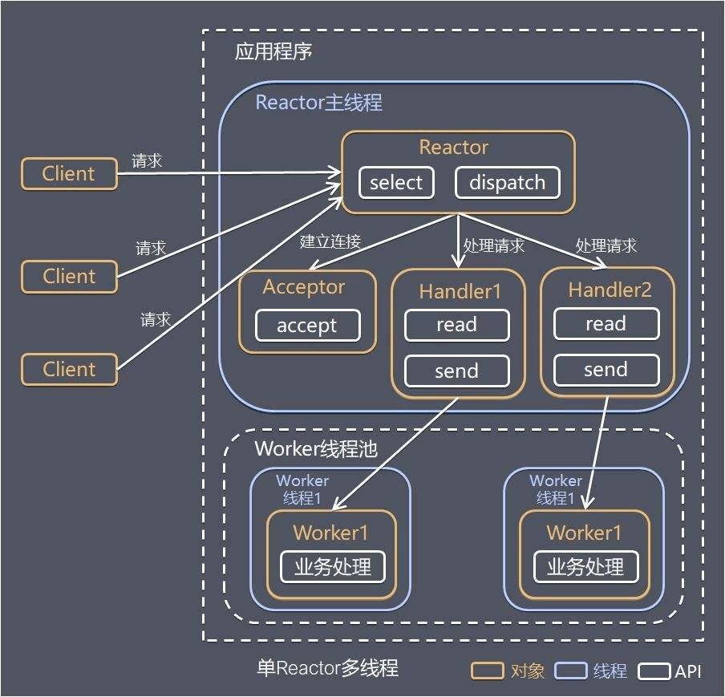

<!-- GFM-TOC -->
* [一 、基本概念](#一 -基本概念)
    * [1.1用户空间与内核空间](#1.1用户空间与内核空间)
    * [1.2进程切换](#1.2进程切换)
    * [1.3进程的阻塞](#1.3进程的阻塞)
    * [1.4文件描述符fd](#1.4文件描述符fd)
    * [1.5缓存 I/O](#1.5缓存 I/O)
* [二 、网络 IO 的发展](#二-网络 IO 的发展)
    * [1.1 网络 IO 的各个发展阶段](#1.1 网络 IO 的各个发展阶段)
    * [2.2 网络的两个阶段](#2.2 网络的两个阶段)
    * [2.3 阻塞 IO 和非阻塞 IO 的区别](#2.3 阻塞 IO 和非阻塞 IO 的区别)
    * [2.4 同步 IO 和异步 IO 的区别](#2.4 同步 IO 和异步 IO 的区别)
* [三、IO模式](#三-IO模式)
    * [3.1 阻塞 I/O（blocking IO，BIO）](#3.1 阻塞 I/O（blocking IO，BIO）)
    * [3.2 非阻塞 I/O（Nonblocking IO，NIO）](#3.2 非阻塞 I/O（Nonblocking IO，NIO）)
    * [3.3 IO 多路复用（ IO multiplexing）](#3.3 IO 多路复用（ IO multiplexing）)
    * [3.4 信号驱动IO模型](#3.4 信号驱动IO模型)
    * [3.5 异步 I/O（asynchronous IO）](#3.5 异步 I/O（asynchronous IO）)
* [四、I/O 多路复用之select、poll、epoll详解](#四I/O 多路复用之select、poll、epoll详解)
    * [4.1 多路复用第一版select/poll](#多路复用第一版select/poll)
    * [4.2 多路复用第二版 epoll](#4.2 多路复用第二版 epoll)
* [五、网络 IO 各种模型](#五网络 IO 各种模型)
    * [5.1 thread-based architecture（基于线程的架构）](#thread-based architecture（基于线程的架构）)
    * [5.2 event-driven architecture（事件驱动模型）](#event-driven architecture（事件驱动模型）)
* [参考资料](#参考资料)
<!-- GFM-TOC -->

# 网络 IO 演变过程

在互联网中提起网络，我们都会避免不了讨论高并发、百万连接。而此处的百万连接的实现，脱离不了网络 IO 的选择，因此本文作为一篇个人学习的笔记，特此进行记录一下整个网络 IO 的发展演变过程。以及目前广泛使用的网络模型。

# 一 、基本概念

POSIX(可移植操作系统接口)把同步IO操作定义为导致进程阻塞直到IO完成的操作，反之则是异步IO。

按POSIX的描述似乎把同步和阻塞划等号，异步和非阻塞划等号，但是为什么有的人说同步IO不等于阻塞IO呢？

## 1.1用户空间与内核空间

现在操作系统都是采用虚拟存储器，那么对32位操作系统而言，它的寻址空间（虚拟存储空间）为4G（2的32次方）。操作系统的核心是内核，独立于普通的应用程序，可以访问受保护的内存空间，也有访问底层硬件设备的所有权限。为了保证用户进程不能直接操作内核（kernel），保证内核的安全，操心系统将虚拟空间划分为两部分，一部分为内核空间，一部分为用户空间。针对linux操作系统而言，将最高的1G字节（从虚拟地址0xC0000000到0xFFFFFFFF），供内核使用，称为内核空间，而将较低的3G字节（从虚拟地址0x00000000到0xBFFFFFFF），供各个进程使用，称为用户空间。

## 1.2进程切换

为了控制进程的执行，内核必须有能力挂起正在CPU上运行的进程，并恢复以前挂起的某个进程的执行。这种行为被称为进程切换。因此可以说，任何进程都是在操作系统内核的支持下运行的，是与内核紧密相关的。

从一个进程的运行转到另一个进程上运行，这个过程中经过下面这些变化：

1. 保存处理机上下文，包括程序计数器和其他寄存器。
2. 更新PCB信息。
3. 把进程的PCB移入相应的队列，如就绪、在某事件阻塞等队列。
4. 选择另一个进程执行，并更新其PCB。
5. 更新内存管理的数据结构。
6. 恢复处理机上下文。

**总而言之就是很耗资源**

## 1.3进程的阻塞

正在执行的进程，由于期待的某些事件未发生，如请求系统资源失败、等待某种操作的完成、新数据尚未到达或无新工作做等，则由系统自动执行阻塞原语(Block)，使自己由运行状态变为阻塞状态。可见，进程的阻塞是进程自身的一种主动行为，也因此只有处于运行态的进程（获得CPU），才可能将其转为阻塞状态。`当进程进入阻塞状态，是不占用CPU资源的`。

## 1.4文件描述符fd

文件描述符（File descriptor）是计算机科学中的一个术语，是一个用于表述指向文件的引用的抽象化概念。

文件描述符在形式上是一个非负整数。实际上，它是一个索引值，指向内核为每一个进程所维护的该进程打开文件的记录表。当程序打开一个现有文件或者创建一个新文件时，内核向进程返回一个文件描述符。在程序设计中，一些涉及底层的程序编写往往会围绕着文件描述符展开。但是文件描述符这一概念往往只适用于UNIX、Linux这样的操作系统。

## 1.5缓存 I/O

缓存 I/O 又被称作标准 I/O，大多数文件系统的默认 I/O 操作都是缓存 I/O。在 Linux 的缓存 I/O 机制中，操作系统会将 I/O 的数据缓存在文件系统的页缓存（ page cache ）中，也就是说，数据会先被拷贝到操作系统内核的缓冲区中，然后才会从操作系统内核的缓冲区拷贝到应用程序的地址空间。

至于为什么不能直接让磁盘控制器把数据送到应用程序的地址空间中呢？**最简单的一个原因就是应用程序不能直接操作底层硬件。**

**缓存 I/O 的缺点：**
数据在传输过程中需要在应用程序地址空间和内核进行多次数据拷贝操作，这些数据拷贝操作所带来的 CPU 以及内存开销是非常大的。

# 二 、网络 IO 的发展

在本节内容中，我们将一步一步介绍网络 IO 的演变发展过程。介绍完发展过程后，再对网络 IO 中几组容易混淆的概念进行对比、分析。

<div align="center">  </div><br>

## 2.1 网络 IO 的各个发展阶段

通常，我们在此讨论的网络 IO 一般都是针对 linux 操作系统而言。网络 IO 的发展过程是随着 linux 的内核演变而变化，因此网络 IO 大致可以分为如下几个阶段：

1.  阻塞 IO(BIO)
2. 非阻塞 IO(NIO)
3. IO 多路复用第一版(select/poll)
4. IO 多路复用第二版(epoll)
5. 异步 IO(AIO)

而每一个阶段，都是因为当前的网络有一些缺陷，因此又在不断改进该缺陷。这是**网络 IO 一直演变过程中的本质**。下面将对上述几个阶段进行介绍，并对每个阶段的网络 IO 解决了哪些问题、优点、缺点进行剖析。

<div align="center">  </div><br>

## 2.2 网络的两个阶段

在网络中，我们通常可以将其广义上划分为以下两个阶段：

**第一阶段：数据准备阶段-硬件接口到内核态**
**第二阶段：内核态到用户态-内核空间复制回用户进程缓冲区阶段**

本人理解：我们通常上网，大部分数据都是通过网线传递的。因此对于两台计算机而言，要进行网络通信，其数据都是先从应用程序传递到传输层(TCP/UDP)到达内核态，然后再到网络层、数据链路层、物理层，接着数据传递到硬件网卡，最后通过网络传输介质传递到对端机器的网卡，然后再一步一步数据从网卡传递到内核态，最后再拷贝到用户态。

<div align="center">  </div><br>

## 2.3 阻塞 IO 和非阻塞 IO 的区别

根据 1、2 节的内容，我们可以知道，网络中的数据传输从网络传输介质到达目的机器，需要如上两个阶段。此处我们把从**硬件到内核态**这一阶段，是否发生阻塞等待，可以将网络分为**阻塞 IO**和**非阻塞 IO**。如果用户发起了读写请求，但内核态数据还未准备就绪，该阶段不会阻塞用户操作，内核立马返回，则称为非阻塞 IO。如果该阶段一直阻塞用户操作。直到内核态数据准备就绪，才返回。这种方式称为阻塞 IO。

因此，区分阻塞 IO 和非阻塞 IO 主要看第一阶段是否阻塞用户操作。

## 2.4 同步Synchronous IO 和异步 Asynchronous IO 的区别

从前面我们知道了，数据的传递需要两个阶段，在此处**只要任何一个阶段会阻塞用户请求**，都将其称为同步 IO，两个阶段都不阻塞，则称为异步 IO。

在目前所有的操作系统中，linux 中的 epoll、mac 的 kqueue 都属于同步 IO，因为其在第二阶段(数据从内核态到用户态)都会发生拷贝阻塞。 而只有 windows 中的 IOCP 才真正属于异步 IO，即 AIO。

阻塞IO模型、非阻塞IO模型、IO复用模型(select/poll/epoll)、信号驱动IO模型都属于**同步IO**，因为阶段2是阻塞的(尽管时间很短)。只有异步IO模型是符合POSIX异步IO操作含义的，不管在阶段1还是阶段2都可以干别的事。

# 三 、IO模式

刚才说了，对于一次IO访问（以read举例：Linux下的系统调用recv。它用于从套接字上接收一个消息，因为是一个系统调用，所以调用时会**从用户进程空间切换到内核空间运行一段时间再切换回来**。默认情况下recv会等到**网络数据到达**并且**复制到用户进程空间**或者发生错误时返回，而第4个参数flags可以让它马上返回。），数据会先被拷贝到操作系统内核的缓冲区中，然后才会从操作系统内核的缓冲区拷贝到应用程序的地址空间。所以说，当一个read操作发生时，它会经历两个阶段：

1. 等待数据准备 (Waiting for the data to be ready)：这时数据可能还没有到达,如还没有收到一个完成的udp包，kernel需要等待.也就是 `数据被拷贝到操作系统内核的缓冲区是需要一个过程`
2. 将数据从内核拷贝到进程（内存）中 (Copying the data from the kernel to the process)：对于synchronous IO 这一步需要用户进程去请求read操作，阻塞。对于asynchronous IO，这一步由kernel主动完成，非阻塞。

**可以认为：阻塞/非阻塞是指阶段1,synchronous/asynchronous是指阶段2**

<div align="center">  </div><br>

正是因为这两个阶段，linux系统产生了下面五种网络模式的方案：

- 阻塞 I/O（blocking IO）
- 非阻塞 I/O（nonblocking IO）
- I/O 多路复用（ IO multiplexing）
- 信号驱动 I/O（ signal driven IO）
- 异步 I/O（asynchronous IO）

注：由于signal driven IO在实际中并不常用，所以这只提及剩下的四种IO Model。

## 3.1 阻塞 I/O（blocking IO，BIO）

**概念：**顾名思义当用户发生了系统调用后，如果数据未从网卡到达内核态，内核态数据未准备好，此时会一直阻塞。直到数据就绪，然后从内核态拷贝到用户态再返回。

根据前面的介绍，阻塞 IO 主要指的是第一阶段(硬件网卡到内核态)。本质上，synchronous阻塞 IO`,这里 `1 2` 阶段都是阻塞的。用户进程请求后等待阶段1阻塞,阶段1完成后等待阶段2仍然阻塞,`整个过程只需要一次系统调用`。

<div align="center">  </div><br>

当用户进程调用了recvfrom这个系统调用，kernel就开始了IO的第一个阶段：准备数据（对于网络IO来说，很多时候数据在一开始还没有到达。比如，还没有收到一个完整的UDP包。这个时候kernel就要等待足够的数据到来）。这个过程需要等待，也就是说数据被拷贝到操作系统内核的缓冲区中是需要一个过程的。而在用户进程这边，整个进程会被阻塞（当然，是进程自己选择的阻塞）。当kernel一直等到数据准备好了，它就会将数据从kernel中拷贝到用户内存，然后kernel返回结果，用户进程才解除block的状态，重新运行起来。

> 以recv函数为例，使用recv的默认参数一直等数据直到拷贝到用户空间，这段时间内进程始终阻塞。比如A同学用杯子装水，打开水龙头装满水然后离开。这一过程就可以看成是使用了阻塞IO模型，因为如果水龙头没有水，他也要等到有水并装满杯子才能离开去做别的事情。很显然，这种IO模型是同步的。
>
> 所以，blocking IO的特点就是在IO执行的两个阶段都被block了。

**优点：**能够及时返回数据，无延迟。

**缺点：**对用户来说处于等待就要付出性能代价。在一般使用阻塞 IO 时，都需要配置多线程来使用，最常见的模型是**阻塞 IO+多线程**，每个连接一个单独的线程进行处理。**我们知道，一般一个程序可以开辟的线程是有限的，而且开辟线程的开销也是比较大的。也正是这种方式，会导致一个应用程序可以处理的客户端请求受限。面对百万连接的情况，是无法处理。**

## 3.2 非阻塞 I/O（Nonblocking IO，NIO）

非阻塞 IO 是为了解决前面提到的阻塞 IO 的缺陷而引出的。非阻塞 IO 是需要系统内核支持的，在创建了连接后，可以调用 setsockop 设置 noblocking。

**概念：**见名知意，就是在第一阶段(网卡-内核态)数据未到达时不等待，然后直接返回。因此非阻塞 IO 需要不断的用户发起请求，询问内核数据好了没，好了没。

`synchronous非阻塞IO`,这里只是`阶段2`是阻塞的：

1. 用户进程轮询请求数据,没有数据时kernel返回错误状态,用户进程收到后会重试.
2. 某次请求后如果数据到达,kernel返回数据到达状态,`阶段1结束`,用户进程调用read,将数据从kernel拷贝到用户内存

需要`两次`**有效的**系统调用。

<div align="center">  </div><br>

当用户进程发出read操作时，如果kernel中的数据还没有准备好，那么它并不会block用户进程，而是立刻返回一个error。从用户进程角度讲 ，它发起一个read操作后，并不需要等待，而是马上就得到了一个结果。用户进程判断结果是一个error时，它就知道数据还没有准备好，于是它可以再次发送read操作。一旦kernel中的数据准备好了，并且又再次收到了用户进程的system call，那么它马上就将数据拷贝到了用户内存，然后返回。

> 以recv函数为例，让recv不管有没有获取到数据都返回，如果没有数据那么一段时间后再调用recv看看，如此循环。B同学也用杯子装水，打开水龙头后发现没有水，它离开了，过一会他又拿着杯子来看看……在中间离开的这些时间里，B同学离开了装水现场(回到用户进程空间)，可以做他自己的事情。这就是非阻塞IO模型。但是它只有是检查无数据的时候是非阻塞的，在数据到达的时候依然要等待复制数据到用户空间(等着水将水杯装满)，因此它还是同步IO。
>
> 所以，nonblocking IO的特点是用户进程需要**不断的主动询问**kernel数据好了没有。

**优点：**非阻塞 IO 解决了阻塞 IO**每个连接一个线程处理的问题**，所以其最大的优点就是 **一个线程可以处理多个连接**，这也是其非阻塞决定的。能够在等待的时间里去做其他的事情。

**缺点：**需要用户多次发起系统调用。**频繁的系统调用**是比较消耗系统资源的：任务完成的响应延迟增大了，因为每过一段时间去轮询一次read操作，而任务可能在两次轮询之间的任意时间完成，这对导致整体数据吞吐量的降低。

## 3.3 IO 多路复用（ IO multiplexing）

为了解决非阻塞 IO 存在的频繁的系统调用这个问题，随着内核的发展，出现了 IO 多路复用模型。那么我们就需要搞懂几个问题：

1. IO 多路复用到底复用什么？
2. IO 多路复用如何复用？

**IO 多路复用：** 很多人都说，IO 多路复用是用一个线程来管理多个网络连接，但本人不太认可，因为在非阻塞 IO 时，就已经可以实现一个线程处理多个网络连接了，这个是由于其非阻塞而决定的。

**在此处，个人观点，多路复用主要复用的是通过有限次的系统调用来实现管理多个网络连接。最简单来说，我目前有 10 个连接，我可以通过一次系统调用将这 10 个连接都丢给内核，让内核告诉我，哪些连接上面数据准备好了，然后我再去读取每个就绪的连接上的数据。因此，IO 多路复用，复用的是系统调用。通过有限次系统调用判断海量连接是否数据准备好了**

**无论下面的 select、poll、epoll，其都是这种思想实现的，不过在实现上，select/poll 可以看做是第一版，而 epoll 是第二版**

**概念：**IO multiplexing就是我们说的select，poll，epoll，有些地方也称这种IO方式为event driven IO。select/epoll的好处就在于单个process就可以同时处理多个网络连接的IO。它的基本原理就是select，poll，epoll这个function会不断的轮询所负责的所有socket，当某个socket有数据到达了，就通知用户进程。

IO 多路复用和阻塞IO一样是`synchronous阻塞IO（在阻塞到select阶段时，用户进程是主动等待并调用select函数来获取就绪状态消息，并且其进程状态为阻塞）,这里的 1 2是阻塞的(java nio的实现,发现取决于使用的api,阶段1不一定阻塞,比如Selector.selectNow()是非阻塞的,Selector.select()和Selector.select(long timeout)是阻塞的) ,唯一的区别是一个用户进程负责多个socket,也是IO多路复用的优势`

基本原理就是

1. select poll epoll请求数据,`在阶段1被阻塞`,当某个socket有数据到达了就通知用户进程
2. 用户进程调用read操作,将数据从kernel拷贝到用户内存,`在阶段2被阻塞`

<div align="center">  </div><br>

**和第二种一样，调用system call后，并不等待内核的返回结果而是立即返回。虽然返回结果的调用函数是异步的方式，但应用程序会被像select、poll和epoll等具有多个文件描述符的函数阻塞住，一直等到这个system call有结果返回，再通知应用程序。IO复用模型使用select函数等可以为多个文件描述符提供通知。举个例子：例如有一万个并发的read请求，但是网络上仍然没有数据，此时这一万个read会同时各自阻塞，现在用select、poll、epoll这样的函数来专门负责阻塞同时监听这一万个请求的状态，一旦有数据到达了就负责通知，这样就将一万个等待和阻塞转化为一个专门的函数来负责与管理。即**`当用户进程调用了select，那么整个进程会被block`，而同时，kernel会“监视”所有select负责的socket，当任何一个socket中的数据准备好了，select就会返回。这个时候用户进程再调用read操作，将数据从kernel拷贝到用户进程。

> 这种IO模型比较特别，分个段。因为它能同时监听多个文件描述符(fd)。这个时候C同学来装水，发现有一排水龙头，舍管阿姨告诉他这些水龙头都还没有水，等有水了告诉他。于是等啊等(select调用中)，过了一会阿姨告诉他有水了，但不知道是哪个水龙头有水，自己看吧。于是C同学一个个打开，往杯子里装水(recv)。这里再顺便说说鼎鼎大名的epoll(高性能的代名词啊)，epoll也属于IO复用模型，主要区别在于舍管阿姨会告诉C同学哪几个水龙头有水了，不需要一个个打开看(当然还有其它区别)。
>
> 所以，I/O 多路复用的特点是通过一种机制一个进程能同时等待多个文件描述符，而这些文件描述符（套接字描述符）其中的任意一个进入读就绪状态，select()函数就可以返回。

这个图和blocking IO的图其实并没有太大的不同，事实上，还更差一些。因为这里需要使用两个system call (select 和 recvfrom)，而blocking IO只调用了一个system call (recvfrom)。但是，用select的优势在于它可以同时处理多个connection。

阻塞io只需要一次系统调用，IO多路复用需要两次。所以，如果处理的连接数（并发）不是很高的话，使用select/epoll的web server不一定比使用multi-threading + blocking IO的web server性能更好，可能延迟还更大。select/epoll的优势并不是对于单个连接能处理得更快，而是在于能处理更多的连接。

在IO multiplexing Model中，实际中，对于每一个socket，一般都设置成为non-blocking，但是，如上图所示，整个用户的process其实是一直被block的。只不过process是被select这个函数block，而不是被socket IO给block。

## 3.4 信号驱动IO模型

应用程序提交read请求，调用system call，然后内核开始处理相应的IO操作，而同时，应用程序并不等内核返回响应，就会开始执行其他的处理操作，当内核执行完毕，返回read响应，就会产生一个信号或执行一个基于线程的回调函数来完成这次IO处理过程。在这里IO的读写操作是在IO事件发生之后由应用程序来完成。

通过调用sigaction注册信号函数，等内核数据准备好的时候系统中断当前程序，执行信号函数(在这里面调用recv)。D同学让舍管阿姨等有水的时候通知他(注册信号函数)，没多久D同学得知有水了，跑去装水。是不是很像异步IO？很遗憾，它还是同步IO(省不了装水的时间啊)。

<div align="center">  </div><br>

## 3.5 异步 I/O（asynchronous IO）

`asynchronous非阻塞 IO`,完全的非阻塞

1. 用户进程发起read操作后立即返回去做其他事,kernel收到asynchronous read后也立刻返回
2. 在数据准备完成后,kernel将数据拷贝到用户内存,并发送给用户signa

`理论上是这样`,目前的实现不尽如人意，目前只有 windows 系统的 IOCP 是属于异步 IO，linux下的asynchronous IO其实用得很少。参见[ Linux AIO（异步IO）那点事儿](https://link.juejin.cn?target=http%3A%2F%2Fwww.yeolar.com%2Fnote%2F2012%2F12%2F16%2Flinux-aio%2F)

<div align="center">  </div><br>

用户进程发起read操作之后，立刻就可以开始去做其它的事。而另一方面，从kernel的角度，当它受到一个asynchronous read之后，首先它会立刻返回，所以不会对用户进程产生任何block。然后，kernel会等待数据准备完成，然后将数据拷贝到用户内存，当这一切都完成之后，kernel会给用户进程发送一个signal，告诉它read操作完成了。

> 比如调用aio_read，让内核等数据准备好，并且复制到用户进程空间后执行事先指定好的函数。E同学让舍管阿姨将杯子装满水后通知他。整个过程E同学都可以做别的事情(没有recv)，这才是真正的异步IO。

## 3.6 总结

### blocking和non-blocking的区别

调用blocking IO会一直block住对应的进程直到操作完成，而non-blocking IO在kernel还准备数据的情况下会立刻返回。

### synchronous IO和asynchronous IO的区别

在说明synchronous IO和asynchronous IO的区别之前，需要先给出两者的定义。POSIX的定义是这样子的：
\- A synchronous I/O operation causes the requesting process to be blocked until that I/O operation completes;
\- An asynchronous I/O operation does not cause the requesting process to be blocked;

两者的区别就在于synchronous IO做”IO operation”的时候会将process阻塞。按照这个定义，之前所述的blocking IO，non-blocking IO，IO multiplexing都属于synchronous IO。

有人会说，non-blocking IO并没有被block啊。这里有个非常“狡猾”的地方，定义中所指的”IO operation”是指真实的IO操作，就是例子中的recvfrom这个system call。non-blocking IO在执行recvfrom这个system call的时候，如果kernel的数据没有准备好，这时候不会block进程。但是，当kernel中数据准备好的时候，recvfrom会将数据从kernel拷贝到用户内存中（第二阶段），这个时候进程是被block了，在这段时间内，进程是被block的。

而asynchronous IO则不一样，当进程发起IO 操作之后，就直接返回再也不理睬了，直到kernel发送一个信号，告诉进程说IO完成。在这整个过程中，进程完全没有被block。

**各个IO Model的比较如图所示：**

<div align="center">  </div><br>

# 四、 I/O 多路复用之select、poll、epoll详解

目前支持I/O多路复用的系统调用有 `select，pselect，poll，epoll`，它们都是IO多路复用的机制。与多进程和多线程技术相比，`I/O多路复用技术的最大优势是系统开销小，系统不必创建进程/线程`，也不必维护这些进程/线程，从而大大减小了系统的开销。

I/O多路复用就是通过一种机制，一个进程可以监视多个描述符，一旦某个描述符就绪（一般是读就绪或者写就绪），能够通知程序进行相应的读写操作。但select，poll，epoll本质上都是同步I/O，因为他们都需要在读写事件就绪后自己负责进行读写，也就是说这个读写过程是阻塞的，而异步I/O则无需自己负责进行读写，异步I/O的实现会负责把数据从内核拷贝到用户空间。

epoll跟select都能提供多路I/O复用的解决方案。在现在的Linux内核里有都能够支持，`其中epoll是Linux所特有，而select则应该是POSIX所规定`，一般操作系统均有实现。

**从本质来说：IO 多路复用中，select()/poll()/epoll_wait()这几个函数对应第一阶段；read()/recvfrom()对应第二阶段**

## 4.1 多路复用第一版select/poll

#### select

```cpp
// readfds:关心读的fd集合；writefds：关心写的fd集合；excepttfds：异常的fd集合
int select (int n, fd_set *readfds, fd_set *writefds, fd_set *exceptfds, struct timeval *timeout);
```

select 函数监视的文件描述符分3类，分别是writefds、readfds、和exceptfds。调用后select函数会阻塞，直到有描述符就绪（有数据 可读、可写、或者有except），或者超时（timeout指定等待时间，如果立即返回设为null即可），函数返回。当select函数返回后，可以 通过遍历fdset，来找到就绪的描述符。

select目前几乎在所有的平台上支持，其良好跨平台支持也是它的一个优点。select的一 个缺点在于单个进程能够监视的文件描述符的数量存在最大限制，在Linux上一般为1024，可以通过修改宏定义甚至重新编译内核的方式提升这一限制，但 是这样也会造成效率的降低。

`select本质上是通过设置或者检查存放fd标志位的数据结构来进行下一步处理`。这样所带来的**缺点：**

- select最大的缺陷就是单个进程所打开的FD是有一定限制的，它由FD_SETSIZE设置，默认值是1024**。**

  一般来说这个数目和系统内存关系很大，`具体数目可以cat /proc/sys/fs/file-max察看`。32位机默认是1024个。64位机默认是2048.

- 对socket进行扫描时是线性扫描，即采用轮询的方法，效率较低。

  当套接字比较多的时候，每次select()都要通过遍历FD_SETSIZE个Socket来完成调度，不管哪个Socket是活跃的，都遍历一遍。这会浪费很多CPU时间。`如果能给套接字注册某个回调函数，当他们活跃时，自动完成相关操作，那就避免了轮询`，这正是epoll与kqueue做的。

- 需要维护一个用来存放大量fd的数据结构，这样会使得用户空间和内核空间在传递该结构时复制开销大

#### poll

`poll本质上和select没有区别，它将用户传入的数组拷贝到内核空间`，然后查询每个fd对应的设备状态，如果设备就绪则在设备等待队列中加入一项并继续遍历，如果遍历完所有fd后没有发现就绪设备，则挂起当前进程，直到设备就绪或者主动超时，被唤醒后它又要再次遍历fd。这个过程经历了多次无谓的遍历。

```cpp
int poll (struct pollfd *fds, unsigned int nfds, int timeout);
```

不同与select使用三个位图来表示三个fdset的方式，poll使用一个 pollfd的指针实现。

```cpp
struct pollfd {
    int fd; /* file descriptor */
    short events; /* requested events to watch */
    short revents; /* returned events witnessed */
};
```

pollfd结构包含了要监视的event和发生的event，不再使用select“参数-值”传递的方式。同时，pollfd并没有最大数量限制（但是数量过大后性能也是会下降）。 和select函数一样，poll返回后，需要轮询pollfd来获取就绪的描述符。

**它没有最大连接数的限制，**`原因是它是基于链表来存储的`**，但是同样有一个缺点：**

- 大量的fd的数组被整体复制于用户态和内核地址空间之间，而不管这样的复制是不是有意义。
- poll还有一个特点是“水平触发”，如果报告了fd后，没有被处理，那么下次poll时会再次报告该fd。

> 从上面看，select和poll都需要在返回后，`通过遍历文件描述符来获取已经就绪的socket`。事实上，同时连接的大量客户端在一时刻可能只有很少的处于就绪状态，因此随着监视的描述符数量的增长，其效率也会线性下降。

#### select 和 poll 的区别

select和poll都需要在返回后遍历文件描述符来获取已经就绪的socket,描述符越多效率越低：

1. select 能处理的最大连接，默认是 1024 个，可以通过修改配置来改变，但终究是有限个；而 poll 理论上可以支持无限个，但是数量过大都会影响性能(遍历文件描述符)
2. select使用3个位图表示三种文件描述符,poll使用一个pollfd完成

#### 多路复用第一版的优点

IO 多路复用，主要在于复用，通过 select()或者 poll()将多个 socket fds 批量通过系统调用传递给内核，由内核进行循环遍历判断哪些 fd 上数据就绪了，然后将就绪的 readyfds 返回给用户。再由用户进行挨个遍历就绪好的 fd，读取或者写入数据。

所以通过 IO 多路复用+非阻塞 IO，一方面降低了系统调用次数，另一方面可以用极少的线程来处理多个网络连接。

#### 多路复用第一版的缺点

虽然第一版 IO 多路复用解决了之前提到的频繁的系统调用次数，但同时引入了新的问题：**用户需要每次将海量的 socket fds 集合从用户态传递到内核态，让内核态去检测哪些网络连接数据就绪了，但这个地方会出现频繁的将海量 fd 集合从用户态传递到内核态，再从内核态拷贝到用户态。 所以，这个地方开销也挺大。**

因此就引出了第二版的 IO 多路复用。**既然需要拷贝，那就想办法，不拷贝。既然不拷贝，那就在内核开辟一段区域**

## 4.2多路复用第二版 epoll

epoll是在2.6内核中提出的，是之前的select和poll的增强版本。相对于select和poll来说，epoll更加灵活，没有描述符限制。epoll使用一个文件描述符管理多个描述符，将用户关系的文件描述符的事件存放到内核的一个事件表中，这样在用户空间和内核空间的copy只需一次。

### epoll操作过程

epoll操作过程需要三个接口，分别如下：

```reasonml
//创建epollFd，底层是在内核态分配一段区域，底层数据结构红黑树+双向链表
int epoll_create(int size)；//创建一个epoll的句柄，size用来告诉内核这个监听的数目一共有多大

//往红黑树中增加、删除、更新管理的socket fd
int epoll_ctl(int epfd, int op, int fd, struct epoll_event *event)；

//这个api是用来在第一阶段阻塞，等待就绪的fd。
int epoll_wait(int epfd, struct epoll_event * events, int maxevents, int timeout);
```

**1. int epoll_create(int size);**
创建一个epoll的句柄，size用来告诉内核这个监听的数目一共有多大，这个参数不同于select()中的第一个参数，给出最大监听的fd+1的值，`参数size并不是限制了epoll所能监听的描述符最大个数，只是对内核初始分配内部数据结构的一个建议`。
当创建好epoll句柄后，它就会占用一个fd值，在linux下如果查看/proc/进程id/fd/，是能够看到这个fd的，所以在使用完epoll后，必须调用close()关闭，否则可能导致fd被耗尽。

**2. int epoll_ctl(int epfd, int op, int fd, struct epoll_event \*event)；**
函数是对指定描述符fd执行op操作。
\- epfd：是epoll_create()的返回值。
\- op：表示op操作，用三个宏来表示：添加EPOLL_CTL_ADD，删除EPOLL_CTL_DEL，修改EPOLL_CTL_MOD。分别添加、删除和修改对fd的监听事件。
\- fd：是需要监听的fd（文件描述符）
\- epoll_event：是告诉内核需要监听什么事，struct epoll_event结构如下：

```cpp
struct epoll_event {
  __uint32_t events;  /* Epoll events */
  epoll_data_t data;  /* User data variable */
};

//events可以是以下几个宏的集合：
EPOLLIN ：表示对应的文件描述符可以读（包括对端SOCKET正常关闭）；
EPOLLOUT：表示对应的文件描述符可以写；
EPOLLPRI：表示对应的文件描述符有紧急的数据可读（这里应该表示有带外数据到来）；
EPOLLERR：表示对应的文件描述符发生错误；
EPOLLHUP：表示对应的文件描述符被挂断；
EPOLLET： 将EPOLL设为边缘触发(Edge Triggered)模式，这是相对于水平触发(Level Triggered)来说的。
EPOLLONESHOT：只监听一次事件，当监听完这次事件之后，如果还需要继续监听这个socket的话，需要再次把这个socket加入到EPOLL队列里
```

**3. int epoll_wait(int epfd, struct epoll_event \* events, int maxevents, int timeout);**
等待epfd上的io事件，最多返回maxevents个事件。当epoll_wait()调用后会阻塞，结果会返回了哪些 fd 的数据就绪了，用户只需要遍历就绪的 fd 进行读写即可。

参数events用来从内核得到事件的集合，maxevents告之内核这个events有多大，这个maxevents的值不能大于创建epoll_create()时的size，参数timeout是超时时间（毫秒，0会立即返回，-1将不确定，也有说法说是永久阻塞）。该函数返回需要处理的事件数目，如返回0表示已超时。

### 工作模式

　epoll对文件描述符的操作有两种模式：**LT（level trigger）**和**ET（edge trigger）**。LT模式是默认模式，LT模式与ET模式的区别如下：
　　**LT模式**：当epoll_wait检测到描述符事件发生并将此事件通知应用程序，`应用程序可以不立即处理该事件`。下次调用epoll_wait时，会再次响应应用程序并通知此事件。
　　**ET模式**：当epoll_wait检测到描述符事件发生并将此事件通知应用程序，`应用程序必须立即处理该事件`。如果不处理，下次调用epoll_wait时，不会再次响应应用程序并通知此事件。

#### 1. LT模式

LT(level triggered)是缺省的工作方式，并且同时支持block和no-block socket.在这种做法中，内核告诉你一个文件描述符是否就绪了，然后你可以对这个就绪的fd进行IO操作。如果你不作任何操作，内核还是会继续通知你的。

#### 2. ET模式

ET(edge-triggered)是高速工作方式，只支持no-block socket。在这种模式下，当描述符从未就绪变为就绪时，内核通过epoll告诉你。然后它会假设你知道文件描述符已经就绪，并且不会再为那个文件描述符发送更多的就绪通知，`直到你做了某些操作导致那个文件描述符不再为就绪状态了(比如，你在发送，接收或者接收请求，或者发送接收的数据少于一定量时导致了一个EWOULDBLOCK 错误）【注：准确来说是一次请求中，server端不对这个fd做IO操作，则只会通知一次。同一客户端多次请求的话，每次新请求都会通知。用个水杯举例，lt：只要杯子里有水，每次都会告诉你。et:每当有人向杯子里装水才会告诉你。】`。但是请注意，如果一直不对这个fd作IO操作(从而导致它再次变成未就绪)，内核不会发送更多的通知(only once)

ET模式在很大程度上减少了epoll事件被重复触发的次数，因此效率要比LT模式高。epoll工作在ET模式的时候，必须使用非阻塞套接口，以避免由于一个文件句柄的阻塞读/阻塞写操作把处理多个文件描述符的任务饿死。

#### 3. 总结

**假如有这样一个例子：**

1. 我们已经把一个用来从管道中读取数据的文件句柄(RFD)添加到epoll描述符
2. 这个时候从管道的另一端被写入了2KB的数据
3. 调用epoll_wait(2)，并且它会返回RFD，说明它已经准备好读取操作
4. 然后我们读取了1KB的数据
5. 调用epoll_wait(2)......

**LT模式：**
如果是LT模式，那么在第5步调用epoll_wait(2)之后，仍然能受到通知。

**ET模式：**
如果我们在第1步将RFD添加到epoll描述符的时候使用了EPOLLET标志，那么在第5步调用epoll_wait(2)之后将有可能会挂起，因为剩余的数据还存在于文件的输入缓冲区内，而且数据发出端还在等待一个针对已经发出数据的反馈信息。只有在监视的文件句柄上发生了某个事件的时候 ET 工作模式才会汇报事件。因此在第5步的时候，调用者可能会放弃等待仍在存在于文件输入缓冲区内的剩余数据。

当使用epoll的ET模型来工作时，当产生了一个EPOLLIN事件后，
读数据的时候需要考虑的是当recv()返回的大小如果等于请求的大小，那么很有可能是缓冲区还有数据未读完，也意味着该次事件还没有处理完，所以还需要再次读取：

```awk
while(rs){
  buflen = recv(activeevents[i].data.fd, buf, sizeof(buf), 0);
  if(buflen < 0){
    // 由于是非阻塞的模式,所以当errno为EAGAIN时,表示当前缓冲区已无数据可读
    // 在这里就当作是该次事件已处理处.
    if(errno == EAGAIN){
        break;
    }
    else{
        return;
    }
  }
  else if(buflen == 0){
     // 这里表示对端的socket已正常关闭.
  }

 if(buflen == sizeof(buf){
      rs = 1;   // 需要再次读取
 }
 else{
      rs = 0;
 }
}
```

> **Linux中的EAGAIN含义**

Linux环境下开发经常会碰到很多错误(设置errno)，其中EAGAIN是其中比较常见的一个错误(比如用在非阻塞操作中)。
从字面上来看，是提示再试一次。这个错误经常出现在当应用程序进行一些非阻塞(non-blocking)操作(对文件或socket)的时候。

例如，以 O_NONBLOCK的标志打开文件/socket/FIFO，如果你连续做read操作而没有数据可读。此时程序不会阻塞起来等待数据准备就绪返回，read函数会返回一个错误EAGAIN，提示你的应用程序现在没有数据可读请稍后再试。
又例如，当一个系统调用(比如fork)因为没有足够的资源(比如虚拟内存)而执行失败，返回EAGAIN提示其再调用一次(也许下次就能成功)。

### 代码演示

下面是一段不完整的代码且格式不对，意在表述上面的过程，去掉了一些模板代码。

```c++
#define IPADDRESS   "127.0.0.1"
#define PORT        8787
#define MAXSIZE     1024
#define LISTENQ     5
#define FDSIZE      1000
#define EPOLLEVENTS 100

listenfd = socket_bind(IPADDRESS,PORT);

struct epoll_event events[EPOLLEVENTS];

//创建一个描述符
epollfd = epoll_create(FDSIZE);

//添加监听描述符事件
add_event(epollfd,listenfd,EPOLLIN);

//循环等待
for ( ; ; ){
    //该函数返回已经准备好的描述符事件数目
    ret = epoll_wait(epollfd,events,EPOLLEVENTS,-1);
    //处理接收到的连接
    handle_events(epollfd,events,ret,listenfd,buf);
}

//事件处理函数
static void handle_events(int epollfd,struct epoll_event *events,int num,int listenfd,char *buf)
{
     int i;
     int fd;
     //进行遍历;这里只要遍历已经准备好的io事件。num并不是当初epoll_create时的FDSIZE。
     for (i = 0;i < num;i++)
     {
         fd = events[i].data.fd;
        //根据描述符的类型和事件类型进行处理
         if ((fd == listenfd) &&(events[i].events & EPOLLIN))
            handle_accpet(epollfd,listenfd);
         else if (events[i].events & EPOLLIN)
            do_read(epollfd,fd,buf);
         else if (events[i].events & EPOLLOUT)
            do_write(epollfd,fd,buf);
     }
}

//添加事件
static void add_event(int epollfd,int fd,int state){
    struct epoll_event ev;
    ev.events = state;
    ev.data.fd = fd;
    epoll_ctl(epollfd,EPOLL_CTL_ADD,fd,&ev);
}

//处理接收到的连接
static void handle_accpet(int epollfd,int listenfd){
     int clifd;     
     struct sockaddr_in cliaddr;     
     socklen_t  cliaddrlen;     
     clifd = accept(listenfd,(struct sockaddr*)&cliaddr,&cliaddrlen);     
     if (clifd == -1)         
     perror("accpet error:");     
     else {         
         printf("accept a new client: %s:%d\n",inet_ntoa(cliaddr.sin_addr),cliaddr.sin_port);                       //添加一个客户描述符和事件         
         add_event(epollfd,clifd,EPOLLIN);     
     } 
}

//读处理
static void do_read(int epollfd,int fd,char *buf){
    int nread;
    nread = read(fd,buf,MAXSIZE);
    if (nread == -1)     {         
        perror("read error:");         
        close(fd); //记住close fd        
        delete_event(epollfd,fd,EPOLLIN); //删除监听 
    }
    else if (nread == 0)     {         
        fprintf(stderr,"client close.\n");
        close(fd); //记住close fd       
        delete_event(epollfd,fd,EPOLLIN); //删除监听 
    }     
    else {         
        printf("read message is : %s",buf);        
        //修改描述符对应的事件，由读改为写         
        modify_event(epollfd,fd,EPOLLOUT);     
    } 
}

//写处理
static void do_write(int epollfd,int fd,char *buf) {     
    int nwrite;     
    nwrite = write(fd,buf,strlen(buf));     
    if (nwrite == -1){         
        perror("write error:");        
        close(fd);   //记住close fd       
        delete_event(epollfd,fd,EPOLLOUT);  //删除监听    
    }else{
        modify_event(epollfd,fd,EPOLLIN); 
    }    
    memset(buf,0,MAXSIZE); 
}

//删除事件
static void delete_event(int epollfd,int fd,int state) {
    struct epoll_event ev;
    ev.events = state;
    ev.data.fd = fd;
    epoll_ctl(epollfd,EPOLL_CTL_DEL,fd,&ev);
}

//修改事件
static void modify_event(int epollfd,int fd,int state){     
    struct epoll_event ev;
    ev.events = state;
    ev.data.fd = fd;
    epoll_ctl(epollfd,EPOLL_CTL_MOD,fd,&ev);
}

//注：另外一端我就省了
```

### epoll总结

在 select/poll中，进程只有在调用一定的方法后，内核才对所有监视的文件描述符进行扫描，而**epoll事先通过epoll_ctl()来注册一 个文件描述符，一旦基于某个文件描述符就绪时，内核会采用类似callback的回调机制，迅速激活这个文件描述符，当进程调用epoll_wait() 时便得到通知**。(`此处去掉了遍历文件描述符，而是通过监听回调的的机制`。这正是epoll的魅力所在。)

**epoll的优点主要是一下几个方面：**

- 监视的描述符数量不受限制，它所支持的FD上限是最大可以打开文件的数目，这个数字一般远大于2048,举个例子,在1GB内存的机器上大约是10万左 右，具体数目可以cat /proc/sys/fs/file-max察看,一般来说这个数目和系统内存关系很大。select的最大缺点就是进程打开的fd是有数量限制的。这对 于连接数量比较大的服务器来说根本不能满足。虽然也可以选择多进程的解决方案( Apache就是这样实现的)，不过虽然linux上面创建进程的代价比较小，但仍旧是不可忽视的，加上进程间数据同步远比不上线程间同步的高效，所以也不是一种完美的方案。

- IO的效率不会随着监视fd的数量的增长而下降。epoll不同于select和poll轮询的方式，而是通过每个fd定义的回调函数来实现的。只有就绪的fd才会执行回调函数。`即Epoll最大的优点就在于它只管你“活跃”的连接，而跟连接总数无关`，因此在实际的网络环境中，Epoll的效率就会远远高于select和poll。

  > epoll相比于select和poll的高效在于：同时连接的大量客户端在同一时刻可能只有很少处于就绪状态。
  >
  > 如果同时处于就绪状态的客户端连接很多,那epoll相比select和poll也没什么优势了。即如果没有大量的idle -connection或者dead-connection，epoll的效率并不会比select/poll高很多，但是当遇到大量的idle- connection，就会发现epoll的效率大大高于select/poll。

- 内存拷贝，利用mmap()文件映射内存加速与内核空间的消息传递

  一开始就在内核态分配了一段空间，来存放管理的 fd,所以在每次连接建立后，交给 epoll 管理时，需要将其添加到原先分配的空间中，后面再管理时就不需要频繁的从用户态拷贝管理的 fd 集合。通通过这种方式大大的提升了性能。

# 五、网络 IO 各种模型

前四节内容是本节内容的理论基础和底层依赖。本节内容则是在上节内容作为底层的基础，经过巧妙的设计和前赴后继的实践，得出的一套应用层的“最佳实践”。虽不是开箱即用，但也为我们提供了很大的便利，让我们少走很多弯路。下面我们就看看有哪些不错的架构模型、模式值得我们去参考。

在web服务中，处理web请求通常有两种体系结构，分别为：**thread-based architecture（基于线程的架构）、event-driven architecture（事件驱动模型）**

## 5.1 thread-based architecture（基于线程的架构）

基于线程的架构，即多线程并发模式，一个连接一个线程，服务器每当收到客户端的一个请求， 便开启一个独立的线程来处理。

<div align="center">  </div><br>

这种模式一定程度上极大地提高了服务器的吞吐量，由于在不同线程中，之前的请求在read阻塞以后，不会影响到后续的请求。**但是**，仅适用于于并发量不大的场景，因为：

- 线程需要占用一定的内存资源
- 创建和销毁线程也需一定的代价
- 操作系统在切换线程也需要一定的开销
- 线程处理I/O，在等待输入或输出的这段时间处于空闲的状态，同样也会造成cpu资源的浪费

**如果连接数太高，系统将无法承受**

## 5.2 event-driven architecture（事件驱动模型）

事件驱动体系结构是目前比较广泛使用的一种。这种方式会定义一系列的事件处理器来响应事件的发生，并且将**服务端接受连接**与**对事件的处理**分离。其中，**事件是一种状态的改变**。所谓的事件当然就是read、write、bind、connect、close等这些动作了。如果对event-driven architecture有深入兴趣，可以看下维基百科对它的解释：[传送门](https://link.zhihu.com/?target=https%3A//en.wikipedia.org/wiki/Event-driven_architecture)

Reactor模式和Proactor模式都是event-driven architecture（事件驱动模型）的实现方式，下面聊一聊这两种模式。

### 5.2.1 Reactor模式

维基百科对`Reactor pattern`的解释：

> The reactor design pattern is an event handling pattern for handling service requests delivered concurrently to a service handler by one or more inputs. The service handler then demultiplexes the incoming requests and dispatches them synchronously to the associated request handlers

从这个描述中，我们知道Reactor模式**首先是事件驱动的，有一个或多个并发输入源，有一个Service Handler，有多个Request Handlers**；Service Handler会对输入的请求（Event）进行多路复用，并同步地将它们分发给相应的Request Handler。

下面的图将直观地展示上述文字描述：

<div align="center">  </div><br>

“Scalable IO in Java”的地址是：http://gee.cs.oswego.edu/dl/cpjslides/nio.pdf

不同于传统IO的串行调度方式，NIO把整个服务请求分为五个阶段

read：接收到请求，读取数据

decode：解码数据

compute：业务逻辑处理

encode：返回数据编码

send：发送数据

其中，以read和send阶段IO最为频繁, Acceptor 类只用于处理接受请求的时候，后续的读写跟其无任何关系.

Reactor模式也叫反应器模式，大多数IO相关组件如Netty、Redis在使用的IO模式，为什么需要这种模式，它是如何设计来解决高性能并发的呢？

Reactor模式也有三种不同的方式，下面一一介绍。

##### 5.2.1.1 Reactor模式-单线程模式

Java中的NIO模式的Selector网络通讯，其实就是一个简单的Reactor模型。可以说是单线程的Reactor模式

<div align="center">  </div><br>

上图中Reactor是一个典型的事件驱动中心，客户端发起请求并建立连接时，会触发注册在多路复用器Selector上的SelectionKey.OP_ACCEPT事件，绑定在该事件上的Acceptor对象的职责就是接受请求，为接下来的读写操作做准备。

Reactor的单线程模式的单线程主要是针对于I/O操作而言，也就是I/O所有的accept()、read()、write()以及connect()操作都在一个线程上完成的。

但在目前的单线程Reactor模式中，不仅I/O操作在该Reactor线程上，连非I/O的业务操作也在该线程上进行处理了，这可能会大大延迟I/O请求的响应。所以我们应该将非I/O的业务逻辑操作从Reactor线程上卸载，以此来加速Reactor线程对I/O请求的响应。

上图黄圈部分本质上是handler，转化下本质就是下图：

<div align="center">  </div><br>

**方案说明**

- 1）Select 是前面 I/O 复用模型介绍的标准网络编程 API，可以实现应用程序通过一个阻塞对象监听多路连接请求
- 2）Reactor 对象通过 Select 监控客户端请求事件，收到事件后通过 Dispatch 进行分发
- 3）如果是建立连接请求事件，则由 Acceptor 通过 Accept 处理连接请求，然后创建一个 Handler 对象处理连接完成后的后续业务处理
- 4）如果不是建立连接事件，则 Reactor 会分发调用连接对应的 Handler 来响应
- 5）Handler 会完成 Read ——> 业务处理 ——> Send 的完整业务流程

结合实例：服务器调用一个线程通过多路复用搞定所有的 IO 操作（包括连接，读、写等），编码简单，清晰明了，但是如果客户端连接数量较多，将无法支撑

**优点**

模型简单，没有多线程、进程通信。竞争的问题，全部都在一个线程中完成

**缺点**

性能问题，只有一个线程，无法完全发挥多核 CPU 的性能，Handler 在处理某个连接上的业务时，整个进程无法处理其它连接事件，很容易导致性能瓶颈；可靠性问题，线程意外终止，或者进入死循环，会导致整个系统通信模块不可用，不能接收和处理外部消息，造成节点故障

**使用场景**

客户端的数量有限，业务处理非常快速，比如 Redis 在业务处理的时间复杂度为 O(1) 的情况

##### 5.2.1.2 Reactor模式-工作者线程池模式

与单线程模式不同的是，添加了一个**工作者线程池**，并将非I/O操作从Reactor线程中移出转交给工作者线程池（Thread Pool）来执行。这样能够提高Reactor线程的I/O响应，不至于因为一些耗时的业务逻辑而延迟对后面I/O请求的处理。

<div align="center">  </div><br>

在工作者线程池模式中，虽然非I/O操作交给了线程池来处理，但是**所有的I/O操作依然由Reactor单线程执行**，在高负载、高并发或大数据量的应用场景，依然较容易成为瓶颈。所以，对于Reactor的优化，又产生出下面的多线程模式。

上图黄圈部分本质上是handler，转化下本质就是下图：

<div align="center">  </div><br>

**方案说明**

- 1）Reactor 对象通过 select 监控客户端请求事件，收到事件后，通过 dispatch 进行分发
- 2）如果是建立连接请求，则由 Acceptor 通过 accept 处理连接请求，然后创建一个 Handler 对象处理完成连接后的各种事件
- 3）如果不是连接请求，则由 Reactor 对象会分发调用连接对应的 Handler 来处理
- 4）Handler 只负责响应事件，不做具体的业务处理，通过 read 读取数据后，会分发给后面的 Worker 线程池的某个线程处理业务
- 5）Worker 线程池会分配独立线程完成真正的业务，并将结果返回给 Handler
- 6）Handler 收到响应后，通过 send 将结果返回给 Client

结合实例：服务器调用一个线程通过多路复用搞定所有的 IO 操作（包括连接，读、写等），编码简单，清晰明了，但是如果客户端连接数量较多，将无法支撑

**优点**

可以充分的利用多核 CPU 的处理能力

**缺点**

多线程会进行数据共享和访问比较复杂，Reactor 处理所有的事件的监听和响应，在单线程中运行，在高并发场景容易出现性能瓶颈

##### 5.2.1.3 Reactor模式-多线程模式

对于多个CPU的机器，为充分利用系统资源，将Reactor拆分为两部分：mainReactor和subReactor

<div align="center">  </div><br>

**mainReactor**负责监听server socket，用来处理网络新连接的建立，将建立的socketChannel指定注册给subReactor，通常**一个线程**就可以处理 ；

**subReactor**维护自己的selector, 基于mainReactor 注册的socketChannel多路分离I/O读写事件，读写网络数据，通常使用**多线程**；

对非I/O的操作，依然转交给工作者线程池（Thread Pool）执行。

此种模型中，每个模块的工作更加专一，耦合度更低，性能和稳定性也大量的提升，支持的可并发客户端数量可达到上百万级别。关于此种模型的应用，目前有很多优秀的框架已经在应用了，比如mina和netty 等。Reactor模式-多线程模式下去掉工作者线程池（Thread Pool），则是Netty中NIO的默认模式。

- mainReactor对应Netty中配置的BossGroup线程组，主要负责接受客户端连接的建立。一般只暴露一个服务端口，BossGroup线程组一般一个线程工作即可
- subReactor对应Netty中配置的WorkerGroup线程组，BossGroup线程组接受并建立完客户端的连接后，将网络socket转交给WorkerGroup线程组，然后在WorkerGroup线程组内选择一个线程，进行I/O的处理。WorkerGroup线程组主要处理I/O，一般设置`2*CPU核数`个线程

上图黄圈部分本质上是handler，转化下本质就是下图：

<div align="center">  </div><br>

**方案说明**

- 1）Reactor 主线程 MainReactor 对象通过 select 监听连接事件，收到事件后，通过 Acceptor 处理连接事件
- 2）当 Acceptor 处理连接事件后，MainReactor 将连接分配给 SubReactor
- 3）SubReactor 将连接加入到连接队列进行监听，并创建 Handler 进行各种事件处理
- 4）当有新事件发生时，SubReactor 就会调用对应的 Handler 处理 handler
- 5）handler 通过 read 读取数据，分发给后面的 worker 线程处理
- 6）worker 线程池会分配独立的 worker 线程进行业务处理，并返回结果
- 7）handler 收到响应的结果后，再通过 send 将结果返回给 Client
- 8）Reactor 主线程可以对应多个 Reactor 子线程，即 MainReactor 可以关联多个 SubReactor

结合实例：服务器调用一个线程通过多路复用搞定所有的 IO 操作（包括连接，读、写等），编码简单，清晰明了，但是如果客户端连接数量较多，将无法支撑

**优点**

- 父线程与子线程的数据交互简单职责明确，父线程只需要接收新连接，子线程完成后续的业务处理
- 父线程与子线程的数据交互简单，Reactor 主线程只需要把新连接传给子线程，子线程无需返回数据

**缺点**

编程复杂度较高

**使用场景**

这种模型在许多项目中广泛使用，包括 Nginx 主从 Reactor 多进程模型，Memcached 主从多线程，Netty 主从多线程模型的支持

##### 5.2.1.3 Reactor模式总结

**3 种模式有哪个生活案例来理解**

- 1）单 Reactor 单线程，前台接待员和服务员是同一个人，全程为顾客服务
- 2）单 Reactor 多线程，1 个前台接待员，多个服务员，接待员只负责接待
- 3）主从 Reactor 多线程，多个前台接待员，多个服务生

**Reactor 模式具有如下的优点**

- 1）响应快，不必为单个同步时间所阻塞，虽然 Reactor 本身依然是同步的
- 2）可以最大程度的避免复杂的多线程及同步问题，并且避免了多线程 / 进程的切换开销
- 3）扩展性好，可以方便的通过增加 Reactor 实例个数来充分利用 CPU 资源
- 4）复用性好，Reactor 模型本身与具体事件处理逻辑无关，具有很高的复用性

### 5.2.2 Proactor模式

流程与Reactor模式类似，区别在于proactor在IO ready事件触发后，完成IO操作再通知应用回调。虽然在linux平台还是基于epoll/select，但是内部实现了异步操作处理器(Asynchronous Operation Processor)以及异步事件分离器(Asynchronous Event Demultiplexer)将IO操作与应用回调隔离。经典应用例如boost asio异步IO库的结构和流程图如下：

<div align="center">  </div><br>

再直观一点，就是下面这幅图：

<div align="center">  </div><br>

再再直观一点，其实就回到了五大模型-异步I/O模型的流程，就是下面这幅图：

<div align="center">  </div><br>

针对第二幅图在稍作解释：

Reactor模式中，用户线程通过向Reactor对象注册感兴趣的事件监听，然后事件触发时调用事件处理函数。而Proactor模式中，用户线程将AsynchronousOperation（读/写等）、Proactor以及操作完成时的CompletionHandler注册到AsynchronousOperationProcessor。

AsynchronousOperationProcessor使用Facade模式提供了一组异步操作API（读/写等）供用户使用，当用户线程调用异步API后，便继续执行自己的任务。AsynchronousOperationProcessor 会开启独立的内核线程执行异步操作，实现真正的异步。当异步IO操作完成时，AsynchronousOperationProcessor将用户线程与AsynchronousOperation一起注册的Proactor和CompletionHandler取出，然后将CompletionHandler与IO操作的结果数据一起转发给Proactor，Proactor负责回调每一个异步操作的事件完成处理函数handle_event。虽然Proactor模式中每个异步操作都可以绑定一个Proactor对象，但是一般在操作系统中，Proactor被实现为Singleton模式，以便于集中化分发操作完成事件。

## 5.3 Reactor模式和Proactor模式的总结对比

reactor和proactor主要是用来解决高并发的问题（ppc和tpc不能应对高并发），reactor的时序图如下（这是最简单的reactor，后面还有父子reactor，一个处理连接请求，一个做具体的请求操作）。

打个比方，我们去点心店吃碗面，首先先得去收银台点单付钱，同步阻塞的情况是：我点了碗辣酱加辣肉面，然后我就在收银台等着，等到面来了，我拿着面去吃了，后面所有的人都无法点单无法下单。而reactor（同步非阻塞）的情况是我点了碗辣酱加辣肉面，钱付好以后我就拿着号去座位上坐下了，等面好了后，服务员会叫“XXX号，你的面好了，***自己来取\***”（服务员帮你送上来的叫proactor），这里收银台就是reactor或者叫dispatcher，店里会有一个小二定时的轮询去看XXX号的XXX面有没有好，好了以后就通知XXX你可以来拿面了，没好你就等着呗。

<div align="center">  </div><br>

#### 5.3.1 主动和被动

以主动写为例：

- Reactor将handler放到select()，等待可写就绪，然后调用write()写入数据；写完数据后再处理后续逻辑；（反应器，有数据来了你反应给我，我去读）
- Proactor调用aoi_write后立刻返回，由内核负责写操作，写完后调用相应的回调函数处理后续逻辑。（代理人，有数据来了你代理我读好，然后再通知我）

**Reactor模式是一种被动的处理**，即有事件发生时被动处理。而**Proator模式则是主动发起异步调用**，然后循环检测完成事件。

#### 5.3.2 实现

Reactor实现了一个被动的事件分离和分发模型，服务等待请求事件的到来，再通过不受间断的同步处理事件，从而做出反应；

Proactor实现了一个主动的事件分离和分发模型；这种设计允许多个任务并发的执行，从而提高吞吐量。

所以涉及到文件I/O或耗时I/O可以使用Proactor模式，或使用多线程模拟实现异步I/O的方式。

#### 5.3.3 优点

Reactor实现相对简单，对于链接多，但耗时短的处理场景高效；

- 操作系统可以在多个事件源上等待，并且避免了线程切换的性能开销和编程复杂性；
- 事件的串行化对应用是透明的，可以顺序的同步执行而不需要加锁；
- 事务分离：将与应用无关的多路复用、分配机制和与应用相关的回调函数分离开来。

Proactor在**理论上**性能更高，能够处理耗时长的并发场景。为什么说在**理论上**？请自行搜索Netty 5.X版本废弃的原因。

#### 5.3.4 缺点

Reactor处理耗时长的操作会造成事件分发的阻塞，影响到后续事件的处理；

Proactor实现逻辑复杂；依赖操作系统对异步的支持，目前实现了纯异步操作的操作系统少，实现优秀的如windows IOCP，但由于其windows系统用于服务器的局限性，目前应用范围较小；而Unix/Linux系统对纯异步的支持有限，应用事件驱动的主流还是通过select/epoll来实现。

#### 5.3.5 适用场景

Reactor：非阻塞同步网络模型，可以理解为：**来了事件我通知你，你来处理。**即同时接收多个服务请求，并且依次同步的处理它们的事件驱动程序；

Proactor：异步网络模型，可以理解为：**来了事件我来处理，处理完了我通知你**。即异步接收和同时处理多个服务请求的事件驱动程序。

理论上：Proactor比Reactor效率要高一些。

