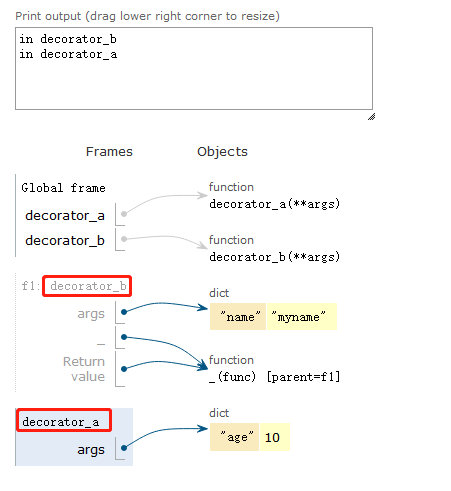

<!-- GFM-TOC -->

* [一 、装饰器](#一-装饰器)

   


  <!-- GFM-TOC -->

# 一 、装饰器

**问题1.执行顺序**

```python
def decorator_a(**args):
        print("in decorator_a")

        def _(func):
                print("in decorator_a _")

                def wrapper_func(*i, **ki):
                        print("in decorator_a _ wrapper_func")
                        return func(*i,**ki)

                return wrapper_func

        return _


def decorator_b(**args):
        print("in decorator_b")

        def _(func):
                print("in decorator_b _")

                def wrapper_func(*i, **ki):
                        print("in decorator_b _ wrapper_func")
                        return func(*i, **ki)

                return wrapper_func

        return _


@decorator_b(name="myname")
@decorator_a(age=10)
def my(a, b):
        print("in my {0}, {1}".format(a, b))
        return a

my("aaa", {"xxx":"this"})
////////////////////////////////
in decorator_b
in decorator_a
in decorator_a _
in decorator_b _
in decorator_b _ wrapper_func
in decorator_a _ wrapper_func
in my aaa, {'xxx': 'this'}
```

第3行到第7行的输出顺序 可以参考这篇文章 https://segmentfault.com/a/1190000007837364

第1行 第2行顺序原因：

装饰器是为了不改变原来函数代码的基础上，增加新的需求，在python里装饰器就是一个高阶函数。

@是装饰器的语法糖。

例子中的装饰器

```python
@decorator_b(name="myname")
@decorator_a(age=10)
def my(a, b):
        print("in my {0}, {1}".format(a, b))
        return a
        
//////////实际上等同于/////////////
my = decorator_b(name="myname")(decorator_a(age=10)(my))
```

这是立即执行的，所以在例子中最后一行调用my之前，就打印出了1-4行的内容。后面的打印结果没问题，我们就先关注这个赋值语句的执行过程，（对应打印结果的1-4行）

语法有点乱也不慌，用 ast 看看python是如何看待这句话的

```python
import ast
import astunparse

src = '''my = decorator_b(name="myname")(decorator_a(age=10)(my))'''

node = ast.parse(src)
r = astunparse.dump(node)
print(r)
////////////////////结果/////////////////
Module(body=[Assign(
  targets=[Name(
    id='my',
    ctx=Store())],
  value=Call(
    func=Call(
      func=Name(
        id='decorator_b',
        ctx=Load()),
      args=[],
      keywords=[keyword(
        arg='name',
        value=Str(s='myname'))]),
    args=[Call(
      func=Call(
        func=Name(
          id='decorator_a',
          ctx=Load()),
        args=[],
        keywords=[keyword(
          arg='age',
          value=Num(n=10))]),
      args=[Name(
        id='my',
        ctx=Load())],
      keywords=[])],
    keywords=[]))])
```

这时候就很明显了，python认为这是一个Assign赋值语句，赋值给`my`，值是一个Call函数调用的结果，Call的函数本体是这一部分：

```
    func=Call(
      func=Name(
        id='decorator_b',
        ctx=Load()),
      args=[],
      keywords=[keyword(
        arg='name',
        value=Str(s='myname'))]),
```

是`decorator_b(name="myname")`执行的结果！所以这时候打印出了第一行函数的参数是`decorator_a(age=10)(my)`。以此类推，打印出了第二行。

总结：

- 装饰器就像装箱，装的时候先打包里面的，再打包外层的，打开的时候，先拆外面的再拆里面的，这里b是外层a是里层，这就是3-7行的原因。

  但第1行第2行不是装饰器，是生产装饰器的过程，生成顺序按代码中出现的顺序。

  ```
  @decorator_b(name="myname")
  @decorator_a(age=10)
  ```

​		这里decorator_b(name="myname") 是个函数调用，它的返回值才是作为装饰器（箱子）包装到my函数		上，所以它们是在Python解释这个文件时就立刻执行了，解释的顺序自然是从上到下。

- 简单来说，就是代码运行后先调用函数decorator_b，所以第一行打印in decorator_b； 之后会调用decorator_a, 所以第二行打印in decorator_a.看这里: [pythontutor](http://www.pythontutor.com/visualize.html#code=def decorator_a(**args)%3A        print("in decorator_a")         def _(func)%3A                print("in decorator_a _")                 def wrapper_func(*i, **ki)%3A                        print("in decorator_a _ wrapper_func")                        return func(*i,**ki)                 return wrapper_func         return _  def decorator_b(**args)%3A        print("in decorator_b")         def _(func)%3A                print("in decorator_b _")                 def wrapper_func(*i, **ki)%3A                        print("in decorator_b _ wrapper_func")                        return func(*i, **ki)                 return wrapper_func         return _  %40decorator_b(name%3D"myname") %40decorator_a(age%3D10) def my(a, b)%3A        print("in my {0}, {1}".format(a, b)) 

<div align="center">  </div><br>