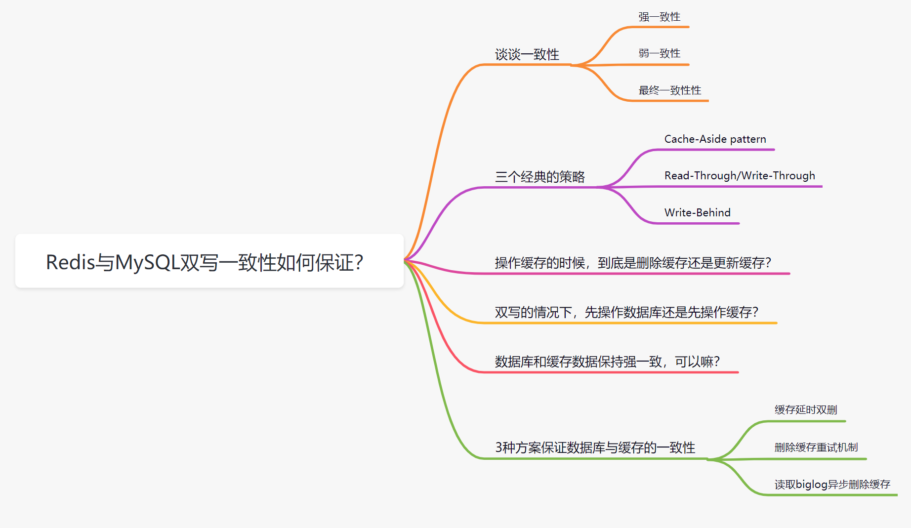
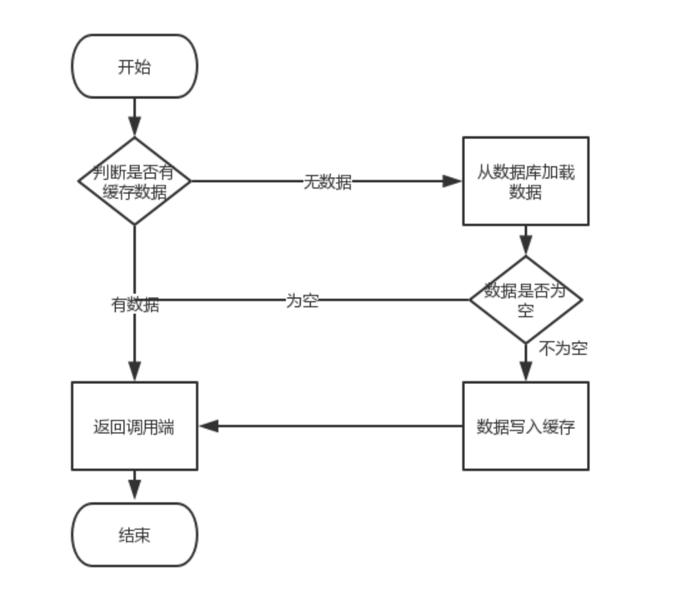
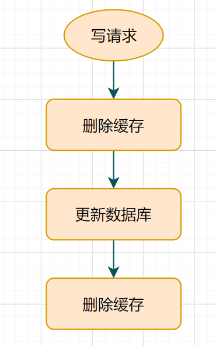
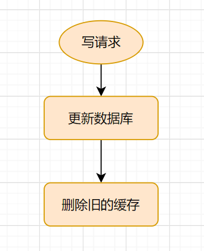
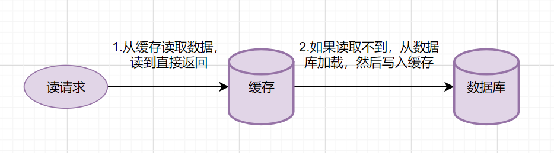
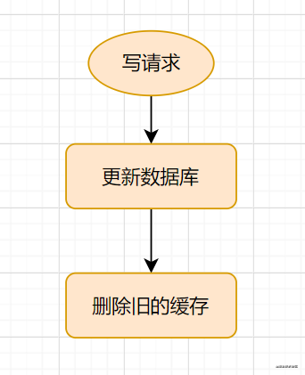
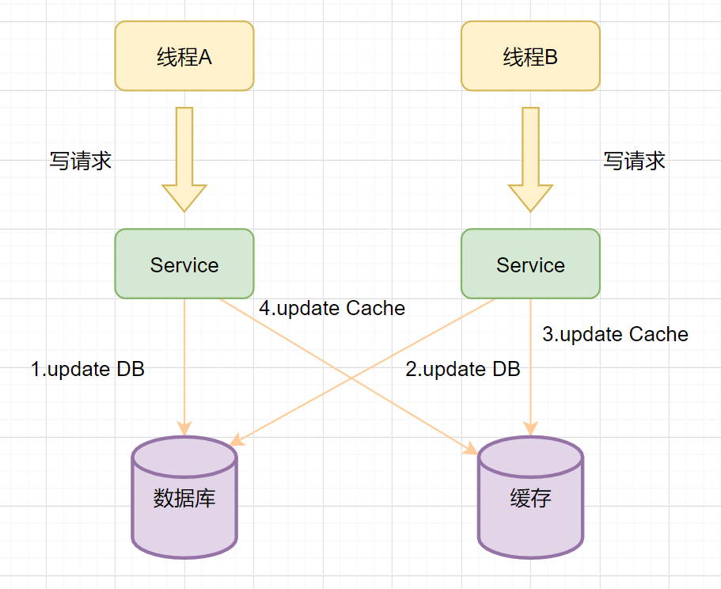
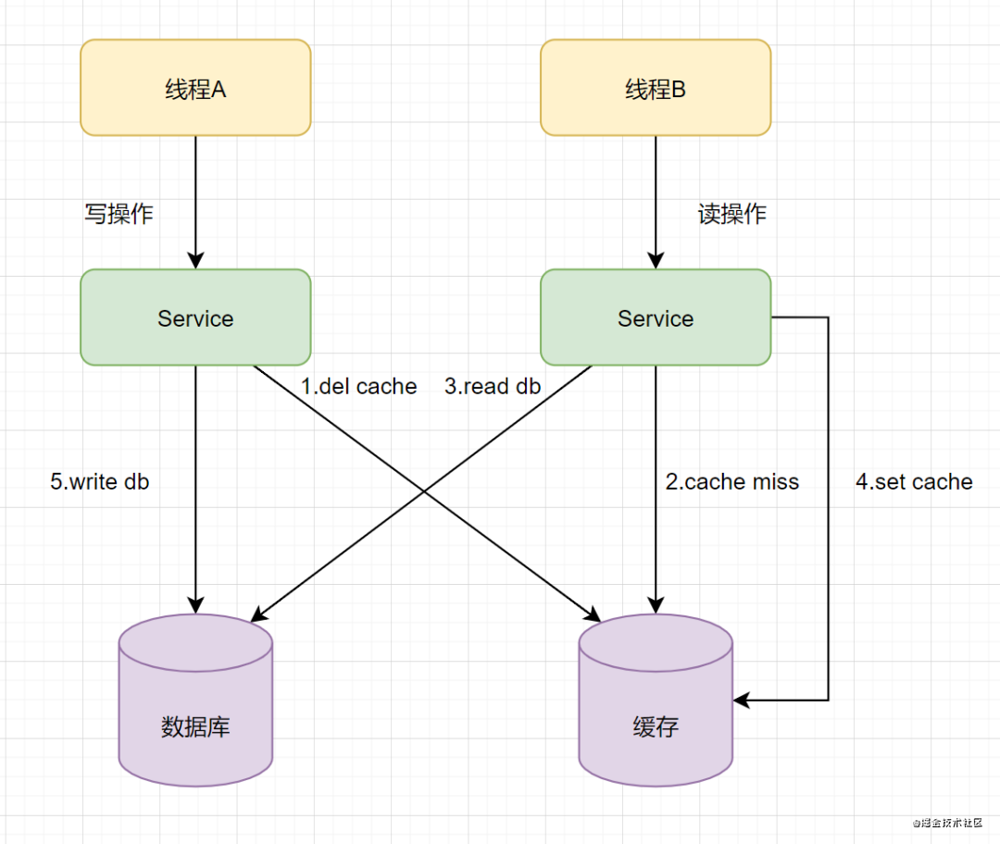
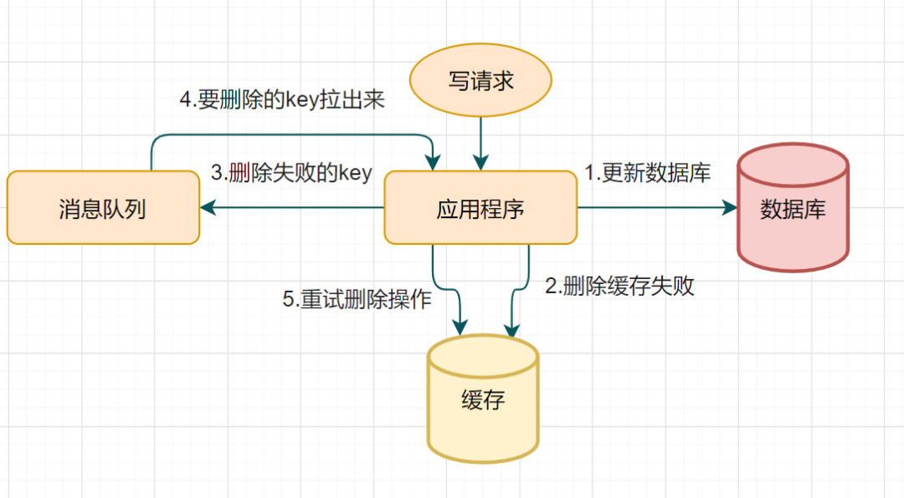

<div align="center">  </div><br>

## 一、一致性

一致性就是数据保持一致，在分布式系统中，可以理解为多个节点中数据的值是一致的。

- **强一致性**：这种一致性级别是最符合用户直觉的，它要求系统写入什么，读出来的也会是什么，用户体验好，但实现起来往往对系统的性能影响大
- **弱一致性**：这种一致性级别约束了系统在写入成功后，不承诺立即可以读到写入的值，也不承诺多久之后数据能够达到一致，但会尽可能地保证到某个时间级别（比如秒级别）后，数据能够达到一致状态
- **最终一致性**：最终一致性是弱一致性的一个特例，系统会保证在一定时间内，能够达到一个数据一致的状态。这里之所以将最终一致性单独提出来，是因为它是弱一致性中非常推崇的一种一致性模型，也是业界在大型分布式系统的数据一致性上比较推崇的模型

### 缓存和数据库不一致

数据一致性有以下三个要求：

- 缓存不能读到脏数据。
- 缓存可能会读到过期数据，但要在可容忍时间内实现最终一致。
- 这个可容忍时间尽可能的小。

例如现有三个请求：写入数据A和C和读取数据的B。都对同一个数据进行读写操作。

1. A先写入缓存再写数据库会怎样?

   答：有可能缓存写完程序出错退出，数据库写入失败，此时B读取的缓存就是脏数据。

2. A先写入数据库再写入缓存呢?

   答：A先写，然后C继续写，接着C写入缓存，然后某种原因A写入缓存的步骤来晚了再去写入缓存，B去读缓存的时候就是A后面写入的脏数据了。

3. A只管写数据库，然后删除缓存，等B来读的时候发现没缓存再去读取数据库同时写入缓存呢?

   答：还是不行，因为这么操作流量大的时候可能都发现没缓存击都去读取数据库导致直接打垮数据库。或者B读取完毕的时候，C开始写数据库，然后C先同步缓存成功，然后B再去写入缓存，结果可想而知还是脏数据。

#### **缓存更新的难点**

先更新缓存还是先更新存储，缓存的处理是通过删除来实现还是通过更新来实现。这里我们面临的问题本质上是一个数据库的分布式事务的问题，需要处理数据可靠性的挑战，并发更新带来的隔离性挑战，和数据更新原子性的挑战。

- **数据可靠性**

如果要保证数据的可靠性，在业务逻辑成功之前，必须保障有一份数据落地，有以下两个选择：

1. 先更新成功存储，再更新缓存；
2. 先更新成功缓存，再跟新存储，如果存储更新失败，删除缓存；

- **操作隔离性**

一条数据的更新涉及到存储和缓存两套系统，如果多个线程同时操作一条数据，并且没有方案保证多个操作之间的有序执行，就可能会发生更新顺序错乱导致数据不一致的问题。

- **更新原子性**

引入缓存后，我们需要保证缓存和存储要么同时更新成功，要么同时更新失败，否则部分更新成功就会导致缓存和存储数据不一致的问题。

## 二、缓存和数据库之间的调用关系基本套路

**前言：**

对于读多写少的场景，通常使用内存型数据库作为缓存，关系型数据库作为主存储，从而形成两层相互依赖的存储体系。

缓存系统的**读取场景**和**更新场景**：

- 读取时只要之前MySQL和Redis中的数据是一致的，后续只要没有更新操作就不会有什么问题，同时借助于内存来提高并发能力，这也是我们设计缓存系统的初衷。
- 对于读多写少的业务模型，由于**操作MySQL和Redis并非天然的原子操作**，会造成数据的不一致，需要特殊处理。

**1. 读取场景READ: 读请求优先从缓存中获取数据，拿到后即可返回；如缓存无数据，则从主存储拿数据，并且将数据更新到缓存中，为后续的读取请求做铺垫，并设置过期时间，返回前端。读取场景基本没什么大问题。**

<div align="center">  </div><br>

**2. 更新场景DELETE/UPDATE/INSERT ：**

更新过程之所以会出现数据不一致问题，有**内外两大原因**：

- **内部原因**：Redis和MySQL的更新不是天然的原子操作，非事务性的组合拳。
- **外部原因**：实际中的读写请求是并发且无序的，可预测性很差，完全不可控。

要实现缓存和主存储的强一致性，需要借助于复杂的分布式一致性协议等，倒不如不用缓存，毕竟缓存的优势还是读多写少的场景。

> **缓存并不是什么万金油，对于写多读少的场景，或许并不是适合用缓存。**
>
> **研究重点：在保证数据最终一致性的前提下，如何把数据不一致带来的影响降低到业务可接受的范围内？**

**更新还是删除是个问题**

当MySQL被更新时，我们如何处理Redis呢？

- 直接将key淘汰掉，是否再次被加载由后续读请求决定。
- 直接update发生变化的key，相当于帮后面的请求做了加载的操作。

可以明确一点删除操作直接操作就行(简单明了)，但是更新操作可能涉及的处理步骤更多，也就是update可能比delete更复杂。

另外，我们需要尽量保证Redis中的数据都是热数据，update每次都会使得数据驻留在Redis中，或许这是没有必要的，因为这些可能是冷数据，至于要加载哪些数据，还是交给后面的请求比较合适，各司其职。

**综上，我们更倾向于将delete作为通用的选择，因此后续都是基于淘汰缓存来展开的。**

Redis和MySQL的数据不一致产生的根源是**业务需要进行更新(写入)操作**。

> **先操作Redis 还是 先操作MySQL是个问题，操作时序不同产生的影响也不同。**

> 尺有所短，寸有所长，说到底是一种权衡，哪一种组合产生的负面影响对业务最小，就倾向于哪种方案。

**对于保证数据最终一致性，缓存系统的数据不一致问题，是个经典的问题，因此肯定有很多解决问题的套路**，所以让我们带着分析和思考去看看，各个方案的利弊。

### 2.0 设置缓存过期时间

缓存的作用是将热点数据缓存到内存实现加速，内存的成本要远高于磁盘，因此我们通常仅仅缓存热数据在内存，冷数据需要定期的从内存淘汰，数据的淘汰通常有两种方案：

- 主动淘汰，这是推荐的方式，我们通过对Key设置TTL的方式来让Key定期淘汰，以保障冷数据不会长久的占有内存。TTL的策略可以保证冷数据一定被淘汰，但是没有办法保障热数据始终在内存，这个我们在后面会展开；
- 被动淘汰，这个是保底方案，并不推荐，Redis提供了一系列的Maxmemory策略来对数据进行驱逐，触发的前提是内存要到达maxmemory（内存使用率100%），在maxmemory的场景下缓存的质量是不可控的，因为每次缓存一个Key都可能需要去淘汰一个Key。

当向Redis写入一条数据时，同时设置过期时间x秒，业务不同过期时间不同。

过期时间到达时Redis就会删掉这条数据，后续读请求Redis出现Cache Miss，进而读取MySQL，然后把数据写到Redis。

如果发生更新操作时，只操作MySQL，那么Redis中的数据更新就只是依赖于过期时间来保底，淘汰后再被加载就是新数据了。

> 这种方案是最简单的，如果业务对短时间不一致问题并不在意，设置过期时间的方案就足够了，没有必要搞太复杂。

### 2.1 先更新数据库，再更新缓存

这套方案，大家是普遍反对的。为什么呢？有如下两点原因。
​       原因一（线程安全角度）

​       同时有请求A和请求B进行更新操作，那么会出现
​       1）线程A更新了数据库
​       2）线程B更新了数据库
​       3）线程B更新了缓存
​       4）线程A更新了缓存

这就出现请求A更新缓存应该比请求B更新缓存早才对，但是因为网络等原因，B却比A更早更新了缓存。这就导致 了脏数据，因此不考虑。
       原因二（业务场景角度），有如下两点：
       1）如果你是一个写数据库场景比较多，而读数据场景比较少的业务需求，采用这种方案就会导致，数据压根还没读到，缓存就被频繁的更新，浪费性能。
       2）如果你写入数据库的值，并不是直接写入缓存的，而是要经过一系列复杂的计算再写入缓存。那么，每次写入数据库后，都再次计算写入缓存的值，无疑是浪费性能的。显然，删除缓存更为适合。

### 2.2 先更新缓存，再更新数据库

​         有存在其他的线程安全问题么？

​		有的，假设这会同时有请求A和请求B进行更新操作，那么会出现
​          1）线程A更新了缓存
​          2）线程B更新了缓存
​          3）线程B更新了数据库
​          4）线程A更新了数据库
​         请求A更新数据库应该比请求B更新数据库早才对，但是因为网络等原因，B却比A更早更新了数据库。这就导致了脏数据，因此不考虑。

### 2.3 先删除缓存，再更新数据库/缓存延时双删

​    该方案会导致不一致的原因是。同时有一个请求A进行更新操作，另一个请求B进行查询操作。那么会出现如下情形:
​       1）请求A进行写操作，删除缓存
​       2）请求B查询发现缓存不存在
​       3）请求B去数据库查询得到旧值
​       4）请求B将旧值写入缓存
​       5）请求A将新值写入数据库
​       上述情况就会导致不一致的情形出现。而且，如果不采用给缓存设置过期时间策略，该数据永远都是脏数据。
​       有些小伙伴可能会说，并不一定要先操作数据库呀，采用**缓存延时双删**策略，就可以保证数据的一致性啦。什么是延时双删呢？
​       伪代码如下

```java
public void write(String key,Object data){
		redis.delKey(key);
	    db.updateData(data);
	    Thread.sleep(1000);
	    redis.delKey(key);
	}
```

<div align="center">  </div><br>

​		转化为中文描述就是： 
​       1）先淘汰缓存
​       2）再写数据库（这两步和原来一样）
​       3）休眠1秒，再次淘汰缓存
​       这么做，可以将1秒内所造成的缓存脏数据，再次删除。
​       **那么，这个1秒怎么确定的，具体该休眠多久呢？**（休眠时间 =  读业务逻辑数据的耗时 + 几百毫秒。为了确保读请求结束，写请求可以删除读请求可能带来的缓存脏数据。）
​       针对上面的情形，读者应该自行评估自己的项目的读数据业务逻辑的耗时。然后写数据的休眠时间则在读数据业务逻辑的耗时基础上，加几百ms即可。这么做的目的，就是确保读请求结束，写请求可以删除读请求造成的缓存脏数据。

​	 **对于mysql的读写分离架构：**在这种情况下，造成数据不一致的原因如下，还是两个请求，一个请求A进行更新操作，另一个请求B进行查询操作。
​       1）请求A进行写操作，删除缓存
​       2）请求A将数据写入数据库了，
​       3）请求B查询缓存发现，缓存没有值
​       4）请求B去从库查询，这时，还没有完成主从同步，因此查询到的是旧值
​       5）请求B将旧值写入缓存
​       6）数据库完成主从同步，从库变为新值
​       上述情形，就是数据不一致的原因。还是使用双删延时策略。只是，睡眠时间修改为在主从同步的延时时间基础上，加几百ms。

​	**采用这种同步淘汰策略，吞吐量降低怎么办？**
 	  那就将第二次删除作为异步的。自己起一个线程，异步删除。这样，写的请求就不用沉睡一段时间后了，再返回。这么做，加大吞吐量。
 	  **第二次删除,如果删除失败怎么办？**

​		 这是个非常好的问题，因为第二次删除失败，就会出现如下情形。还是有两个请求，一个请求A进行更新操作，另一个请求B进行查询操作，为了方便，假设是单库：
​       1）请求A进行写操作，删除缓存
​       2）请求B查询发现缓存不存在
​       3）请求B去数据库查询得到旧值
​       4）请求B将旧值写入缓存
​       5）请求A将新值写入数据库
​       6）请求A试图去删除请求B写入对缓存值，结果失败了。
​       ok,这也就是说。如果第二次删除缓存失败，会再次出现缓存和数据库不一致的问题。
​       **如何解决呢？ 使用最后一个策略： 先更新数据库，再删除缓存**

### 2.4 先更新数据库，再删除缓存 - 最经典的缓存+数据库读写的模式 Cache Aside Pattern

即**旁路缓存模式**，它的提出是为了尽可能地解决缓存与数据库的数据不一致问题。

**Cache-Aside Pattern**的**读**请求流程如下：

<div align="center">  </div><br>

1. 读的时候，先读缓存，缓存命中的话，直接返回数据
2. 缓存没有命中的话，就去读数据库，从数据库取出数据，放入缓存后，同时返回响应。

**Cache-Aside Pattern**的**写**请求流程如下：

<div align="center">  </div><br>

更新的时候，先**更新数据库，然后再删除缓存**。

  **这种情况不存在并发问题么？**
        不是的。假设这会有两个请求，一个请求A做查询操作，一个请求B做更新操作，那么会有如下情形产生
        1）缓存刚好失效
        2）请求A查询数据库，得一个旧值
        3）请求B将新值写入数据库
        4）请求B删除缓存
        5）请求A将查到的旧值写入缓存
        ok，如果发生上述情况，确实是会发生脏数据。
        **然而，发生这种情况的概率又有多少呢？**
        发生上述情况有一个先天性条件，就是步骤（3）的写数据库操作比步骤（2）的读数据库操作耗时更短，才有可能使得步骤（4）先于步骤（5）。可是，大家想想，数据库的读操作的速度远快于写操作的（不然做读写分离干嘛，做读写分离的意义就是因为读操作比较快，耗资源少），因此步骤（3）耗时比步骤（2）更短，这一情形很难出现。

​	**假设，有人说一定要解决上述并发问题？**
​        1): 给缓存设有效时间是一种方案。

​        2): 采用上面介绍异步延时删除策略，保证读请求完成以后，再进行删除操作。

总结：根据以上对比，优先采用：先更新数据库，再删除缓存 的策略

## 三、其他两个经典的缓存模式

### Read-Through/Write-Through（读写穿透）

**Read/Write-Through**模式中，服务端把缓存作为主要数据存储。应用程序跟数据库缓存交互，都是通过**抽象缓存层**完成的。

#### Read-Through

**Read-Through**的简要流程如下

<div align="center">  </div><br>

1. 从缓存读取数据，读到直接返回
2. 如果读取不到的话，从数据库加载，写入缓存后，再返回响应。

这个简要流程是不是跟**Cache-Aside**很像呢？其实**Read-Through**就是多了一层**Cache-Provider**而已，流程如下：

<div align="center">  </div><br>

Read-Through实际只是在**Cache-Aside**之上进行了一层封装，它会让程序代码变得更简洁，同时也减少数据源上的负载。

#### Write-Through

**Write-Through**模式下，当发生写请求时，也是由**缓存抽象层**完成数据源和缓存数据的更新,流程如下：

<div align="center">  </div><br>

### Write-behind （异步缓存写入）

**Write-behind** 跟Read-Through/Write-Through有相似的地方，都是由**Cache Provider**来负责缓存和数据库的读写。它们又有个很大的不同：**Read/Write-Through**是同步更新缓存和数据的，**Write-Behind**则是只更新缓存，不直接更新数据库，通过**批量异步**的方式来更新数据库。

<div align="center">  </div><br>

这种方式下，缓存和数据库的一致性不强，**对一致性要求高的系统要谨慎使用**。但是它适合频繁写的场景，MySQL的**InnoDB Buffer Pool机制**就使用到这种模式。

## 四、操作缓存的时候，到底是删除缓存呢，还是更新缓存？

日常开发中，一般使用的就是**Cache-Aside**模式。有些小伙伴可能会问，**Cache-Aside**在写入请求的时候，为什么是**删除缓存而不是更新缓存**呢？

<div align="center">  </div><br>

在操作缓存的时候，到底应该删除缓存还是更新缓存呢？我们先来看个例子：

<div align="center">  </div><br>

1. 线程A先发起一个写操作，第一步先更新数据库
2. 线程B再发起一个写操作，第二步更新了数据库
3. 由于网络等原因，线程B先更新了缓存
4. 线程A更新缓存。

这时候，缓存保存的是A的数据（老数据），数据库保存的是B的数据（新数据），数据**不一致**了，脏数据出现啦。如果是**删除缓存取代更新缓存**则不会出现这个脏数据问题。

**更新缓存相对于删除缓存**，还有两点劣势：

- 如果你写入的缓存值，是经过复杂计算才得到的话。更新缓存频率高的话，就浪费性能啦。
- 在写数据库场景多，读数据场景少的情况下，数据很多时候还没被读取到，又被更新了，这也浪费了性能呢(实际上，写多的场景，用缓存也不是很划算的,哈哈)

## 五、双写的情况下，先操作数据库还是先操作缓存？

`Cache-Aside`缓存模式中，有些小伙伴还是会有疑问，在写请求过来的时候，为什么是**先操作数据库呢**？为什么**不先操作缓存**呢？

假设有A、B两个请求，请求A做更新操作，请求B做查询读取操作。

<div align="center">  </div><br>

1. 线程A发起一个写操作，第一步del cache
2. 此时线程B发起一个读操作，cache miss
3. 线程B继续读DB，读出来一个老数据
4. 然后线程B把老数据设置入cache
5. 线程A写入DB最新的数据

酱紫就有问题啦，**缓存和数据库的数据不一致了。缓存保存的是老数据，数据库保存的是新数据**。因此，Cache-Aside缓存模式，选择了先操作数据库而不是先操作缓存。

- 个别小伙伴可能会问，先操作数据库再操作缓存，不一样也会导致数据不一致嘛？它俩又不是原子性操作的。这个是**会的**，但是这种方式，一般因为删除缓存失败等原因，才会导致脏数据，这个概率就很低。小伙伴们可以画下操作流程图，自己先分析下哈。接下来我们再来分析这种**删除缓存失败**的情况，**如何保证一致性**。

## 六、数据库和缓存数据保持强一致，可以嘛？

实际上，没办法做到数据库与缓存**绝对的一致性**。

- 加锁可以嘛？并发写期间加锁，任何读操作不写入缓存？
- 缓存及数据库封装CAS乐观锁，更新缓存时通过lua脚本？
- 分布式事务，3PC？TCC？

其实，这是由**CAP理论**（指的是在一个分布式系统中， Consistency（一致性）、 Availability（可用性）、Partition tolerance（分区容错性），三者不可得兼。）定的。缓存系统适用的场景就是非强一致性的场景，它属于CAP中的AP。**个人觉得，追求绝对一致性的业务场景，不适合引入缓存**。

但是，通过一些方案优化处理，是可以**保证弱一致性，最终一致性**的。

## 七、三种方案保证数据库与缓存的一致性

### 缓存延时双删

问题来了：对于如果删缓存失败了怎么办？数据就不一致了， 比如一个写数据请求，然后写入数据库了，删缓存失败了，这会就出现不一致的情况了。为此，需提供一个保障的重试机制即可，这里给以下两套方案。

### 删除缓存重试机制

不管是**延时双删**还是**Cache-Aside的先操作数据库再删除缓存**，都可能会存在第二步的删除缓存失败，导致的数据不一致问题。可以使用这个方案优化：删除失败就多删除几次呀,保证删除缓存成功就可以了呀~ 所以可以引入**删除缓存重试机制**

<div align="center">  </div><br>

1. 写请求更新数据库
2. 缓存因为某些原因，删除失败
3. 把删除失败的key放到消息队列
4. 消费消息队列的消息，获取要删除的key
5. 重试删除缓存操作

缺点：对业务线代码造成大量的侵入。于是有了方案二，在方案二中，启动一个订阅程序去订阅数据库的binlog，获得需要操作的数据。在应用程序中，另起一段程序，获得这个订阅程序传来的信息，进行删除缓存操作。

### 读取binlog异步删除缓存

重试删除缓存机制还可以吧，就是会造成好多**业务代码入侵**。其实，还可以这样优化：通过数据库的**binlog来异步淘汰key**。**目前业界比较公认的解法，但需要的设计和编码的成本也是最高的**

采用订阅监听binlog方式异步串行处理，如采用阿里开源的中间件canal可以完成订阅binlog日志的功能。mysql主从时会在主机修改后写入bijnlog日志，然后同步到从服务器。这些组件伪装成从服务器，从收到binlog日志里面解析出原始的修改，然后再去从容的修改缓存。异步串行处理让复杂的事情变得简单了。

<div align="center">  </div><br>

​		流程如下图所示：
​        1）更新数据库数据
​        2）数据库会将操作信息写入binlog日志当中
​        3）订阅程序提取出所需要的数据以及key
​        4）另起一段非业务代码，获得该信息
​        5）尝试删除缓存操作，发现删除失败
​        6）将这些信息发送至消息队列
​        7）重新从消息队列中获得该数据，重试操作。

局限性：

- 为了保证高效，这个最好不要做复杂的逻辑，比如聚合 连表 统计等等，不然的话影响性能。一般都是原表的复制或者是某些字段的复制。需要提前配置好，太不灵活，对于业务开发人员不够友好。

- 有一定的延迟性。这个其实还好的，一般都是毫秒级的同步。但是需要注意监控，出现问题最好及时人工处理。

​		 方案升级)：如果数据库存在读写分离的场景，读从写主。主从DB问题：因为主从DB同步存在同时延时时间如果删除缓存之后，数据同步到备库之前已经有请求过来时，会从备库中读到脏数据，如何解决呢？解决方案： 从从库中拉取binlog数据,而不是从主数据库拉取即可。

**追加方案**

- 缓存引入版本号。

  设计表的时候增加版本号字段，每次update其他字段的时候增加set version=version+1，每次写入修改后，再去读取一把获取数据以及最新的version字段，再去修改缓存，如果发现缓存的中的版本比较高就不去修改缓存，如果现有缓存比较低就修改缓存。

  局限性：

  只有部分缓存支持，memcache和redis都不支持，如果采取读取缓存再去判断再去操作缓存，就变成非原子性的操作，一样的有不同步的风险。

- 写入缓存前加锁

  先加锁(一定要带失效时间)，再去查询数据库，再去写入缓存，然后删除锁。其他需要写入缓存的操作一定要先判断是否有锁，有锁就休眠一会再去重复刚才的动作。

  局限性：

  - 锁的失效时间一定要设置，还要设置的比较恰当，不然的话会出问题，推荐5-10s吧。

  - 只要是锁都是有风险的，都会影响点性能的。

综上，最好的还是监听binglog异步处理，其次如果采用缓存支持版本号可以使用版本号，再其次采用加锁。当然了如果要求不算太高可以先删缓存->写数据库->读取数据库->写缓存。Facebook选择了这个方案。


