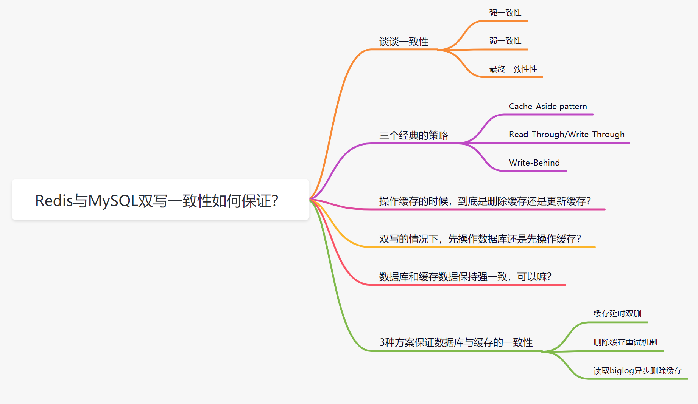
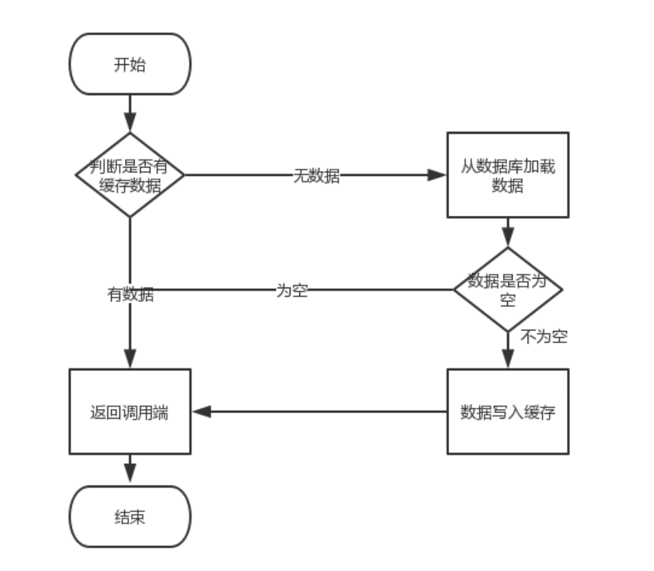
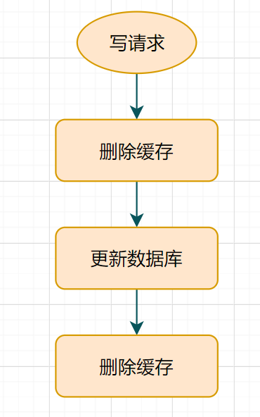
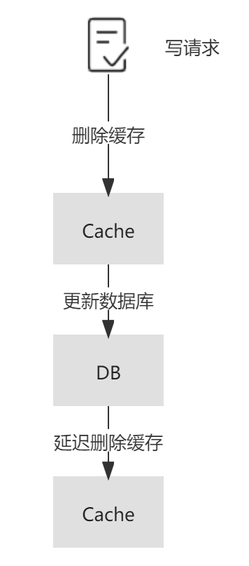

<div align="center">  </div><br>

## 缓存系统交互

缓存系统设计是后端开发人员的必备技能，也是实现高并发的重要武器。

对于读多写少的场景，我们通常使用内存型数据库作为缓存，关系型数据库作为主存储，从而形成两层相互依赖的存储体系。

> **共识**：我们将使用Redis和MySQL作为缓存和主存的实体，展开今天的话题。

缓存系统的**读取场景**和**更新场景**：

- 读取时只要之前MySQL和Redis中的数据是一致的，后续只要没有更新操作就不会有什么问题，同时借助于内存来提高并发能力，这也是我们设计缓存系统的初衷。
- 对于读多写少的业务模型，由于**操作MySQL和Redis并非天然的原子操作**，会造成数据的不一致，需要特殊处理。

<div align="center">  </div><br>

**读取过程示意：**

<div align="center">  </div><br>

> **读取过程**：读请求优先从缓存中获取数据，拿到后即可返回；如缓存无数据，则从主存储拿数据，并且将数据更新到缓存中，为后续的读取请求做铺垫。

更新过程之所以会出现数据不一致问题，有**内外两大原因**：

- **内部原因**：Redis和MySQL的更新不是天然的原子操作，非事务性的组合拳。
- **外部原因**：实际中的读写请求是并发且无序的，可预测性很差，完全不可控。

<div align="center">  </div><br>

## 一、什么是数据库与缓存一致性

数据一致性指的是：

- 缓存中存有数据，缓存的数据值 = 数据库中的值；
- 缓存中没有该数据，数据库中的值 = 最新值。

反推缓存与数据库不一致：

- 缓存的数据值 ≠ 数据库中的值；
- 缓存或者数据库存在旧的数据，导致线程读取到旧数据。

缓存系统的数据一致性通常包括持久化层和缓存层的一致性、以及多级缓存之间的一致性，这里我们仅讨论前者。持久化层和缓存层的一致性问题也通常被称为双写一致性问题，“双写”意为数据既在数据库中保存一份，也在缓存中保存一份，当数据发生改变我们需要双写来保证缓存与数据库的数据一致，即衍生出数据一致性问题。


一致性就是数据保持一致，在分布式系统中，可以理解为多个节点中数据的值是一致的。数据一致性可以说是分布式系统中必然存在的问题，数据一致性可以分为：

- **强一致性**：这种一致性级别是最符合用户直觉的，它要求系统写入什么，读出来的也会是什么，用户体验好，但实现起来往往对系统的性能影响大
- **弱一致性**：这种一致性级别约束了系统在写入成功后，不承诺立即可以读到写入的值，也不承诺多久之后数据能够达到一致，但会尽可能地保证到某个时间级别（比如秒级别）后，数据能够达到一致状态
- **最终一致性**：最终一致性是弱一致性的一个特例，系统会保证在一定时间内，能够达到一个数据一致的状态。这里之所以将最终一致性单独提出来，是因为它是弱一致性中非常推崇的一种一致性模型，也是业界在大型分布式系统的数据一致性上比较推崇的模型

对于应用缓存的大部分场景来说，追求的则是最终一致性，少部分对数据一致性要求极高的场景则会追求强一致性。

### 缓存更新的难点

先更新缓存还是先更新存储，缓存的处理是通过删除来实现还是通过更新来实现。这里我们面临的问题本质上是一个数据库的分布式事务的问题，需要处理数据可靠性的挑战，并发更新带来的隔离性挑战，和数据更新原子性的挑战。

- **数据可靠性**

如果要保证数据的可靠性，在业务逻辑成功之前，必须保障有一份数据落地，有以下两个选择：

1. 先更新成功存储，再更新缓存；
2. 先更新成功缓存，再跟新存储，如果存储更新失败，删除缓存；

- **操作隔离性**

一条数据的更新涉及到存储和缓存两套系统，如果多个线程同时操作一条数据，并且没有方案保证多个操作之间的有序执行，就可能会发生更新顺序错乱导致数据不一致的问题。

- **更新原子性**

引入缓存后，我们需要保证缓存和存储要么同时更新成功，要么同时更新失败，否则部分更新成功就会导致缓存和存储数据不一致的问题。

## 二、缓存和数据库之间的调用关系基本套路

**前言：**

对于读多写少的场景，通常使用内存型数据库作为缓存，关系型数据库作为主存储，从而形成两层相互依赖的存储体系。

缓存系统的**读取场景**和**更新场景**：

- 读取时只要之前MySQL和Redis中的数据是一致的，后续只要没有更新操作就不会有什么问题，同时借助于内存来提高并发能力，这也是我们设计缓存系统的初衷。
- 对于读多写少的业务模型，由于**操作MySQL和Redis并非天然的原子操作**，会造成数据的不一致，需要特殊处理。

**1. 读取场景READ: 读请求优先从缓存中获取数据，拿到后即可返回；如缓存无数据，则从主存储拿数据，并且将数据更新到缓存中，为后续的读取请求做铺垫，并设置过期时间，返回前端。读取场景基本没什么大问题。**

<div align="center">  </div><br>

**2. 更新场景DELETE/UPDATE/INSERT ：**

更新过程之所以会出现数据不一致问题，有**内外两大原因**：

- **内部原因**：Redis和MySQL的更新不是天然的原子操作，非事务性的组合拳。
- **外部原因**：实际中的读写请求是并发且无序的，可预测性很差，完全不可控。

要实现缓存和主存储的强一致性，需要借助于复杂的分布式一致性协议等，倒不如不用缓存，毕竟缓存的优势还是读多写少的场景。

> **缓存并不是什么万金油，对于写多读少的场景，或许并不是适合用缓存。**
>
> **研究重点：在保证数据最终一致性的前提下，如何把数据不一致带来的影响降低到业务可接受的范围内？**

**更新还是删除是个问题**

当MySQL被更新时，我们如何处理Redis呢？

- 直接将key淘汰掉，是否再次被加载由后续读请求决定。
- 直接update发生变化的key，相当于帮后面的请求做了加载的操作。

可以明确一点删除操作直接操作就行(简单明了)，但是更新操作可能涉及的处理步骤更多，也就是update可能比delete更复杂。

另外，我们需要尽量保证Redis中的数据都是热数据，update每次都会使得数据驻留在Redis中，或许这是没有必要的，因为这些可能是冷数据，至于要加载哪些数据，还是交给后面的请求比较合适，各司其职。

**综上，我们更倾向于将delete作为通用的选择，因此后续都是基于淘汰缓存来展开的。**

Redis和MySQL的数据不一致产生的根源是**业务需要进行更新(写入)操作**。

> **先操作Redis 还是 先操作MySQL是个问题，操作时序不同产生的影响也不同。**

> 尺有所短，寸有所长，说到底是一种权衡，哪一种组合产生的负面影响对业务最小，就倾向于哪种方案。

**对于保证数据最终一致性，缓存系统的数据不一致问题，是个经典的问题，因此肯定有很多解决问题的套路**，所以让我们带着分析和思考去看看，各个方案的利弊。

### 2.0 设置缓存过期时间

缓存的作用是将热点数据缓存到内存实现加速，内存的成本要远高于磁盘，因此我们通常仅仅缓存热数据在内存，冷数据需要定期的从内存淘汰，数据的淘汰通常有两种方案：

- 主动淘汰，这是推荐的方式，我们通过对Key设置TTL的方式来让Key定期淘汰，以保障冷数据不会长久的占有内存。TTL的策略可以保证冷数据一定被淘汰，但是没有办法保障热数据始终在内存，这个我们在后面会展开；
- 被动淘汰，这个是保底方案，并不推荐，Redis提供了一系列的Maxmemory策略来对数据进行驱逐，触发的前提是内存要到达maxmemory（内存使用率100%），在maxmemory的场景下缓存的质量是不可控的，因为每次缓存一个Key都可能需要去淘汰一个Key。

当向Redis写入一条数据时，同时设置过期时间x秒，业务不同过期时间不同。

过期时间到达时Redis就会删掉这条数据，后续读请求Redis出现Cache Miss，进而读取MySQL，然后把数据写到Redis。

如果发生更新操作时，只操作MySQL，那么Redis中的数据更新就只是依赖于过期时间来保底，淘汰后再被加载就是新数据了。

> 这种方案是最简单的，如果业务对短时间不一致问题并不在意，设置过期时间的方案就足够了，没有必要搞太复杂。

### 2.1 先更新数据库，再更新缓存

这套方案，大家是普遍反对的。为什么呢？有如下两点原因。
​       原因一（线程安全角度）

​       同时有请求A和请求B进行更新操作，那么会出现
​       1）线程A更新了数据库
​       2）线程B更新了数据库
​       3）线程B更新了缓存
​       4）线程A更新了缓存

这就出现请求A更新缓存应该比请求B更新缓存早才对，但是因为网络等原因，B却比A更早更新了缓存。这就导致 了脏数据，因此不考虑。
       原因二（业务场景角度），有如下两点：
       1）如果你是一个写数据库场景比较多，而读数据场景比较少的业务需求，采用这种方案就会导致，数据压根还没读到，缓存就被频繁的更新，浪费性能。
       2）如果你写入数据库的值，并不是直接写入缓存的，而是要经过一系列复杂的计算再写入缓存。那么，每次写入数据库后，都再次计算写入缓存的值，无疑是浪费性能的。显然，删除缓存更为适合。

### 2.2 先更新缓存，再更新数据库

​         有存在其他的线程安全问题么？

​		有的，假设这会同时有请求A和请求B进行更新操作，那么会出现
​          1）线程A更新了缓存
​          2）线程B更新了缓存
​          3）线程B更新了数据库
​          4）线程A更新了数据库
​         请求A更新数据库应该比请求B更新数据库早才对，但是因为网络等原因，B却比A更早更新了数据库。这就导致了脏数据，因此不考虑。

### 2.3 先删除缓存，再更新数据库

​    该方案会导致不一致的原因是。同时有一个请求A进行更新操作，另一个请求B进行查询操作。那么会出现如下情形:
​       1）请求A进行写操作，删除缓存
​       2）请求B查询发现缓存不存在
​       3）请求B去数据库查询得到旧值
​       4）请求B将旧值写入缓存
​       5）请求A将新值写入数据库
​       上述情况就会导致不一致的情形出现。而且，如果不采用给缓存设置过期时间策略，该数据永远都是脏数据。
​       有些小伙伴可能会说，并不一定要先操作数据库呀，采用**缓存延时双删**策略，就可以保证数据的一致性啦。什么是延时双删呢？
​       伪代码如下

```java
public void write(String key,Object data){
		redis.delKey(key);
	    db.updateData(data);
	    Thread.sleep(1000);
	    redis.delKey(key);
	}
```

<div align="center">  </div><br>

​		转化为中文描述就是： 
​       1）先淘汰缓存
​       2）再写数据库（这两步和原来一样）
​       3）休眠1秒，再次淘汰缓存
​       这么做，可以将1秒内所造成的缓存脏数据，再次删除。
​       **那么，这个1秒怎么确定的，具体该休眠多久呢？**（休眠时间 =  读业务逻辑数据的耗时 + 几百毫秒。为了确保读请求结束，写请求可以删除读请求可能带来的缓存脏数据。）
​       针对上面的情形，读者应该自行评估自己的项目的读数据业务逻辑的耗时。然后写数据的休眠时间则在读数据业务逻辑的耗时基础上，加几百ms即可。这么做的目的，就是确保读请求结束，写请求可以删除读请求造成的缓存脏数据。

​	 **对于mysql的读写分离架构：**在这种情况下，造成数据不一致的原因如下，还是两个请求，一个请求A进行更新操作，另一个请求B进行查询操作。
​       1）请求A进行写操作，删除缓存
​       2）请求A将数据写入数据库了，
​       3）请求B查询缓存发现，缓存没有值
​       4）请求B去从库查询，这时，还没有完成主从同步，因此查询到的是旧值
​       5）请求B将旧值写入缓存
​       6）数据库完成主从同步，从库变为新值
​       上述情形，就是数据不一致的原因。还是使用双删延时策略。只是，睡眠时间修改为在主从同步的延时时间基础上，加几百ms。

​	**采用这种同步淘汰策略，吞吐量降低怎么办？**
 	  那就将第二次删除作为异步的。自己起一个线程，异步删除。这样，写的请求就不用沉睡一段时间后了，再返回。这么做，加大吞吐量。
 	  **第二次删除,如果删除失败怎么办？**

​		 这是个非常好的问题，因为第二次删除失败，就会出现如下情形。还是有两个请求，一个请求A进行更新操作，另一个请求B进行查询操作，为了方便，假设是单库：
​       1）请求A进行写操作，删除缓存
​       2）请求B查询发现缓存不存在
​       3）请求B去数据库查询得到旧值
​       4）请求B将旧值写入缓存
​       5）请求A将新值写入数据库
​       6）请求A试图去删除请求B写入对缓存值，结果失败了。
​       ok,这也就是说。如果第二次删除缓存失败，会再次出现缓存和数据库不一致的问题。
​       **如何解决呢？ 使用最后一个策略： 先更新数据库，再删除缓存**

### 2.4 两个最佳策略

为了达到最终一致性，针对不同的场景，业界逐步形成了下面这几种应用缓存的策略。

#### 2.4.1 先更新数据库，再删除缓存（Cache Aside Pattern）

Cache-Aside 意为旁路缓存模式，是应用最为广泛的一种缓存策略。下面的图示展示了它的读写流程，来看看它是如何保证最终一致性的。在读请求中，首先请求缓存，若缓存命中（ cache hit ），则直接返回缓存中的数据；若缓存未命中（ cache miss ），则查询数据库并将查询结果更新至缓存，然后返回查询出的数据（ demand-filled look-aside ）。在写请求中，先更新数据库，再删除缓存（write-invalidate）。

<div align="center">  </div><br>

##### 2.4.1.1 为什么删除缓存，而不是更新缓存？

在 Cache-Aside 中，对于读请求的处理比较容易理解，但在写请求中，可能会有读者提出疑问，为什么要删除缓存，而不是更新缓存？站在符合直觉的角度来看，更新缓存是一个容易被理解的方案，但站在性能和安全的角度，更新缓存则可能会导致一些不好的后果。

首先是性能，当该缓存对应的结果需要消耗大量的计算过程才能得到时，比如需要访问多张数据库表并联合计算，那么在写操作中更新缓存的动作将会是一笔不小的开销。同时，当写操作较多时，可能也会存在刚更新的缓存还没有被读取到，又再次被更新的情况（这常被称为缓存扰动），显然，这样的更新是白白消耗机器性能的，会导致缓存利用率不高。而等到读请求未命中缓存时再去更新，也符合懒加载的思路，需要时再进行计算。删除缓存的操作不仅是幂等的，可以在发生异常时重试，而且写-删除和读-更新在语义上更加对称。

其次是安全，在并发场景下，在写请求中更新缓存可能会引发数据的不一致问题。参考下面的图示，若存在两个来自不同线程的写请求，首先来自线程 1 的写请求更新了数据库（ step 1 ），接着来自线程 2 的写请求再次更新了数据库（ step 3 ），但由于网络延迟等原因，线程 1 可能会晚于线程 2 更新缓存（ step 4 晚于 step 3 ），那么这样便会导致最终写入数据库的结果是来自线程 2 的新值，写入缓存的结果是来自线程 1 的旧值，即缓存落后于数据库，此时再有读请求命中缓存（ step 5 ），读取到的便是旧值。

<div align="center">  </div><br>

##### 2.4.1.2为什么先更新数据库，而不是先删除缓存？

在单线程下，这种方案看似具有一定合理性，这种合理性体现在删除缓存成功，但更新数据库失败的场景下，尽管缓存被删除了，下次读操作时，仍能将正确的数据写回缓存，相对于 Cache-Aside 中更新数据库成功，删除缓存失败的场景来说，先删除缓存的方案似乎更合理一些。那么，先删除缓存有什么问题呢？

问题仍然出现在并发场景下，首先来自线程 1 的写请求删除了缓存（ step 1 ），接着来自线程 2 的读请求由于缓存的删除导致缓存未命中，根据 Cache-Aside 模式，线程 2 继而查询数据库（ step 2 ），但由于写请求通常慢于读请求，线程 1 更新数据库的操作可能会晚于线程 2 查询数据库后更新缓存的操作（ step 4 晚于 step 3 ），那么这样便会导致最终写入缓存的结果是来自线程 2 中查询到的旧值，而写入数据库的结果是来自线程 1 的新值，即缓存落后于数据库，此时再有读请求命中缓存（ step 5 ），读取到的便是旧值。

<div align="center">  </div><br>

另外，先删除缓存，由于缓存中数据缺失，加剧数据库的请求压力，可能会增大缓存击穿出现的概率。

##### 2.4.1.3如果选择先删除缓存，再更新数据库，那如何解决一致性问题呢？

为了避免“先删除缓存，再更新数据库”这一方案在读写并发时可能带来的缓存脏数据，业界又提出了延时双删的策略，即在更新数据库之后，延迟一段时间再次删除缓存，为了保证第二次删除缓存的时间点在读请求更新缓存之后，这个延迟时间的经验值通常应稍大于业务中读请求的耗时。延迟的实现可以在代码中 `sleep` 或采用延迟队列。显而易见的是，无论这个值如何预估，都很难和读请求的完成时间点准确衔接，这也是延时双删被诟病的主要原因。

<div align="center">  </div><br>

**2.4.1.4那么 Cache-Aside 存在数据不一致的可能吗？**

在 Cache-Aside 中，也存在数据不一致的可能性。在下面的读写并发场景下，首先来自线程 1 的读请求在未命中缓存的情况下查询数据库（ step 1 ），接着来自线程 2 的写请求更新数据库（ step 2 ），但由于一些极端原因，线程 1 中读请求的更新缓存操作晚于线程 2 中写请求的删除缓存的操作（ step 4 晚于 step 3 ），那么这样便会导致最终写入缓存中的是来自线程 1 的旧值，而写入数据库中的是来自线程 2 的新值，即缓存落后于数据库，此时再有读请求命中缓存（ step 5 ），读取到的便是旧值。

这种场景的出现，不仅需要缓存失效且读写并发执行，而且还需要读请求查询数据库的执行早于写请求更新数据库，同时读请求的执行完成晚于写请求。足以见得，这种不一致场景产生的条件非常严格，在实际的生产中出现的可能性较小。

<div align="center">  </div><br>

除此之外，在并发环境下，Cache-Aside 中也存在读请求命中缓存的时间点在写请求更新数据库之后，删除缓存之前，这样也会导致读请求查询到的缓存落后于数据库的情况。

<div align="center">  </div><br>

虽然在下一次读请求中，缓存会被更新，但如果业务层面对这种情况的容忍度较低，那么可以采用加锁在写请求中保证“更新数据库&删除缓存”的串行执行为原子性操作（同理也可对读请求中缓存的更新加锁）。加锁势必会导致吞吐量的下降，故采取加锁的方案应该对性能的损耗有所预期。

<div align="center">  </div><br>

#### 2.4.2补偿机制

上面提到了，在 Cache-Aside 中可能存在更新数据库成功，但删除缓存失败的场景，如果发生这种情况，那么便会导致缓存中的数据落后于数据库，产生数据的不一致的问题。其实，不仅 Cache-Aside 存在这样的问题，在延时双删等策略中也存在这样的问题。针对可能出现的删除失败问题，目前业界主要有以下几种补偿机制。

##### 2.4.2.1删除重试机制

由于同步重试删除在性能上会影响吞吐量，所以常通过引入消息队列，将删除失败的缓存对应的 `key` 放入消息队列中，在对应的消费者中获取删除失败的 `key` ，异步重试删除。这种方法在实现上相对简单，但由于删除失败后的逻辑需要基于业务代码的 trigger 来触发 ，对业务代码具有一定入侵性。

<div align="center">  </div><br>

##### 2.4.2.2基于数据库日志（ MySQL binlog ）增量解析、订阅和消费

鉴于上述方案对业务代码具有一定入侵性，所以需要一种更加优雅的解决方案，让缓存删除失败的补偿机制运行在背后，尽量少的耦合于业务代码。一个简单的思路是通过后台任务使用更新时间戳或者版本作为对比获取数据库的增量数据更新至缓存中，这种方式在小规模数据的场景可以起到一定作用，但其扩展性、稳定性都有所欠缺。

一个相对成熟的方案是基于 MySQL 数据库增量日志进行解析和消费，这里较为流行的是阿里巴巴开源的作为 MySQL binlog 增量获取和解析的组件 canal （类似的开源组件还有 Maxwell、Databus 等）。canal sever 模拟 MySQL slave 的交互协议，伪装为 MySQL slave ，向 MySQL master 发送dump 协议，MySQL master 收到 dump 请求，开始推送 binary log 给 slave （即 canal sever ），canal sever 解析 binary log 对象（原始为 byte 流），可由 canal client 拉取进行消费，同时 canal server 也默认支持将变更记录投递到 MQ 系统中，主动推送给其他系统进行消费。在 ack 机制的加持下，不管是推送还是拉取，都可以有效的保证数据按照预期被消费。当前版本的 canal 支持的 MQ 有 kafka 或者 RocketMQ 。另外， canal 依赖 zookeeper 作为分布式协调组件来实现 HA ，canal 的 HA 分为两个部分：

- 为了减少对 MySQL dump 的请求压力，不同 canal server 上的 instance 要求同一时间只能有一个处于运行状态，其他的 instance 处于 standby 状态；
- 为了保证有序性，对于一个 instance 在同一时间只能由一个 canal client 进行 get/ack 等动作；

<div align="center">  </div><br>

<div align="center">  </div><br>

流程如下图所示：

1. 更新数据库；
2. 数据库会把操作信息记录在 binlog 日志中；
3. 使用 canal 订阅 binlog 日志获取目标数据和 key；
4. 缓存删除系统获取 canal 的数据，解析目标 key，尝试删除缓存。
5. 如果删除失败则将消息发送到消息队列；
6. 缓存删除系统重新从消息队列获取数据，再次执行删除操作。

那么，针对缓存的删除操作便可以在 canal client 或 consumer 中编写相关业务代码来完成。这样，结合数据库日志增量解析消费的方案以及 Cache-Aside 模型，在读请求中未命中缓存时更新缓存（通常这里会涉及到复杂的业务逻辑），在写请求更新数据库后删除缓存，并基于日志增量解析来补偿数据库更新时可能的缓存删除失败问题，在绝大多数场景下，可以有效的保证缓存的最终一致性。

另外需要注意的是，还应该隔离事务与缓存，确保数据库入库后再进行缓存的删除操作。比如考虑到数据库的主从架构，主从同步及读从写主的场景下，可能会造成读取到从库的旧数据后便更新了缓存，导致缓存落后于数据库的问题，这就要求对缓存的删除应该确保在数据库操作完成之后。所以，基于 binlog 增量日志进行数据同步的方案，可以通过选择解析从节点的 binlog，来避免主从同步下删除缓存过早的问题。

局限性：

- 为了保证高效，这个最好不要做复杂的逻辑，比如聚合 连表 统计等等，不然的话影响性能。一般都是原表的复制或者是某些字段的复制。需要提前配置好，太不灵活，对于业务开发人员不够友好。

- 有一定的延迟性。这个其实还好的，一般都是毫秒级的同步。但是需要注意监控，出现问题最好及时人工处理。

​		 方案升级)：如果数据库存在读写分离的场景，读从写主。主从DB问题：因为主从DB同步存在同时延时时间如果删除缓存之后，数据同步到备库之前已经有请求过来时，会从备库中读到脏数据，如何解决呢？解决方案： 从从库中拉取binlog数据,而不是从主数据库拉取即可。

**追加方案**

- 缓存引入版本号。

  设计表的时候增加版本号字段，每次update其他字段的时候增加set version=version+1，每次写入修改后，再去读取一把获取数据以及最新的version字段，再去修改缓存，如果发现缓存的中的版本比较高就不去修改缓存，如果现有缓存比较低就修改缓存。

  局限性：

  只有部分缓存支持，memcache和redis都不支持，如果采取读取缓存再去判断再去操作缓存，就变成非原子性的操作，一样的有不同步的风险。

- 写入缓存前加锁

  先加锁(一定要带失效时间)，再去查询数据库，再去写入缓存，然后删除锁。其他需要写入缓存的操作一定要先判断是否有锁，有锁就休眠一会再去重复刚才的动作。

  局限性：

  - 锁的失效时间一定要设置，还要设置的比较恰当，不然的话会出问题，推荐5-10s吧。

  - 只要是锁都是有风险的，都会影响点性能的。

综上，最好的还是监听binglog异步处理，其次如果采用缓存支持版本号可以使用版本号，再其次采用加锁。当然了如果要求不算太高可以先删缓存->写数据库->读取数据库->写缓存。Facebook选择了这个方案。

**2.4.2.3数据传输服务 DTS**

数据传输服务（ Data Transmission Service，简称 DTS）是云服务商提供的一种支持 RDBMS（关系型数据库）、NoSQL、OLAP 等多种数据源之间进行数据交互的数据流服务。DTS 提供了包括数据迁移、数据订阅、数据同步等在内的多种数据传输能力，常用于不停服数据迁移、数据异地灾备、异地多活(单元化)、跨境数据同步、实时数据仓库、查询报表分流、缓存更新、异步消息通知等多种业务应用场景。

相对于上述基于 canal 等开源组件自建系统，DTS 的优势体现在对多种数据源的支持、对多种数据传输方式的支持，避免了部署维护的人力成本。目前，各家云服务商的 DTS 服务已 针对云数据库，云缓存等产品进行了适配，解决了 Binlog 日志回收，主备切换等场景下的订阅高可用问题。在大规模的缓存数据一致性场景下，优先推荐使用 DTS 服务。

#### 2.4.3 Cache-As-SoR

SoR 即「System Of Record，记录系统」，从字面上来看，就是把 Cache 当作 SoR，也就是数据源，所以一切读写操作都是针对 Cache 的，由 **Cache 内部自己维护和数据源的一致性。**

<div align="center">  </div><br>


这样对于使用者来说就和直接操作 SoR 没有区别了，完全感知不到 Cache 的存在。

CPU 内部的 L1、L2、L3 Cache 就是这种方式，作为数据的使用方应用程序，是完全感知不到在内存和我们之间还存在几层的 Cache，但是我们之前又提到编写 “缓存友好”的代码，不是透明的吗？这是不是冲突呢？

其实不然，缓存友好是指我们通过学习了解缓存内部实现、更新策略之后，通过调整数据访问顺序提高缓存的命中率。

##### 2.4.2.1 Read-Through

Read-Through 意为读穿透模式，它的流程和 Cache-Aside 类似，不同点在于 Read-Through 中多了一个访问控制层，读请求只和该访问控制层进行交互，而背后缓存命中与否的逻辑则由访问控制层与数据源进行交互，业务层的实现会更加简洁，并且对于缓存层及持久化层交互的封装程度更高，更易于移植。

<div align="center">  </div><br>

##### 2.4.2.2 Write Through

Write-Through 意为直写模式，对于 Write-Through 直写模式来说，它也增加了访问控制层来提供更高程度的封装。不同于 Cache-Aside 的是，Write-Through 直写模式在写请求更新数据库之后，并不会删除缓存，而是更新缓存。

<div align="center">  </div><br>

这种方式的优势在于读请求过程简单，不需要查询数据库更新缓存等操作。但其劣势也非常明显，除了上面我们提到的更新数据库再更新缓存的弊端之外，这种方案还会造成更新效率低，并且两个写操作任何一次写失败都会造成数据不一致。

如果要使用这种方案，最好可以将这两个操作作为事务处理，可以同时失败或者同时成功，支持回滚，并且防止并发环境下的不一致。另外，为了防止缓存扰动的频发，也可以给缓存增加 TTL 来缓解。站在可行性的角度，不管是 Write-Through 模式还是 Cache-Aside 模式，理想状况下都可以通过分布式事务保证缓存层数据与持久化层数据的一致性，但在实际项目中，大多都对一致性的要求存在一些宽容度，所以在方案上往往有所折衷。

Write-Through 直写模式适合写操作较多，并且对一致性要求较高的场景，在应用 Write-Through 模式时，也需要通过一定的补偿机制来解决它的问题。首先，在并发环境下，我们前面提到了先更新数据库，再更新缓存会导致缓存和数据库的不一致，那么先更新缓存，再更新数据库呢？这样的操作时序仍然会导致下面这样线程 1 先更新缓存，最后更新数据库的情况，即由于线程 1 和 线程 2 的执行不确定性导致数据库和缓存的不一致。这种由于线程竞争导致的缓存不一致，可以通过分布式锁解决，保证对缓存和数据库的操作仅能由同一个线程完成。对于没有拿到锁的线程，一是通过锁的 `timeout` 时间进行控制，二是将请求暂存在消息队列中顺序消费。

<div align="center">  </div><br>

在下面这种并发执行场景下，来自线程 1 的写请求更新了数据库，接着来自线程 2 的读请求命中缓存，接着线程 1 才更新缓存，这样便会导致线程 2 读取到的缓存落后于数据库。同理，先更新缓存后更新数据库在写请求和读请求并发时，也会出现类似的问题。面对这种场景，我们也可以加锁解决。

<div align="center">  </div><br>

##### 2.4.2.3 Write-behind 

Write behind 意为异步回写模式，它也具有类似 Read-Through/Write-Through 的访问控制层，不同的是，Write behind 在处理写请求时，只更新缓存而不更新数据库，对于数据库的更新，则是通过批量异步更新的方式进行的，批量写入的时间点可以选在数据库负载较低的时间进行。

<div align="center">  </div><br>

在 Write-Behind 模式下，写请求延迟较低，减轻了数据库的压力，具有较好的吞吐性。但数据库和缓存的一致性较弱，比如当更新的数据还未被写入数据库时，直接从数据库中查询数据是落后于缓存的。同时，缓存的负载较大，如果缓存宕机会导致数据丢失，所以需要做好缓存的高可用。显然，Write behind 模式下适合大量写操作的场景，常用于电商秒杀场景中库存的扣减。

##### 2.4.2.4Write-Around

如果一些非核心业务，对一致性的要求较弱，可以选择在 cache aside 读模式下增加一个缓存过期时间，在写请求中仅仅更新数据库，不做任何删除或更新缓存的操作，这样，缓存仅能通过过期时间失效。这种方案实现简单，但缓存中的数据和数据库数据一致性较差，往往会造成用户的体验较差，应慎重选择。

## 三、结论

在解决缓存一致性的过程中，有多种途径可以保证缓存的最终一致性，应该根据场景来设计合适的方案，读多写少的场景下，可以选择采用“ Cache-Aside 结合消费数据库日志做补偿”的方案。

**读缓存**最佳实践：先读缓存，命中则返回；未命中则查询数据库，再写到缓存中。

**写缓存**最佳实践：

- 先写数据库，再操作缓存；
- 直接删除缓存，而不是修改，因为**当缓存的更新成本很高，需要访问多张表联合计算，建议直接删除缓存，而不是更新，另外，删除缓存操作简单，副作用只是增加了一次 chache miss，建议大家使用该策略。**

在以上最佳实践下，为了尽可能保证缓存与数据库的一致性，我们可以采用延迟双删。

防止删除失败，我们采用异步重试机制保证能正确删除，异步机制我们可以发送删除消息到 mq 消息中间件，或者利用 canal 订阅 MySQL binlog 日志监听写请求删除对应缓存。

写多的场景下，可以选择采用“ Write-Through 结合分布式锁”的方案 ，写多的极端场景下，可以选择采用“ Write-Behind ” 的方案。


如果我非要保证绝对一致性怎么办，先给出结论：

**没有办法做到绝对的一致性，这是由 CAP 理论决定的，缓存系统适用的场景就是非强一致性的场景，所以它属于 CAP 中的 AP。**

所以，我们得委曲求全，可以去做到 BASE 理论中说的**最终一致性**。

其实一旦在方案中使用了缓存，那往往也就意味着我们放弃了数据的强一致性，但这也意味着我们的系统在性能上能够得到一些提升。
