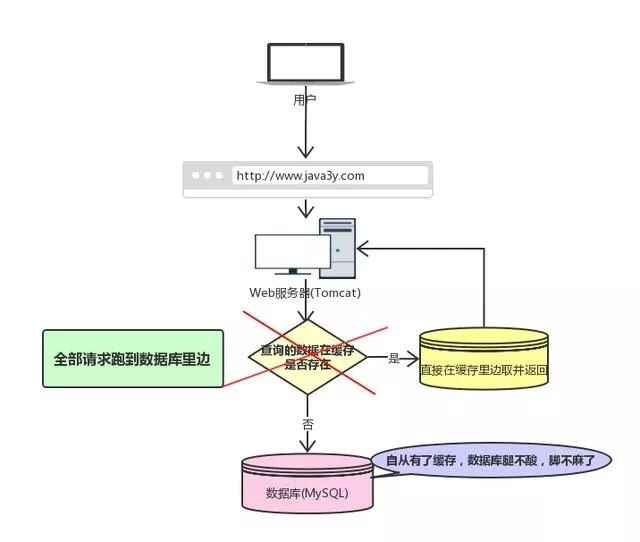
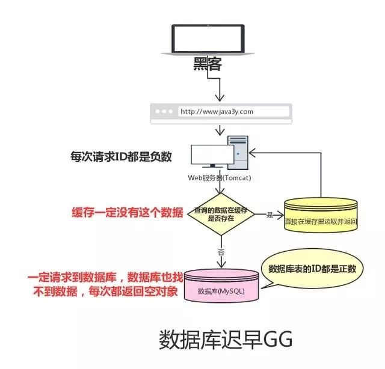

<!-- GFM-TOC -->
* [缓存雪崩](#缓存雪崩)
* [缓存穿透](#缓存穿透)
* [缓存与数据库双写一致](#缓存与数据库双写一致)

<!-- GFM-TOC -->

## 缓存雪崩

如果我们的缓存挂掉了，这意味着我们的全部请求都跑去数据库了。

  
 

Redis不可能把所有的数据都缓存起来(内存昂贵且有限)，所以Redis需要对数据设置过期时间，并采用的是惰性删除+定期删除两种策略对过期键删除。

如果缓存数据设置的过期时间是相同的，并且Redis恰好将这部分数据全部删光了。这就会导致在这段时间内，这些缓存同时失效，全部请求到数据库中。

这就是缓存雪崩：Redis挂掉了，请求全部走数据库。

缓存雪崩很可能把数据库搞垮，导致整个服务瘫痪！

**如何解决缓存雪崩？**

在缓存的时候给过期时间加上一个随机值，这样就会大幅度的减少缓存在同一时间过期。

对于“Redis挂掉了，请求全部走数据库”这种情况，可以有以下的思路：

- 事发前：实现Redis的高可用(主从架构+Sentinel 或者Redis Cluster)，尽量避免Redis挂掉这种情况发生。
- 事发中：万一Redis真的挂了，我们可以设置本地缓存(ehcache)+限流(hystrix)，尽量避免我们的数据库被干掉(起码能保证我们的服务还是能正常工作的)
- 事发后：redis持久化，重启后自动从磁盘上加载数据，快速恢复缓存数据。

## 缓存穿透

缓存穿透是指查询一个一定不存在的数据。由于缓存不命中，并且出于容错考虑，如果从数据库查不到数据则不写入缓存，这将导致这个不存在的数据每次请求都要到数据库去查询，失去了缓存的意义。

  
 

这就是缓存穿透：

请求的数据在缓存大量不命中，导致请求走数据库。

缓存穿透如果发生了，也可能把我们的数据库搞垮，导致整个服务瘫痪！

**如何解决缓存穿透？**

- 由于请求的参数是不合法的(每次都请求不存在的参数)，于是我们可以使用布隆过滤器(BloomFilter)或者压缩filter提前拦截，不合法就不让这个请求到数据库层！

- 当我们从数据库找不到的时候，我们也将这个空对象设置到缓存里边去。下次再请求的时候，就可以从缓存里边获取了。这种情况一般会将空对象设置一个较短的过期时间

## 缓存与数据库双写一

**对于读操作，流程是这样的：**

如果数据在缓存里边有，那么就直接取缓存的。

如果缓存里没有我们想要的数据，我们会先去查询数据库，然后将数据库查出来的数据写到缓存中。最后将数据返回给请求。

**什么是缓存与数据库双写一致问题？**

如果仅仅查询的话，缓存的数据和数据库的数据是没问题的。但是，当我们要更新时候呢？各种情况很可能就造成数据库和缓存的数据不一致了。

这里不一致指的是：数据库的数据跟缓存的数据不一致。

  
 

从理论上说，只要我们设置了键的过期时间，我们就能保证缓存和数据库的数据最终是一致的。因为只要缓存数据过期了，就会被删除。随后读的时候，因为缓存里没有，就可以查数据库的数据，然后将数据库查出来的数据写入到缓存中。
