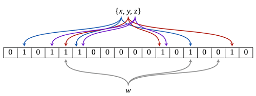

<!-- GFM-TOC -->
* [缓存](#缓存)
* [缓存雪崩](#缓存雪崩)
* [缓存穿透](#缓存穿透)
* [缓存预热](#缓存预热)
* [缓存降级](#缓存降级)
* [缓存爆满](#缓存爆满)
* [网卡打满](#网卡打满)

* [缓存一致性](#缓存一致性)
  - [缓存读取](缓存读取)
  - [缓存更新](缓存更新)
  - [缓存淘汰](缓存淘汰)

<!-- GFM-TOC -->

## 缓存

在高并发的场景下，直接用数据库去抗是远远不够的，不管数据库是mysql还是oracle，用SSD还是磁盘阵列，采用怎样的分表分库都是很容易达到极限的，单机上千的QPS已经是一个比较的现实的天花板，而且成本太高了。而且有些比较复杂的场景单纯的去采用数据库是不能实现要求的，例如：

- 读多写少的场景，这种其实很尴尬的，数据库是力不从心 鞭长莫及。

比如文章流量：每日上亿的pv，每篇文章都会被大量的阅读，一次的insert的文章在短时间内会带来几百万甚至上千万的select。如果每次的阅读这种不善变的都直接干到数据库其实很傻的，数据库是为了记录数据不是为了这种简单查询场景设计的，这种场景下数据很容易撂挑子的。

- 需要复杂的计算得出的数据，数据库真的压力山大了。

比如排行榜：最新来访的排行，用数据库是可以实现的，大不了每次登陆或者刷新都来update一下数据么，可是当用户量过大的时候呢？看似update一个简单的数据因为量太大可能会导致整体数据库系统的瘫痪。

又比如附近的人：每个人都可能在移动这个update太频繁，mysql是可以通过插件实现这个功能，但是效率呢？

缓存就是为了应对这些场景应用而生的，诞生于高并发的互联网场景，为高速而生。也许它不能保证数据的100%的准确，也许它不能完全脱离数据库，但那些不是缓存要考虑的，它为了抗住高并发，有限的有损抗住流量洪峰，准确性可以异步慢慢操作。

缓存绝大多数存放在内存中(cpu的M1，M2，M3 cache其实也是缓存)，内存的速度远不是硬盘能比的，硬盘就是SSD阵列也就是每秒百兆最快也就是G的级别。而内存已经达到数十G，双通道之后可以达到了上百G的级别。

缓存一次生产多次使用，避免每次读取都直接干到数据库。

如果说数据库主要是为了写，那么缓存主要是为了读，任务不同场景不同。

缓存能够带来性能的大幅提升，以memcache为例，单台memcache服务器简单的key-value查询能够达到TPS 5千以上，而redis服务器的话可以再翻倍达到10万以上没有问题的。

基本架构：

<div align="center">  </div><br>


## 缓存雪崩（缓存故障大批量甚至整体查询都去数据库）

缓存雪崩：由于大量的热数据设置了相同或接近的过期时间导致缓存在某一时刻密集失效，或服务突然宕机。如果这个时间段内有大量请求，而查询数据量巨大，所有的请求都会达到存储层，存储层的调用量会暴增，引起数据库压力过大甚至宕机。

<div align="center">  </div><br>

Redis不可能把所有的数据都缓存起来(内存昂贵且有限)，所以Redis需要对数据设置过期时间，并采用的是惰性删除+定期删除两种策略对过期键删除。

如果缓存数据设置的过期时间是相同的，并且Redis恰好将这部分数据全部删光了。这就会导致在这段时间内，这些缓存同时失效，全部请求到数据库中。

**如何解决缓存雪崩？**

在缓存的时候给过期时间加上一个随机值，这样就会大幅度的减少缓存在同一时间过期。打散key的淘汰时间来尽量规避，但是不能彻底规避。

- 不同的过期时间：设置不同的过期时间，让缓存失效的时间点尽量均匀。
- 服务高可用：服务有可能挂掉，多增加几台 缓存实例，（一主多从或者多主多从），这样一台挂掉之后其他的还可以继续工作，实现Redis的高可用(主从架构+Sentinel 或者Redis Cluster)，尽量避免Redis挂掉这种情况发生。

- 集群：只是采用主从模式是不够的的。
- 设置本地缓存(ehcache/go-cache)+限流(hystrix)，尽量避免我们的数据库被干掉(起码能保证我们的服务还是能正常工作的)
- 限流+服务降级：在缓存失效后，通过加锁或者队列来控制读数据库写缓存的线程数量，对某个 key 只允许一个线程查询数据和写缓存，其他线程等待。死一个服务总比全死强，丢掉一部分总比全丢强。

- 数据预热：数据加热的含义就是在正式部署之前，先把可能的数据先预先访问一遍，这样部分可能大量访问的数据就会加载到缓存中。在即将发生大并发访问前手动触发加载缓存不同的 key。

在 redis 中，实现 高可用 的技术主要包括 持久化、复制、哨兵 和 集群，下面简单说明它们的作用，以及解决了什么样的问题：

持久化：持久化是 最简单的 高可用方法。它的主要作用是 数据备份，即将数据存储在 硬盘，保证数据不会因进程退出而丢失。

复制：复制是高可用 redis 的基础，哨兵 和 集群 都是在 复制基础 上实现高可用的。复制主要实现了数据的多机备份以及对于读操作的负载均衡和简单的故障恢复。缺陷是故障恢复无法自动化、写操作无法负载均衡、存储能力受到单机的限制。

哨兵：在复制的基础上，哨兵实现了 自动化 的 故障恢复。缺陷是 写操作 无法 负载均衡，存储能力受到单机的限制。

集群：通过集群，redis 解决了 写操作 无法 负载均衡以及存储能力 受到 单机限制 的问题，实现了较为完善的高可用方案。

## 缓存穿透(查根本不存在的数据)

缓存穿透：缓存和数据库中都没有的数据，这样每次请求都会去查库，不会查缓存，如果同一时间有大量请求进来的话，就会给数据库造成巨大的查询压力，甚至击垮db系统。

比如说查询id为-1的商品，这样的id在商品表里肯定不存在，如果没做特殊处理的话，攻击者很容易可以让系统奔溃。

<div align="center">  </div><br>

**如何解决缓存穿透？**

- 缓存空对象，避免无效Key的查询：指一个请求发送过来，如果此时缓存中和数据库都不存在这个请求所要查询的相关信息，那么数据库就会返回一个空对象，并将这个空对象和请求关联起来存到缓存中，当下次还是这个请求过来的时候，这时缓存就会命中，就直接从缓存中返回这个空对象，这样可以减少访问数据库的压力，提高当前数据库的访问性能。处理流程如下图

  <div align="center">  </div><br>

  这种方法会存在两个问题：

  - 如果有大量的key穿透，缓存空对象会占用宝贵的内存空间（一般会将空对象设置一个较短的过期时间）。
  - 空对象的key设置了过期时间，这段时间内可能数据库刚好有了该key的数据，从而导致数据不一致的情况。

  这种情况下，我们可以用更好的解决方案，也就是**布隆过滤器**

- 由于请求的参数是不合法的(每次都请求不存在的参数)，可以使用布隆过滤器(BloomFilter)或者压缩filter提前拦截，记录key是否存在，不合法就不让这个请求到数据库层。

  - 布隆过滤器：由一个长度为m比特的位数组（bit array）与k个哈希函数（hash function）组成的数据结构。原理是当一个元素被加入集合时，通过K个散列函数将这个元素映射成一个位数组中的K个点，把它们置为1。检索时，我们只要看看这些点是不是都是1就大约知道集合中有没有它了，也就是说，**如果这些点有任何一个0，则被检元素一定不在；如果都是1，则被检元素很可能在。**

    至于说为什么都是1的情况只是可能存在检索元素，这是因为不同的元素计算的哈希值有可能一样，会出现哈希碰撞，导致一个不存在的元素有可能对应的比特位为1。举个例子：下图是一个布隆过滤器，共有18个比特位，3个哈希函数。当查询某个元素w时，通过三个哈希函数计算，发现有一个比特位的值为0，可以肯定认为该元素不在集合中。

    <div align="center">  </div><br>

    优点：

    - 节省空间：不需要存储数据本身，只需要存储数据对应hash比特位
    - 时间复杂度低：基于哈希算法来查找元素，插入和查找的时间复杂度都为O(k)，k为哈希函数的个数

    缺点：

    - 准确率有误：布隆过滤器判断存在，可能出现元素不在集合中；判断准确率取决于哈希函数的个数
    - 不能删除元素：如果一个元素被删除，但是却不能从布隆过滤器中删除，这样进一步导致了不存在的元素也会显示1的情况。

    **适用场景**

    - 爬虫系统url去重
    - 垃圾邮件过滤
    - 黑名单

  - **提高布隆过滤器的准确率：**

    1. 哈希函数的好坏
    2. 存储空间大小
    3. 哈希函数个数

    hash 函数的设计也是一个十分重要的问题，对于好的 hash 函数能大大降低布隆过滤器的误判率。同时，对于一个布隆过滤器来说，如果其位数组越大的话，那么每个 key 通过 hash 函数映射的位置会变得稀疏许多，不会那么紧凑，有利于提高布隆过滤器的准确率。同时，对于一个布隆过滤器来说，如果 key 通过许多 hash 函数映射，那么在位数组上就会有许多位置有标志，这样当用户查询的时候，在通过布隆过滤器来找的时候，误判率也会相应降低。

- id最大才999999 但可能传过来的id是9999991，9999992，9999993。。。既合法又不重复其实没有的数据id，那要怎么办？你可能会想到一直维护一个maxId，每次update数据库都要维护一下，那就成本太高了。这就要涉及到频控（最好外加服务降级），比如ip的维度等等，不管是不是恶意都要控制到可靠的范围内，这样才能比较可靠。

## 缓存击穿（高频次查刚失效的缓存）

缓存击穿：某个 key 经常被查询，或者这个 key 在缓存的过期时间失效的时候或者这是个冷门 key 时，这时候突然有大量有关这个 key 的访问请求，这样会导致大并发请求直接穿透缓存，请求数据库，瞬间对数据库的访问压力增大。

**归纳起来：造成缓存击穿的原因有两个。**

（1）一个 “冷门”key，突然被大量用户请求访问。

（2）一个 “热门”key，在缓存中时间恰好过期，这时有大量用户来进行访问。

<div align="center">  </div><br>

**解决方案**

- 将高频次的热点数据设置为永远不过期。如全局配置，挡在最前面即便没了缓存也是不应该查询数据库的，直接抛出错误返回。

  这里的“永远不过期”包含两层意思：

  > (1) 从redis上看，确实没有设置过期时间，这就保证了，不会出现热点key过期问题，也就是“物理”不过期。
  > (2) 从功能上看，如果不过期，那不就成静态的了吗？所以我们把过期时间存在key对应的value里，如果发现要过期了，通过一个后台的异步线程进行缓存的构建，也就是“逻辑”过期

  从实战看，这种方法对于性能非常友好，唯一不足的就是构建缓存时候，其余线程(非构建缓存的线程)可能访问的是老数据，但是对于一般的互联网功能来说这个还是可以忍受。

  ```java
  String get(final String key) {  
          V v = redis.get(key);  
          String value = v.getValue();  
          long timeout = v.getTimeout();  
          if (v.timeout <= System.currentTimeMillis()) {  
              // 异步更新后台异常执行  
              threadPool.execute(new Runnable() {  
                  public void run() {  
                      String keyMutex = "mutex:" + key;  
                      if (redis.setnx(keyMutex, "1")) {  
                          // 3 min timeout to avoid mutex holder crash  
                          redis.expire(keyMutex, 3 * 60);  
                          String dbValue = db.get(key);  
                          redis.set(key, dbValue);  
                          redis.delete(keyMutex);  
                      }  
                  }  
              });  
          }  
          return value;  
      }  
  ```

- 常用基于Redis或者Zookeeper实现互斥锁，等待第一个请求构建完缓存之后，再释放锁，进而其它请求才能通过该key访问数据。对于 key 过期的时候，当 key 要查询数据库的时候加上一把锁，这时只能让第一个请求进行查询数据库，然后把从数据库中查询到的值存储到缓存中，对于剩下的相同的 key，可以直接从缓存中获取即可。

  如果我们是在单机环境下：直接使用常用的锁即可（如：Lock、Synchronized 等），在分布式环境下我们可以使用分布式锁，如：基于数据库、基于 Redis 或者 zookeeper 的分布式锁。

  缺点：当缓存失效的时候，同一时间只有一个线程读数据库然后回写缓存，其他线程都处于阻塞状态。如果是高并发场景，大量线程阻塞势必会降低吞吐量。这种情况该如何处理呢？只能说没什么设计是完美的，你又想数据一致，又想保证吞吐量，哪有那么好的事，为了系统能更加健全，必要的时候牺牲下性能也是可以采取的措施，两者之间怎么取舍要根据实际业务场景来决定，万能的技术方案什么的根本不存在。

  ```go
  String get(String key) {  
     String value = redis.get(key);  
     if (value  == null) {  
      if (redis.setnx(key_mutex, "1")) {  
          // 3 min timeout to avoid mutex holder crash  
          redis.expire(key_mutex, 3 * 60)  
          value = db.get(key);  
          redis.set(key, value);  
          redis.delete(key_mutex);  
      } else {  
          //其他线程休息50毫秒后重试  
          Thread.sleep(50);  
          get(key);  
      }  
    }  
  } 
  ```
  
  <div align="center">  </div><br>

- "提前"使用互斥锁(mutex key)

  在value内部设置1个超时值(timeout1), timeout1比实际的memcache timeout(timeout2)小。当从cache读取到timeout1发现它已经过期时候，马上延长timeout1并重新设置到cache。然后再从数据库加载数据并设置到cache中。伪代码如下：

  ```java
  v = rediscache.get(key);  
  if (v == null) {  
      if (rediscache.setnx(key_mutex, 3 * 60 * 1000) == true) {  
          value = db.get(key);  
          rediscache.set(key, value);  
          rediscache.delete(key_mutex);  
      } else {  
          sleep(50);  
          retry();  
      }  
  } else {  
      if (v.timeout <= now()) {  
          if (rediscache.setnx(key_mutex, 3 * 60 * 1000) == true) {  
              // extend the timeout for other threads  
              v.timeout += 3 * 60 * 1000;  
              rediscache.set(key, v, KEY_TIMEOUT * 2);  
    
              // load the latest value from db  
              v = db.get(key);  
              v.timeout = KEY_TIMEOUT;  
              rediscache.set(key, value, KEY_TIMEOUT * 2);  
              rediscache.delete(key_mutex);  
          } else {  
              sleep(50);  
              retry();  
          }  
      }  
  }
  ```

- 资源保护

  采用netflix的hystrix，可以做资源的隔离保护主线程池，如果把这个应用到缓存的构建也未尝不可。

**四种方案对比（没有最好，只有最合适）：**

   作为一个并发量较大的互联网应用，我们的目标有3个:

1. 加快用户访问速度，提高用户体验。

2. 降低后端负载，保证系统平稳。

3. 保证数据“尽可能”及时更新(要不要完全一致，取决于业务，而不是技术。)

| 解决方案                     | 优点                                                   | 缺点                                                         |
| ---------------------------- | ------------------------------------------------------ | ------------------------------------------------------------ |
| 简单分布式锁(Tim yang)       | 1. 思路简单2. 保证一致性                               | 1. 代码复杂度增大2. 存在死锁的风险3. 存在线程池阻塞的风险    |
| 加另外一个过期时间(Tim yang) | 1. 保证一致性                                          | 同上                                                         |
| 不过期(本文)                 | 1. 异步构建缓存，不会阻塞线程池                        | 1. 不保证一致性。2. 代码复杂度增大(每个value都要维护一个timekey)。3. 占用一定的内存空间(每个value都要维护一个timekey)。 |
| 资源隔离组件hystrix(本文)    | 1. hystrix技术成熟，有效保证后端。2. hystrix监控强大。 | 1. 部分访问存在降级策略。                                    |

**当然在请求刚进来的时候，也需要做好多处理：**

在接口层增加校验，比如用户鉴权校验，参数做校验，不合法的参数直接代码Return，比如：id 做基础校验，id <=0的直接拦截等。


## 缓存预热

缓存预热就是系统上线后，先将相关的数据构建到缓存中，这样就可以避免用户请求的时候直接查库。

这部分预热的数据主要取决于访问量和数据量大小，如果数据的访问量不大的话，那么就没必要做预热，都没什么多少请求了，直接按正常的缓存读取流程执行就好。

访问量大的话，也要看数据的大小来做预热措施。

- 数据量不大的时候，工程启动的时候进行加载缓存动作，这种数据一般可以是电商首页的运营位之类的信息；
- 数据量大的时候，设置一个定时任务脚本，进行缓存的刷新；
- 数据量太大的时候，优先保证热点数据进行提前加载到缓存，并且确保访问期间不能更改缓存，比如用定时器在秒杀活动前30分钟就把商品信息之类的刷新到缓存，同时规定后台运营人员不能在秒杀期间更改商品属性。

## 缓存降级

缓存降级是指缓存失效或缓存服务器挂掉的情况下，不去访问数据库，直接返回默认数据或访问服务的内存数据。

在项目实战中通常会将部分热点数据缓存到服务的内存中，类似HashMap、Guava这样的工具，一旦缓存出现异常，可以直接使用服务的内存数据，从而避免数据库遭受巨大压力。

当然，这样的操作对于业务是有损害的，分布式系统中很容易就出现数据不一致的问题，所以，一般这种情况下，我们都优先保证从运维角度确保缓存服务器的高可用性，比如Redis的部署采用集群方式，同时做好备份，总之，尽量避免出现降级的影响。

## 缓存爆满（由于预估不足，内存设置不足，内存使用占满）

redis的淘汰策略算法有6种：

volatile-lru：从设置了过期时间的数据集中，选择最近最久未使用的数据释放。
allkeys-lru：从数据集中(包括设置过期时间以及未设置过期时间的数据集中)，选择最近最久未使用的数据释放。
volatile-random：从设置了过期时间的数据集中，随机选择一个数据进行释放。
allkeys-random：从数据集中(包括了设置过期时间以及未设置过期时间)随机选择一个数据进行入释放。
volatile-ttl：从设置了过期时间的数据集中，选择马上就要过期的数据进行释放操作。
noeviction：不删除任意数据(但redis还会根据引用计数器进行释放),这时如果内存不够时，会直接返回错误。

其实很多时候拿redis当mysql去用了，很多时候都是不失效的。这就导致了redis使用内存一直暴涨，如果内存设置的不够大那就有严重的问题了。

解决预案（其实不能叫解决方法）：

a。监控！监控！监控！其实即便不是这个问题也是需要对redis整体监控的，内存吃紧的时候尽早知晓！

b。集群也是要分开的。不是说一个集群大家一股脑的混在一起去用，一个爆掉全部爆掉。分开存储也是未来容易拆分迁移，可以细分。有些redis的key确实需要持久的可以一起存储，有些业务缓存有失效期可以一起存储，或者可以根据微服务模块的方式隔离存储。

c。随时准备好扩容，比如采用云redis集群。尽量不要自建集群，维护起来成本比较高。

## 网卡打满（缓存故障大批量甚至整体查询都去数据库）

一些核心数据比如全局的设置等等，这些大部分的请求都是需要获取的。这样会造成流量过于集中，达到物理网卡上限，从而导致redis的服务整体不稳定了：延迟长，请求超时，最后整体服务瘫了。

**怎么发现热key** 

- 凭借业务经验，进行预估哪些是热key.其实这个方法还是挺有可行性的。比如某商品在做秒杀，那这个商品的key就可以判断出是热key。缺点很明显，并非所有业务都能预估出哪些key是热key。

- 在客户端进行收集:在操作redis之前，加入一行代码进行数据统计。那么这个数据统计的方式有很多种，也可以是给外部的通讯系统发送一个通知信息。缺点就是对客户端代码造成入侵。

- 在Proxy层做收集:有些集群架构是下面这样的，Proxy可以是Twemproxy，是统一的入口。可以在Proxy层做收集上报，但是缺点很明显，并非所有的redis集群架构都有proxy。

- 用redis自带命令

  - monitor命令，该命令可以实时抓取出redis服务器接收到的命令，然后写代码统计出热key是啥。当然，也有现成的分析工具可以给你使用，比如redis-faina。但是该命令在高并发的条件下，有内存增暴增的隐患，还会降低redis的性能。

  - hotkeys参数，redis 4.0.3提供了redis-cli的热点key发现功能，执行redis-cli时加上–hotkeys选项即可。但是该参数在执行的时候，如果key比较多，执行起来比较慢。

- 抓包评估：redis客户端使用TCP协议与服务端进行交互，通信协议采用的是RESP。自己写程序监听端口，按照RESP协议规则解析数据，进行分析。缺点就是开发成本高，维护困难，有丢包可能性。

**解决方法**：

- 发现不对了赶紧做的是限流和服务降级，丢掉一部分请求先保证部分功能和请求的正常。

- 后期把这些key单独放到一个实例(库)里面，做好集群。

- 投机取巧的方式：每个业务服务器上部署一个redis做从机，做到缓存的分级。高频次访问的全局设置直接可以读本机的redis从机，因为这种全局配置肯定会有值哪怕默认值绝对不会为空。从机有问题或者读不到再去读取集群。

- 最主要的是架构师的预估，对自身业务要心里有谱，就在设计的架构的时候就做好隔离，等到病了再想去吃药有点晚了。

## 缓存一致性

缓存一致性是指业务在引入分布式缓存系统后，业务对数据的更新除了要更新存储以外还需要同时更新缓存，对两个系统进行数据更新就要先解决分布式系统中的隔离性和原子性难题。目前大多数业务在引入分布式缓存后都是通过牺牲小概率的一致性来保障业务性能，因为要在业务层严格保障数据的一致性，代价非常高，业务引入分布式缓存主要是为了解决性能问题，所以在性能和一致性面前，通常选择牺牲小概率的一致性来保障业务性能。

### 缓存读取

如果数据在缓存里边有，那么就直接取缓存的。

如果缓存里没有我们想要的数据，我们会先去查询数据库，然后将数据库查出来的数据写到缓存中。最后将数据返回给请求。

### 缓存和数据库不一致

数据一致性有以下三个要求：

- 缓存不能读到脏数据。
- 缓存可能会读到过期数据，但要在可容忍时间内实现最终一致。
- 这个可容忍时间尽可能的小。

例如现有三个请求：写入数据A和C和读取数据的B。都对同一个数据进行读写操作。

1. A先写入缓存再写数据库会怎样?

   答：有可能缓存写完程序出错退出，数据库写入失败，此时B读取的缓存就是脏数据。

2. A先写入数据库再写入缓存呢?

   答：A先写，然后C继续写，接着C写入缓存，然后某种原因A写入缓存的步骤来晚了再去写入缓存，B去读缓存的时候就是A后面写入的脏数据了。

3. A只管写数据库，然后删除缓存，等B来读的时候发现没缓存再去读取数据库同时写入缓存呢?

   答：还是不行，因为这么操作流量大的时候可能都发现没缓存击都去读取数据库导致直接打垮数据库。或者B读取完毕的时候，C开始写数据库，然后C先同步缓存成功，然后B再去写入缓存，结果可想而知还是脏数据。

**解决方案**

- 采用订阅监听binglog方式异步串行处理，如采用阿里开源的中间件canal可以完成订阅binlog日志的功能。mysql主从时会在主机修改后写入binglog日志，然后同步到从服务器。这些组件伪装成从服务器，从收到binglog日志里面解析出原始的修改，然后再去从容的修改缓存。异步串行处理让复杂的事情变得简单了。

  <div align="center">  </div><br>

  局限性：

  - 为了保证高效，这个最好不要做复杂的逻辑，比如聚合 连表 统计等等，不然的话影响性能。一般都是原表的复制或者是某些字段的复制。需要提前配置好，太不灵活，对于业务开发人员不够友好。

  - 有一定的延迟性。这个其实还好的，一般都是毫秒级的同步。但是需要注意监控，出现问题最好及时人工处理。

- 缓存引入版本号。

  设计表的时候增加版本号字段，每次update其他字段的时候增加set version=version+1，每次写入修改后，再去读取一把获取数据以及最新的version字段，再去修改缓存，如果发现缓存的中的版本比较高就不去修改缓存，如果现有缓存比较低就修改缓存。

  局限性：

  只有部分缓存支持，memcache和redis都不支持，如果采取读取缓存再去判断再去操作缓存，就变成非原子性的操作，一样的有不同步的风险。

- 写入缓存前加锁

  先加锁(一定要带失效时间)，再去查询数据库，再去写入缓存，然后删除锁。其他需要写入缓存的操作一定要先判断是否有锁，有锁就休眠一会再去重复刚才的动作。

  局限性：

  - 锁的失效时间一定要设置，还要设置的比较恰当，不然的话会出问题，推荐5-10s吧。

  - 只要是锁都是有风险的，都会影响点性能的。

综上，最好的还是监听binglog异步处理，其次如果采用缓存支持版本号可以使用版本号，再其次采用加锁。当然了如果要求不算太高可以先删缓存->写数据库->读取数据库->写缓存。Facebook选择了这个方案。

### 缓存更新

**什么是缓存与数据库双写一致问题？**

如果仅仅查询的话，缓存的数据和数据库的数据是没问题的。但是，当我们要更新时候呢？各种情况很可能就造成数据库和缓存的数据不一致了。这里不一致指的是：数据库的数据跟缓存的数据不一致。

<div align="center">  </div><br>

从理论上说，只要我们设置了键的过期时间，我们就能保证缓存和数据库的数据最终是一致的。因为只要缓存数据过期了，就会被删除。随后读的时候，因为缓存里没有，就可以查数据库的数据，然后将数据库查出来的数据写入到缓存中。

#### **缓存更新的难点**

先更新缓存还是先更新存储，缓存的处理是通过删除来实现还是通过更新来实现。这里我们面临的问题本质上是一个数据库的分布式事务的问题，需要处理数据可靠性的挑战，并发更新带来的隔离性挑战，和数据更新原子性的挑战。

- **数据可靠性**

如果要保证数据的可靠性，在业务逻辑成功之前，必须保障有一份数据落地，有以下两个选择：

1. 先更新成功存储，再更新缓存；
2. 先更新成功缓存，再跟新存储，如果存储更新失败，删除缓存；

- **操作隔离性**

一条数据的更新涉及到存储和缓存两套系统，如果多个线程同时操作一条数据，并且没有方案保证多个操作之间的有序执行，就可能会发生更新顺序错乱导致数据不一致的问题。

- **更新原子性**

引入缓存后，我们需要保证缓存和存储要么同时更新成功，要么同时更新失败，否则部分更新成功就会导致缓存和存储数据不一致的问题。

#### 业务层缓存更新方案

大多数的常见是选择以下方案，保障数据可靠性，尽量减少数据不一致的出现，通过TTL超时机制在一定时间段后自动解决数据不一致现象。

- Step1：更新存储，保证数据可靠性；

- Step2：更新缓存，2个策略：

  - 惰性更新：删除缓存，等待下次读MISS再缓存（推荐方案）；

  - 积极更新：将最新的值更新到缓存（不推荐）；积极更新策略，缓存数据实时性更高，但是在缓存侧带来了更多的更新操作，这会提高更新冲突导致脏数据概率。

#### 外部组件更新缓存

- 缓存MISS处理方案

在通过第三方组件更新的方案中，为了保障数据的一致性，避免对单条数据的并行更新，缓存的所有更新操作都需要交给同步组件，因此缓存MISS场景下的逻辑

- 缓存更新方案
  - 先更新存储，由第三方组件异步更新缓存；
  - 该方案投入较大，只适合特定的场景，并且有以下3个难点：
    - 第一：需要监控存储的日志，或者通过Triger来监控存储数据的变更，需要对存储系统非常熟悉；
    - 第二：需要对更新进行过滤，我们的目的是缓存热数据，但是像DDL、批量更新这一系列的操作是不需要更新缓存的，要把非业务更新操作过滤；
    - 第三：同步组件需要理解数据，不通用；

- 其他缓存更新方案

在实际的生产中，还会看到很多先更新缓存，然后通过第三方组件更新存储的场景，但是这个方案也会面临数据一致性和数据可靠性的挑战，虽然不推荐，但是确实还是能看到有在使用这个方案的。

1. 这个场景数据可靠性，不及先更新存储的方案，但是写入性能高，延迟低；
2. 这个方案APP和第三方组件都会更新Cache，会存在数据一致性的问题，因为很难保障两个组件更新的时序。

### 缓存淘汰

缓存的作用是将热点数据缓存到内存实现加速，内存的成本要远高于磁盘，因此我们通常仅仅缓存热数据在内存，冷数据需要定期的从内存淘汰，数据的淘汰通常有两种方案：

- 主动淘汰，这是推荐的方式，我们通过对Key设置TTL的方式来让Key定期淘汰，以保障冷数据不会长久的占有内存。TTL的策略可以保证冷数据一定被淘汰，但是没有办法保障热数据始终在内存，这个我们在后面会展开；
- 被动淘汰，这个是保底方案，并不推荐，Redis提供了一系列的Maxmemory策略来对数据进行驱逐，触发的前提是内存要到达maxmemory（内存使用率100%），在maxmemory的场景下缓存的质量是不可控的，因为每次缓存一个Key都可能需要去淘汰一个Key；


**总结一般架构图：**

<div align="center">  </div><br>

