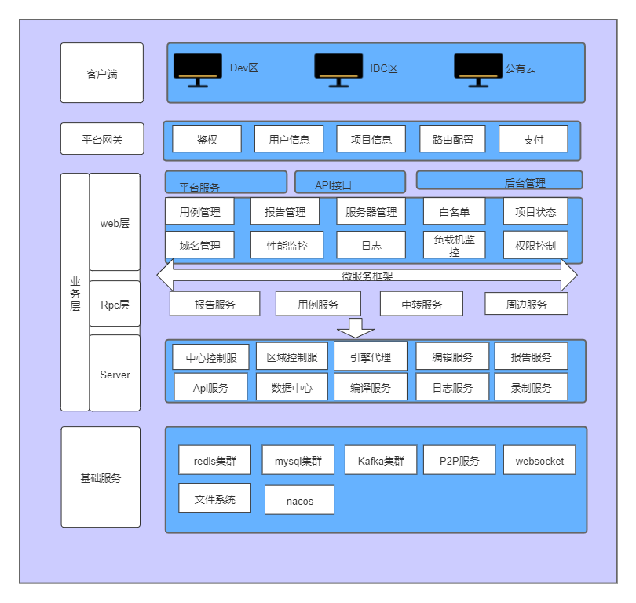
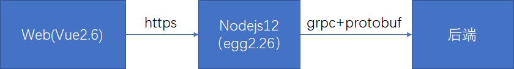
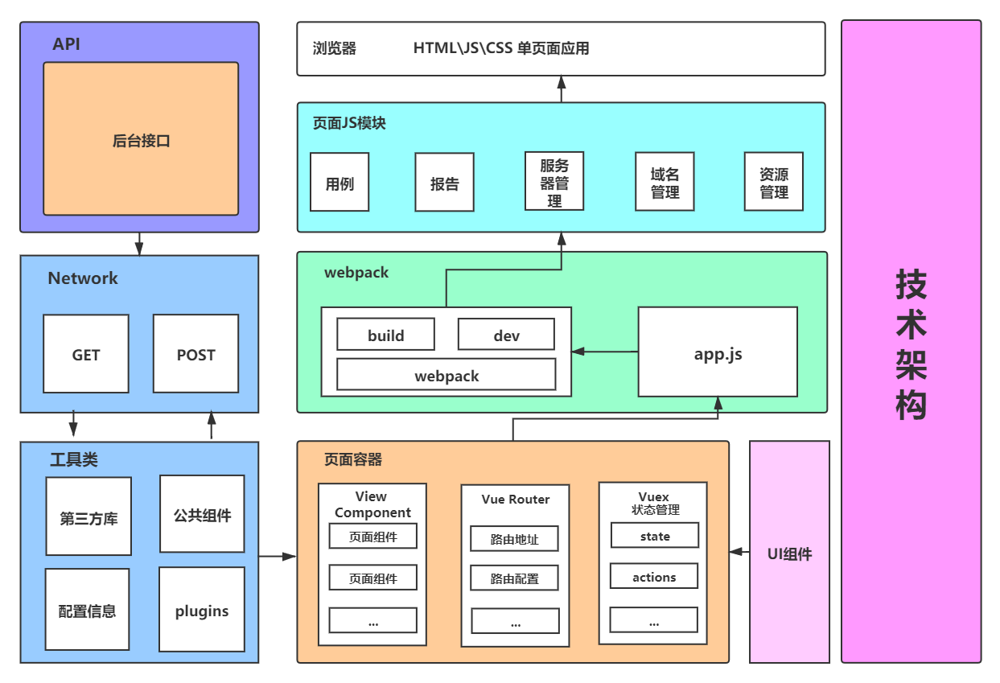
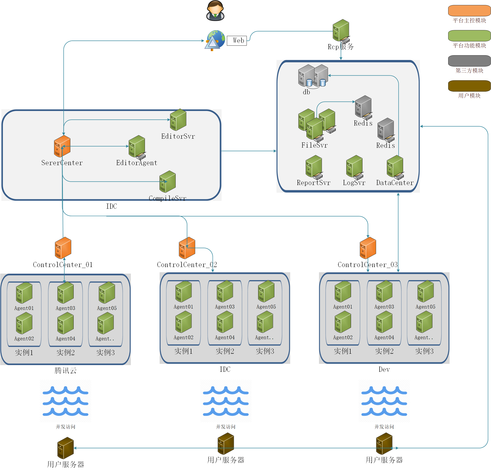
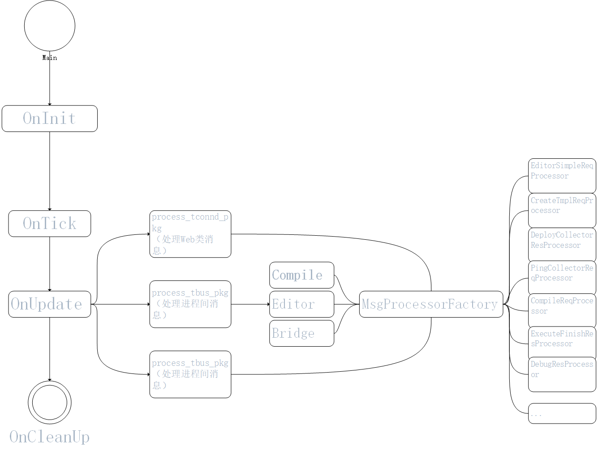
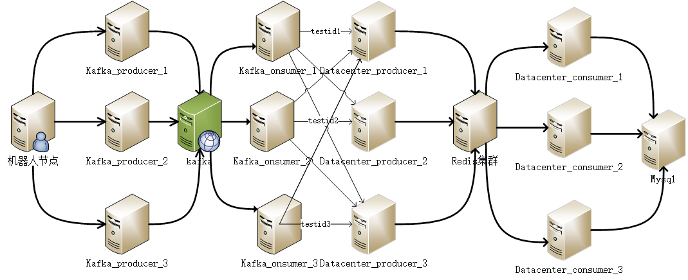
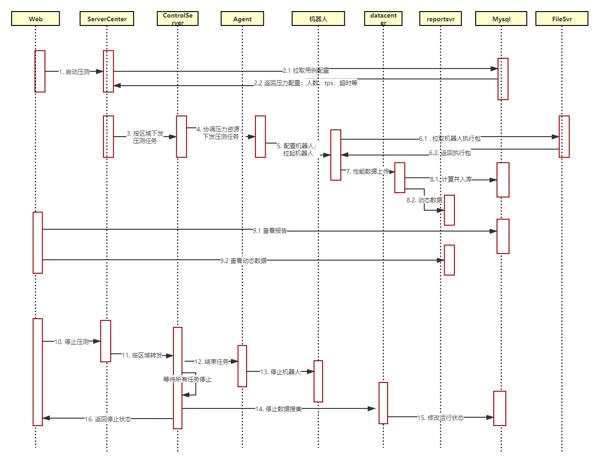

# 压测大师架构设计说明

更新时间：2021年6月29日15:16:13


# 技术架构

## 整体架构

平台概要设计说明




整套服务大体从前置后大致可分为四层

```sequence
客户端->网关: 

网关-->业务层: 

业务层->基础服务: 

```

1. **客户端**

   用户发起压力请求端，支持两种使用场景，三种网络环境

   - 两种使用使用场景
     1. 支持在浏览器中使用平台直接发起压力，压力机系平台提供，支持http/https， 旧版支持自定义发压
     2. 支持在linux/windows控制台通过机器人发压，需要用户具备一定开发能力

   - 三种网络环境
     1. Dev/DevCloud
     2. IDC/自研云
     3. 公有云

2. **平台网关层**

   客户端发起的所有请求，首先会到达WeTest平台网关层，网关层主要负责登入鉴权，权限认证，限流判断等。 除此之外，项目信息，用户信息公共信息亦存储在平台。 业务层需要调用平台api获取相关信息

3. **业务层**

   用户请求通过网关后，将触达业务层。 目前压测业务层可分为3层（后续将详细说明）

   1. Web层

      Web层主要实现请求的发起，数据报告的展示。

      Web前台基于vue实现，Web后台基于nodejs实现，通信采用https通信。 

      Web层在设计上主要用户表现渲染，对于数据的读/写、二次处理，数据通信的实际处理通过rpc完成

   2. Rpc层

      Rpc层作为Web和Server中间层，封装了Server通信逻辑，缓存逻辑，数据库逻辑

   3. Server层

      Server用于处理用户具体请求，整体可以分为4类服务，总共包含10个大小服务，主要采用c++基于tsfg框架实现，详细服务将在后台价格中阐述

      1. 业务调度
      2. 发压引擎
      3. 数据上报
      4. 周边服务

4. **基础服务层**

   ​		为业务提供基础能力，如数据库存储、消息队列、缓存等能力。 


## 前台架构


- web视角协议流程



数据渲染在web前台完成

node层主要负责数据的简单读写及处理，以及于平台层的交互

node数据通过pb协议，于rpc服务进行通信，剥离了数据库和缓存依赖


- web前台架构



web前台主要基于vue2.6框架


## 后台架构


- 后台整体架构



后台架构大致可以分为四层，各功能层分别如下

1. 业务调度服务

   ServerCenter:   **中心控制服**，  后台请求的第一站，一般不直接处理业务逻辑，主要是路由请求

   ControlCenter：**区域控制服**，每个区域（Dev，IDC,  公有云）均为独立网络环境，在每个区域设置一个区域控制服，用于进行压力调度，管理一组压力引擎代理

2. 发压引擎

   发压引擎是真正发起压力的客户端，目前主要如下3种引擎，这部分详细介绍将在引擎部分说明

   - 游戏压测引擎
   - http压测引擎

3. 数据上报服务

   DataCenter：**数据中心**， 用于收集处理压力客户端上报的事务等数据，以及服务端监控上报的数据。 实际该模块由一组服务组成，将在后续详细说明

   AccessSvr： **api服务**， 提供事务上报等http接口，供第三方机器人接入使用

4. 周边服务

   FileSvr：**文件系统**，提供文件存储，日志存储，压测引擎更新等功能

   ReportSvr：**报告服务**， 性能服务数据实时记录

   EditorSvr：**编辑控制服**， 可通过命令行保存操作用户项目，类似git（注：新版中因安全问题暂未开放）

   LogSvr：**日志服务**，可在页面实时显示后台日志（注：主要是给专家模式使用，新版中已去除）

   EditorAgent：文件服务LB

   CompileSvr：**编译服务器**， 专家模式编译用（注：主要是给专家模式使用，新版中已去除）


- 调度层

  后台框架大多采用tsf4g框架，如下展示为ServerCenter逻辑，其他服务整体框架类似

  	

- 数据中心架构

  

所有数据从上报到入库主要经过5个节点

1. Kafka_producer：  数据生产者，主要用于接受上报数据，可扩展
2. kafka：  用于事务数据及服务器数据消息队列
3. Kafka_consumer: 从消费队列中读取数据，并且按照测试id均摊请求到后续服务
4. datacenter_producer:  数据处理，服务器相关数据在此处处理，客户端数据会进一步提交到redis集群
5. datacenter_consumer: 数据处理，读取redis集群中的客户端数据进行处理


# 时序说明

以压力调度启停为例，说明服务间调度逻辑

## 压力启停时序



压测启动时序说明

- 1： Web 发起一次启动测试， 协议以tdr协议发送到ServerCenter，主要携带协议包含caseid作为用例索引
- 2.1到2.2： Serverncer依据caseid索引，从数据库中读取用例的配置（如人数，HTTP请求配置）
- 3到4: ControlServer 根据压力配置，调度对应的Agent，同时将压力平摊给每个Agent
- 5: 被调度的Agent 依据被分配的压力，修改对应的机器人配置文件
- 7-8： 机器人读取配置文件，发起压力。 同时将数据提交到datacenter入库


数据查看时序说明

-  9.1-9.2  页面数据根据用户访问的testid， 首先会访问数据库，拉取历史数据。其次，新增的数据会通过和reportsvr交互获取


压测停止时序说明

- 10-12: web发起停止压测，servercenter根据停止协议中的testID，获取其压测区域并转发给对应的controlcenter
- 13-14: controlcenter根据testID，获取所有agent状态，并发送停止任务
- 15-16:  controlcenter判断所有agent停止后，修改用例运行状态为停止，并返回到前台


